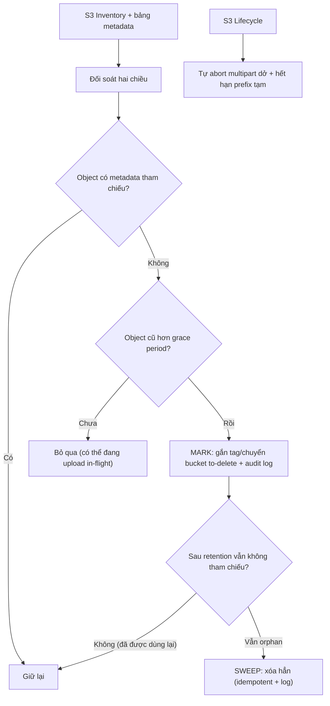

# Cleanup file orphan như thế nào?

## ⚡ Tóm tắt ngắn (30s)
* **Bản chất**: File orphan (mồ côi) là **object tồn tại trên storage nhưng không còn ai tham chiếu** — sinh ra từ dual-write thất bại, multipart upload bỏ dở, soft-delete metadata nhưng quên xóa file, hoặc upload thử rồi hủy. Chúng **âm thầm tốn tiền lưu trữ** và gây lệch số liệu. Dọn orphan đúng cách là một **reconciliation hai chiều có grace period**, **không phải** "xóa mọi file không có row DB" — vì làm ẩu sẽ xóa nhầm **file đang upload dở** (race) → mất dữ liệu thật.
* **Hướng xử lý**:
  1. **Đối soát hai chiều**: liệt kê S3 ↔ DB; file trên S3 không có metadata = ứng viên orphan.
  2. **Grace period bắt buộc**: chỉ xóa object **cũ hơn** một ngưỡng (vd > 24h) để không đụng upload đang in-flight.
  3. **Tự động hóa phần biết chắc**: **S3 Lifecycle** dọn multipart dở và prefix tạm; mark-and-sweep + soft-delete cho phần còn lại.
* **Quyết định Senior**: Dọn orphan phải **an toàn trước, triệt để sau** — thà để rác thêm một ngày còn hơn xóa nhầm file người dùng. Mọi lần xóa đều **idempotent, có log/audit, có grace period**.

---

## 🔍 Chi tiết bản chất thực chiến

### 1. Orphan từ đâu ra
* **Dual-write lỗi**: upload file lên S3 nhưng ghi metadata thất bại → file không có row (xem bài consistency DB↔storage).
* **Multipart bỏ dở**: client khởi tạo multipart rồi bỏ ngang → các **part** đã upload vẫn chiếm chỗ (và **vẫn tính tiền**) dù object chưa bao giờ `Complete`.
* **Soft-delete một phía**: xóa row DB (hoặc đánh dấu `deleted`) nhưng quên xóa object S3.
* **Upload nháp/hủy**: user chọn file, hệ thống tạo key tạm rồi user hủy.

### 2. Hai loại orphan, hai cách dò
* **File mồ côi** (S3 có, DB không): phải **liệt kê S3** rồi đối chiếu DB — tốn kém với bucket lớn, nên dùng **S3 Inventory** (báo cáo danh sách object định kỳ) thay vì `ListObjects` realtime hàng triệu key.
* **Metadata mồ côi** (DB có, S3 không): quét row trỏ tới key không tồn tại trên S3 (`headObject` trả `404`) — thường gắn với trạng thái `PENDING`/`FAILED` quá hạn.

### 3. Grace period — vì sao bắt buộc
Một object **vừa** xuất hiện trên S3 mà **chưa** có metadata **không** chắc là orphan: rất có thể nó đang ở **giữa** luồng "upload file → ghi metadata", metadata sẽ xuất hiện sau vài giây. Nếu cleanup xóa ngay, ta **xóa nhầm file thật đang in-flight** → mất dữ liệu. Vì vậy chỉ coi là orphan khi object **cũ hơn grace period** (đủ dài hơn thời gian tối đa của một luồng upload, vd 24h).

### 4. S3 Lifecycle — tự động hóa phần biết chắc
* **`AbortIncompleteMultipartUpload`**: tự hủy part của multipart dở sau N ngày → dọn loại orphan phổ biến nhất mà **không cần code**.
* **Expiration theo prefix tạm**: object dưới `tmp/` hoặc `staging/` tự hết hạn sau X ngày.
* Lifecycle chạy ở phía S3, rẻ và đáng tin — ưu tiên dùng cho các quy tắc rõ ràng trước khi viết job tùy biến.

### 5. Mark-and-sweep + soft delete cho phần còn lại
Với orphan không nằm trong quy tắc lifecycle:
* **Mark**: reconciliation đánh dấu ứng viên orphan (đối soát + qua grace period), **ghi log/audit**, có thể chuyển sang bucket "to-delete" hoặc gắn tag thay vì xóa thẳng.
* **Sweep**: sau một retention nữa, nếu vẫn không có tham chiếu → xóa hẳn. Cách hai-pha này cho cơ hội **khôi phục** nếu lỡ đánh dấu nhầm.

---

## 🎨 Sơ đồ trực quan: Reconciliation hai chiều có grace period

Sơ đồ mô tả luồng dò và dọn orphan an toàn theo mark-and-sweep:



---

## 💻 Code thực chiến: BAD vs GOOD

Hai đoạn dưới tương phản: xóa thẳng mọi file không có row DB, và mark-and-sweep có grace period.

### ❌ BAD: Xóa ngay mọi object không có metadata
```java
@Scheduled(cron = "0 0 * * * *")
public void cleanup() {
    for (S3Object obj : s3.listObjects("user-docs").contents()) {
        if (!metaRepo.existsByKey(obj.key())) {  // ❌ object vừa upload, metadata chưa kịp ghi
            s3.deleteObject(delReq(obj.key()));  // ❌ xóa nhầm file ĐANG upload in-flight -> mất data
        }
    }
    // ❌ ListObjects realtime trên bucket triệu key: chậm, tốn tiền request, dễ timeout
}
```

### ✅ GOOD: Đối soát + grace period + mark-and-sweep
```java
@Scheduled(cron = "0 0 3 * * *")  // chạy đêm, dùng S3 Inventory thay cho ListObjects realtime
public void reconcileOrphans() {
    Duration grace = Duration.ofHours(24);
    for (InventoryItem item : s3Inventory.latest("user-docs")) {
        boolean referenced = metaRepo.existsByKey(item.key());
        boolean oldEnough = item.lastModified().isBefore(Instant.now().minus(grace));

        // ✅ Chỉ xét object KHÔNG được tham chiếu VÀ đã qua grace period
        if (!referenced && oldEnough) {
            orphanRepo.mark(item.key());                 // ✅ MARK + audit, chưa xóa
            s3.copyObject(src("user-docs", item.key()),  // chuyển sang khu chờ xóa (có thể khôi phục)
                          dst("to-delete", item.key()));
            s3.deleteObject(delReq("user-docs", item.key()));
        }
    }
    // ✅ SWEEP: sau retention, xóa hẳn những gì vẫn orphan (idempotent)
    for (String key : orphanRepo.markedBefore(Duration.ofDays(7))) {
        if (!metaRepo.existsByKey(key)) {                // ✅ kiểm tra lại lần cuối trước khi xóa
            s3.deleteObject(delReq("to-delete", key));
            log.info("orphan swept key={}", key);        // ✅ audit mọi lần xóa
        }
    }
}
```

S3 Lifecycle dọn loại orphan phổ biến nhất mà không cần code:
```json
{ "Rules": [
  { "ID": "abort-incomplete-mpu", "Status": "Enabled",
    "AbortIncompleteMultipartUpload": { "DaysAfterInitiation": 1 } },   // ✅ part multipart dở
  { "ID": "expire-tmp-prefix", "Status": "Enabled",
    "Filter": { "Prefix": "tmp/" },
    "Expiration": { "Days": 3 } }                                       // ✅ prefix tạm tự hết hạn
] }
```

---

## 📊 Bảng so sánh cách dọn orphan

Bảng dưới đối chiếu các cách dọn theo độ an toàn và phạm vi áp dụng:

| Cách | An toàn | Chi phí | Áp dụng cho |
| :--- | :--- | :--- | :--- |
| **Xóa ngay file không có row** | ❌ Xóa nhầm in-flight | Cao (ListObjects realtime) | Không nên |
| **S3 Lifecycle (abort MPU/tmp)** | ✅ Cao | Rất thấp | Multipart dở, prefix tạm |
| **Reconcile + grace + mark/sweep** | ✅✅ Cao | Trung bình (dùng Inventory) | Orphan dual-write, soft-delete |
| **Soft-delete rồi hard-delete sau** | ✅✅ Khôi phục được | Trung bình | Dữ liệu quan trọng, cần an toàn |

---

## ⚠️ Common Gotchas & Questions follow-up

### 1. Cạm bẫy "ListObjects realtime trên bucket khổng lồ"
* Bucket hàng triệu/tỉ object mà quét bằng `ListObjectsV2` mỗi lần cleanup sẽ **chậm, tốn tiền request, dễ timeout**, và đập vào rate limit. Dùng **S3 Inventory** — báo cáo danh sách object (CSV/Parquet) sinh định kỳ — để đối soát theo lô, vừa rẻ vừa scale.

### 2. Cạm bẫy "xóa cứng không thể hoàn tác"
* Reconciliation có thể sai (bug logic, metadata tạm thời không đọc được do DB lỗi) và xóa nhầm. Nếu xóa **cứng** ngay, không có đường lui. Hãy dùng **mark-and-sweep hai pha** (chuyển sang bucket to-delete/gắn tag, đợi retention) hoặc bật **S3 Versioning** để còn khôi phục — biến "xóa" thành thao tác **có thể đảo ngược trong một khoảng**.

### 3. Câu hỏi đào sâu từ interviewer
* **Interviewer: "Hóa đơn S3 tăng đều dù lượng file người dùng không tăng. Bạn nghi orphan — làm sao xác minh và dọn mà không xóa nhầm?"**
* **Trả lời**: Trước hết tôi **định lượng** thay vì đoán: bật **S3 Inventory** để có danh sách toàn bộ object, rồi đối chiếu với bảng metadata để biết bao nhiêu object **không được tham chiếu** và tổng dung lượng của chúng — đồng thời kiểm tra **Storage Lens/metrics** xem phần phình đến từ object hoàn chỉnh hay từ **multipart upload dở** (loại này hay bị bỏ quên mà vẫn tính tiền). Với multipart dở và prefix tạm, tôi bật ngay **S3 Lifecycle** `AbortIncompleteMultipartUpload` và expiration — dọn được phần lớn mà không rủi ro. Với orphan thật từ dual-write/soft-delete, tôi chạy **reconciliation hai chiều** nhưng **bắt buộc grace period** (chỉ xét object cũ hơn thời gian tối đa của một luồng upload) để không đụng file đang in-flight, và áp **mark-and-sweep**: đánh dấu + chuyển sang bucket "to-delete" + audit trước, chỉ **xóa hẳn sau một retention** và kiểm tra lại lần cuối là vẫn không có tham chiếu. Tôi cũng bật **Versioning** để mọi thao tác xóa còn khôi phục được. Triết lý là **an toàn trước, triệt để sau**: chấp nhận giữ rác thêm vài ngày để tuyệt đối không xóa nhầm dữ liệu thật của khách hàng, đồng thời tự động hóa phần biết-chắc bằng lifecycle để vấn đề không tái tích tụ.
