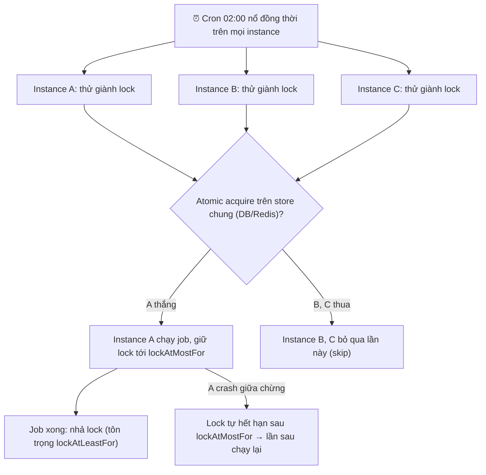

# Cron job chạy trùng trên nhiều instance. Bạn xử lý thế nào?

## ⚡ Tóm tắt ngắn (30s)
* **Bản chất**: Khi bạn scale app lên `N` instance để chịu tải, mỗi instance đều ôm một bản sao của `@Scheduled`. Đến giờ cron, **cả N instance cùng nổ một lúc** → job chạy trùng N lần: gửi mail trùng, trừ tiền trùng, chốt báo cáo trùng. Đây không phải bug của cron mà là hệ quả tất yếu của việc nhúng scheduler vào trong app stateless.
* **Hướng xử lý**: Tách "ai được chạy" ra khỏi "ai có trigger". Chỉ cho **một** instance thực thi mỗi lần kích hoạt, bằng một trong ba cơ chế:
  1. **Distributed lock (ShedLock)**: instance nào giành được khóa trên store dùng chung (DB/Redis) thì chạy, các instance còn lại bỏ qua. Nhẹ nhất, hợp 90% trường hợp.
  2. **Leader election**: bầu một leader (qua ZooKeeper/Consul/K8s Lease), chỉ leader chạy scheduled task.
  3. **Clustered scheduler chuyên dụng**: Quartz cluster mode (JDBC JobStore) tự đảm bảo một job chỉ chạy trên một node.
* **Quyết định Senior**: Mặc định dùng **ShedLock** vì nó không đổi kiến trúc, chỉ thêm annotation. Cấu hình **`lockAtMostFor`** (lưới an toàn khi instance crash giữa chừng để khóa tự nhả) và **`lockAtLeastFor`** (chống job ngắn chạy lại tức thì do lệch đồng hồ giữa các node).

---

## 🔍 Chi tiết bản chất thực chiến: Vì sao trùng và khóa giải quyết thế nào

### 1. Gốc rễ: scheduler nằm trong process stateless
`@Scheduled` của Spring chạy bằng một `ThreadPoolTaskScheduler` **cục bộ trong từng JVM**. Nó không hề biết có bao nhiêu bản sao của app đang chạy. Triển khai 1 instance → đúng 1 lần. Triển khai 5 pod trên Kubernetes → **5 lần đồng thời**. Bản chất là thiếu một "nguồn sự thật chung" để điều phối "lần kích hoạt này đã có ai nhận chưa".

### 2. ShedLock — mutual exclusion qua store dùng chung
ShedLock không phải là scheduler, nó là **một lớp khóa** đặt trước method. Cơ chế:
* Trước khi chạy, instance thử **INSERT/UPDATE có điều kiện** một dòng `(name, lock_until, locked_by)` vào store chung.
* Thao tác này **nguyên tử** (dựa vào unique constraint của DB hoặc `SET NX` của Redis) → chỉ một instance thắng.
* Instance thắng chạy job; các instance thua thấy khóa còn hiệu lực → **bỏ qua lần này**, không xếp hàng chờ.

### 3. Hai tham số sống còn: `lockAtMostFor` và `lockAtLeastFor`
* **`lockAtMostFor`** (thời gian giữ khóa tối đa): nếu instance giành khóa rồi **crash/kill -9** trước khi nhả, khóa sẽ tự hết hạn sau khoảng này để job không bị treo vĩnh viễn. **Phải đặt dài hơn thời gian chạy tệ nhất của job**, nếu không khóa nhả sớm → instance khác nhảy vào chạy trùng.
* **`lockAtLeastFor`** (thời gian giữ khóa tối thiểu): giữ khóa ít nhất khoảng này kể cả job xong sớm. Mục đích chống trường hợp đồng hồ các node lệch nhau khiến một node khác "đến giờ trễ" lại giành được khóa và chạy lại ngay lập tức.

### 4. Khi nào leo thang lên Leader Election / Quartz cluster
* Nếu cần **nhiều scheduled task phối hợp**, lịch động (thêm/sửa job lúc runtime), hoặc cần lịch sử thực thi bền vững → cân nhắc **Quartz cluster** (JobStore JDBC, các node tranh `trigger` qua row lock).
* Nếu hệ đã có ZooKeeper/Consul hoặc chạy trên K8s → **leader election** (K8s `Lease`) cũng sạch sẽ: chỉ leader bật scheduler.
* Với phần lớn cron đơn lẻ kiểu "1h chạy 1 lần dọn dữ liệu", ShedLock là đủ và đơn giản nhất.

---

## 🎨 Sơ đồ trực quan: Ba instance tranh khóa, chỉ một chạy

Sơ đồ dưới mô tả thời điểm cron nổ trên cả ba instance và cách distributed lock chọn ra đúng một người thực thi:



---

## 💻 Code thực chiến: BAD vs GOOD

Hai đoạn dưới tương phản scheduled task không bảo vệ (chạy trùng) và bản dùng ShedLock (chỉ một instance chạy):

### ❌ BAD: `@Scheduled` trần — nổ trên mọi instance
```java
@Component
public class ReportJob {
    @Scheduled(cron = "0 0 2 * * *")
    public void generateDailyReport() {
        // ❌ Chạy 02:00 trên CẢ N instance → N báo cáo trùng, N email gửi đi
        reportService.buildAndSend();
    }
}
```

### ✅ GOOD: ShedLock — chỉ một instance giành khóa được chạy
```java
@Configuration
@EnableSchedulerLock(defaultLockAtMostFor = "PT30M") // lưới an toàn khi crash
public class SchedulerConfig {
    @Bean
    public LockProvider lockProvider(DataSource dataSource) {
        return new JdbcTemplateLockProvider(
            JdbcTemplateLockProvider.Configuration.builder()
                .withJdbcTemplate(new JdbcTemplate(dataSource))
                .usingDbTime() // ✅ dùng giờ DB, tránh lệch clock giữa các node
                .build());
    }
}

@Component
public class ReportJob {
    @Scheduled(cron = "0 0 2 * * *")
    @SchedulerLock(
        name = "generateDailyReport",
        lockAtMostFor = "PT30M",  // ✅ > thời gian chạy tệ nhất; crash thì 30' sau tự nhả
        lockAtLeastFor = "PT1M")  // ✅ giữ tối thiểu 1' chống chạy lại do lệch đồng hồ
    public void generateDailyReport() {
        reportService.buildAndSend(); // ✅ chỉ instance giữ lock thực thi
    }
}
```

```sql
-- Bảng khóa dùng chung cho ShedLock (mọi instance trỏ vào cùng DB)
CREATE TABLE shedlock (
    name       VARCHAR(64)  NOT NULL,
    lock_until TIMESTAMP    NOT NULL,
    locked_at  TIMESTAMP    NOT NULL,
    locked_by  VARCHAR(255) NOT NULL,
    PRIMARY KEY (name) -- ✅ unique đảm bảo acquire nguyên tử
);
```

---

## 📊 Bảng so sánh các cách chống chạy trùng

| Tiêu chí | ShedLock (distributed lock) | Leader Election | Quartz Cluster Mode |
| :--- | :--- | :--- | :--- |
| **Cơ chế** | Khóa có TTL trên DB/Redis cho mỗi lần chạy | Bầu 1 leader, chỉ leader bật scheduler | Các node tranh trigger qua row lock JDBC |
| **Độ phức tạp** | Thấp — thêm annotation | Trung bình — cần ZK/Consul/K8s Lease | Cao — cấu hình JobStore, schema Quartz |
| **Đổi kiến trúc** | Gần như không | Có (thành phần coordination) | Có (thay scheduler) |
| **Lịch động runtime** | Không | Không trực tiếp | ✅ Có |
| **Phù hợp** | Phần lớn cron đơn lẻ | Hệ đã có coordination layer | Nhiều job, cần lịch sử & lịch động |

---

## ⚠️ Common Gotchas & Questions follow-up

### 1. Cạm bẫy "`lockAtMostFor` ngắn hơn thời gian chạy job"
* Nếu job thực tế chạy 20 phút nhưng `lockAtMostFor = PT5M`, thì sau 5 phút khóa tự hết hạn **trong khi job vẫn đang chạy** → instance khác giành khóa và **chạy trùng**. Đây là lỗi tinh vi nhất với ShedLock. Quy tắc: `lockAtMostFor` phải lớn hơn hẳn thời gian chạy ở kịch bản tệ nhất (cộng buffer). ShedLock cố tình **không** gia hạn khóa giữa chừng để giữ logic đơn giản, nên bạn phải ước lượng đúng.

### 2. Cạm bẫy "lệch đồng hồ giữa các node"
* Nếu các instance lệch giờ vài giây và bạn dựa vào giờ cục bộ để tính `lock_until`, một node "chậm giờ" có thể coi khóa đã hết hạn và chạy lại. Cách chuẩn là **dùng giờ của DB** (`usingDbTime()`) làm nguồn thời gian duy nhất, để mọi node so cùng một chiếc đồng hồ.

### 3. Câu hỏi đào sâu từ interviewer
* **Interviewer: "ShedLock đảm bảo job chạy đúng một lần phải không?"**
* **Trả lời**: Không hẳn — ShedLock đảm bảo **tại một thời điểm chỉ một instance chạy** (mutual exclusion), nhưng **không** đảm bảo exactly-once. Nếu instance giữ khóa làm xong một phần việc rồi crash trước khi nhả khóa, thì sau khi `lockAtMostFor` hết hạn, lần kích hoạt kế tiếp sẽ chạy lại và **lặp lại phần việc dở dang**. Vì vậy ShedLock chỉ giải quyết "chạy trùng song song giữa các instance", còn để an toàn khi **chạy lại sau crash**, bản thân job vẫn phải **idempotent** (dùng processed-marker/UPSERT/checkpoint). Tôi luôn coi distributed lock và idempotency là hai lớp bổ sung cho nhau, không thay thế nhau.
