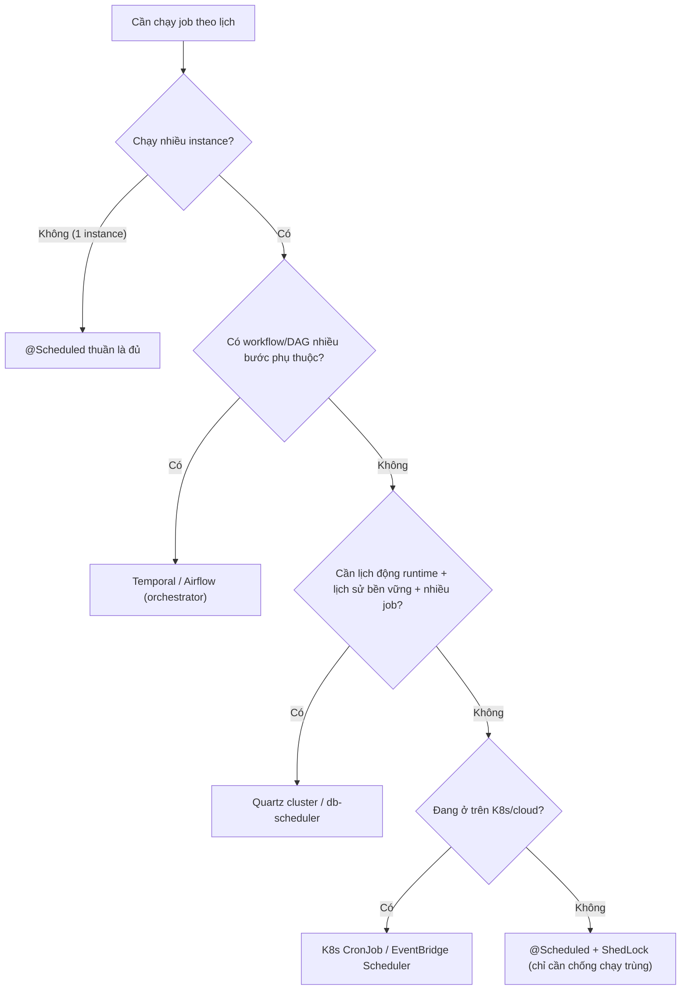

# Khi nào nên dùng distributed scheduler?

## ⚡ Tóm tắt ngắn (30s)
* **Bản chất**: Một `@Scheduled` trong app là **scheduler nhúng, cục bộ**: đơn giản nhưng "ngây thơ" khi chạy nhiều instance (chạy trùng) hoặc khi cần độ tin cậy cao. **Distributed scheduler** là hệ điều phối lịch **xuyên cụm**: đảm bảo job chạy **đúng một chỗ** dù có nhiều node, vẫn chạy khi một node chết (HA), lưu **lịch sử/trạng thái** bền vững, hỗ trợ **lịch động** và **quan sát** tập trung.
* **Khi nào DÙNG**: chạy nhiều instance **và** cần job chỉ thực thi một lần + HA; cần thêm/sửa/xóa job lúc runtime; nhiều job phụ thuộc nhau (workflow/DAG); cần lịch sử thực thi, retry tập trung, sharding tải; cần khả năng nhìn thấy & vận hành (pause/trigger tay) từ một nơi.
* **Khi nào KHÔNG cần**: chạy **một instance**, hoặc một vài cron đơn giản, không phụ thuộc nhau → `@Scheduled` (có thể **thêm ShedLock** nếu lỡ scale ra nhiều instance) là **đủ và rẻ nhất**.
* **Quyết định Senior**: Chọn theo **mức độ phối hợp và độ tin cậy** thực sự cần, không theo "nghe sang". Bậc thang: `@Scheduled` → `@Scheduled + ShedLock` → Quartz cluster / db-scheduler → Temporal/Airflow → cloud-native cron. **Đừng kéo Airflow về chỉ để chạy một cron 5 phút.**

---

## 🔍 Chi tiết bản chất thực chiến: Bậc thang lựa chọn

### 1. `@Scheduled` thuần — đủ cho phần lớn việc đơn giản
Nhẹ, không phụ thuộc ngoài, sống cùng app. **Điểm yếu**: scheduler **cục bộ trong từng JVM** nên scale ra N instance là **chạy trùng N lần**; không có lịch sử bền vững; lịch cố định trong code; pool mặc định 1 thread dễ kẹt. Hợp khi: 1 instance, cron đơn giản, lỡ thì không chết người.

### 2. `@Scheduled + ShedLock` — thêm một lớp khóa, **không** phải scheduler
Khi đã scale nhiều instance nhưng nhu cầu vẫn chỉ là "đừng chạy trùng", **ShedLock** thêm một **distributed lock** (DB/Redis) để chỉ một instance chạy mỗi lần. Cực nhẹ, không đổi kiến trúc. **Lưu ý**: ShedLock **chỉ là khóa**, không quản lịch sử, không retry, không lịch động — đừng nhầm nó là "distributed scheduler" đầy đủ.

### 3. Quartz cluster / db-scheduler — distributed scheduler "thực thụ", JVM-centric
Khi cần **HA + lịch động + lịch sử bền vững** trong hệ sinh thái Java: các node tranh trigger qua **JDBC JobStore** (row lock), job được persist, hỗ trợ misfire policy, có thể thêm/sửa job runtime. Phù hợp khi có **nhiều job**, cần độ tin cậy và khả năng vận hành cao, nhưng vẫn chạy trong app của bạn.

### 4. Temporal / Airflow — khi lịch là một phần của **workflow**
Khi job không đứng một mình mà là **chuỗi bước phụ thuộc** (DAG), cần retry/timeout/state per-step, bù trừ (saga), backfill theo cửa sổ, quan sát chi tiết: dùng **orchestrator**. Airflow mạnh cho **data pipeline theo lịch**; Temporal mạnh cho **workflow bền bỉ, code-first** với trạng thái lưu lâu. Đây là tầng nặng nhất, chỉ kéo vào khi độ phức tạp xứng đáng.

### 5. Cloud-native cron — đẩy lịch ra ngoài app
**Kubernetes CronJob**, **AWS EventBridge Scheduler**, GCP Cloud Scheduler... **tách trigger ra khỏi app**: hạ tầng kích một job/endpoint đúng lịch, mỗi lần thường chạy **một instance riêng** nên không lo chạy trùng. Hợp khi đã ở trên K8s/cloud và muốn lịch là **trách nhiệm của hạ tầng**, app chỉ lo logic.

---

## 🎨 Sơ đồ trực quan: Cây quyết định chọn scheduler

Sơ đồ giúp chọn mức scheduler theo số instance và nhu cầu phối hợp/độ tin cậy:



---

## 💻 Code thực chiến: BAD vs GOOD

Hai đoạn dưới tương phản việc "nhét" mọi nhu cầu vào `@Scheduled` thuần với việc chọn đúng tầng theo bối cảnh:

### ❌ BAD: `@Scheduled` thuần khi đã chạy nhiều instance
```java
@Component
public class PayoutJob {
    // ❌ Deploy 6 pod → 6 lần payout cùng lúc; không HA hiểu đúng nghĩa, không lịch sử, không retry tập trung
    @Scheduled(cron = "0 0 * * * *")
    public void runPayout() { payoutService.runHourly(); }
}
```

### ✅ GOOD: Chọn đúng tầng theo nhu cầu
```java
// ✅ Nhu cầu chỉ là "đừng chạy trùng giữa các instance" → ShedLock (rẻ, không đổi kiến trúc)
@Component
public class PayoutJob {
    @Scheduled(cron = "0 0 * * * *")
    @SchedulerLock(name = "runPayout", lockAtMostFor = "PT50M", lockAtLeastFor = "PT1M")
    public void runPayout() { payoutService.runHourly(); }
}
```

```java
// ✅ Nhu cầu là lịch động + lịch sử bền vững + nhiều job → Quartz cluster (JDBC JobStore)
@Bean
public SchedulerFactoryBean scheduler(DataSource ds) {
    var f = new SchedulerFactoryBean();
    f.setDataSource(ds);
    f.setOverwriteExistingJobs(true);
    var props = new Properties();
    props.put("org.quartz.jobStore.isClustered", "true");   // ✅ các node tranh trigger an toàn
    props.put("org.quartz.jobStore.class", "org.quartz.impl.jdbcjobstore.JobStoreTX");
    f.setQuartzProperties(props);
    return f;
}
```

```yaml
# ✅ Nhu cầu là tách lịch ra hạ tầng, mỗi lần một instance → Kubernetes CronJob
apiVersion: batch/v1
kind: CronJob
metadata: { name: hourly-payout }
spec:
  schedule: "0 * * * *"          # mỗi giờ, hạ tầng chỉ chạy MỘT Pod → không lo chạy trùng
  concurrencyPolicy: Forbid       # ✅ không cho lần chạy mới khi lần trước chưa xong
  jobTemplate:
    spec:
      template:
        spec:
          restartPolicy: Never
          containers:
            - { name: payout, image: myapp:latest, args: ["run-payout"] }
```

---

## 📊 Bảng so sánh các lựa chọn scheduler

| Lựa chọn | Chống chạy trùng đa instance | Lịch động runtime | Lịch sử/retry tập trung | Workflow/DAG | Độ phức tạp vận hành |
| :--- | :--- | :--- | :--- | :--- | :--- |
| **`@Scheduled` thuần** | ❌ | ❌ | ❌ | ❌ | Rất thấp |
| **`@Scheduled` + ShedLock** | ✅ (chỉ khóa) | ❌ | ❌ | ❌ | Thấp |
| **Quartz cluster / db-scheduler** | ✅ | ✅ | ✅ | ⚠️ Hạn chế | Trung bình |
| **Temporal / Airflow** | ✅ | ✅ | ✅✅ | ✅ | Cao |
| **K8s CronJob / EventBridge** | ✅ (1 instance/lần) | ⚠️ qua khai báo | ⚠️ qua nền tảng | ⚠️ Hạn chế | Thấp–trung bình |

---

## ⚠️ Common Gotchas & Questions follow-up

### 1. Cạm bẫy "nhầm ShedLock là distributed scheduler"
* ShedLock chỉ giải quyết **mutual exclusion** (đừng chạy trùng), nó **không** lưu lịch sử, **không** retry tập trung, **không** cho thêm/sửa job lúc runtime, và **không** đảm bảo "chạy bù khi node giữ lock chết đúng cửa sổ". Nếu nhu cầu của bạn vượt quá "chống chạy trùng", ShedLock là chưa đủ — đừng cố nhồi mọi thứ vào nó.

### 2. Cạm bẫy "over-engineering: kéo Airflow/Temporal cho một cron đơn giản"
* Mang một orchestrator nặng về chỉ để chạy "5 phút dọn dữ liệu một lần" là **gánh nợ vận hành** (thêm hạ tầng, thêm điểm hỏng, thêm chi phí học). Hãy leo bậc thang **từ dưới lên**: chỉ nâng cấp khi gặp **đau thật** (chạy trùng, cần lịch động, cần DAG), không phải vì công nghệ "nghe oai".

### 3. Câu hỏi đào sâu từ interviewer
* **Interviewer: "Bạn đang có một cron `@Scheduled` chạy ngon trên 1 instance. Sắp tới scale lên 5 instance để chịu tải HTTP. Bạn cần làm gì với cái cron đó?"**
* **Trả lời**: Mấu chốt: scale instance để chịu tải HTTP **đồng thời cũng nhân bản scheduler nhúng**, nên cron sẽ **chạy 5 lần** mỗi kỳ — đây là bug ẩn hay bị bỏ sót khi scale. Tôi sẽ đánh giá nhu cầu thực: nếu chỉ cần "chạy đúng một lần", giải pháp **nhẹ nhất và đúng nhất** là thêm **ShedLock** (`@SchedulerLock` với `lockAtMostFor`/`lockAtLeastFor`) — không đổi kiến trúc, chỉ thêm một bảng khóa dùng chung. Nếu sau này phát sinh nhu cầu **lịch động/lịch sử/nhiều job phụ thuộc**, tôi mới leo lên **Quartz cluster** hoặc tách lịch ra **K8s CronJob** (mỗi lần một Pod, hết lo chạy trùng). Tôi sẽ **không** vội kéo Airflow/Temporal vào nếu chỉ là một cron đơn. Nguyên tắc của tôi là **chọn mức tối thiểu đủ dùng**, và luôn nhớ rằng "scale app = scale luôn scheduler nhúng" để không dính chạy trùng.
