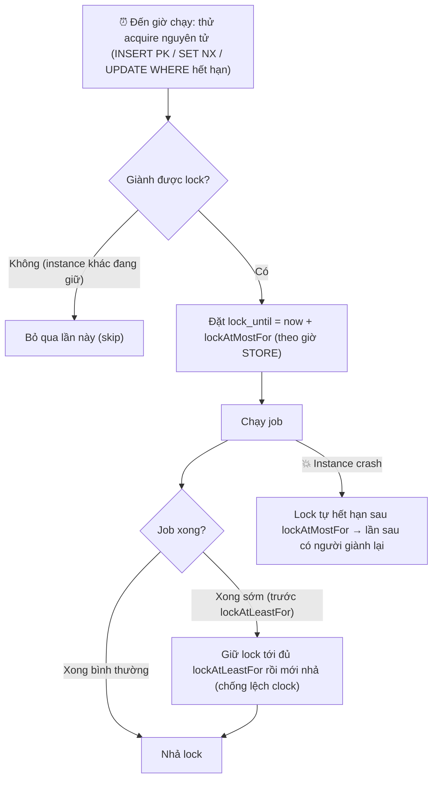

# Lock cho scheduled job nên thiết kế thế nào?

## ⚡ Tóm tắt ngắn (30s)
* **Bản chất**: Lock cho scheduled job là cơ chế để **giữa N instance, chỉ một được chạy** mỗi lần kích hoạt. Một lock "đúng" phải có đủ bốn tính chất: **acquire nguyên tử** (không hai instance cùng thắng), **có lease/TTL** (instance giữ lock mà crash thì lock tự nhả, không deadlock vĩnh viễn), **giữ tối thiểu một khoảng** (chống chạy lại tức thì do lệch đồng hồ), và **chống lock cũ ghi đè** (fencing). Thiếu bất kỳ tính chất nào đều dẫn tới chạy trùng hoặc treo vĩnh viễn.
* **Hướng xử lý**: Dùng store dùng chung (DB/Redis/ZooKeeper) với **upsert có điều kiện nguyên tử** + cột **`lock_until` (TTL)**; cấu hình **`lockAtMostFor`** (lưới an toàn khi crash) và **`lockAtLeastFor`** (tối thiểu, chống lệch clock). Dùng **giờ của store** (không phải giờ cục bộ từng node) làm nguồn thời gian duy nhất.
* **Quyết định Senior**: Tôi thiết kế lock quanh câu hỏi **"điều gì xảy ra khi node giữ lock chết?"** và **"điều gì xảy ra khi đồng hồ lệch?"**. Mặc định dùng **ShedLock** (đã đóng gói đúng các tính chất này), chỉ tự build khi có lý do đặc biệt — vì lock phân tán **rất dễ làm sai một cách tinh vi**.

---

## 🔍 Chi tiết bản chất thực chiến: Bốn tính chất sống còn

### 1. Acquire nguyên tử — chỉ một instance thắng
Bước giành lock phải là **một thao tác nguyên tử** ở store, không phải "đọc rồi ghi" (check-then-act có race). Cách làm:
* **DB**: `INSERT` với **PRIMARY KEY** trên tên lock (trùng thì fail), hoặc `UPDATE ... WHERE lock_until <= now` trả về số dòng (1 = thắng).
* **Redis**: `SET key value NX PX ttl` — chỉ set được nếu key chưa tồn tại, kèm TTL trong cùng lệnh.
Tuyệt đối tránh `SELECT` rồi mới `INSERT` ở hai câu — đó là cửa cho hai instance cùng vào.

### 2. Lease/TTL (`lockAtMostFor`) — chống deadlock khi crash
Nếu instance giành lock rồi **kill -9** trước khi nhả, mà lock không có hạn, thì **không ai chạy được nữa mãi mãi**. Vì vậy lock phải có **thời hạn tối đa** (`lock_until`): sau khoảng đó lock tự coi như hết hiệu lực. **`lockAtMostFor` phải dài hơn thời gian chạy tệ nhất của job** — nếu ngắn hơn, lock hết hạn *khi job vẫn chạy* → instance khác nhảy vào **chạy trùng**.

### 3. Giữ tối thiểu (`lockAtLeastFor`) — chống lệch đồng hồ
Nếu job chạy rất nhanh (vài chục ms) và đồng hồ các node lệch nhau, một node "đến giờ trễ" có thể thấy lock đã nhả và **chạy lại ngay**. **`lockAtLeastFor`** buộc giữ lock **tối thiểu** một khoảng kể cả job xong sớm, tạo vùng đệm an toàn quanh lệch clock.

### 4. Fencing token — chống "lock cũ" ghi đè
Tình huống tinh vi (Martin Kleppmann nêu): instance A giành lock, bị **GC pause/treo** lâu hơn TTL → lock hết hạn, B giành lock và chạy. Sau đó A **tỉnh dậy**, tưởng mình vẫn giữ lock và đi ghi dữ liệu → **xung đột với B**. Giải pháp triệt để là **fencing token**: mỗi lần cấp lock kèm một **số tăng dần**; tài nguyên đích **từ chối** ghi mang token cũ hơn token mới nhất nó đã thấy. Với scheduled job, đa số trường hợp `lockAtMostFor` đủ dài + job idempotent là chấp nhận được, nhưng cần biết giới hạn này.

### 5. Nguồn thời gian & lựa chọn store
* **Một đồng hồ duy nhất**: tính `lock_until` theo **giờ của store** (`usingDbTime()`), đừng để mỗi node dùng giờ riêng → loại bỏ lệch clock khỏi phép so sánh hết hạn.
* **Store**: **DB** (đơn giản, đã có sẵn, đủ tốt cho cron); **Redis** (nhanh, cần để ý TTL + an toàn khi failover); **ZooKeeper/etcd** (lock + ephemeral node tự nhả khi mất session, mạnh nhưng nặng hạ tầng).

---

## 🎨 Sơ đồ trực quan: Vòng đời một lock scheduled job

Sơ đồ mô tả các trạng thái của lock: trống → giữ → nhả/ hết hạn, với lockAtMostFor và lockAtLeastFor:



---

## 💻 Code thực chiến: BAD vs GOOD

Hai đoạn dưới tương phản lock tự chế đầy lỗ hổng với lock đúng (atomic + TTL + min-hold), minh họa bằng SQL và ShedLock:

### ❌ BAD: SELECT-rồi-INSERT, không TTL
```java
public boolean acquire(String name) {
    if (lockRepo.findByName(name) == null) { // ❌ check-then-act: hai instance cùng thấy null
        lockRepo.insert(name, Instant.now()); // ❌ cả hai cùng insert → cùng "thắng" → chạy trùng
        return true;                          // ❌ không có lock_until: instance crash là lock kẹt vĩnh viễn
    }
    return false;
}
```

### ✅ GOOD: Upsert có điều kiện nguyên tử + TTL (SQL) và ShedLock
```sql
-- ✅ Acquire nguyên tử: chỉ thành công nếu lock đang trống HOẶC đã hết hạn (theo giờ DB)
INSERT INTO shedlock (name, lock_until, locked_at, locked_by)
VALUES (:name, :now + :atMostFor, :now, :instanceId)
ON CONFLICT (name) DO UPDATE
   SET lock_until = EXCLUDED.lock_until, locked_at = EXCLUDED.locked_at, locked_by = EXCLUDED.locked_by
 WHERE shedlock.lock_until <= :now; -- ✅ chỉ chiếm được khi lock cũ đã hết hạn → không hai người cùng giữ
```

```java
// ✅ Để ShedLock lo đúng cả bốn tính chất; cấu hình hai tham số sống còn + dùng giờ DB
@Configuration
@EnableSchedulerLock(defaultLockAtMostFor = "PT30M")
public class LockConfig {
    @Bean
    public LockProvider lockProvider(DataSource ds) {
        return new JdbcTemplateLockProvider(
            JdbcTemplateLockProvider.Configuration.builder()
                .withJdbcTemplate(new JdbcTemplate(ds))
                .usingDbTime() // ✅ một đồng hồ duy nhất (giờ DB) → loại bỏ lệch clock giữa node
                .build());
    }
}

@Scheduled(cron = "0 0 2 * * *")
@SchedulerLock(
    name = "settleJob",
    lockAtMostFor = "PT30M",  // ✅ > thời gian chạy tệ nhất → crash thì 30' sau tự nhả, không kẹt
    lockAtLeastFor = "PT1M")  // ✅ giữ tối thiểu 1' → job ngắn không bị chạy lại do lệch đồng hồ
public void settle() { settleService.run(); }
```

---

## 📊 Bảng so sánh lựa chọn store cho lock

| Tiêu chí | DB (JDBC) | Redis (`SET NX PX`) | ZooKeeper / etcd |
| :--- | :--- | :--- | :--- |
| **Acquire nguyên tử** | PK / `ON CONFLICT ... WHERE` | `SET NX` (kèm TTL) | Ephemeral znode |
| **Tự nhả khi crash** | Qua `lock_until` (TTL) | Qua `PX` (TTL) | Tự nhả khi mất session (ephemeral) |
| **Hạ tầng thêm** | Không (đã có DB) | Cần Redis | Cần ZK/etcd (nặng) |
| **Rủi ro tinh vi** | Cần dùng giờ DB | Failover có thể mất lock (Redlock gây tranh cãi) | Phức tạp vận hành |
| **Hợp với** | Phần lớn scheduled job | Cần nhanh, latency thấp | Hệ đã có ZK, cần lock mạnh |

---

## ⚠️ Common Gotchas & Questions follow-up

### 1. Cạm bẫy "`lockAtMostFor` ngắn hơn thời gian chạy job"
* Đây là lỗi số một với lock cho scheduled job. Nếu TTL hết **trong khi job còn chạy**, lock tự nhả → instance khác giành được và **chạy trùng** ngay giữa lúc job đầu chưa xong. `lockAtMostFor` **phải** lớn hơn thời gian chạy ở kịch bản xấu nhất (cộng buffer). ShedLock cố ý không tự gia hạn lock giữa chừng để giữ logic đơn giản, nên trách nhiệm ước lượng đúng thuộc về bạn.

### 2. Cạm bẫy "tin lock là tuyệt đối, bỏ qua idempotency"
* Không lock phân tán nào an toàn 100% trước **GC pause/process treo dài hơn TTL** (vấn đề fencing). Vì vậy lock **giảm** xác suất chạy trùng chứ không **xóa bỏ** mọi rủi ro chạy lại sau crash. Lớp phòng thủ thứ hai **bắt buộc** là job **idempotent** (processed-marker/UPSERT/checkpoint), để dù có chạy lại thì kết quả vẫn đúng.

### 3. Câu hỏi đào sâu từ interviewer
* **Interviewer: "Instance đang giữ lock bị GC pause 40 giây, dài hơn TTL. Lock hết hạn, instance khác giành được và chạy job. Rồi instance đầu tỉnh dậy, tưởng mình vẫn giữ lock và tiếp tục ghi. Bạn chống tình huống này thế nào?"**
* **Trả lời**: Đây đúng là vấn đề **fencing** kinh điển — lock dựa trên TTL **không thể** một mình ngăn một tiến trình "ngủ đông" rồi tỉnh dậy ghi đè. Có hai hướng: (1) **Triệt để — fencing token**: mỗi lần cấp lock kèm một **số tăng đơn điệu**; mọi thao tác ghi xuống tài nguyên đích phải mang token, và tài nguyên **từ chối** token nhỏ hơn token lớn nhất nó từng thấy. Khi instance đầu tỉnh dậy ghi với token cũ, nó bị từ chối — instance sau (token mới) mới được ghi. (2) **Thực dụng — chấp nhận và bọc bằng idempotency**: với phần lớn scheduled job, tôi đặt `lockAtMostFor` đủ dài để vượt các GC pause hợp lý, **và** làm job idempotent để nếu có chạy chồng thì kết quả vẫn đúng (UPSERT/conditional update/processed-marker). Trong thực tế, nếu tài nguyên đích là DB hỗ trợ version/optimistic lock thì chính cột version đóng vai trò fencing token tự nhiên. Điều tôi luôn nhấn mạnh: **lock không thay thế idempotency** — chúng là hai lớp bổ sung.
