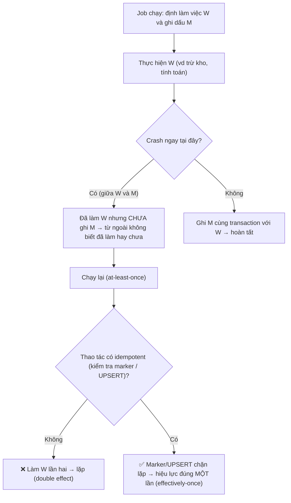

# Job cần chạy đúng một lần có thực tế không?

## ⚡ Tóm tắt ngắn (30s)
* **Bản chất**: "Chạy **đúng một lần** (exactly-once execution)" trong hệ phân tán có lỗi và mạng không tin cậy là một **ảo tưởng** — về lý thuyết là **bất khả thi**. Lý do: bất kỳ bước nào (thực thi việc, ghi nhận "đã làm", nhả lock) cũng có thể bị **crash/timeout xen vào giữa**, và bạn không thể phân biệt "đã làm rồi" với "tưởng làm mà chưa kịp ghi". Bạn chỉ chọn được một trong hai phía: **at-most-once** (có thể **bỏ sót**) hoặc **at-least-once** (có thể **lặp lại**).
* **Hướng xử lý**: Điều **thực tế và đúng** là **at-least-once delivery + idempotent effect = "effectively-once"** (hiệu lực như một lần). Tức là: cho phép job **chạy lại**, nhưng thiết kế sao cho **tác dụng** chỉ tính một lần (processed-marker, UPSERT, idempotency key, conditional update).
* **Quyết định Senior**: Khi nghe yêu cầu "job phải chạy đúng một lần", tôi **dịch lại** thành "**hiệu ứng** của job phải đúng một lần", rồi giải bằng **at-least-once + idempotency**. Tôi **không** hứa exactly-once execution, vì hứa điều bất khả thi là dấu hiệu chưa hiểu bản chất hệ phân tán.

---

## 🔍 Chi tiết bản chất thực chiến: Vì sao exactly-once là ảo tưởng

### 1. Khoảnh khắc "không thể phân biệt"
Mọi job rút gọn về hai hành động: **làm việc (W)** và **ghi nhận đã làm (M)**. Dù xếp thứ tự nào, luôn có một khe crash:
* **W trước, M sau**: crash giữa W và M → việc đã làm nhưng không có dấu → chạy lại sẽ **làm lần hai** (lặp).
* **M trước, W sau**: crash giữa M và W → đã đánh dấu nhưng việc chưa làm → chạy lại **bỏ qua** (sót).
Từ bên ngoài, hai trạng thái này **trông y hệt nhau**. Không có thứ tự nào loại bỏ được khe crash → không có exactly-once "miễn phí".

### 2. Lock cũng không cứu được
Distributed lock (ShedLock) đảm bảo **tại một thời điểm chỉ một instance chạy** (mutual exclusion), nhưng nếu instance giữ lock **làm xong một phần rồi crash** trước khi nhả, thì sau khi lock hết hạn (`lockAtMostFor`), lần kích hoạt sau **chạy lại** và lặp phần dở. Lock chống **chạy song song trùng**, **không** chống **chạy lại sau lỗi**.

### 3. Hai mô hình bạn thực sự được chọn
* **At-most-once**: không retry. Không bao giờ lặp, nhưng có thể **mất** (job lỡ thì thôi). Hợp khi mất một lần không sao (vd gửi một thông báo "nice-to-have").
* **At-least-once**: có retry/chạy lại. Không bao giờ mất, nhưng có thể **lặp**. Hợp với gần như mọi việc quan trọng (thanh toán, tính toán, ETL) — **miễn là** bạn khử được cái lặp.

### 4. "Effectively-once" = at-least-once + idempotency
Cách công nghiệp giải bài toán: chấp nhận **at-least-once** (chạy lại khi nghi ngờ) rồi làm cho **tác dụng idempotent** để cái lặp **vô hại**:
* **Processed-marker** (unique key) cùng transaction với việc → chạy lại thấy dấu thì bỏ qua.
* **UPSERT / conditional update** → ghi lặp không nhân đôi.
* **Idempotency key** cho side-effect ngoài (email, HTTP, Kafka) → bên nhận khử trùng.
Kết quả quan sát được là "**đúng một lần về hiệu lực**", dù **số lần thực thi** có thể >1. Đây mới là thứ "exactly-once" mà các hệ như Kafka EOS thực chất cung cấp: không phải "xử lý đúng một lần" theo nghĩa đen, mà là **kết quả như thể một lần** nhờ idempotency + atomic commit.

---

## 🎨 Sơ đồ trực quan: Khe crash phá vỡ exactly-once, idempotency cứu

Sơ đồ mô tả crash xen giữa "làm việc" và "ghi dấu", và vì sao processed-marker + chạy lại cho hiệu lực một lần:



---

## 💻 Code thực chiến: BAD vs GOOD

Hai đoạn dưới tương phản niềm tin "lock = exactly-once" (không idempotent) với at-least-once + idempotency cho hiệu lực một lần:

### ❌ BAD: Tin lock đảm bảo exactly-once, thao tác không idempotent
```java
@Scheduled(cron = "0 0 3 * * *")
@SchedulerLock(name = "chargeSubscriptions", lockAtMostFor = "PT10M")
public void chargeSubscriptions() {
    for (Sub s : subRepo.findDue()) {
        paymentGateway.charge(s.getUserId(), s.getAmount()); // ❌ crash giữa chừng + chạy lại = trừ tiền hai lần
        s.setChargedAt(Instant.now());                       // ❌ không phải dấu idempotent ở tầng DB
    }
    // ❌ Giả định "lock nên chỉ chạy một lần" — sai khi crash rồi lock hết hạn, lần sau chạy lại
}
```

### ✅ GOOD: At-least-once + idempotency (marker + idempotency key) cho hiệu lực một lần
```java
@Scheduled(cron = "0 0 3 * * *")
@SchedulerLock(name = "chargeSubscriptions", lockAtMostFor = "PT30M", lockAtLeastFor = "PT1M")
public void chargeSubscriptions() {
    for (Sub s : subRepo.findDue()) chargeOnce(s); // ✅ lock chống chạy song song; idempotency chống chạy lại
}

@Transactional
public void chargeOnce(Sub s) {
    String idemKey = "charge-" + s.getId() + "-" + s.getPeriod(); // ✅ khóa xác định, không random
    // ✅ marker là PK → nếu đã charge kỳ này thì INSERT trả 0 dòng → bỏ qua (effectively-once)
    if (processedRepo.insertIgnore(idemKey) == 0) return;
    paymentGateway.charge(s.getUserId(), s.getAmount(), idemKey); // ✅ gateway khử trùng theo cùng key
    s.setChargedAt(Instant.now());
}
```

---

## 📊 Bảng so sánh ba mô hình "số lần chạy"

| Mô hình | Có thể bỏ sót? | Có thể lặp? | Cách đạt | Hợp với |
| :--- | :--- | :--- | :--- | :--- |
| **At-most-once** | ✅ Có | ❌ Không | Không retry | Việc mất một lần không sao |
| **At-least-once** | ❌ Không | ✅ Có | Có retry/chạy lại | Việc quan trọng (cần khử lặp) |
| **Exactly-once (execution)** | ❌ | ❌ | **Bất khả thi** trong hệ phân tán có lỗi | — (chỉ là lý thuyết) |
| **Effectively-once (effect)** | ❌ Không | ❌ Không (về hiệu lực) | At-least-once **+ idempotency** | Chuẩn công nghiệp |

---

## ⚠️ Common Gotchas & Questions follow-up

### 1. Cạm bẫy "ghi marker và làm việc ở hai transaction khác nhau"
* Nếu bạn `charge()` (side-effect ngoài) rồi mới ghi marker ở một transaction khác, crash giữa hai bước sẽ phá vỡ tính "một lần": đã charge nhưng chưa đánh dấu → chạy lại charge tiếp. Với side-effect **trong DB**, hãy gói **marker + việc trong cùng transaction**. Với side-effect **ngoài DB** (gateway), dùng **idempotency key** để chính bên ngoài khử trùng, và/hoặc **outbox pattern** để tách an toàn.

### 2. Cạm bẫy "tưởng Kafka exactly-once nghĩa là xử lý đúng một lần theo nghĩa đen"
* Kafka EOS / transactional producer **không** biến mọi side-effect thành "đúng một lần thực thi". Nó đảm bảo **atomic read-process-write trong phạm vi Kafka** (offset commit + produce cùng một transaction). Mọi tác dụng **ra ngoài Kafka** (gọi API, gửi mail) vẫn cần **idempotency** riêng. "Exactly-once" ở đây vẫn là **effectively-once nhờ atomic commit + idempotency**, không phải phép màu xóa bỏ retry.

### 3. Câu hỏi đào sâu từ interviewer
* **Interviewer: "Sếp yêu cầu 'job trừ tiền phải chạy đúng một lần, tuyệt đối không được trừ hai lần và cũng không được bỏ sót'. Bạn cam kết thế nào?"**
* **Trả lời**: Tôi sẽ **làm rõ kỳ vọng** trước: trong hệ phân tán có lỗi, tôi **không thể** hứa "đúng một lần **thực thi**" — đó là điều bất khả thi vì luôn tồn tại khe crash giữa "trừ tiền" và "ghi nhận đã trừ", và ta không phân biệt được hai trạng thái đó từ bên ngoài. Nhưng tôi **có thể** đảm bảo đúng cái sếp thực sự cần: **không trừ hai lần và không bỏ sót về mặt hiệu lực**. Cách làm: chọn **at-least-once** (luôn chạy lại khi nghi ngờ, nên **không bỏ sót**) và phủ lên một lớp **idempotency** — mỗi lần trừ tiền gắn một **idempotency key xác định** (`charge-{subId}-{period}`) có **unique constraint**; gateway và DB **khử trùng** theo key đó nên chạy lại **không trừ lần hai**. Kết quả quan sát được là **"đúng một lần về hiệu lực" (effectively-once)** — chính xác điều nghiệp vụ mong muốn. Tôi cam kết **kết quả đúng**, chứ không cam kết một thuộc tính lý thuyết bất khả thi; và tôi luôn kèm **reconciliation/đối soát** cuối kỳ làm lưới an toàn cuối cùng.
