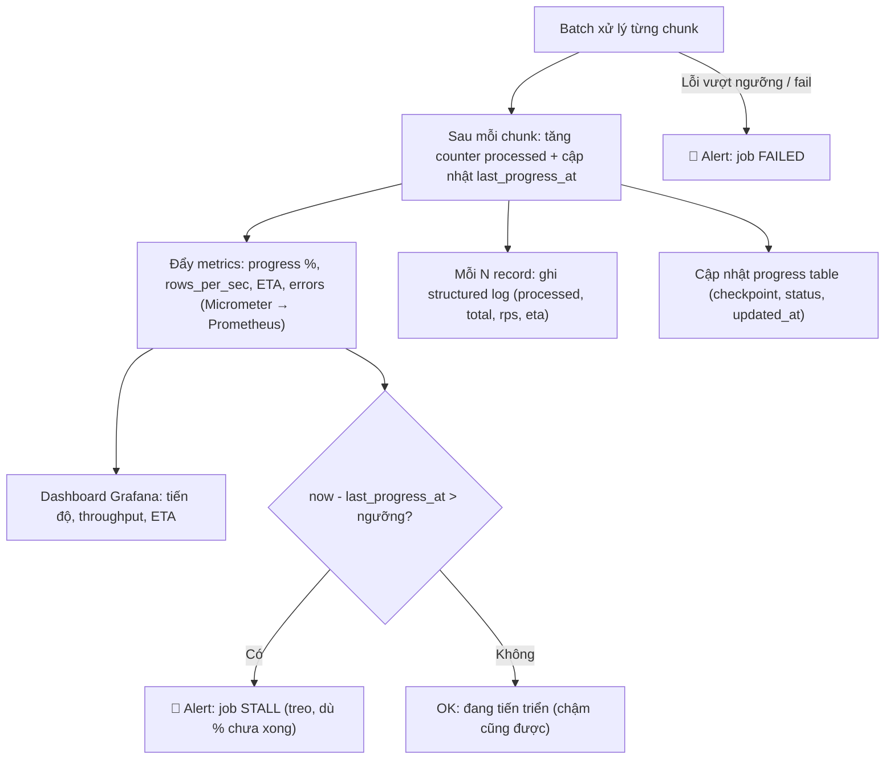

# Làm sao monitor progress của batch job?

## ⚡ Tóm tắt ngắn (30s)
* **Bản chất**: Một batch job chạy hàng giờ mà **không phát tín hiệu** là một **hộp đen**: bạn không biết nó còn sống hay đã treo, đã làm được bao nhiêu, bao giờ xong, có bao nhiêu lỗi. Monitor progress là biến hộp đen đó thành thứ **quan sát được**: bao nhiêu/tổng, throughput (rows/s), **ETA**, số lỗi, checkpoint hiện tại, và **nhịp heartbeat** để phân biệt "đang chạy chậm" với "đã chết".
* **Hướng xử lý**: Phát ba loại tín hiệu bổ sung nhau:
  1. **Metrics** (Micrometer/Prometheus): counter `processed`, gauge `total`/`progress %`/`rows_per_sec`, `last_heartbeat`.
  2. **Structured log** mỗi N record (không phải mỗi record) kèm tiến độ.
  3. **Progress/checkpoint table** để truy vấn trạng thái và resume.
  Trên đó dựng **dashboard + alert**: báo động khi **stall** (không tiến triển trong X phút) và khi **fail/complete**.
* **Quyết định Senior**: Tôi phân biệt rõ **"chậm" (vẫn tiến) và "treo" (không tiến)** — và alert nhắm vào **stall** (thiếu tiến triển) chứ không chỉ vào lỗi. Một batch tốt phải **tự thuật lại** tiến độ của mình để vận hành không phải đoán.

---

## 🔍 Chi tiết bản chất thực chiến: Quan sát một batch dài

### 1. Những chỉ số cần phát ra
* **`processed` / `total`** → suy ra **% hoàn thành**.
* **Throughput** (rows/s) tính trên cửa sổ trượt → biết nhanh/chậm thực tế.
* **ETA** = thời gian còn lại ước lượng:

  $$ETA = \frac{total - processed}{throughput}$$

* **Số lỗi / số skip** và phân loại lỗi.
* **Checkpoint hiện tại** (last id) → biết đang ở đâu, dùng để resume.
* **`last_heartbeat`** → mốc thời gian "lần cuối còn sống".

### 2. Heartbeat — phân biệt "chậm" với "chết"
Vấn đề khó nhất khi monitor batch: một job **chạy chậm** và một job **đã treo** trông giống nhau nếu chỉ nhìn "% chưa xong". Lời giải là **heartbeat/tiến-triển**: job cập nhật `last_progress_at` mỗi khi xử lý xong một chunk. Bộ giám sát so `now - last_progress_at`: nếu vượt ngưỡng (vd 10 phút **không có chunk nào** trôi) → **stall**, dù % chưa tới 100. Đây là khác biệt then chốt so với chỉ theo dõi tỉ lệ phần trăm.

### 3. Ba kênh tín hiệu, mỗi kênh một vai
* **Metrics (Prometheus/Micrometer)**: cho **dashboard thời gian thực** và **alerting** (rate, gauge). Đây là kênh chính để máy theo dõi.
* **Structured logs**: ghi mỗi **N record** (vd mỗi 10.000) một dòng JSON `{processed, total, rps, eta}` — đủ để con người lần theo, **không** ghi mỗi record (sẽ ngập log).
* **Progress table trong DB**: lưu `(job, processed, total, checkpoint, status, updated_at)` — vừa để **truy vấn trạng thái** qua API/endpoint, vừa trùng vai với checkpoint để **resume**.

### 4. Dùng sẵn nền tảng khi có
**Spring Batch** có `JobRepository` lưu metadata mỗi step/chunk (read count, write count, skip count, commit count, status) — khai thác cái này thay vì tự dựng lại. Ngoài ra expose `/actuator` + Micrometer để đẩy thẳng lên Prometheus/Grafana.

---

## 🎨 Sơ đồ trực quan: Batch phát tín hiệu, dashboard & alert tiêu thụ

Sơ đồ mô tả job phát metrics/heartbeat/log, và bộ giám sát báo động khi stall hoặc fail:



---

## 💻 Code thực chiến: BAD vs GOOD

Hai đoạn dưới tương phản batch "hộp đen" với batch phát metrics + heartbeat + log định kỳ + ETA:

### ❌ BAD: Không phát tín hiệu — hộp đen
```java
public void runBatch(List<Long> ids) {
    for (Long id : ids) {
        process(id); // ❌ chạy hàng giờ, không ai biết tới đâu, còn sống hay đã treo
    }
    // ❌ không metrics, không heartbeat, không ETA; treo và "chậm" trông giống hệt nhau
}
```

### ✅ GOOD: Counter + gauge + heartbeat + log định kỳ + ETA
```java
private final Counter processed = Metrics.counter("batch.processed", "job", "recalc");
private final AtomicLong total = new AtomicLong();

public void runBatch(List<Long> ids) {
    total.set(ids.size());
    Metrics.gauge("batch.total", total);                 // ✅ tổng để tính % và ETA
    long start = System.nanoTime(); long done = 0;

    long lastId = checkpointRepo.load("recalc");          // ✅ resume + biết đang ở đâu
    for (Long id : ids) {
        process(id);
        done++; processed.increment();
        if (done % 10_000 == 0) {                         // ✅ log mỗi N record, không mỗi record
            double rps = done / ((System.nanoTime() - start) / 1e9);
            long eta = (long) ((total.get() - done) / Math.max(rps, 1)); // ✅ ETA (giây)
            log.info("recalc progress={}/{} rps={} etaSec={}", done, total.get(), (long) rps, eta);
            progressRepo.update("recalc", done, total.get(), id, Instant.now()); // ✅ heartbeat + checkpoint
        }
    }
}

// ✅ Bộ giám sát: alert khi STALL (thiếu tiến triển), không chỉ khi có lỗi
@Scheduled(fixedRate = 60_000)
public void detectStall() {
    progressRepo.findRunning().forEach(p -> {
        if (p.getUpdatedAt().isBefore(Instant.now().minus(Duration.ofMinutes(10))))
            alerting.fire(p.getJob() + " STALL: 10' không có tiến triển"); // ✅ phân biệt treo vs chậm
    });
}
```

---

## 📊 Bảng so sánh các kênh & chỉ số monitor

| Kênh / chỉ số | Trả lời câu hỏi | Công cụ | Lưu ý |
| :--- | :--- | :--- | :--- |
| **Counter `processed` + gauge `total`** | Bao nhiêu / tổng, % | Micrometer + Prometheus | Nền cho dashboard & ETA |
| **Throughput (rows/s)** | Nhanh hay chậm | Rate trên Prometheus | Tính trên cửa sổ trượt |
| **ETA** | Bao giờ xong | Tính từ rate + còn lại | Chỉ ước lượng, dao động |
| **`last_progress_at` (heartbeat)** | Còn sống hay treo | Progress table / gauge | **Phân biệt chậm vs treo** |
| **Structured log mỗi N record** | Lần theo chi tiết | ELK / Loki | Đừng log mỗi record |
| **Số lỗi / skip** | Chất lượng chạy | Counter | Alert khi vượt ngưỡng |

---

## ⚠️ Common Gotchas & Questions follow-up

### 1. Cạm bẫy "log mỗi record làm ngập log và tự bóp nghẹn"
* Ghi một dòng log cho **từng** record khi xử lý hàng triệu dòng sẽ tạo hàng triệu dòng log: ngốn IO/đĩa, làm chậm chính job, và **chôn vùi** tín hiệu quan trọng trong biển log. Hãy log theo **mốc (mỗi N record)** hoặc theo **thời gian (mỗi 30s)**, và đẩy số liệu chi tiết qua **metrics** (rẻ, tổng hợp được) thay vì log.

### 2. Cạm bẫy "chỉ theo dõi % nên không phát hiện treo"
* Nếu chỉ nhìn "đã xong 47%", bạn **không biết** 47% đó đang nhích lên hay đã **đứng im 2 tiếng**. Một job treo ở 47% và một job chạy chậm tới 47% nhìn giống nhau. Phải theo dõi **tiến-triển theo thời gian** (`last_progress_at`) và alert khi **không có chunk nào trôi qua trong X phút** — đó mới là tín hiệu "treo" thật.

### 3. Câu hỏi đào sâu từ interviewer
* **Interviewer: "Làm sao bạn phân biệt một batch job đang chạy chậm với một batch job đã bị treo, để không báo động giả nhưng cũng không bỏ sót sự cố?"**
* **Trả lời**: Tôi **không** dùng "% hoàn thành" hay "tổng thời gian chạy" làm tín hiệu treo, vì một job lớn chạy chậm hợp lệ vẫn có % thấp và thời gian dài. Thay vào đó tôi đo **tốc độ tiến triển**: mỗi khi xử lý xong một chunk, job cập nhật `last_progress_at`. Bộ giám sát kiểm tra `now - last_progress_at`: nếu **không có chunk nào trôi qua trong một khoảng ngưỡng** (vd 10 phút) thì đó là **treo**, bất kể đang ở 5% hay 95%. Ngược lại, nếu chunk vẫn đều đặn trôi — dù chậm — thì job **vẫn sống**, chỉ là throughput thấp (cái này tôi cảnh báo ở mức nhẹ hơn, hoặc cảnh báo khi **ETA vượt SLA**). Như vậy tôi tách bạch hai khái niệm: **"chết" = thiếu tiến triển** (alert nghiêm trọng), **"chậm" = tiến triển dưới kỳ vọng** (alert cảnh báo/ETA). Ngưỡng stall tôi đặt dựa trên **thời gian xử lý một chunk ở p99**, cộng buffer, để tránh báo động giả khi một chunk tình cờ lâu hơn bình thường.
