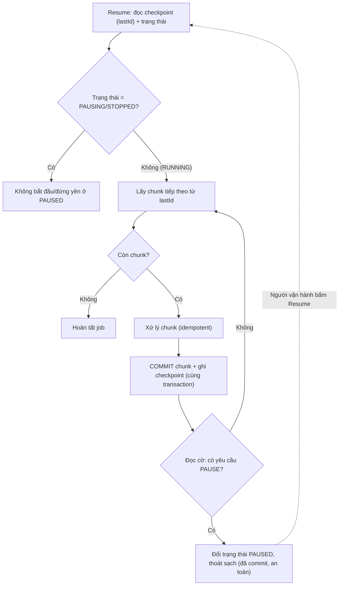

# Làm sao pause/resume một job đang chạy?

## ⚡ Tóm tắt ngắn (30s)
* **Bản chất**: Pause/resume an toàn **không phải** là "giết tiến trình rồi bật lại". Nó là **dừng hợp tác (cooperative stop)**: job tự **kiểm tra một cờ điều khiển ở ranh giới chunk**, khi được yêu cầu dừng thì **hoàn tất chunk hiện tại, ghi checkpoint, thoát sạch**; khi resume thì **đọc checkpoint và chạy tiếp từ đúng chỗ đã dừng**. Tuyệt đối tránh `kill -9`/ngắt cứng giữa transaction vì sẽ để lại trạng thái dở dang.
* **Hướng xử lý**: Cần ba mảnh ghép:
  1. **Cờ điều khiển** (DB/Redis/feature flag) mà job poll ở **ranh giới chunk** (không phải giữa chunk).
  2. **Checkpoint** sau mỗi chunk (cùng transaction với việc) để biết dừng ở đâu mà tiếp.
  3. **Idempotency** để nếu chunk cuối bị xử lý lại khi resume thì cũng vô hại.
* **Quyết định Senior**: Tôi thiết kế job để **luôn dừng được ở một điểm an toàn** và **luôn tiếp được mà không trùng/sót**. Pause là một **tín hiệu hợp tác**, không phải một cú đấm — và khả năng pause/resume chính là hệ quả tự nhiên của việc đã làm batch theo chunk + checkpoint + idempotent.

---

## 🔍 Chi tiết bản chất thực chiến: Dừng hợp tác, không dừng cưỡng bức

### 1. Vì sao không được `kill -9` giữa chừng
Ngắt cứng một job đang ở **giữa một transaction/chunk** để lại hậu quả: transaction dở bị rollback (mất công đã làm), hoặc tệ hơn là **side-effect ngoài DB đã phát đi một nửa** (đã gửi 300/1.000 email của lô) mà không có dấu vết để biết dừng ở đâu. Khi bật lại, bạn **không biết** đã làm tới đâu → trùng hoặc sót. Pause an toàn phải xảy ra ở **ranh giới chunk** — nơi mọi thứ đã được commit gọn gàng.

### 2. Cờ điều khiển kiểm tra ở ranh giới chunk
Job đọc một **cờ trạng thái** (`RUNNING`/`PAUSING`/`STOPPED`) từ store chung **giữa các chunk**, không phải giữa từng record. Khi thấy `PAUSING`:
* Hoàn tất chunk đang dở (commit + checkpoint),
* Đổi trạng thái sang `PAUSED`,
* **Thoát vòng lặp một cách sạch sẽ**.
Kiểm tra ở ranh giới chunk đảm bảo điểm dừng luôn **nhất quán** (đã commit), và độ trễ phản hồi pause = thời gian chạy một chunk (nên giữ chunk đủ nhỏ để pause kịp thời).

### 3. Checkpoint biến "dừng" thành "tạm dừng"
Không có checkpoint thì "dừng" = "phải làm lại từ đầu". Checkpoint (last processed id) **commit cùng transaction với việc của chunk** cho phép resume **chạy tiếp từ đúng vị trí**. Đây chính là thứ phân biệt **pause/resume** (tiếp tục) với **stop/restart** (làm lại).

### 4. Resume an toàn nhờ idempotency
Khi resume, có thể chunk cuối trước lúc pause **đã làm nhưng checkpoint chưa kịp ghi** (nếu pause không hoàn toàn nguyên tử), nên resume có thể **xử lý lại** một ít. Vì vậy job vẫn cần **idempotent** (processed-marker/UPSERT/conditional update) để phần chồng lấn đó **không gây trùng**. Pause/resume và idempotency bổ trợ nhau.

### 5. Nền tảng có sẵn: Spring Batch
**Spring Batch** hỗ trợ điều này gần như nguyên bản: `stop()` đặt cờ để step dừng ở **ranh giới chunk**, trạng thái lưu trong `JobRepository`, và **restart** một `JobExecution` đã `STOPPED` sẽ **tiếp tục từ chunk dang dở** (nhờ metadata đọc/ghi đã commit). Khai thác cái này thay vì tự dựng cơ chế dừng.

---

## 🎨 Sơ đồ trực quan: Vòng lặp chunk kiểm tra cờ pause

Sơ đồ mô tả job đọc cờ điều khiển ở ranh giới chunk, dừng sạch và resume từ checkpoint:



---

## 💻 Code thực chiến: BAD vs GOOD

Hai đoạn dưới tương phản dừng cưỡng bức giữa chunk với dừng hợp tác ở ranh giới chunk + checkpoint:

### ❌ BAD: Ngắt cứng giữa chừng, không checkpoint
```java
volatile boolean kill = false; // ❌ đặt cờ rồi Thread.interrupt()/kill giữa transaction

public void run(List<Long> ids) {
    for (Long id : ids) {
        if (kill) throw new RuntimeException("killed"); // ❌ dừng giữa chunk → transaction dở, mất dấu
        process(id); // ❌ side-effect có thể đã phát một nửa, không biết tới đâu để tiếp
    }
    // ❌ không checkpoint → bật lại phải làm từ đầu, hoặc trùng/sót
}
```

### ✅ GOOD: Cooperative pause ở ranh giới chunk + checkpoint + idempotent
```java
public void run() {
    long lastId = checkpointRepo.load("recalc");          // ✅ resume từ checkpoint
    while (true) {
        if (control.state("recalc") != State.RUNNING) {   // ✅ kiểm tra cờ ở RANH GIỚI chunk
            control.markPaused("recalc");                 // ✅ dừng sạch, trạng thái nhất quán
            return;
        }
        List<Item> chunk = repo.findAfter(lastId, 1000);
        if (chunk.isEmpty()) { control.markCompleted("recalc"); return; }

        lastId = processChunk(chunk);                     // ✅ commit + checkpoint cùng transaction
    }
}

@Transactional
public long processChunk(List<Item> chunk) {
    for (Item it : chunk) processIdempotent(it);          // ✅ idempotent: resume chồng lấn vẫn an toàn
    long last = chunk.get(chunk.size() - 1).getId();
    checkpointRepo.save("recalc", last);                  // ✅ checkpoint cùng tx với việc
    return last;
}

// API điều khiển: pause/resume chỉ là đổi cờ, job tự phản ứng ở ranh giới chunk
public void pause()  { control.requestPause("recalc"); }  // ✅ tín hiệu hợp tác, không kill
public void resume() { control.setRunning("recalc"); }    // ✅ job đọc checkpoint chạy tiếp
```

---

## 📊 Bảng so sánh dừng cưỡng bức vs dừng hợp tác

| Tiêu chí | `kill -9` / ngắt cứng giữa chunk | Cooperative pause ở ranh giới chunk |
| :--- | :--- | :--- |
| **Trạng thái khi dừng** | Dở dang, có thể rollback/nửa vời | Nhất quán (đã commit chunk) |
| **Side-effect ngoài DB** | Có thể phát một nửa, mất dấu | Trọn vẹn theo chunk, có checkpoint |
| **Resume** | Phải làm lại từ đầu / trùng / sót | Chạy tiếp từ checkpoint |
| **Độ trễ phản hồi pause** | Tức thì nhưng nguy hiểm | = thời gian một chunk (an toàn) |
| **Yêu cầu** | Không | Cờ điều khiển + checkpoint + idempotent |

---

## ⚠️ Common Gotchas & Questions follow-up

### 1. Cạm bẫy "kiểm tra cờ pause giữa chunk thay vì ở ranh giới"
* Nếu job kiểm tra cờ và dừng **ngay giữa** một chunk/transaction, nó để lại đúng cái trạng thái dở dang mà cooperative pause sinh ra để tránh. Cờ pause phải được đọc **giữa các chunk** — sau khi chunk trước đã commit, trước khi chunk sau bắt đầu — để điểm dừng luôn nằm trên một **ranh giới nhất quán**. Hệ quả: muốn pause phản hồi nhanh thì chunk phải đủ nhỏ.

### 2. Cạm bẫy "pause nhưng vẫn giữ tài nguyên/lock"
* Một job "paused" mà vẫn **giữ distributed lock**, **ôm connection**, hoặc **giữ transaction mở** thì không thật sự nhường tài nguyên — nó chặn instance khác và có thể làm lock hết hạn bất ngờ. Khi pause, job nên **nhả lock/connection** và lưu mọi thứ cần thiết vào checkpoint, để lúc resume **giành lại** tài nguyên và tiếp tục, thay vì "ngủ" mà vẫn nắm tài nguyên.

### 3. Câu hỏi đào sâu từ interviewer
* **Interviewer: "Job của bạn đang gửi email hàng loạt thì bị yêu cầu pause. Làm sao đảm bảo khi resume không có ai bị gửi trùng và cũng không ai bị bỏ sót?"**
* **Trả lời**: Email là **side-effect ngoài DB không rollback được**, nên tôi không thể chỉ dựa vào transaction. Tôi xử lý ở ba lớp. (1) **Checkpoint theo từng người nhận**: thay vì checkpoint thô theo lô, tôi ghi **processed-marker cho mỗi recipient** (`sent(jobId, userId)` với unique key) **trước hoặc trong cùng transaction** với hành động gửi, để biết chính xác ai đã được gửi. (2) **Pause ở ranh giới chunk**: khi nhận yêu cầu pause, job gửi nốt chunk hiện tại, commit marker, rồi dừng — không cắt ngang giữa lô. (3) **Idempotent khi resume**: lúc chạy tiếp, với mỗi recipient tôi kiểm tra marker; ai **đã có marker thì bỏ qua** (không gửi trùng), ai **chưa có thì gửi** (không bỏ sót). Nếu có khe nhỏ "đã gửi nhưng marker chưa kịp ghi" do crash, tôi giảm thiểu bằng cách gắn **idempotency key vào nhà cung cấp email** (nhiều provider hỗ trợ khử trùng theo key) — như vậy ngay cả khi gọi lại, email cũng chỉ thực sự đi một lần. Tổng hợp lại: **marker theo từng recipient + pause ở ranh giới + idempotency key của provider** cho tôi đảm bảo "đúng một lần về hiệu lực" cho từng người nhận, đúng cả khi pause/resume xen vào.
