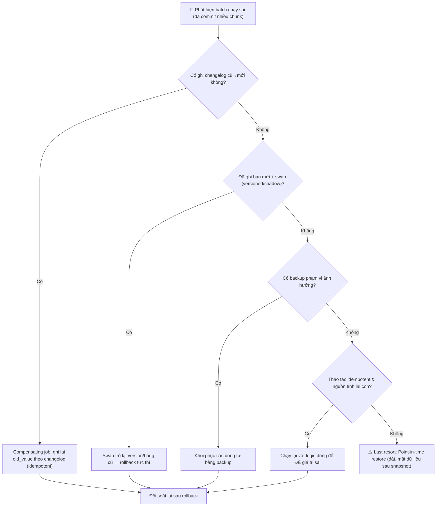

# Làm sao rollback kết quả của batch job sai?

## ⚡ Tóm tắt ngắn (30s)
* **Bản chất**: Một batch sai đã chạy xong **không thể** rollback bằng `ROLLBACK` của transaction — vì nó đã **commit qua hàng nghìn chunk** (mỗi chunk một transaction riêng), thậm chí đã **phát side-effect ra ngoài** (email, gọi API, event). "Rollback batch" thực chất là một bài toán **đảo ngược có chủ đích**: phải **biết đã đổi những gì** rồi **hoàn tác** chúng — chứ không có nút Undo thần kỳ.
* **Hướng xử lý**: Khả năng rollback phải được **thiết kế từ trước**, theo các chiến lược (từ tốt đến last-resort):
  1. **Changelog/audit (cũ→mới)** + **compensating job** đảo ngược từng thay đổi.
  2. **Ghi bản mới + swap** (versioned write / shadow table) thay vì ghi đè — rollback = trỏ lại bản cũ.
  3. **Backup/snapshot trước khi chạy** → khôi phục có chọn lọc.
  4. **Chạy lại với logic đúng** để **đè** (nếu thao tác idempotent & tuyệt đối).
  5. **Point-in-time restore** toàn DB (last resort, đắt, ảnh hưởng rộng).
* **Quyết định Senior**: Phòng bệnh hơn chữa bệnh — **dry-run + canary + đối soát** để **đừng** phải rollback. Nhưng luôn **thiết kế đường lùi trước khi chạy**: ghi lại cái mình đổi và ưu tiên thao tác **đảo ngược được**. Đặc biệt cảnh giác **side-effect không thể thu hồi**.

---

## 🔍 Chi tiết bản chất thực chiến: Năm chiến lược đảo ngược

### 1. Vì sao không thể "rollback" như một transaction
Batch lớn cố tình **commit theo từng chunk** (để nhả lock, tránh undo phình). Hệ quả là khi phát hiện sai ở chunk thứ 4.000, thì 3.999 chunk trước **đã commit vĩnh viễn** — không còn transaction nào để rollback. Vì vậy "rollback batch" = **một batch thứ hai đi đảo ngược batch thứ nhất**, và nó chỉ làm được nếu ta đã **lưu lại đủ thông tin** để biết đảo ngược cái gì.

### 2. Changelog + compensating job (đảo ngược tường minh)
Trong lúc chạy, ghi một **changelog** cho mỗi thay đổi: `(table, id, field, old_value, new_value, batch_run_id)`. Khi cần rollback, một **compensating job** đọc changelog của `batch_run_id` đó và **ghi lại `old_value`** (theo thứ tự ngược, idempotent). Đây là cách **chính xác và có chọn lọc** nhất: chỉ hoàn tác đúng những gì batch đã đổi, không đụng dữ liệu khác.

### 3. Versioned write / shadow table + swap (không ghi đè)
Thay vì ghi đè trực tiếp, batch ghi kết quả vào **bản mới có version** hoặc **bảng bóng (shadow)**; chỉ khi đã **đối soát đạt** mới **swap** (đổi con trỏ/đổi tên bảng/bật version) để dữ liệu mới có hiệu lực. Rollback khi đó cực rẻ: **trỏ lại version/bảng cũ**. Mô hình này biến rollback thành một thao tác **nguyên tử, tức thì**.

### 4. Backup/snapshot trước khi chạy
Trước backfill nguy hiểm, **chụp snapshot** (DB snapshot, hoặc copy các dòng sẽ đụng sang bảng `*_backup`). Nếu sai, **khôi phục** từ snapshot. Lưu ý: snapshot toàn DB khôi phục thì **mất luôn** dữ liệu hợp lệ ghi sau thời điểm snapshot — nên thường chỉ backup **phạm vi bị ảnh hưởng**, không phải cả DB.

### 5. Chạy lại đè + Point-in-time restore (hai thái cực)
* **Chạy lại với logic đúng**: nếu thao tác **idempotent & tuyệt đối** (`SET x = correct_value`), chỉ cần chạy lại batch với công thức đúng để **đè** giá trị sai — không cần "undo" riêng. Đây thường là cách đơn giản nhất **nếu** dữ liệu nguồn để tính lại vẫn còn.
* **Point-in-time recovery (PITR)**: khôi phục toàn DB về thời điểm trước batch — **last resort**: đắt, downtime, và **cuốn trôi** mọi giao dịch hợp lệ xảy ra sau đó. Chỉ dùng khi thảm họa diện rộng và không có đường nào khác.

---

## 🎨 Sơ đồ trực quan: Đường lùi của một batch sai

Sơ đồ mô tả lựa chọn chiến lược rollback tùy theo cái đã chuẩn bị trước khi chạy:



---

## 💻 Code thực chiến: BAD vs GOOD

Hai đoạn dưới tương phản batch ghi đè không để lại dấu vết (không thể lùi) với batch ghi changelog + compensating job:

### ❌ BAD: Ghi đè trực tiếp, không lưu giá trị cũ
```java
@Transactional
public void applyChunk(List<Account> chunk) {
    for (Account a : chunk) {
        a.setTier(computeTier(a)); // ❌ ghi đè tier cũ, KHÔNG lưu lại giá trị trước đó
        accountRepo.save(a);       // ❌ commit vĩnh viễn; nếu computeTier sai → không có đường về
    }
}
```

### ✅ GOOD: Changelog cũ→mới khi chạy + compensating job để rollback
```java
@Transactional
public void applyChunk(List<Account> chunk, String batchRunId) {
    for (Account a : chunk) {
        String oldTier = a.getTier();
        String newTier = computeTier(a);
        changelogRepo.record(batchRunId, "account", a.getId(), "tier", oldTier, newTier); // ✅ lưu cũ→mới
        accountRepo.updateTier(a.getId(), newTier);
    }
}

// ✅ Rollback = compensating job đọc changelog, ghi lại giá trị cũ (idempotent, theo lô)
public void rollback(String batchRunId) {
    long lastId = checkpointRepo.load("rollback-" + batchRunId);
    while (true) {
        List<Change> changes = changelogRepo.findAfter(batchRunId, lastId, 1000); // keyset
        if (changes.isEmpty()) break;
        compensateChunk(changes);
        lastId = changes.get(changes.size() - 1).getSeq();
    }
}

@Transactional
public void compensateChunk(List<Change> changes) {
    for (Change c : changes) {
        // ✅ chỉ hoàn tác nếu giá trị hiện tại đúng bằng giá trị batch đã ghi (tránh đè mất thay đổi mới hơn)
        accountRepo.updateFieldIfEquals(c.getEntityId(), c.getField(), c.getNewValue(), c.getOldValue());
    }
}
```

```sql
-- ✅ Changelog cho phép rollback có chọn lọc theo từng lần chạy batch
CREATE TABLE batch_changelog (
    seq          BIGSERIAL PRIMARY KEY,
    batch_run_id VARCHAR(64) NOT NULL,
    entity       VARCHAR(64) NOT NULL,
    entity_id    BIGINT      NOT NULL,
    field        VARCHAR(64) NOT NULL,
    old_value    TEXT,
    new_value    TEXT
);
CREATE INDEX idx_changelog_run ON batch_changelog (batch_run_id, seq);
```

---

## 📊 Bảng so sánh các chiến lược rollback batch

| Chiến lược | Phải chuẩn bị trước? | Độ chính xác | Chi phí rollback | Hợp với |
| :--- | :--- | :--- | :--- | :--- |
| **Changelog + compensating job** | Có (ghi cũ→mới) | Cao (chọn lọc đúng dòng) | Trung bình (chạy job đảo) | Update tại chỗ cần lùi chính xác |
| **Versioned write / shadow + swap** | Có (ghi bản mới) | Cao | Rất thấp (swap tức thì) | Tính lại tập lớn, cần swap nguyên tử |
| **Backup phạm vi ảnh hưởng** | Có (snapshot trước) | Trung bình | Trung bình | Backfill rủi ro, phạm vi rõ |
| **Chạy lại đè (idempotent)** | Không (nếu nguồn còn) | Cao nếu tuyệt đối | Thấp | Thao tác idempotent, còn nguồn tính lại |
| **Point-in-time restore** | Có (backup/WAL) | Thô (cả DB) | Rất cao + downtime | Last resort, thảm họa diện rộng |

---

## ⚠️ Common Gotchas & Questions follow-up

### 1. Cạm bẫy "side-effect ngoài DB không thể rollback"
* Email đã gửi, tiền đã trừ qua gateway, event đã đẩy lên Kafka — những thứ này **không** nằm trong DB nên changelog/restore **không thu hồi** được. Bạn không thể "rút lại" một email đã gửi. Với loại này, cách duy nhất là **giảm thiểu rủi ro trước** (dry-run/canary để bắt sai trước khi phát ra ngoài) và **bù trừ về mặt nghiệp vụ** (gửi email đính chính, tạo giao dịch hoàn tiền) — chứ không có rollback kỹ thuật. Vì vậy thứ tự an toàn là: **đổi DB và đối soát xong** rồi mới **phát side-effect ngoài**.

### 2. Cạm bẫy "rollback đè mất thay đổi hợp lệ xảy ra sau batch"
* Nếu sau khi batch chạy sai, user/hệ thống khác đã **cập nhật hợp lệ** một số dòng, thì việc khôi phục thô (restore snapshot / ghi đè `old_value` vô điều kiện) sẽ **xóa luôn** các thay đổi đúng đó. Compensating job nên dùng **conditional update** (`WHERE current = new_value_batch_đã_ghi`): chỉ hoàn tác khi giá trị hiện tại **đúng là** cái batch đã đặt, còn nếu đã bị đổi tiếp thì **bỏ qua** để không cuốn trôi dữ liệu mới hơn.

### 3. Câu hỏi đào sâu từ interviewer
* **Interviewer: "Batch của bạn vừa cập nhật sai `status` cho 3 triệu đơn hàng cách đây 6 tiếng. Trong 6 tiếng đó khách hàng vẫn đặt đơn mới và một số đơn đã đổi trạng thái hợp lệ. Bạn rollback thế nào để sửa cái sai mà không phá cái đúng?"**
* **Trả lời**: Tôi **loại ngay** phương án point-in-time restore toàn DB, vì nó sẽ **cuốn trôi 6 tiếng dữ liệu hợp lệ** (đơn mới, thay đổi đúng) — chữa lợn lành thành lợn què. Cách đúng là **rollback có chọn lọc dựa trên dấu vết**: (1) Nếu batch đã ghi **changelog (cũ→mới) gắn `batch_run_id`**, tôi chạy một **compensating job** đọc changelog đó và khôi phục `status` cũ, nhưng dùng **conditional update**: chỉ hoàn tác đơn nào mà `status` hiện tại **vẫn đúng bằng giá trị batch đã ghi sai** — nghĩa là chưa bị ai đụng tiếp; đơn nào đã đổi trạng thái hợp lệ sau đó thì **bỏ qua**, không đè. (2) Nếu **không có changelog**, tôi tận dụng các nguồn dấu vết khác: `updated_at`/`updated_by` để khoanh vùng đúng các dòng do batch (chạy lúc 6h trước, bởi service account của batch) chạm vào, kết hợp **audit log/CDC** nếu có, rồi vẫn dùng conditional update để chỉ sửa đúng tập đó. (3) Tôi sẽ chạy compensating job **theo chunk + idempotent + có đối soát**, và **dry-run** trên một mẫu để xác nhận nó chỉ chạm đúng các đơn sai trước khi chạy toàn bộ. Bài học tôi rút ra và sẽ áp dụng lần sau: **mọi batch ghi đè dữ liệu quan trọng phải sinh changelog hoặc ghi versioned ngay từ đầu**, để rollback luôn là thao tác **có chọn lọc**, không bao giờ phải dùng tới búa tạ restore toàn cục.
