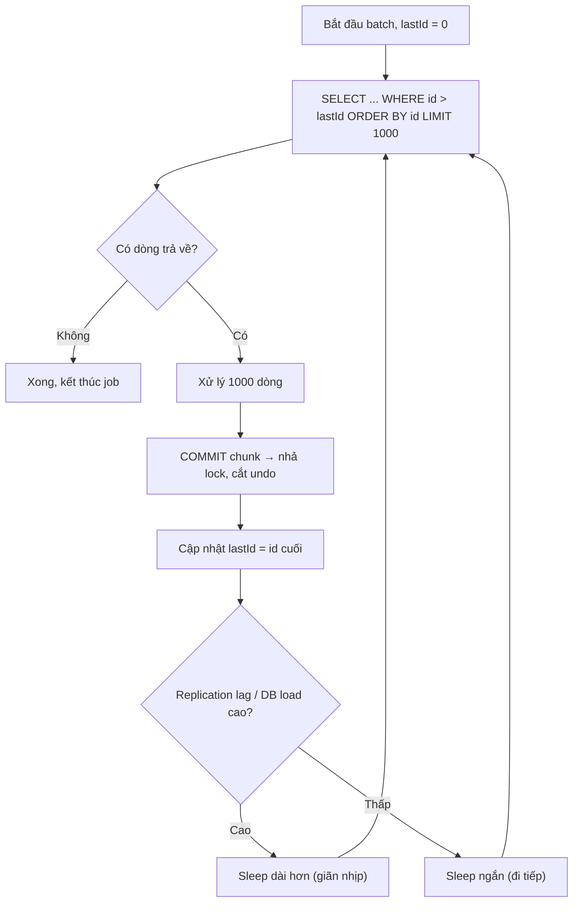

# Batch job chạy quá lâu ảnh hưởng database production. Bạn làm gì?

## ⚡ Tóm tắt ngắn (30s)
* **Bản chất**: Một batch job "ăn tạp" (load hết vào RAM, update hàng triệu dòng trong **một transaction khổng lồ**, quét bảng bằng `OFFSET`) sẽ **giam lock lâu, phình undo/WAL, ngốn buffer pool, bão hòa IO/CPU**, kéo theo **replication lag** và làm chậm mọi truy vấn OLTP của khách hàng. Database production "ốm" không phải vì job sai logic mà vì **cách job tương tác với DB sai**.
* **Hướng xử lý**: Biến job "một phát ăn ngay" thành **xử lý theo lô nhỏ (chunked) + commit định kỳ + tiết chế tốc độ (throttling) + chạy giờ thấp điểm/đọc trên replica**, dùng **keyset pagination** thay cho `OFFSET`, và đặt **giới hạn tài nguyên** (timeout, fetch size).
* **Quyết định Senior**: Không bao giờ để một transaction batch ôm quá nhiều dòng; **commit theo từng chunk** để nhả lock và cắt undo; **phân tách tải** khỏi traffic live (replica/worker riêng/off-peak); và **đo trước khi tăng tốc** — pacing có kiểm soát quan trọng hơn chạy nhanh nhất có thể.

---

## 🔍 Chi tiết bản chất thực chiến: Vì sao batch dài giết DB và cách chữa

### 1. Transaction khổng lồ — kẻ giết người thầm lặng
Một `UPDATE ... WHERE` đụng vài triệu dòng trong **một** transaction sẽ:
* Giữ **row/gap lock** trên lượng lớn dữ liệu suốt thời gian chạy → OLTP của user bị block hoặc deadlock.
* Phình **undo log / WAL / redo**; nếu fail ở phút thứ 30, DB phải **rollback** toàn bộ — còn lâu hơn cả lúc chạy.
* Với Postgres còn chặn `autovacuum` dọn dead tuple (long-running transaction giữ xmin) → **bloat**.

Cách chữa: **chia nhỏ và commit từng lô** (vd 1.000 dòng/commit). Mỗi commit nhả lock, cắt undo, cho replica bắt kịp.

### 2. `OFFSET` pagination — cái bẫy $O(n^2)$
`SELECT ... LIMIT 1000 OFFSET 2000000` buộc DB **quét và bỏ** 2 triệu dòng đầu mỗi lần lấy trang. Càng về sau càng chậm, tổng chi phí quét xấp xỉ $O(n^2)$. Thay bằng **keyset (seek) pagination**: `WHERE id > :lastId ORDER BY id LIMIT 1000` — luôn dùng index, mỗi trang $O(\log n)$, ổn định bất kể đi sâu bao nhiêu.

### 3. Throttling & pacing — nhường đường cho khách hàng
Chạy batch full-speed sẽ hút sạch IOPS/CPU. Thêm **nhịp nghỉ giữa các chunk** (vài chục–trăm ms), hoặc tốt hơn là **adaptive throttling**: theo dõi **replication lag / DB load**, lag tăng thì giãn nhịp, lag giảm thì tăng tốc. Mục tiêu là batch "vô hình" với người dùng.

### 4. Phân tách tải khỏi production
* **Đọc trên read replica**: phần SELECT nặng (báo cáo, quét) trỏ vào replica, primary chỉ nhận phần ghi tối thiểu.
* **Off-peak**: lên lịch giờ thấp điểm (đêm) cho job nặng định kỳ.
* **Worker riêng / batch DB**: với ETL lớn, tách hẳn sang cụm xử lý riêng, không dùng chung pool kết nối với API.
* **Giới hạn tài nguyên**: đặt `statement_timeout`, `fetch size` hợp lý (tránh kéo cả triệu dòng về client một lần), và `lock_timeout` để job tự bỏ khi đụng lock thay vì giam DB.

---

## 🎨 Sơ đồ trực quan: Vòng lặp chunk + throttle theo tải

Sơ đồ mô tả batch xử lý theo lô nhỏ bằng keyset, commit từng chunk và tự giãn nhịp khi DB căng:



---

## 💻 Code thực chiến: BAD vs GOOD

Hai đoạn dưới tương phản batch "một transaction nuốt cả bảng" với batch chunked + keyset + throttle:

### ❌ BAD: Load hết + một transaction khổng lồ + OFFSET
```java
@Transactional // ❌ MỘT transaction ôm toàn bộ → lock & undo phình to
public void recalcAll() {
    List<Account> all = accountRepo.findAll(); // ❌ kéo hàng triệu dòng vào RAM → OOM
    for (Account a : all) {
        a.setScore(recalc(a));
        accountRepo.save(a); // ❌ tích lũy vào 1 tx, fail thì rollback tất
    }
} // ❌ commit duy nhất ở cuối: giam lock suốt nhiều phút, replica lag dồn
```

### ✅ GOOD: Chunked + keyset pagination + commit từng lô + throttle
```java
public void recalcAll() {
    long lastId = 0;
    int CHUNK = 1000;
    while (true) {
        // ✅ keyset pagination — luôn dùng index, không quét-bỏ như OFFSET
        List<Account> batch = accountRepo.findNextChunk(lastId, CHUNK);
        if (batch.isEmpty()) break;

        processChunkInOwnTx(batch); // ✅ mỗi chunk = 1 transaction ngắn, commit ngay
        lastId = batch.get(batch.size() - 1).getId();

        throttleByDbLoad(); // ✅ giãn nhịp theo replication lag / DB load
    }
}

@Transactional // ✅ transaction nhỏ gọn theo từng chunk
public void processChunkInOwnTx(List<Account> batch) {
    for (Account a : batch) a.setScore(recalc(a));
    accountRepo.saveAll(batch); // commit khi method trả về → nhả lock sớm
}
```

```sql
-- ✅ Keyset query: seek theo khóa, mỗi trang O(log n) bất kể đi sâu bao nhiêu
SELECT * FROM account
WHERE id > :lastId
ORDER BY id
LIMIT 1000;
-- ❌ Tránh: SELECT * FROM account ORDER BY id LIMIT 1000 OFFSET 2000000; (quét-bỏ 2M dòng)
```

---

## 📊 Bảng so sánh hai cách chạy batch trên DB production

| Tiêu chí | Một transaction khổng lồ + OFFSET | Chunked + keyset + commit từng lô |
| :--- | :--- | :--- |
| **Thời gian giữ lock** | Suốt cả job (phút–giờ) | Ngắn, theo từng chunk (ms–s) |
| **Undo / WAL / rollback** | Phình to; fail là rollback toàn bộ | Nhỏ; fail chỉ mất chunk hiện tại |
| **Replication lag** | Dồn cao, khách hàng đọc dữ liệu cũ | Replica kịp bắt nhịp giữa các commit |
| **Bộ nhớ** | Dễ OOM (load hết) | Hằng số (chỉ giữ 1 chunk) |
| **Chi phí phân trang** | $O(n^2)$ vì quét-bỏ | $O(\log n)$ mỗi trang nhờ index |
| **Tác động OLTP** | Block/deadlock user | Gần như vô hình nếu throttle tốt |

---

## ⚠️ Common Gotchas & Questions follow-up

### 1. Cạm bẫy "chia chunk nhưng vẫn để mở một transaction xuyên suốt"
* Nhiều người chia vòng lặp 1.000 dòng nhưng lại **bọc cả vòng lặp trong một `@Transactional`** ở ngoài. Khi đó dù xử lý theo lô, transaction vẫn **không commit cho tới cuối** → lock và undo vẫn phình y như cũ, công sức chia chunk vô nghĩa. Phải đảm bảo **mỗi chunk commit độc lập** (transaction nằm bên trong vòng lặp, không bao ngoài).

### 2. Cạm bẫy "throttle bằng sleep cố định"
* Sleep cứng (vd luôn 200ms) hoặc lãng phí (đêm vắng vẫn đi rón rén) hoặc nguy hiểm (cao điểm vẫn quá nhanh). Tốt hơn là **adaptive**: đo `replication lag`/`active connections` và điều chỉnh nhịp theo thời gian thực. Đồng thời đặt `lock_timeout`/`statement_timeout` để job **tự lùi** khi đụng lock thay vì giam DB.

### 3. Câu hỏi đào sâu từ interviewer
* **Interviewer: "Job đang chạy thì DB production bắt đầu chậm, alert nổ. Bạn xử lý ngay lúc đó thế nào, và sửa gốc ra sao?"**
* **Trả lời**: Trước hết **giảm đau tức thì**: hạ tốc hoặc tạm dừng job (kill an toàn ở ranh giới chunk, nhờ đã commit từng lô nên không mất tiến độ và không cần rollback khổng lồ); nếu cần, `pg_terminate_backend`/`KILL` đúng session batch chứ không đụng session khách. Sau khi DB ổn, tôi **xem nguồn**: long-running transaction, lock chờ, plan của query batch (có dùng index không, có `OFFSET` không), và replication lag. **Sửa gốc**: chuyển sang chunk + keyset + commit từng lô, dời job nặng sang **giờ thấp điểm** và **đọc trên replica**, thêm **adaptive throttling theo lag**, đặt `statement_timeout`/`lock_timeout`, và bổ sung **monitor tiến độ + cảnh báo khi lag vượt ngưỡng**. Triết lý của tôi là batch phải **nhường đường** cho traffic phục vụ khách hàng, không phải tranh tài nguyên với nó.
