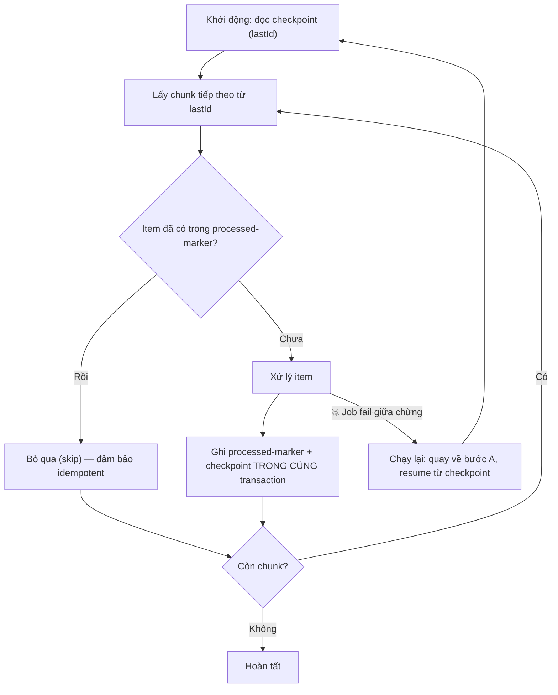

# Job fail giữa chừng, chạy lại có an toàn không?

## ⚡ Tóm tắt ngắn (30s)
* **Bản chất**: Câu trả lời là **"tùy"** — và một Senior phải biến cái "tùy" đó thành **"có, an toàn"** bằng thiết kế. Chạy lại an toàn ⇔ job vừa **idempotent** (làm lại cho cùng kết quả, không nhân đôi tác dụng) vừa có **checkpoint/resume** (biết đã làm tới đâu để không lặp lại phần đã xong). Thiếu một trong hai, việc retry sẽ **xử lý trùng** những item đã hoàn thành trước lúc fail.
* **Hướng xử lý**: Chuyển job sang mô hình **at-least-once + idempotency**: ghi **processed-marker** cho từng item (hoặc UPSERT/conditional update), **lưu checkpoint** (offset/last id) **trong cùng transaction** với phần việc, và tách **side-effect ra ngoài không idempotent** (email, gọi API) bằng idempotency key.
* **Quyết định Senior**: Không bao giờ giả định "job sẽ chạy trọn vẹn". Luôn thiết kế cho **việc nó sẽ chết giữa chừng và bị chạy lại** — đó mới là trạng thái bình thường của batch trong production.

---

## 🔍 Chi tiết bản chất thực chiến: Điều kiện để re-run an toàn

### 1. Vì sao "chạy lại" lại nguy hiểm
Giả sử job xử lý 100.000 đơn, fail ở đơn thứ 60.000. Nếu chạy lại từ đầu mà **không** có cơ chế bảo vệ:
* 60.000 đơn đầu **bị xử lý lần hai**: phát coupon trùng, gửi mail trùng, cộng điểm trùng, đẩy event trùng.
* Trạng thái DB có thể **không nhất quán** vì lần fail để lại dữ liệu dở dang.

Hai gốc rễ: (a) thao tác **không idempotent** (làm lại ≠ làm một lần), và (b) **không nhớ đã làm tới đâu**.

### 2. Idempotency — làm lại không nhân đôi tác dụng
Một item xử lý lại phải cho **cùng một hiệu ứng** như xử lý một lần. Kỹ thuật:
* **Processed-marker**: bảng `job_processed(item_id PRIMARY KEY)`; trước khi xử lý, kiểm tra/`INSERT` — nếu đã có thì **bỏ qua**.
* **UPSERT/conditional update**: `INSERT ... ON CONFLICT DO NOTHING`, hoặc `UPDATE ... WHERE status = 'PENDING'` (chạy lại thấy đã `DONE` thì không tác động).
* **Phép gán tuyệt đối thay vì tương đối**: `SET score = :x` an toàn khi lặp; `SET balance = balance + :x` thì **không** — với tiền phải dùng ledger + idempotency key.

### 3. Checkpoint/Resume — nhớ đã làm tới đâu
Lưu **vị trí tiến độ** (last processed id/offset) định kỳ. Khi chạy lại, job đọc checkpoint và **tiếp tục từ đó** thay vì làm lại từ đầu. Mấu chốt: **checkpoint phải commit cùng transaction với phần việc của chunk**. Nếu việc commit ở một tx, checkpoint commit ở tx khác → có cửa sổ "đã làm nhưng chưa kịp ghi checkpoint" (hoặc ngược lại) gây lệch.

### 4. At-least-once là hợp đồng thực tế
Trong môi trường có lỗi/timeout, bạn không thể đảm bảo "đúng một lần thực thi". Mô hình thực tế là **at-least-once** (có thể chạy lại) + **idempotent effect** = "**effectively once**". Đây chính là lý do hai kỹ thuật trên là bắt buộc: chúng làm cho việc "chạy lại" trở nên **vô hại**.

---

## 🎨 Sơ đồ trực quan: Fail giữa chừng rồi resume an toàn

Sơ đồ mô tả job ghi checkpoint từng chunk, khi fail và chạy lại thì tiếp tục từ checkpoint và bỏ qua item đã xử lý:



---

## 💻 Code thực chiến: BAD vs GOOD

Hai đoạn dưới tương phản job re-run gây xử lý trùng với job idempotent + checkpoint an toàn khi chạy lại:

### ❌ BAD: Chạy lại là làm lại từ đầu, không idempotent
```java
public void grantCoupons() {
    for (Order o : orderRepo.findAllPaid()) { // ❌ luôn quét từ đầu
        couponService.issue(o.getUserId());   // ❌ không idempotent → fail rồi chạy lại = coupon trùng
        emailService.send(o.getUserId());      // ❌ gửi mail lần hai cho user đã nhận
    }
} // ❌ fail ở giữa: không nhớ đã tới đâu, re-run nhân đôi mọi thứ đã làm
```

### ✅ GOOD: Processed-marker + checkpoint cùng transaction + idempotent
```java
public void grantCoupons() {
    long lastId = checkpointRepo.load("grantCoupons"); // ✅ resume từ checkpoint
    while (true) {
        List<Order> batch = orderRepo.findPaidAfter(lastId, 1000);
        if (batch.isEmpty()) break;
        for (Order o : batch) processOneIdempotent(o);
        lastId = batch.get(batch.size() - 1).getId();
    }
}

@Transactional
public void processOneIdempotent(Order o) {
    // ✅ marker là khóa chính → INSERT trùng sẽ bị chặn, đảm bảo mỗi order xử lý một lần
    boolean firstTime = processedRepo.tryInsert(o.getId());
    if (!firstTime) return; // ✅ đã xử lý ở lần chạy trước → bỏ qua

    couponService.issueIdempotent(o.getUserId(), o.getId()); // ✅ idempotency key = orderId
    outbox.enqueueEmail(o.getUserId(), o.getId());           // ✅ side-effect qua outbox, gửi 1 lần
    checkpointRepo.save("grantCoupons", o.getId());          // ✅ checkpoint commit CÙNG tx với việc
}
```

```sql
-- Marker đảm bảo idempotency ở tầng DB
CREATE TABLE job_processed (
    job_name VARCHAR(64) NOT NULL,
    item_id  BIGINT      NOT NULL,
    PRIMARY KEY (job_name, item_id) -- ✅ chặn xử lý trùng cùng item
);
```

---

## 📊 Bảng so sánh mức an toàn khi chạy lại

| Idempotent? | Có checkpoint? | Chạy lại có an toàn? | Hệ quả khi fail giữa chừng |
| :--- | :--- | :--- | :--- |
| ❌ Không | ❌ Không | ❌ Rất nguy hiểm | Làm lại từ đầu, nhân đôi mọi tác dụng |
| ❌ Không | ✅ Có | ⚠️ Một phần | Không lặp item cũ, nhưng item đang dở có thể lệch |
| ✅ Có | ❌ Không | ✅ An toàn (chậm) | Làm lại từ đầu nhưng vô hại, chỉ tốn thời gian |
| ✅ Có | ✅ Có | ✅✅ An toàn & nhanh | Resume từ checkpoint, bỏ qua phần đã xong |

---

## ⚠️ Common Gotchas & Questions follow-up

### 1. Cạm bẫy "checkpoint và phần việc ở hai transaction khác nhau"
* Nếu bạn commit phần việc trong tx A rồi mới `checkpointRepo.save(...)` trong tx B, thì khi crash **giữa hai tx**, việc đã làm nhưng checkpoint chưa ghi → chạy lại sẽ **làm lại item đó**. Nếu thao tác không idempotent thì lại trùng. Lời giải: **gói marker + việc + checkpoint trong cùng một transaction**, để chúng "cùng sống cùng chết".

### 2. Cạm bẫy "side-effect ngoài DB không thể rollback"
* Email đã gửi, tiền đã trừ qua API ngoài, event đã đẩy lên Kafka — những thứ này **không rollback được** theo transaction DB. Khi job chạy lại, chúng dễ lặp. Cách xử lý: đẩy side-effect qua **outbox/idempotency key** để chỉ thực sự thực thi một lần, hoặc dùng consumer phía nhận **idempotent**.

### 3. Câu hỏi đào sâu từ interviewer
* **Interviewer: "Nếu job của bạn đã idempotent hoàn toàn rồi thì có cần checkpoint không?"**
* **Trả lời**: Về mặt **đúng đắn (correctness)** thì không bắt buộc — job idempotent có thể chạy lại từ đầu mà vẫn cho kết quả đúng, vì mọi item đã xong sẽ bị bỏ qua. Nhưng về mặt **hiệu năng và chi phí**, checkpoint vẫn rất đáng giá: với job xử lý hàng triệu record, chạy lại từ đầu để "kiểm tra rồi skip" 99% công việc đã xong là cực kỳ lãng phí thời gian và tải DB, đồng thời kéo dài cửa sổ rủi ro. Vì vậy tôi coi **idempotency là để đảm bảo đúng**, còn **checkpoint là để đảm bảo nhanh và rẻ** — production cần cả hai. Trường hợp duy nhất bỏ checkpoint chấp nhận được là job nhỏ, chạy lại từ đầu cũng chỉ vài giây.
