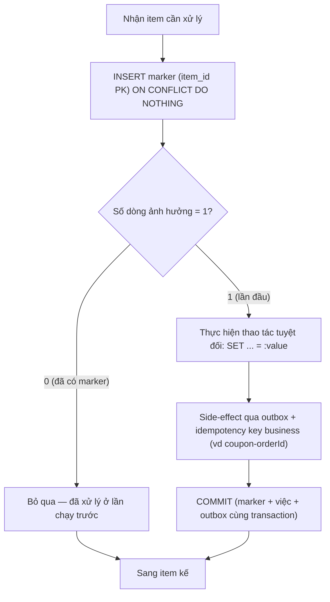

# Làm sao thiết kế batch job idempotent?

## ⚡ Tóm tắt ngắn (30s)
* **Bản chất**: Idempotent nghĩa là **chạy 1 lần hay N lần đều cho cùng một hiệu ứng**. Đây là tính chất quan trọng nhất của batch trong production vì batch **chắc chắn** sẽ có lúc bị chạy lại (retry, fail giữa chừng, chạy trùng instance, replay message). Một batch không idempotent là một quả bom hẹn giờ: mỗi lần chạy lại là một lần nhân đôi tác dụng.
* **Hướng xử lý**: Áp dụng kết hợp các kỹ thuật:
  1. **Processed-marker / dedup key**: ghi dấu từng item đã xử lý, lần sau gặp lại thì bỏ qua.
  2. **UPSERT thay vì INSERT**: `INSERT ... ON CONFLICT DO NOTHING/UPDATE` để ghi trùng không sinh bản ghi thừa.
  3. **Conditional update theo trạng thái**: `UPDATE ... WHERE status = 'PENDING'` — chạy lại thấy đã xong thì không tác động.
  4. **Phép gán tuyệt đối, không tương đối**: `SET x = :v` thay vì `SET x = x + :v` (cái sau lặp là sai).
  5. **Idempotency key cho side-effect ngoài**: email/HTTP/Kafka đi kèm khóa để hệ nhận khử trùng.
* **Quyết định Senior**: Idempotency **không phải mặc định** — phải **thiết kế chủ động** ở cả tầng DB (unique constraint, UPSERT) lẫn tầng side-effect (idempotency key). Và nó **mạnh nhất khi gắn vào ràng buộc của DB**, không phải kiểm tra bằng `if` trong code (vì `if` có race condition).

---

## 🔍 Chi tiết bản chất thực chiến: Các tầng làm nên idempotency

### 1. Phép toán tự thân idempotent (absolute vs relative)
Phân biệt hai loại thao tác:
* **Tuyệt đối (absolute)** — idempotent sẵn: `SET status = 'DONE'`, `SET score = 95`. Làm lại bao nhiêu lần cũng ra một giá trị.
* **Tương đối (relative)** — **không** idempotent: `balance = balance + 100`, `counter++`, `INSERT` một dòng mới. Mỗi lần lặp là một lần cộng dồn → sai.

Quy tắc đầu tiên: **ưu tiên thiết kế thao tác về dạng tuyệt đối**. Khi buộc phải cộng dồn (vd ví tiền), chuyển sang **ledger entry có idempotency key** thay vì update tại chỗ.

### 2. Khử trùng dựa vào ràng buộc DB (mạnh hơn `if` trong code)
Kiểm tra "đã xử lý chưa" bằng `if (exists) skip` có **race condition**: hai luồng cùng đọc thấy "chưa", cùng xử lý. Cách chắc chắn là để **DB làm trọng tài**:
* **Unique constraint / PRIMARY KEY** trên dedup key → `INSERT` trùng tự fail/bỏ qua.
* **`INSERT ... ON CONFLICT DO NOTHING`** (Postgres) / **`INSERT IGNORE`** (MySQL) → ghi trùng không nhân đôi.
* **`UPDATE ... WHERE status = 'PENDING'`** trả về số dòng ảnh hưởng; bằng 0 nghĩa là đã có người làm → skip.

### 3. Idempotency key cho tác dụng ngoài DB
Email, gọi API thanh toán, đẩy Kafka **không** nằm trong transaction DB nên không rollback được. Mỗi tác dụng như vậy cần một **idempotency key ổn định** (thường suy ra từ business id, vd `coupon-{orderId}`), để bên nhận khử trùng. Tốt nhất là đi qua **outbox pattern**: ghi ý định vào bảng outbox cùng transaction, một publisher đọc và gửi với key — đảm bảo "ghi một lần, gửi hiệu lực một lần".

### 4. Khóa idempotency phải ổn định và xác định
Khóa phải **suy ra được lại y hệt** ở mỗi lần chạy (từ dữ liệu nghiệp vụ), **không** dùng `UUID.randomUUID()` hay timestamp — vì lần chạy lại sẽ sinh khóa mới và phá vỡ khử trùng. Đây là lỗi phổ biến biến "idempotent" thành "vẫn trùng".

---

## 🎨 Sơ đồ trực quan: Đường đi của một item trong batch idempotent

Sơ đồ mô tả mỗi item được khử trùng bằng marker ở DB, side-effect đi qua idempotency key:



---

## 💻 Code thực chiến: BAD vs GOOD

Hai đoạn dưới tương phản batch dùng phép tương đối + INSERT trần với batch dùng UPSERT + phép tuyệt đối + idempotency key:

### ❌ BAD: Cộng dồn + INSERT + check bằng if
```java
@Transactional
public void applyBonus(User u, int bonus) {
    if (!processedRepo.exists(u.getId())) {   // ❌ race condition: hai luồng cùng thấy "chưa"
        u.setBalance(u.getBalance() + bonus); // ❌ tương đối: chạy lại cộng dồn nhiều lần
        rewardRepo.insert(new Reward(u.getId(), bonus)); // ❌ INSERT trùng → nhiều dòng thưởng
        emailService.send(u.getEmail());      // ❌ không idempotency key → mail trùng
        processedRepo.insert(u.getId());      // ❌ ghi marker tách rời, vẫn còn cửa sổ race
    }
}
```

### ✅ GOOD: UPSERT + phép tuyệt đối + idempotency key + ràng buộc DB
```java
@Transactional
public void applyBonus(User u, int bonus) {
    // ✅ DB làm trọng tài: marker là PK, INSERT trùng trả về 0 dòng → đã xử lý
    int inserted = processedRepo.insertIgnore(u.getId(), "applyBonus");
    if (inserted == 0) return; // ✅ idempotent: lần chạy lại bỏ qua an toàn

    // ✅ Ghi ledger entry có khóa ổn định thay vì balance += (tránh cộng dồn)
    ledgerRepo.insert(new LedgerEntry("bonus-" + u.getId(), u.getId(), bonus));
    u.setBalance(ledgerRepo.sumByUser(u.getId())); // ✅ tính lại từ ledger = tuyệt đối

    // ✅ side-effect đi qua outbox với idempotency key suy ra từ business id
    outbox.enqueueEmail(u.getEmail(), "bonus-" + u.getId());
}
```

```sql
-- ✅ Khử trùng tại tầng DB: ON CONFLICT thay cho if-exists trong code
INSERT INTO job_processed (job_name, item_id) VALUES ('applyBonus', :userId)
ON CONFLICT (job_name, item_id) DO NOTHING;
-- ✅ Conditional update: chỉ tác động khi còn PENDING, chạy lại thấy DONE thì 0 dòng
UPDATE invoice SET status = 'PAID' WHERE id = :id AND status = 'PENDING';
```

---

## 📊 Bảng so sánh các kỹ thuật làm batch idempotent

| Kỹ thuật | Cơ chế | Mạnh ở | Cạm bẫy cần tránh |
| :--- | :--- | :--- | :--- |
| **Processed-marker (PK)** | INSERT dedup key, trùng thì bỏ qua | Khử trùng chắc chắn nhờ ràng buộc DB | Phải cùng tx với việc |
| **UPSERT** | `ON CONFLICT DO NOTHING/UPDATE` | Ghi lặp không sinh dòng thừa | Chọn đúng conflict target |
| **Conditional update** | `WHERE status = 'PENDING'` | Tự nhiên, không cần bảng phụ | Cần cột trạng thái rõ ràng |
| **Phép tuyệt đối** | `SET x = :v` thay vì `x = x + :v` | Idempotent tự thân | Tiền/đếm phải dùng ledger |
| **Idempotency key (side-effect)** | Khóa ổn định cho email/HTTP/Kafka | Khử trùng tác dụng ngoài DB | Khóa phải xác định, không random |

---

## ⚠️ Common Gotchas & Questions follow-up

### 1. Cạm bẫy "idempotency key sinh ngẫu nhiên mỗi lần chạy"
* Nếu key được tạo bằng `UUID.randomUUID()` hoặc `Instant.now()`, thì lần chạy lại sinh **khóa khác** → hệ nhận coi là request mới → vẫn trùng. Khóa idempotency **bắt buộc xác định**: suy ra từ dữ liệu nghiệp vụ ổn định (`coupon-{orderId}`, `bonus-{userId}-{period}`) để mọi lần chạy lại đều ra đúng một khóa.

### 2. Cạm bẫy "kiểm tra exists rồi mới insert" (check-then-act)
* `if (!exists) insert(...)` không nguyên tử — dưới tải cao, hai luồng cùng vượt qua `if` rồi cùng insert → trùng. Hãy để **DB quyết định** bằng unique constraint + `ON CONFLICT`/`INSERT IGNORE`, đọc số dòng ảnh hưởng để biết mình có phải người đầu tiên không. Đừng tự kiểm tra trong code.

### 3. Câu hỏi đào sâu từ interviewer
* **Interviewer: "Job của bạn cộng tiền vào ví user. Làm sao để nó idempotent khi `balance = balance + amount` vốn không idempotent?"**
* **Trả lời**: Tôi **không** update `balance` tại chỗ. Thay vào đó tôi mô hình hóa bằng **ledger (sổ cái append-only)**: mỗi lần cộng tiền là một **entry** mang một **idempotency key xác định** (vd `bonus-{userId}-{period}`) với **unique constraint** trên key đó. Khi job chạy lại, `INSERT` entry trùng key sẽ bị DB từ chối (`ON CONFLICT DO NOTHING`) nên **không cộng dồn**. Số dư `balance` được **tính lại bằng `SUM` các entry** (hoặc cập nhật bằng phép cộng *trong cùng transaction* với việc chèn entry, mà entry đã được khử trùng nên cộng cũng chỉ một lần). Cách này biến một phép tương đối ("cộng thêm") thành một phép có thể khử trùng tuyệt đối ở tầng DB, đồng thời để lại **audit trail** đầy đủ — vừa idempotent vừa truy vết được, đúng chuẩn xử lý tiền.
