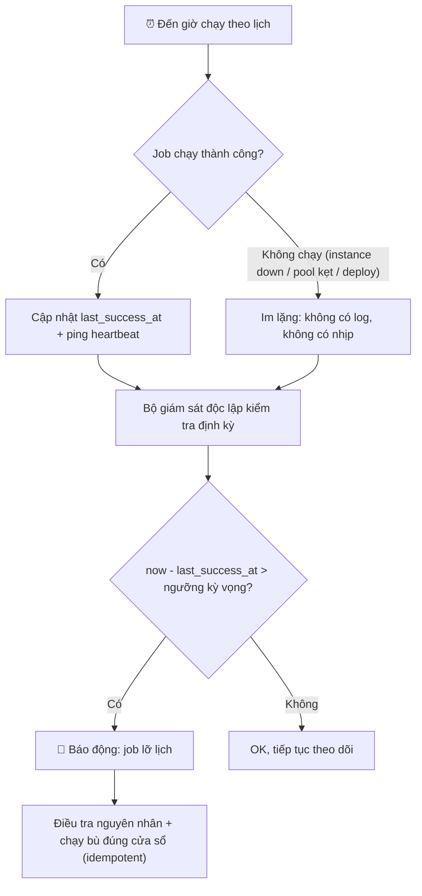

# Một job bị miss schedule. Bạn phát hiện và xử lý ra sao?

## ⚡ Tóm tắt ngắn (30s)
* **Bản chất**: "Miss schedule" là job **lẽ ra phải chạy nhưng không chạy** — và thứ nguy hiểm nhất là **sự im lặng**: không có lỗi, không có exception, chỉ là *không có gì xảy ra*. Bạn thường phát hiện ra **quá muộn** qua phàn nàn của business ("báo cáo hôm nay đâu?"). Nguyên nhân hay gặp: instance giữ scheduler bị down đúng lúc, **pool scheduler bị một job dài chiếm hết thread**, deploy/restart trúng cửa sổ chạy, hoặc misfire khi scheduler quá tải.
* **Hướng xử lý**: Giám sát bằng **"dead man's switch"** — cảnh báo khi **vắng** tín hiệu, chứ không chỉ cảnh báo khi **có** lỗi. Theo dõi `last_success_at`/heartbeat của mỗi job, so với lịch kỳ vọng; quá hạn thì báo động. Xử lý bằng **catch-up/backfill có kiểm soát** + **misfire policy** đúng, và vì có thể phải chạy bù nên job phải **idempotent**.
* **Quyết định Senior**: Lịch chạy là một **SLA cần được giám sát chủ động**. Tôi không tin "không thấy lỗi nghĩa là ổn"; tôi đo **đã bao lâu rồi job chưa chạy thành công** và để hệ thống tự la lên khi vượt ngưỡng.

---

## 🔍 Chi tiết bản chất thực chiến: Phát hiện cái "không xảy ra"

### 1. Vì sao miss schedule khó phát hiện
Lỗi thường (exception) sẽ tự "kêu" qua log/alert. Nhưng miss schedule là **sự vắng mặt** — không có log nào được sinh ra để mà bắt. Giám sát hướng-lỗi (error-based) hoàn toàn mù với nó. Phải chuyển sang giám sát hướng-**vắng mặt** (absence-based): *"đáng lẽ phải có một lần chạy thành công trong X giờ qua — có không?"*

### 2. Dead man's switch — cảnh báo khi im lặng
Cơ chế: mỗi lần job chạy **thành công**, nó "đập nhịp" (cập nhật `last_success_at`, ping một heartbeat endpoint như Healthchecks.io/Dead Man's Snitch, hoặc đẩy metric `job_last_success_timestamp`). Một bộ giám sát độc lập kiểm tra: nếu `now - last_success_at > ngưỡng kỳ vọng` → **báo động**. Điểm hay là bộ giám sát **nằm ngoài** app, nên ngay cả khi app chết hẳn, alert vẫn nổ.

### 3. Các nguyên nhân gốc thường gặp
* **Single-thread scheduler pool bị chiếm**: `@Scheduled` mặc định chạy trên pool **1 thread**. Một job chạy dài làm **kẹt** tất cả job khác đến hạn → chúng bị miss/dồn. Khắc phục: tăng pool size hoặc tách scheduler.
* **Instance giữ lock/leader bị down**: nếu chỉ một instance được chạy (ShedLock/leader) mà nó chết đúng cửa sổ, lần đó miss. Cần các instance khác sẵn sàng tiếp quản lần kế.
* **Deploy/restart trúng giờ**: rolling update làm app không sẵn sàng đúng thời điểm cron.
* **Misfire**: scheduler quá tải hoặc vừa tỉnh sau khi down, trigger đã quá hạn → cần **misfire instruction** quyết định bỏ qua hay chạy bù.

### 4. Xử lý: misfire policy + catch-up + idempotency
* **Misfire policy** (Quartz): chọn `fireAndProceed` (chạy bù **một** lần rồi tiếp lịch), hay `doNothing`/`ignoreMisfires` (bỏ qua các lần lỡ) tùy bản chất job.
* **Catch-up/backfill**: với job theo cửa sổ dữ liệu (vd "tổng hợp ngày"), khi phát hiện lỡ, chạy bù **đúng cửa sổ bị lỡ** (truyền tham số ngày), không chạy với "hôm nay".
* **Idempotency**: vì catch-up có thể chồng lấn với lần chạy phục hồi, job phải idempotent để chạy bù không gây trùng.

---

## 🎨 Sơ đồ trực quan: Dead man's switch phát hiện job lỡ lịch

Sơ đồ mô tả heartbeat sau mỗi lần chạy thành công và bộ giám sát độc lập báo động khi quá hạn:



---

## 💻 Code thực chiến: BAD vs GOOD

Hai đoạn dưới tương phản scheduler không giám sát/đơn luồng với bản có heartbeat, pool đủ thread và catch-up theo cửa sổ:

### ❌ BAD: Pool 1 thread, không heartbeat, chạy với "hôm nay"
```java
@Component
public class DailyAggJob {
    @Scheduled(cron = "0 0 1 * * *")
    public void run() {
        // ❌ pool mặc định 1 thread: job dài khác đang chạy sẽ làm job này bị miss
        // ❌ không ghi last_success_at → không ai biết nếu nó không chạy
        aggregate(LocalDate.now()); // ❌ nếu chạy bù ngày sau, tính nhầm "hôm nay"
    }
}
```

### ✅ GOOD: Pool đủ thread + heartbeat + catch-up đúng cửa sổ
```java
@Configuration
public class SchedulerConfig {
    @Bean
    public ThreadPoolTaskScheduler taskScheduler() {
        var s = new ThreadPoolTaskScheduler();
        s.setPoolSize(5); // ✅ tránh một job dài làm kẹt mọi job khác
        return s;
    }
}

@Component
public class DailyAggJob {
    @Scheduled(cron = "0 0 1 * * *")
    public void run() {
        LocalDate target = pickNextUnprocessedDay(); // ✅ chạy bù đúng cửa sổ bị lỡ
        aggregateIdempotent(target);                 // ✅ idempotent: chạy bù không trùng
        jobHealthRepo.markSuccess("DailyAgg", target, Instant.now()); // ✅ heartbeat
    }
}

// Bộ giám sát độc lập: báo động khi vắng tín hiệu
@Component
public class MissScheduleWatchdog {
    @Scheduled(fixedRate = 600_000) // mỗi 10 phút
    public void check() {
        Instant last = jobHealthRepo.lastSuccess("DailyAgg");
        if (last.isBefore(Instant.now().minus(Duration.ofHours(26)))) {
            alerting.fire("DailyAgg đã >26h chưa chạy thành công"); // ✅ dead man's switch
        }
    }
}
```

---

## 📊 Bảng so sánh chiến lược phát hiện & xử lý miss schedule

| Khía cạnh | Cách yếu (hay gặp) | Cách Senior |
| :--- | :--- | :--- |
| **Phát hiện** | Đợi business phàn nàn | Dead man's switch: alert khi vắng `last_success_at` |
| **Giám sát** | Chỉ alert khi có exception | Alert dựa trên **vắng mặt** tín hiệu thành công |
| **Pool scheduler** | 1 thread (mặc định) → kẹt | Pool đủ lớn / tách scheduler riêng |
| **Khi lỡ lịch** | Không có cơ chế bù | Misfire policy + catch-up đúng cửa sổ |
| **Tham số chạy bù** | Dùng `now()`/"hôm nay" | Truyền cửa sổ bị lỡ (target date) |
| **An toàn chạy bù** | Có thể trùng | Idempotent → chạy bù vô hại |

---

## ⚠️ Common Gotchas & Questions follow-up

### 1. Cạm bẫy "scheduler 1 thread làm job này giết job kia"
* `@Scheduled` của Spring mặc định chạy trên một **pool 1 thread**. Nếu một job chạy 40 phút, mọi job đến hạn trong 40 phút đó đều **bị xếp hàng/bỏ lỡ** trong im lặng. Rất nhiều vụ "miss schedule" thực chất là **pool starvation**. Khắc phục: cấu hình `ThreadPoolTaskScheduler` với pool size đủ lớn, hoặc tách các job nặng sang scheduler/worker riêng.

### 2. Cạm bẫy "catch-up dùng `now()` thay vì cửa sổ bị lỡ"
* Job "tổng hợp doanh thu **ngày**" lỡ chạy đêm 01/06, đến 02/06 mới chạy bù mà lại gọi `aggregate(LocalDate.now())` → tổng hợp nhầm **ngày 02** và **bỏ luôn ngày 01**. Job theo cửa sổ phải nhận **tham số cửa sổ** (ngày cần xử lý) và biết **ngày nào chưa xử lý** để bù đúng chỗ.

### 3. Câu hỏi đào sâu từ interviewer
* **Interviewer: "Làm sao bạn alert được khi một job *không* chạy, trong khi không-chạy thì chẳng sinh ra log nào để bắt?"**
* **Trả lời**: Chìa khóa là **đảo ngược tín hiệu**: thay vì cảnh báo khi *có* lỗi, tôi cảnh báo khi *vắng* thành công. Mỗi lần job chạy xong, nó ghi một dấu "còn sống" (`last_success_at`, hoặc ping một heartbeat service ngoài như Healthchecks.io/Dead Man's Snitch, hoặc đẩy metric `job_last_success_timestamp` lên Prometheus). Sau đó một **bộ giám sát độc lập, nằm ngoài app** kiểm tra: *nếu quá ngưỡng kỳ vọng (vd job hằng ngày mà >26h không có nhịp) thì báo động*. Vì bộ giám sát ở ngoài, nên kể cả khi toàn bộ app chết — đúng tình huống không sinh log — alert vẫn nổ. Bản chất là tôi biến "sự im lặng" thành một tín hiệu có thể đo được: **im lặng quá lâu = sự cố**.
