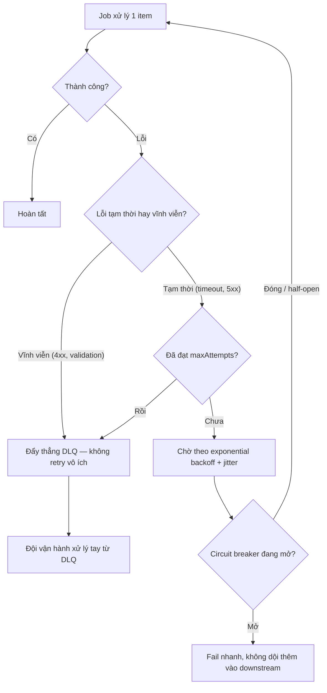

# Job retry liên tục gây quá tải hệ thống. Bạn xử lý thế nào?

## ⚡ Tóm tắt ngắn (30s)
* **Bản chất**: Đây là **retry storm / retry amplification**. Khi downstream chậm hoặc lỗi, một job retry **ngay lập tức và không giới hạn** sẽ **nhân tải lên nhiều lần** đúng lúc hệ thống đang yếu nhất → biến một sự cố nhỏ thành sập dây chuyền. Đặc biệt nguy hiểm khi **nhiều worker cùng retry đồng loạt** (thundering herd) hoặc khi gặp **poison message** (lỗi vĩnh viễn) bị retry vô hạn.
* **Hướng xử lý**: Retry phải **có kỷ luật**:
  1. **Exponential backoff + jitter** — giãn khoảng cách giữa các lần thử và thêm nhiễu ngẫu nhiên để tránh đồng loạt.
  2. **Giới hạn số lần / retry budget** — có trần, không retry vô hạn.
  3. **Phân biệt lỗi tạm thời vs vĩnh viễn** — `5xx`/timeout thì retry, `4xx`/validation thì **đừng** retry.
  4. **Dead Letter Queue (DLQ)** — quá số lần thì đẩy sang DLQ để xử lý tay, không chặn hàng đợi.
  5. **Circuit breaker** — downstream sập thì **ngắt** nhanh, ngừng dội thêm.
* **Quyết định Senior**: Retry là để vượt qua trục trặc **thoáng qua**, **không** phải để "cố đấm ăn xôi". Mục tiêu là **giúp hệ thống hồi phục**, nên retry phải lùi dần, có trần, có jitter, và biết khi nào **dừng lại** (DLQ/circuit breaker).

---

## 🔍 Chi tiết bản chất thực chiến: Vì sao retry "ngây thơ" gây sập

### 1. Retry amplification — khuếch đại tải
Nếu mỗi request thất bại được retry tối đa 3 lần **không backoff**, thì khi downstream gặp sự cố, lượng request tới nó có thể **nhân 4** — đúng lúc nó đang ngộp. Retry vô tình trở thành một cuộc **tự DDoS**, kéo dài và làm sâu thêm sự cố thay vì chữa nó.

### 2. Thundering herd — đồng loạt thử lại
Nhiều worker/instance cùng fail tại một thời điểm (vd downstream chớp tắt) sẽ cùng retry **cùng một nhịp** → tạo các đợt sóng tải đồng pha dội vào downstream vừa mới hồi. Lời giải là **jitter**: thêm nhiễu ngẫu nhiên vào thời gian chờ để **trải đều** các lần thử ra theo thời gian.

### 3. Exponential backoff + jitter
Thay vì retry cách đều, tăng khoảng chờ theo cấp số nhân và cộng nhiễu:

$$delay_n = \min(cap,\; base \cdot 2^{\,n}) \times (1 + rand(0,\,jitter))$$

Ví dụ `base=1s`: các lần chờ ~1s, 2s, 4s, 8s... (có nhiễu). Cách này vừa **giảm áp lực** lên downstream theo thời gian, vừa **phá vỡ đồng pha** giữa các worker.

### 4. Phân biệt lỗi tạm thời vs vĩnh viễn (đừng retry cái không thể thắng)
* **Tạm thời (transient)**: timeout, `503`, connection reset, deadlock → **đáng retry**.
* **Vĩnh viễn (permanent)**: `400` validation, `401/403`, `404`, lỗi parse → retry **vô ích**, chỉ tổ đốt tài nguyên. Đây chính là **poison message**: cứ retry mãi một thứ không bao giờ thành công. Phải nhận diện và đẩy thẳng sang **DLQ**.

### 5. DLQ + Circuit breaker — biết khi nào dừng
* **DLQ**: sau `maxAttempts`, chuyển message sang hàng đợi chết để con người/đội vận hành xử lý, **giải phóng** luồng chính khỏi bị một message độc làm tắc.
* **Circuit breaker**: khi tỉ lệ lỗi tới downstream vượt ngưỡng, "mở mạch" để **fail nhanh** (không gọi nữa) trong một khoảng, cho downstream thời gian hồi, rồi half-open thăm dò. Đây là phanh khẩn cấp chống dội tải.

---

## 🎨 Sơ đồ trực quan: Retry có kỷ luật với backoff, trần và DLQ

Sơ đồ mô tả luồng retry phân biệt loại lỗi, lùi theo backoff+jitter, có trần và đẩy DLQ khi cạn lượt:



---

## 💻 Code thực chiến: BAD vs GOOD

Hai đoạn dưới tương phản vòng retry vô hạn tức thời với retry có backoff+jitter, có trần, phân loại lỗi và DLQ:

### ❌ BAD: Retry vô hạn, tức thời, không phân loại lỗi
```java
public void process(Message m) {
    while (true) {                 // ❌ không có trần → poison message lặp vô hạn
        try {
            downstream.call(m);    // ❌ 4xx cũng retry → không bao giờ thắng
            return;
        } catch (Exception e) {
            // ❌ retry NGAY, không backoff, không jitter → khuếch đại tải, thundering herd
        }
    }
}
```

### ✅ GOOD: Backoff + jitter + trần + phân loại lỗi + DLQ + circuit breaker
```java
public void process(Message m) {
    long base = 1000, cap = 30_000;
    for (int attempt = 0; attempt < MAX_ATTEMPTS; attempt++) {
        try {
            circuitBreaker.executeRunnable(() -> downstream.call(m)); // ✅ phanh khi downstream sập
            return;
        } catch (PermanentException e) {
            deadLetterQueue.send(m, e);  // ✅ lỗi vĩnh viễn → DLQ ngay, không phí retry
            return;
        } catch (TransientException e) {
            long delay = Math.min(cap, base * (1L << attempt)); // ✅ exponential backoff
            long jittered = delay / 2 + ThreadLocalRandom.current().nextLong(delay / 2); // ✅ jitter
            sleep(jittered);
        }
    }
    deadLetterQueue.send(m, "Hết lượt retry"); // ✅ có trần: cạn lượt thì sang DLQ, không chặn hàng đợi
}
```

```java
// ✅ Khai báo bằng Resilience4j (Spring): backoff + jitter + giới hạn + circuit breaker
@Retry(name = "downstream")        // maxAttempts + exponentialBackoff + randomizedWait (jitter)
@CircuitBreaker(name = "downstream", fallbackMethod = "toDlq")
public void callDownstream(Message m) { downstream.call(m); }

public void toDlq(Message m, Throwable t) { deadLetterQueue.send(m, t); } // ✅ fallback an toàn
```

---

## 📊 Bảng so sánh chiến lược retry

| Chiến lược | Áp lực lên downstream | Chống thundering herd | Chống poison message | Phù hợp |
| :--- | :--- | :--- | :--- | :--- |
| **Retry tức thời, vô hạn** | Rất cao (khuếch đại) | ❌ Không | ❌ Lặp vô hạn | Không bao giờ |
| **Retry cố định, có trần** | Trung bình | ❌ Không (đồng pha) | ✅ Có trần | Job đơn giản, tải thấp |
| **Exponential backoff** | Giảm dần | ⚠️ Một phần | ✅ Có trần | Đa số trường hợp |
| **Backoff + jitter** | Giảm dần & trải đều | ✅ Có | ✅ Có trần | Nhiều worker, tải cao |
| **+ DLQ + Circuit breaker** | Thấp nhất, có phanh | ✅ Có | ✅✅ Cô lập + ngắt | Production nghiêm túc |

---

## ⚠️ Common Gotchas & Questions follow-up

### 1. Cạm bẫy "backoff nhưng quên jitter"
* Exponential backoff **một mình** vẫn để các worker thử lại **đồng pha**: tất cả cùng chờ 1s, cùng 2s, cùng 4s → vẫn dội thành từng đợt sóng vào downstream. **Jitter** (nhiễu ngẫu nhiên) là thứ phá vỡ đồng pha, trải các lần thử ra trên trục thời gian. Backoff giảm *tần suất*, jitter giảm *tính đồng thời* — cần cả hai.

### 2. Cạm bẫy "retry thao tác không idempotent"
* Retry chỉ an toàn khi thao tác **idempotent**. Nếu mỗi lần thử lại lại tạo đơn mới/trừ tiền lần nữa, thì retry storm không chỉ quá tải mà còn **nhân đôi dữ liệu/giao dịch**. Trước khi bật retry mạnh tay, phải đảm bảo downstream khử trùng bằng **idempotency key**. Ngoài ra: timeout không có nghĩa là thất bại — retry mù sau timeout của lệnh tạo giao dịch có thể gây double-charge; phải truy vấn trạng thái trước.

### 3. Câu hỏi đào sâu từ interviewer
* **Interviewer: "Một message lỗi vĩnh viễn (poison) đang bị retry vô hạn và làm nghẽn cả consumer. Bạn xử lý thế nào, cả tức thời lẫn lâu dài?"**
* **Trả lời**: **Tức thời**, tôi cần lấy lại thông lượng cho hàng đợi: thiết lập **trần số lần retry** và **DLQ**, để message độc sau `maxAttempts` bị **đẩy sang DLQ** thay vì quay vòng mãi ở đầu hàng đợi chặn mọi message khỏe phía sau. Nếu chưa có DLQ, tôi có thể tạm "ack + park" message đó sang một bảng/topic riêng để consumer thoát kẹt. **Lâu dài**, tôi sửa ở ba lớp: (1) **phân loại lỗi** ngay tại consumer — lỗi `4xx`/validation/parse là vĩnh viễn, đẩy DLQ **không retry**; chỉ lỗi `5xx`/timeout mới retry; (2) thêm **exponential backoff + jitter** và **giới hạn lượt** để retry không khuếch đại tải; (3) gắn **alert + dashboard cho DLQ** để đội vận hành thấy và xử lý gốc (sửa dữ liệu, vá bug) rồi **replay** message từ DLQ một cách có kiểm soát. Nguyên tắc của tôi: retry để vượt sự cố thoáng qua, còn lỗi vĩnh viễn thì phải **cô lập nhanh**, đừng để một message độc kéo sập cả pipeline.
