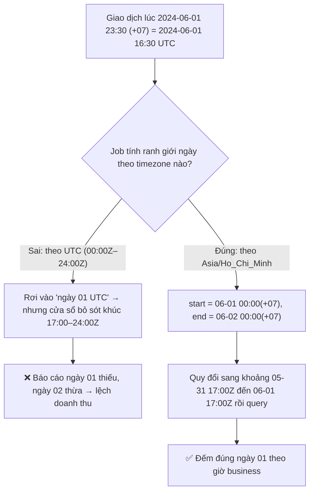

# Job xử lý dữ liệu theo ngày nhưng timezone sai. Hậu quả là gì?

## ⚡ Tóm tắt ngắn (30s)
* **Bản chất**: "Một ngày" **không phải** một khái niệm tuyệt đối — nó là một **khoảng thời gian phụ thuộc timezone**. Nếu job dùng timezone của **server (thường UTC)** trong khi business tính theo **giờ địa phương** (vd `Asia/Ho_Chi_Minh`, UTC+7), thì ranh giới "ngày" bị **lệch đúng 7 tiếng**. Mọi bản ghi rơi vào khoảng lệch đó (đặc biệt quanh nửa đêm) sẽ bị **đếm nhầm ngày**: ngày này thiếu, ngày kia thừa.
* **Hậu quả thực chiến**:
  1. **Báo cáo/doanh thu theo ngày sai lệch** — giao dịch lúc 23:30 giờ VN ngày 01 bị tính sang ngày 30 (UTC) hoặc ngược lại.
  2. **Record bị bỏ sót hoặc đếm trùng ở ranh giới** — cửa sổ `[00:00, 24:00)` tính sai làm sót/lặp dữ liệu rìa.
  3. **Lỗi DST** — ở vùng có Daylight Saving, có ngày 23h hoặc 25h, có mốc giờ **không tồn tại** hoặc **lặp lại**, làm phép cộng giờ thủ công sai.
  4. **Sai lệch tài chính/đối soát** — số liệu lệch so với hệ thống khác, gây tranh cãi và mất niềm tin.
* **Quyết định Senior**: **Lưu mọi thứ ở UTC (Instant), nhưng tính ranh giới ngày ở business timezone một cách tường minh** rồi quy đổi sang khoảng `Instant` để truy vấn. Tuyệt đối tránh `LocalDate.now()`/`new Date()` vì chúng âm thầm dùng timezone mặc định của JVM/server.

---

## 🔍 Chi tiết bản chất thực chiến: "Một ngày" lệch theo timezone

### 1. Ranh giới ngày là một khoảng `Instant`, không phải một chuỗi ngày
"Ngày 01/06 theo giờ VN" thực chất là khoảng:

$$[\,2024\text{-}06\text{-}01\,00{:}00\,(+07),\;\; 2024\text{-}06\text{-}02\,00{:}00\,(+07)\,)$$

quy về UTC là `[2024-05-31T17:00Z, 2024-06-01T17:00Z)`. Nếu job lại lấy cửa sổ theo **UTC ngày 01** (`00:00Z–24:00Z`), nó sẽ **bao gồm nhầm** các giao dịch 00:00–07:00 UTC (thuộc *chiều* ngày 01 giờ VN) và **bỏ sót** các giao dịch 17:00–24:00 UTC (thuộc *sáng sớm* ngày 02 giờ VN). Lệch 7 tiếng = lệch một mảng dữ liệu.

### 2. `LocalDate.now()` — cái bẫy "timezone ẩn"
`LocalDate.now()`, `new Date()`, `Calendar.getInstance()` đều **âm thầm** dùng **timezone mặc định của JVM** (do OS/`TZ` env quyết định). Cùng một dòng code chạy trên laptop dev (giờ VN) và trên pod production (UTC) sẽ cho **hai kết quả ngày khác nhau**. Đây là nguồn bug kinh điển: "chạy đúng ở máy em mà sai trên prod". Luôn truyền `ZoneId` tường minh: `LocalDate.now(ZoneId.of("Asia/Ho_Chi_Minh"))`.

### 3. DST — ngày không phải lúc nào cũng 24 giờ
Ở vùng có Daylight Saving (vd `America/New_York`), có ngày **23 giờ** (mất 1 giờ) hoặc **25 giờ** (lặp 1 giờ). Nếu bạn tính cửa sổ ngày bằng "cộng 24 giờ" thủ công vào `Instant`, bạn sẽ **lệch** vào các ngày chuyển DST. Phải dùng API ngày-vùng (`ZonedDateTime`/`LocalDate.atStartOfDay(zone)`) để thư viện tự xử lý độ dài ngày. Việt Nam hiện không áp dụng DST, nhưng hệ thống đa quốc gia thì gặp ngay.

### 4. Nguyên tắc lưu trữ & tính toán
* **Lưu**: dùng `Instant`/`timestamptz` (UTC tuyệt đối). Không lưu `LocalDateTime` trần cho thời điểm sự kiện.
* **Tính ranh giới**: xác định **business timezone tường minh**, dựng `start = date.atStartOfDay(zone)`, `end = start.plusDays(1)`, rồi `toInstant()` để truy vấn theo `[startInstant, endInstant)`.
* **Hiển thị**: quy đổi `Instant` sang timezone của người xem ở **tầng trình bày**, không phải lúc lưu.

---

## 🎨 Sơ đồ trực quan: Ranh giới "ngày" lệch khi dùng sai timezone

Sơ đồ mô tả cùng một loạt giao dịch bị gom vào ngày khác nhau tùy job tính theo UTC hay theo giờ business:



---

## 💻 Code thực chiến: BAD vs GOOD

Hai đoạn dưới tương phản job dùng timezone mặc định của server với job tính cửa sổ ngày theo business timezone tường minh:

### ❌ BAD: `LocalDate.now()` + cộng giờ thủ công (timezone ẩn)
```java
public DailyReport aggregateToday() {
    LocalDate today = LocalDate.now(); // ❌ dùng timezone mặc định JVM → UTC trên prod, VN ở local
    Instant start = today.atStartOfDay().toInstant(ZoneOffset.UTC); // ❌ ép UTC, lệch giờ business
    Instant end = start.plus(24, ChronoUnit.HOURS); // ❌ cộng 24h cứng → sai vào ngày DST
    return repo.aggregateBetween(start, end); // ❌ cửa sổ lệch 7 tiếng so với "ngày" của business
}
```

### ✅ GOOD: Business timezone tường minh + quy đổi sang khoảng Instant
```java
private static final ZoneId BIZ = ZoneId.of("Asia/Ho_Chi_Minh"); // ✅ khai báo rõ múi giờ nghiệp vụ

public DailyReport aggregateForBusinessDay(LocalDate businessDay) {
    // ✅ dựng ranh giới theo zone → tự xử lý độ dài ngày, kể cả DST ở vùng khác
    ZonedDateTime startZdt = businessDay.atStartOfDay(BIZ);
    ZonedDateTime endZdt   = businessDay.plusDays(1).atStartOfDay(BIZ);

    Instant start = startZdt.toInstant(); // ✅ quy về UTC tuyệt đối để query cột timestamptz
    Instant end   = endZdt.toInstant();
    return repo.aggregateBetween(start, end); // [start, end) — đúng "ngày" theo giờ business
}

public DailyReport aggregateYesterday() {
    LocalDate yesterday = LocalDate.now(BIZ).minusDays(1); // ✅ "hôm qua" theo giờ business, không phải UTC
    return aggregateForBusinessDay(yesterday);
}
```

```sql
-- ✅ Query theo nửa khoảng [start, end) trên cột timestamptz (UTC), tránh BETWEEN dính mép cuối
SELECT date_trunc('day', created_at AT TIME ZONE 'Asia/Ho_Chi_Minh') AS biz_day,
       SUM(amount)
FROM orders
WHERE created_at >= :startInstant AND created_at < :endInstant
GROUP BY biz_day;
```

---

## 📊 Bảng so sánh các kiểu thời gian khi xử lý batch theo ngày

| Kiểu | Có chứa timezone? | Dùng cho | Rủi ro nếu lạm dụng |
| :--- | :--- | :--- | :--- |
| **`Instant` / `timestamptz`** | Có (UTC tuyệt đối) | Lưu thời điểm sự kiện, query khoảng | Phải nhớ quy đổi khi hiển thị |
| **`ZonedDateTime`** | Có (kèm zone + DST) | Tính ranh giới ngày business, hiển thị | Nặng hơn, đừng dùng để lưu thô |
| **`OffsetDateTime`** | Có offset, không có quy tắc DST | Trao đổi qua API | Không tự cập nhật DST theo zone |
| **`LocalDate` / `LocalDateTime`** | **Không** | Ngày/giờ "trần" theo ngữ cảnh | `now()` dùng TZ mặc định → bug ẩn |

---

## ⚠️ Common Gotchas & Questions follow-up

### 1. Cạm bẫy "BETWEEN dính cả hai mép → đếm trùng ranh giới"
* `WHERE ts BETWEEN start AND end` bao gồm **cả** `end`, nên giao dịch đúng `00:00:00.000` của ngày kế bị **đếm cho cả hai ngày**. Luôn dùng **nửa khoảng** `>= start AND < end`. Cùng với đó, phải nhất quán: ranh giới `end` của ngày này **chính là** `start` của ngày kế, không chừa khe hở (sót) cũng không chồng lấn (trùng).

### 2. Cạm bẫy "đổi timezone của server/JVM để 'sửa' bug"
* Khi thấy lệch ngày, nhiều người set `TZ=Asia/Ho_Chi_Minh` hoặc `-Duser.timezone` trên prod để "khớp". Đây là **vá tạm nguy hiểm**: nó làm code phụ thuộc vào timezone mặc định, dễ vỡ lại khi deploy chỗ khác, và làm lệch các thành phần khác đang giả định UTC. Cách đúng là **không phụ thuộc timezone mặc định**: luôn truyền `ZoneId` tường minh trong code, để server chạy UTC cho nhất quán hạ tầng.

### 3. Câu hỏi đào sâu từ interviewer
* **Interviewer: "Hệ thống của bạn phục vụ user ở nhiều quốc gia. Báo cáo 'doanh thu theo ngày' nên tính theo timezone nào?"**
* **Trả lời**: Không có một câu trả lời "đúng" tuyệt đối — nó là **quyết định nghiệp vụ phải làm tường minh**, và tôi sẽ làm rõ với product trước khi code. Có ba lựa chọn phổ biến: (1) **một timezone chuẩn của công ty** (vd trụ sở) — đơn giản, mọi báo cáo nhất quán, nhưng "ngày" có thể lệch cảm nhận của user vùng khác; (2) **theo timezone của từng user/cửa hàng** — đúng trực giác địa phương nhưng tổng hợp toàn cục phức tạp vì các "ngày" so le nhau; (3) **theo UTC** — đơn giản kỹ thuật nhưng hiếm khi khớp nghiệp vụ. Dù chọn cách nào, nguyên tắc kỹ thuật của tôi không đổi: **lưu sự kiện ở `Instant` (UTC)**, và **gắn timezone dùng để chốt sổ vào metadata của báo cáo** để con số luôn tái lập được và giải thích được. Cái sai duy nhất là **để mặc định ngầm** rồi mỗi nơi hiểu một kiểu.
