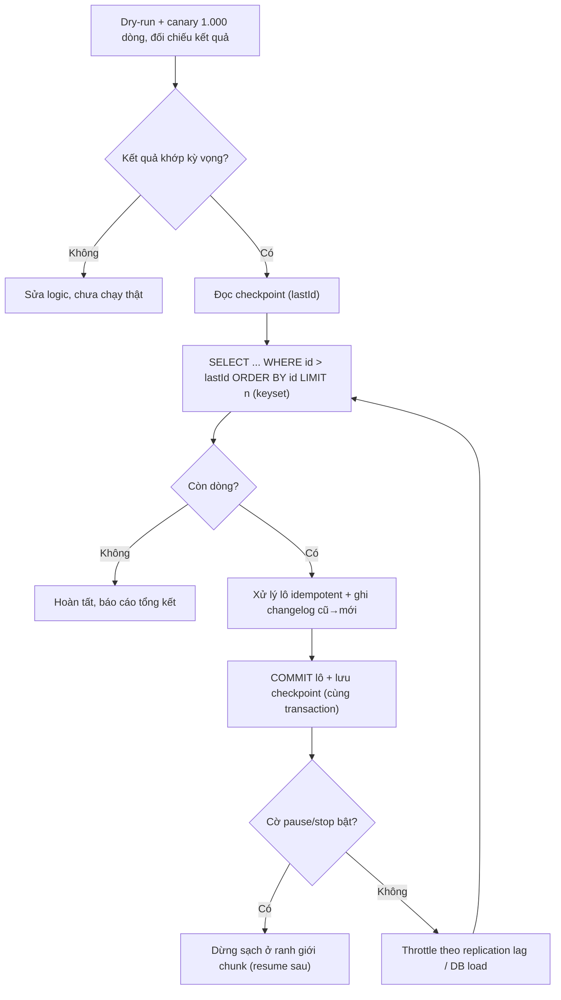

# Backfill hàng triệu records cần lưu ý gì?

## ⚡ Tóm tắt ngắn (30s)
* **Bản chất**: Backfill là việc **chạy lại/điền bù** một lượng lớn dữ liệu lịch sử (vd thêm cột mới, tính lại chỉ số, migrate sang schema mới) cho **hàng triệu bản ghi**. Nó là một **batch khổng lồ chạy một lần**, nên gom đủ mọi rủi ro của batch dài: **đè tải DB production, transaction phình to, lock contention, replication lag, OOM** — cộng thêm áp lực **không được làm sai** vì sửa dữ liệu thật.
* **Hướng xử lý (checklist)**:
  1. **Chunk + keyset pagination** (không `OFFSET`), **commit từng lô**.
  2. **Idempotent + resumable** (checkpoint) — backfill chắc chắn sẽ bị dừng/chạy lại.
  3. **Throttle theo tải** + **chạy off-peak** / **trên replica hoặc worker tách biệt**.
  4. **Dry-run + canary** một tập nhỏ trước, đối chiếu kết quả.
  5. **Monitor tiến độ + ETA + khả năng pause/stop**.
  6. **Có đường lùi** (ghi lại cái đã đổi để rollback được).
* **Quyết định Senior**: Backfill phải được đối xử như một **dự án vận hành có kế hoạch**, không phải một câu `UPDATE` chạy tay. Ưu tiên **an toàn và khả năng dừng/khôi phục** hơn tốc độ; **không bao giờ** một `UPDATE` đụng cả triệu dòng trong một transaction.

---

## 🔍 Chi tiết bản chất thực chiến: Sáu trụ cột của một backfill an toàn

### 1. Chunk + keyset, commit từng lô (không transaction khổng lồ)
Một `UPDATE ... WHERE` đụng vài triệu dòng = giữ lock lâu, phình undo/WAL, fail là rollback toàn bộ. Thay bằng vòng lặp **keyset**: `WHERE id > :lastId ORDER BY id LIMIT :n`, mỗi lô là **một transaction ngắn commit ngay**. `OFFSET` bị cấm vì chi phí quét-bỏ tăng theo $O(n^2)$.

### 2. Idempotent + resumable (checkpoint)
Backfill chạy hàng giờ/ngày → gần như chắc chắn sẽ bị **ngắt giữa chừng** (deploy, lỗi, bị bấm dừng). Phải **lưu checkpoint** (id cuối đã xử lý) để **resume** thay vì chạy lại từ đầu, và mỗi thao tác phải **idempotent** (UPSERT, conditional update `WHERE status='OLD'`) để chạy lại không nhân đôi.

### 3. Throttle + tách tải khỏi production
* **Throttle adaptive**: theo dõi `replication lag`/DB load, lag cao thì giãn nhịp. Backfill phải **vô hình** với người dùng.
* **Off-peak**: chạy ban đêm/cuối tuần.
* **Replica/worker riêng**: phần đọc nặng trỏ replica; dùng connection pool **tách biệt** với pool phục vụ API để không hút sạch kết nối của traffic live.

### 4. Dry-run + canary trước khi chạy thật
Trước khi đụng triệu dòng: chạy **dry-run** (chỉ tính, log "sẽ đổi gì", không ghi) và **canary** trên một tập nhỏ (vd 1.000 dòng), **đối chiếu** kết quả với kỳ vọng. Bắt sai sớm trên 1.000 dòng rẻ hơn vạn lần sửa hậu quả trên 5 triệu dòng.

### 5. Quan sát được: tiến độ, ETA, pause/stop
Backfill chạy lâu nên cần **bảng điều khiển**: số đã xử lý/tổng, throughput, ETA, lỗi, checkpoint hiện tại; và một **cờ điều khiển** để **tạm dừng/hủy** an toàn ở ranh giới chunk khi DB căng. Không có cái này, bạn "bay mù".

### 6. Đường lùi (rollback path)
Phải biết **làm sao quay lại** nếu logic backfill sai: ghi **changelog/audit** giá trị cũ→mới, hoặc ghi vào **cột/bảng mới** rồi mới swap (không ghi đè trực tiếp), hoặc **snapshot/backup** trước khi chạy. Side-effect ngoài DB (email, event) cần **idempotency key** vì không rollback được.

---

## 🎨 Sơ đồ trực quan: Pipeline backfill an toàn

Sơ đồ mô tả backfill chạy theo chunk keyset, commit + checkpoint từng lô, throttle theo tải và có cờ dừng:



---

## 💻 Code thực chiến: BAD vs GOOD

Hai đoạn dưới tương phản một `UPDATE` triệu dòng với pipeline backfill chunk + checkpoint + changelog + throttle:

### ❌ BAD: Một UPDATE nuốt cả bảng
```sql
-- ❌ Khóa hàng triệu dòng, phình undo/WAL, replica lag dồn, fail là rollback toàn bộ
UPDATE users SET tier = compute_tier(points) WHERE tier IS NULL;
-- ❌ Không resume được, không throttle, không biết đổi gì để rollback
```

### ✅ GOOD: Chunk keyset + checkpoint + changelog + throttle, resumable
```java
public void backfillTier() {
    long lastId = checkpointRepo.load("backfillTier"); // ✅ resume từ checkpoint
    while (!control.isStopRequested()) {               // ✅ có thể dừng an toàn
        List<User> chunk = userRepo.findNullTierAfter(lastId, 1000); // ✅ keyset, không OFFSET
        if (chunk.isEmpty()) break;
        applyChunk(chunk);                              // ✅ 1 transaction ngắn / lô
        lastId = chunk.get(chunk.size() - 1).getId();
        progress.report("backfillTier", lastId);        // ✅ tiến độ + ETA
        throttle.byReplicationLag();                    // ✅ nhường đường traffic live
    }
}

@Transactional
public void applyChunk(List<User> chunk) {
    for (User u : chunk) {
        String newTier = computeTier(u.getPoints());
        changelogRepo.record("users", u.getId(), "tier", u.getTier(), newTier); // ✅ đường lùi
        userRepo.updateTierIfNull(u.getId(), newTier); // ✅ conditional → idempotent, chạy lại an toàn
    }
    checkpointRepo.save("backfillTier", chunk.get(chunk.size() - 1).getId()); // ✅ cùng tx với việc
}
```

---

## 📊 Bảng so sánh: backfill ngây thơ vs backfill có kế hoạch

| Tiêu chí | `UPDATE` triệu dòng một phát | Backfill chunk có kế hoạch |
| :--- | :--- | :--- |
| **Tác động DB production** | Lock lâu, lag dồn, dễ sập OLTP | Vô hình nếu throttle + off-peak |
| **Bộ nhớ / undo** | Phình to, rollback khổng lồ | Hằng số, rollback nhỏ theo lô |
| **Bị ngắt giữa chừng** | Mất hết, làm lại từ đầu | Resume từ checkpoint |
| **Chạy lại** | Dễ nhân đôi | Idempotent → an toàn |
| **Kiểm soát** | Không pause/stop được | Dừng/tiếp ở ranh giới chunk |
| **Sửa khi logic sai** | Khó rollback | Có changelog/canary để lùi |

---

## ⚠️ Common Gotchas & Questions follow-up

### 1. Cạm bẫy "backfill hút sạch connection pool của traffic live"
* Backfill chạy nhiều worker song song dễ **chiếm hết** connection pool dùng chung với API → request của khách hàng **đói kết nối**, timeout hàng loạt. Hãy cho backfill một **pool kết nối riêng, giới hạn nhỏ**, và ưu tiên đọc trên **replica**. Tách tài nguyên là cách chắc chắn nhất để backfill không "ăn" vào trải nghiệm người dùng.

### 2. Cạm bẫy "không ghi lại cái đã đổi nên không thể rollback"
* Khi phát hiện logic backfill sai **sau khi** đã chạy nửa triệu dòng, nếu bạn ghi đè trực tiếp giá trị cũ mà không lưu lại, thì **không có đường về** — không biết giá trị gốc là gì để khôi phục. Luôn ghi **changelog (cũ→mới)** hoặc backfill vào **cột/bảng mới rồi swap**, để mọi thay đổi đều **đảo ngược được**.

### 3. Câu hỏi đào sâu từ interviewer
* **Interviewer: "Bạn cần backfill 50 triệu dòng nhưng không có cửa sổ downtime, hệ thống phục vụ 24/7. Bạn lên kế hoạch thế nào?"**
* **Trả lời**: Tôi coi đây là một **online backfill** và thiết kế quanh nguyên tắc "không đụng đường traffic live": (1) **chunk + keyset + commit từng lô nhỏ** để mỗi transaction chỉ giữ lock vài mili-giây, không bao giờ khóa diện rộng; (2) **adaptive throttle theo replication lag** — đặt ngưỡng lag, vượt thì tự giãn/tạm dừng, để replica và OLTP luôn khỏe; (3) **pool kết nối riêng** và ưu tiên **đọc trên replica**, ghi nhỏ giọt vào primary; (4) **idempotent + checkpoint** để có thể dừng bất cứ lúc nào (giờ cao điểm) rồi tiếp tục lúc thấp điểm; (5) **canary + dry-run** một tập nhỏ và đối chiếu trước khi mở rộng, **monitor tiến độ/ETA/lỗi** suốt quá trình với alert; (6) nếu là đổi schema, dùng chiến lược **expand–migrate–contract** (thêm cột mới, backfill dần, đọc-ghi song song, rồi mới bỏ cột cũ) để không cần downtime. Tinh thần là chia một việc khổng lồ thành hàng nghìn bước nhỏ **an toàn, dừng được, lùi được**, và để hệ thống tự điều tiết tốc độ theo sức khỏe DB.
