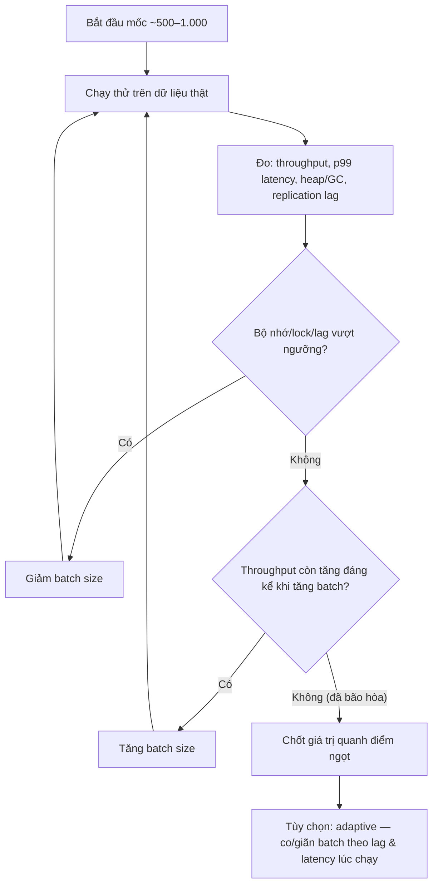

# Làm sao chia batch size phù hợp?

## ⚡ Tóm tắt ngắn (30s)
* **Bản chất**: Batch size là một bài toán **đánh đổi (trade-off)**, không có con số "đúng" tuyệt đối. **Quá nhỏ** → overhead cao (nhiều round-trip mạng, nhiều lần commit, nhiều lần parse) làm job ì ạch. **Quá lớn** → ngốn bộ nhớ (dễ OOM), **transaction dài giữ lock lâu**, undo/WAL phình, dễ timeout, và rollback một lô lớn rất đắt. Điểm tối ưu nằm ở khoảng giữa và **phụ thuộc ngữ cảnh** (kích thước dòng, RAM, độ trễ mục tiêu, giới hạn downstream).
* **Hướng xử lý**: Không đoán — **bắt đầu một giá trị hợp lý (~500–1.000), đo, rồi tinh chỉnh**. Tách rõ hai khái niệm dễ lẫn: **fetch size** (số dòng kéo về mỗi round-trip) và **commit interval** (số dòng mỗi transaction). Với hệ tải biến động, cân nhắc **adaptive batch sizing** (co/giãn theo độ trễ phản hồi và DB load).
* **Quyết định Senior**: Tôi chọn batch size bằng **đo lường, không bằng cảm tính**, dựa trên throughput thực tế và độ trễ p99, đồng thời tôn trọng **giới hạn bộ nhớ và thời gian giữ lock**. Quy tắc ngón tay cái: đủ lớn để **nuốt overhead**, đủ nhỏ để **giữ transaction ngắn và bộ nhớ phẳng**.

---

## 🔍 Chi tiết bản chất thực chiến: Đánh đổi quanh batch size

### 1. Hai thái cực và cái giá của chúng
* **Batch quá nhỏ (vd 1)**: mỗi dòng một round-trip + một commit → chi phí cố định (network RTT, fsync khi commit, parse plan) **nhân lên N lần**. Throughput thấp thảm hại dù mỗi thao tác nhẹ.
* **Batch quá lớn (vd 1 triệu)**: phải giữ cả lô trong RAM (OOM), **transaction chạy lâu giữ lock** chặn OLTP, undo/WAL phình, vượt `statement_timeout`, và nếu fail thì **rollback cả lô** rất tốn.

Throughput tổng có thể hình dung như:

$$throughput \approx \frac{batchSize}{t_{fixed} + batchSize \cdot t_{perRow}}$$

Tăng `batchSize` ban đầu giúp **khấu hao** chi phí cố định $t_{fixed}$ rất nhanh, nhưng tới khi $batchSize \cdot t_{perRow}$ áp đảo thì lợi ích **bão hòa** — trong khi rủi ro bộ nhớ/lock vẫn tăng tuyến tính. Điểm ngọt nằm ngay sau vùng bão hòa đó.

### 2. Fetch size ≠ commit interval (đừng lẫn)
Hai tham số khác nhau, thường bị gộp:
* **Fetch size** (JDBC `setFetchSize`): bao nhiêu dòng kéo về **mỗi round-trip** khi đọc → ảnh hưởng bộ nhớ phía client và số lần đi mạng.
* **Commit interval** (Spring Batch `chunk(n)`): bao nhiêu dòng mỗi **transaction** khi ghi → ảnh hưởng thời gian giữ lock và kích thước rollback.
Có thể **fetch lớn nhưng commit nhỏ** (đọc hiệu quả, ghi an toàn), tùy job nghiêng về đọc hay ghi.

### 3. Các yếu tố quyết định con số
* **Kích thước mỗi dòng**: dòng nặng (BLOB, JSON lớn) → batch nhỏ để khỏi OOM; dòng nhẹ → batch lớn được.
* **Bộ nhớ heap** sẵn có cho worker.
* **Thời gian giữ lock chấp nhận được**: càng nhạy cảm với OLTP thì commit interval càng nhỏ.
* **Giới hạn downstream**: API ngoài giới hạn N item/request; bulk index Elasticsearch khuyến nghị vài MB/lô.
* **Mục tiêu độ trễ**: cần kết quả "gần thời gian thực" thì lô nhỏ để feedback nhanh.

### 4. Đo lường & adaptive sizing
Cách đúng: chọn mốc khởi đầu (~500–1.000), chạy thử trên dữ liệu thật, **đo throughput, p99 latency, GC/heap, replication lag**, rồi tăng/giảm. Với tải biến động, **adaptive**: nếu độ trễ phản hồi/lag tăng thì **giảm** batch, nếu ổn định thì **tăng** dần — tự tìm điểm cân bằng theo thời gian thực.

---

## 🎨 Sơ đồ trực quan: Chọn batch size theo đo lường (và adaptive)

Sơ đồ mô tả quy trình chọn batch size: bắt đầu, đo, tinh chỉnh, và điều chỉnh động theo tải:



---

## 💻 Code thực chiến: BAD vs GOOD

Hai đoạn dưới tương phản batch size cực đoan (1 hoặc cả bảng) với cấu hình tách fetch/commit và adaptive sizing:

### ❌ BAD: Batch = 1 hoặc batch = "cả bảng"
```java
// ❌ Batch = 1: mỗi dòng một round-trip + một commit → overhead khủng khiếp, cực chậm
for (Long id : ids) {
    Item it = repo.findById(id); // 1 query/dòng
    repo.save(process(it));      // 1 commit/dòng
}

// ❌ Batch = cả bảng: kéo hết vào RAM, một transaction dài → OOM + giữ lock + rollback đắt
List<Item> all = repo.findAll();           // hàng triệu dòng vào heap
repo.saveAll(all.stream().map(this::process).toList());
```

### ✅ GOOD: Tách fetch size & commit interval + adaptive
```java
// ✅ Spring Batch: commit interval (chunk) tách biệt với fetch size của reader
@Bean
public Step backfillStep(JobRepository repo, PlatformTransactionManager tx,
                         ItemReader<Item> reader, ItemWriter<Item> writer) {
    return new StepBuilder("backfill", repo)
        .<Item, Item>chunk(1000, tx)   // ✅ commit mỗi 1.000 dòng: transaction ngắn, lock ít
        .reader(reader).processor(this::process).writer(writer)
        .build();
}

@Bean
public JdbcCursorItemReader<Item> reader(DataSource ds) {
    var r = new JdbcCursorItemReader<Item>();
    r.setDataSource(ds);
    r.setSql("SELECT * FROM item WHERE status = 'PENDING' ORDER BY id");
    r.setFetchSize(1000); // ✅ fetch size: kéo 1.000 dòng/round-trip — độc lập với commit interval
    return r;
}

// ✅ Adaptive: giảm batch khi DB căng, tăng khi ổn định
int next(int current, Duration p99, Duration lag) {
    if (lag.toSeconds() > 5 || p99.toMillis() > 200) return Math.max(100, current / 2); // ✅ co lại
    return Math.min(5000, current * 2); // ✅ giãn ra khi khỏe
}
```

```properties
# ✅ JDBC: gộp nhiều INSERT/UPDATE thành ít round-trip (MySQL) — hiệu quả batch ghi
spring.datasource.hikari.data-source-properties.rewriteBatchedStatements=true
```

---

## 📊 Bảng so sánh ảnh hưởng của batch size

| Khía cạnh | Batch quá nhỏ | Batch "vừa" (đo & tinh chỉnh) | Batch quá lớn |
| :--- | :--- | :--- | :--- |
| **Overhead cố định/dòng** | Cao (nhiều round-trip/commit) | Được khấu hao tốt | Thấp nhưng lợi ích bão hòa |
| **Bộ nhớ heap** | Thấp | Ổn định, kiểm soát được | Cao, dễ OOM |
| **Thời gian giữ lock** | Rất ngắn | Ngắn, chấp nhận được | Dài, chặn OLTP |
| **Chi phí khi fail** | Mất ít | Mất một lô nhỏ | Rollback cả lô lớn, đắt |
| **Throughput** | Thấp | Cao nhất quanh điểm ngọt | Giảm/biến động do GC, lock |

---

## ⚠️ Common Gotchas & Questions follow-up

### 1. Cạm bẫy "lẫn fetch size với commit interval"
* Nhiều người chỉnh một con số "batch size" mà không phân biệt **đọc** và **ghi**. Đặt fetch size khổng lồ làm OOM phía client; đặt commit interval khổng lồ làm transaction dài giữ lock. Hãy chỉnh **độc lập**: fetch theo bộ nhớ & số round-trip đọc, commit theo thời gian giữ lock & chi phí rollback. Một job có thể fetch 5.000 nhưng commit mỗi 500.

### 2. Cạm bẫy "JDBC batch nhưng quên `rewriteBatchedStatements`"
* Với MySQL, gọi `addBatch()/executeBatch()` mà **không** bật `rewriteBatchedStatements=true` thì driver vẫn gửi **từng câu một** — bạn tưởng đang batch nhưng thực chất không, throughput chẳng cải thiện. Đây là cái bẫy "batch giả". Luôn kiểm chứng bằng đo số round-trip/throughput thực tế, đừng tin vào tên hàm.

### 3. Câu hỏi đào sâu từ interviewer
* **Interviewer: "Bạn nói 'đo rồi chỉnh'. Cụ thể bạn đo những chỉ số gì và tăng/giảm batch dựa vào tín hiệu nào?"**
* **Trả lời**: Tôi đo bốn nhóm tín hiệu và cho chúng "biểu quyết": (1) **throughput (rows/s)** — tăng batch chừng nào throughput còn lên *đáng kể*; khi nó **đi ngang** (bão hòa) thì dừng tăng vì lợi ích đã cạn trong khi rủi ro vẫn tăng; (2) **độ trễ p99 của mỗi chunk** và **`statement_timeout`** — nếu p99 phình hoặc chạm trần timeout, batch đang quá lớn, phải giảm; (3) **heap/GC** — nếu thấy GC pause dài hoặc heap leo sát ngưỡng, lô đang ngốn bộ nhớ, giảm; (4) **replication lag & lock wait** — nếu lag dâng hoặc OLTP bắt đầu chờ lock, batch đang ép DB quá mức, giảm ngay. Trong môi trường tải biến động tôi để **adaptive**: gặp tín hiệu xấu thì **giảm một nửa**, ổn định một lúc thì **tăng dần** — như một bộ điều khiển tự dò điểm cân bằng. Điểm mấu chốt là tôi **không chốt cứng một con số** rồi quên, mà coi batch size là một tham số **vận hành được giám sát**.
