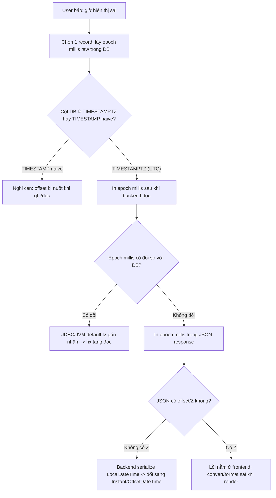

# User ở nhiều timezone thấy ngày giờ sai. Bạn debug thế nào?

## ⚡ Tóm tắt ngắn (30s)
* **Bản chất**: 99% bug timezone bắt nguồn từ việc **trộn lẫn "thời điểm tuyệt đối" (instant) với "biểu diễn local"** ở đâu đó trong chuỗi `DB → Backend → API → Frontend`. Khi một timestamp bị **mất offset/zone** ở một mắt xích, nó sẽ bị **diễn giải lại sai** khi hiển thị cho user ở tz khác. Triệu chứng "mỗi user thấy một giờ khác nhau" gần như luôn là dấu hiệu của một `LocalDateTime` (naive, không zone) đang bị dùng để biểu diễn một thời điểm cụ thể.
* **Hướng debug**: Truy ngược từng tầng pipeline, xác định ở mỗi mắt xích giá trị đang được lưu/truyền dưới **dạng gì**: instant UTC? naive local? có offset không? Chọn **1 record cụ thể**, in ra **epoch millis** ở từng tầng — epoch millis là bất biến, nếu nó giống nhau khắp nơi thì instant đúng, sai chỉ ở presentation; nếu khác nhau thì có chỗ "shift" sai.
* **Quyết định Senior**: Chuẩn hóa nguyên tắc **"store UTC, convert at edges"** — lưu `Instant`/UTC, truyền ISO-8601 **có offset** (`2026-06-29T10:00:00Z`), và **chỉ convert sang timezone người dùng ở tầng trình bày** (frontend hoặc ngay trước khi render). Không bao giờ để JVM default timezone quyết định kết quả.

---

## 🔍 Chi tiết bản chất thực chiến: Truy ngược pipeline thời gian

### 1. Bốn mắt xích nơi timezone hay bị "rớt"
Một thời điểm đi qua 4 ranh giới, mỗi ranh giới là một nơi offset có thể bị mất:
* **DB**: cột `TIMESTAMP` (without time zone) lưu giá trị **naive** — không nhớ đây là UTC hay local. Cột `TIMESTAMPTZ` (Postgres) thì chuẩn hơn vì luôn quy về UTC khi lưu.
* **JDBC / Driver**: khi đọc cột `TIMESTAMP`, driver gán timezone của **JVM hoặc của connection** vào → cùng dữ liệu, hai node JVM khác tz đọc ra hai instant khác nhau.
* **Serialization (Jackson)**: nếu serialize một `LocalDateTime`, JSON ra `"2026-06-29T10:00:00"` **không có Z** → client buộc phải đoán tz.
* **Frontend**: `new Date("2026-06-29T10:00:00")` (thiếu `Z`) được parse theo **timezone của browser** → user ở Hà Nội và user ở Tokyo thấy hai giờ khác nhau từ **cùng một chuỗi**.

### 2. Phương pháp debug bằng "instant bất biến"
Cốt lõi: **epoch millis (số mili-giây từ 1970-01-01T00:00:00Z) là tuyệt đối, không phụ thuộc timezone**. Quy trình:
1. Chọn 1 bản ghi đang bị báo lỗi (ví dụ "đơn tạo lúc 17:00 nhưng hiển thị 10:00").
2. In `epochMilli` ở từng tầng: giá trị raw trong DB, giá trị sau khi backend đọc, giá trị trong JSON response, giá trị frontend parse.
3. **Nếu epoch millis giống nhau toàn pipeline** → instant đúng, lỗi chỉ ở chỗ **format/convert khi hiển thị** (sửa ở UI).
4. **Nếu epoch millis nhảy** ở một tầng → đó chính là nơi một naive datetime bị gán nhầm tz. Fix tại đó.

### 3. Các root cause kinh điển
* **JVM default tz không đồng nhất** giữa các pod (một pod chạy UTC, một pod chạy `Asia/Ho_Chi_Minh`) → cùng code, cùng input, khác output. Phải ép `-Duser.timezone=UTC` hoặc tốt hơn là **không phụ thuộc default tz**.
* **Dùng `LocalDateTime` để biểu diễn một thời điểm**: `LocalDateTime` **không có zone** — nó chỉ là "10:00 ngày 29/6" mà không nói 10:00 ở đâu. Đây là cờ đỏ lớn nhất.
* **Cột DB sai kiểu**: lưu thời điểm vào `TIMESTAMP` thay vì `TIMESTAMPTZ` (Postgres) khiến offset bị nuốt mất.

---

## 🎨 Sơ đồ trực quan: Truy ngược pipeline để định vị tầng làm sai instant

Sơ đồ mô tả cách dùng epoch millis bất biến để khoanh vùng mắt xích làm lệch thời gian:



---

## 💻 Code thực chiến: BAD vs GOOD

Hai đoạn dưới tương phản pipeline đánh mất offset với pipeline giữ instant nhất quán:

### ❌ BAD: Naive datetime, phụ thuộc JVM default tz
```java
// ❌ LocalDateTime.now() lấy giờ theo JVM default tz -> mỗi node một kết quả
LocalDateTime createdAt = LocalDateTime.now();
order.setCreatedAt(createdAt); // ❌ cột DB là TIMESTAMP (naive), offset bị nuốt

// API trả thẳng LocalDateTime
public LocalDateTime getCreatedAt() {
    return order.getCreatedAt(); // ❌ JSON: "2026-06-29T10:00:00" KHÔNG có Z
}                                // -> mỗi browser tự gán tz của nó -> hiển thị lệch
```

### ✅ GOOD: Lưu Instant (UTC), truyền có offset, convert ở edge
```java
// ✅ Instant là thời điểm tuyệt đối trên trục UTC, không dính default tz
Instant createdAt = Instant.now(clock);     // clock được inject (xem q10)
order.setCreatedAt(createdAt);              // ✅ cột DB: TIMESTAMPTZ / lưu epoch UTC

// API trả ISO-8601 có offset -> client không phải đoán
public OffsetDateTime getCreatedAt() {
    return order.getCreatedAt().atOffset(ZoneOffset.UTC); // ✅ "2026-06-29T10:00:00Z"
}
```

Convert sang timezone người dùng **chỉ ở tầng trình bày**, dùng IANA zone ID:
```java
// ✅ Convert tại edge, ngay trước khi hiển thị cho user
ZoneId userZone = ZoneId.of("Asia/Ho_Chi_Minh"); // lấy từ profile user
ZonedDateTime localView = order.getCreatedAt().atZone(userZone);
String display = localView.format(DateTimeFormatter.ofPattern("dd/MM/yyyy HH:mm"));
// User VN thấy 17:00, user Tokyo thấy 19:00 — nhưng CÙNG một instant
```

Cấu hình Jackson để mặc định an toàn:
```yaml
spring:
  jackson:
    serialization:
      write-dates-as-timestamps: false   # ✅ ISO-8601 thay vì epoch số trần
    time-zone: UTC                        # ✅ chuẩn hóa tz khi serialize
```

---

## 📊 Bảng so sánh: timestamp được lưu/truyền dưới dạng gì ở mỗi tầng

Bảng dưới giúp khoanh nhanh nơi offset bị mất:

| Tầng | Dạng AN TOÀN (giữ instant) | Dạng NGUY HIỂM (mất zone) | Triệu chứng khi sai |
| :--- | :--- | :--- | :--- |
| **DB column** | `TIMESTAMPTZ` / epoch UTC | `TIMESTAMP` (naive) | Đọc lại lệch theo tz node |
| **JVM** | Không phụ thuộc default tz | Dựa `LocalDateTime.now()` | Mỗi pod ra giờ khác nhau |
| **API JSON** | ISO-8601 có `Z`/offset | `"...T10:00:00"` không Z | Mỗi browser hiển thị khác |
| **Frontend** | Parse instant, convert khi render | `new Date("...")` không Z | User các tz thấy lệch nhau |

---

## ⚠️ Common Gotchas & Questions follow-up

### 1. Cạm bẫy "sửa ở UI nhưng gốc rễ ở backend"
* Dev hay thấy frontend hiển thị sai và **cộng/trừ thủ công vài giờ** ở UI cho khớp với mình. Đây là **vá triệu chứng**: nó chỉ đúng cho timezone của chính dev, và sẽ sai cho mọi user ở tz khác. Phải fix tại tầng làm rớt offset (thường là backend serialize `LocalDateTime` hoặc cột DB naive), không bù trừ hằng số ở UI.

### 2. Cạm bẫy "test trên máy mình nên không thấy bug"
* Máy dev và server thường cùng tz nên bug **ẩn hoàn toàn** khi test local. Bug chỉ lộ khi user thật ở tz khác. Cách phòng: chạy thử app với `-Duser.timezone=UTC` và `-Duser.timezone=Pacific/Kiritimati` (UTC+14) để ép lộ giả định ngầm.

### 3. Câu hỏi đào sâu từ interviewer
* **Interviewer: "Frontend báo giờ sai 7 tiếng đúng bằng offset của Việt Nam. Junior đề xuất trừ đi 7 tiếng ở backend cho khớp. Bạn nói gì?"**
* **Trả lời**: Tôi sẽ **không** trừ 7 tiếng, vì con số 7h chỉ đúng cho user ở `Asia/Ho_Chi_Minh`; user ở Tokyo (UTC+9) sẽ lệch 9h, ở London (UTC+0/+1) sẽ lệch khác. Lệch đúng bằng một offset cố định là **bằng chứng** rằng đâu đó một instant UTC đang bị hiển thị **như thể nó là giờ local** (hoặc ngược lại) — tức là ở tầng serialize/parse có một `LocalDateTime` không mang zone. Cách đúng là đảm bảo backend trả instant kèm offset (`...Z`), rồi để **frontend convert sang tz của từng user** bằng IANA zone ID. Như vậy mọi user thấy đúng giờ của họ mà cùng trỏ về một thời điểm tuyệt đối, thay vì hard-code một con số chỉ đúng cho một quốc gia.
