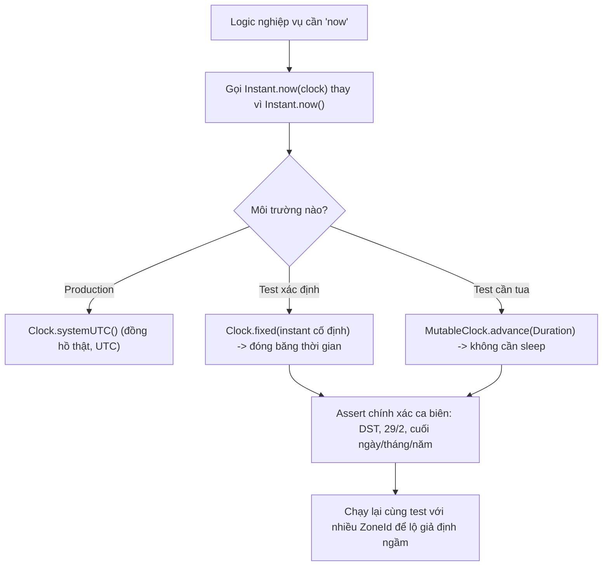

# Làm sao test logic liên quan thời gian?

## ⚡ Tóm tắt ngắn (30s)
* **Bản chất**: Code gọi thẳng `Instant.now()`, `LocalDate.now()`, `System.currentTimeMillis()` là **không xác định (non-deterministic)** — kết quả phụ thuộc lúc chạy test và default tz của máy CI, nên không thể assert chính xác và hay "flaky". Gốc rễ để test được thời gian là **biến "hiện tại" thành một dependency tiêm vào được**, thay vì một lời gọi tĩnh ẩn.
* **Hướng làm**: **Inject `java.time.Clock`**. Production dùng `Clock.systemUTC()`; test dùng `Clock.fixed(instant, zone)` để "đóng băng thời gian" hoặc một **mutable clock** để "tua" thời gian theo ý muốn. Tuyệt đối **không dùng `Thread.sleep`** để chờ thời gian trôi — hãy điều khiển đồng hồ.
* **Quyết định Senior**: Coi `Clock` là một **bean hạ tầng** được tiêm vào mọi nơi cần "now". Nhờ đó test được các **ca biên hiểm** một cách **xác định và nhanh**: chuyển DST (gap/overlap), 29/2 năm nhuận, ranh giới cuối ngày/cuối tháng/cuối năm, và hành vi ở các IANA zone khác nhau — những thứ gần như không bao giờ xảy ra tự nhiên trong test.

---

## 🔍 Chi tiết bản chất thực chiến: Biến thời gian thành dependency

### 1. Vì sao `now()` tĩnh là kẻ thù của test
`Instant.now()` đọc đồng hồ hệ thống tại thời điểm chạy → mỗi lần chạy ra giá trị khác. Logic kiểu "token hết hạn sau 15 phút", "đơn quá hạn thanh toán", "report của hôm nay" không thể assert được nếu không kiểm soát được "bây giờ là khi nào". Hệ quả là dev hay viết test mơ hồ (`assertTrue(result != null)`) hoặc test phụ thuộc ngày chạy → **flaky**, đỏ vào đúng nửa đêm hoặc ngày DST.

### 2. `Clock` — điểm tiêm để kiểm soát thời gian
`java.time.Clock` là abstraction chuẩn của JDK cho "nguồn thời gian". Mọi API `now()` đều có overload nhận `Clock`: `Instant.now(clock)`, `LocalDate.now(clock)`, `ZonedDateTime.now(clock)`. Chỉ cần code **luôn truyền `clock`** thay vì gọi `now()` trần:
* **Production**: `Clock.systemUTC()` (hoặc `Clock.system(zone)`).
* **Test cố định**: `Clock.fixed(Instant.parse("2026-06-29T17:00:00Z"), ZoneOffset.UTC)` → thời gian "đứng yên", assert được chính xác.
* **Test tua được**: một `MutableClock` cho phép `advance(Duration)` để mô phỏng thời gian trôi mà **không cần sleep**.

### 3. Không dùng `Thread.sleep` để test thời gian
`sleep` làm test **chậm** và vẫn **không xác định** (phụ thuộc lập lịch OS). Thay vì chờ token thật hết hạn sau 15 phút, hãy đẩy clock tiến 16 phút và verify. Test chạy trong mili-giây và đáng tin.

### 4. Các ca biên phải test chủ đích
Vì hiếm khi xảy ra tự nhiên, phải **cố tình** dựng:
* **DST gap/overlap**: fix clock vào đúng `2026-03-08T02:30` (US spring-forward) / `2026-11-01T01:30` (fall-back).
* **Năm nhuận**: `2028-02-29`, và "+1 năm" từ 29/2.
* **Ranh giới**: cuối ngày (`23:59:59.999`), đầu ngày, cuối tháng (28/29/30/31), cuối năm (31/12 → 1/1).
* **Đa timezone**: chạy cùng test với nhiều `ZoneId` (VN, US/Eastern, UTC+14 Kiribati) để lộ giả định ngầm.

### 5. Test job theo lịch mà không chạy scheduler
Đừng test bằng cách chờ `@Scheduled` kích hoạt. Tách **logic** ra một method nhận `clock`/tham số thời gian, rồi **gọi trực tiếp** method đó trong test với clock cố định. Scheduler chỉ là cái kích hoạt, không cần test phần đó bằng thời gian thật.

---

## 🎨 Sơ đồ trực quan: Kiến trúc test thời gian bằng Clock injection

Sơ đồ mô tả cách thay nguồn thời gian thật bằng clock điều khiển được trong test:



---

## 💻 Code thực chiến: BAD vs GOOD

Hai đoạn dưới tương phản logic phụ thuộc đồng hồ thật với logic tiêm `Clock`:

### ❌ BAD: now() trần + sleep -> flaky, chậm
```java
public class ExpiryService {
    public boolean isExpired(Instant exp) {
        return Instant.now().isAfter(exp);   // ❌ phụ thuộc lúc chạy, không assert chính xác
    }
}

@Test
void tokenExpires() throws InterruptedException {
    Instant exp = Instant.now().plusMillis(50);
    Thread.sleep(60);                        // ❌ chậm, không xác định, dễ flaky
    assertTrue(service.isExpired(exp));
}
```

### ✅ GOOD: Inject Clock, đóng băng/tua thời gian
```java
public class ExpiryService {
    private final Clock clock;               // ✅ tiêm vào
    public ExpiryService(Clock clock) { this.clock = clock; }

    public boolean isExpired(Instant exp) {
        return Instant.now(clock).isAfter(exp); // ✅ đọc theo clock điều khiển được
    }
}

@Test
void tokenExpires_deterministic() {
    Instant t0 = Instant.parse("2026-06-29T10:00:00Z");
    Clock atIssue = Clock.fixed(t0, ZoneOffset.UTC);
    var service = new ExpiryService(Clock.fixed(t0.plusSeconds(901), ZoneOffset.UTC)); // ✅ +15m1s
    assertTrue(service.isExpired(t0.plus(Duration.ofMinutes(15)))); // ✅ chính xác, tức thì
}
```

Test ca biên DST một cách xác định và đa timezone:
```java
@ParameterizedTest
@ValueSource(strings = {"Asia/Ho_Chi_Minh", "America/New_York", "Pacific/Kiritimati"})
void businessDay_correctAcrossZones(String zoneId) {
    ZoneId zone = ZoneId.of(zoneId);
    // ✅ Đóng băng vào 23:00 UTC để lộ lệch ngày ở các zone lệch nhau
    Clock clock = Clock.fixed(Instant.parse("2026-06-29T23:00:00Z"), zone);
    var report = new ReportService(clock);
    LocalDate biz = report.businessToday();          // assert theo zone tương ứng
    assertEquals(LocalDate.now(clock), biz);
}

@Test
void dstFallBack_doesNotDoubleCount() {
    // ✅ Cố tình rơi vào giờ lặp của fall-back (US Eastern)
    Clock clock = Clock.fixed(Instant.parse("2026-11-01T05:30:00Z"), ZoneId.of("America/New_York"));
    // ... assert logic gom theo Instant không bị đếm trùng
}
```

Cung cấp `Clock` như một bean trong Spring để toàn app dùng chung:
```java
@Bean
Clock clock() { return Clock.systemUTC(); }   // ✅ test override bằng Clock.fixed(...)
```

---

## 📊 Bảng so sánh: cách kiểm soát thời gian trong test

Bảng dưới đối chiếu các kỹ thuật theo độ tin cậy và tốc độ:

| Cách | Xác định? | Tốc độ | Ghi chú |
| :--- | :--- | :--- | :--- |
| **`now()` trần + `Thread.sleep`** | ❌ Flaky | Chậm | Tránh tuyệt đối |
| **Mock `System.currentTimeMillis`** | ⚠️ Mong manh | Nhanh | Phụ thuộc bytecode mock, dễ vỡ |
| **`Clock.fixed(...)`** | ✅ Có | Nhanh | Đóng băng thời gian, chuẩn JDK |
| **MutableClock (tua được)** | ✅ Có | Nhanh | Mô phỏng thời gian trôi, không sleep |
| **Parameterized theo `ZoneId`** | ✅ Có | Nhanh | Lộ giả định tz ngầm |

---

## ⚠️ Common Gotchas & Questions follow-up

### 1. Cạm bẫy "còn sót một chỗ gọi `now()` trần"
* Chỉ cần **một** lời gọi `Instant.now()` hoặc `new Date()` lọt trong chuỗi xử lý là test mất tính xác định, dù mọi chỗ khác đã inject `Clock`. Nên đặt quy ước lint/review cấm gọi `LocalDate.now()`/`Instant.now()`/`System.currentTimeMillis()` không tham số trong code nghiệp vụ, và **chỉ cho phép** đọc thời gian qua `clock`.

### 2. Cạm bẫy "Clock.fixed nhưng quên zone"
* `Clock.fixed(instant, zone)` cần đúng `zone` để `LocalDate.now(clock)` ra ngày mong đợi. Nếu test cần kiểm tra hành vi theo giờ VN nhưng truyền `ZoneOffset.UTC`, ngày có thể lệch ở các ca rìa ngày. Hãy chọn `zone` khớp với nghiệp vụ đang test, và test thêm vài zone khác để chắc.

### 3. Câu hỏi đào sâu từ interviewer
* **Interviewer: "Có một test 'đôi khi đỏ' chỉ khi CI chạy gần nửa đêm. Bạn chẩn đoán và sửa thế nào?"**
* **Trả lời**: "Đỏ gần nửa đêm" là triệu chứng kinh điển của test **phụ thuộc đồng hồ thật và ranh giới ngày**: logic gọi `LocalDate.now()` trần, nên khi test chạy vắt qua mốc 00:00 (theo default tz của runner CI), "hôm nay" trong lúc setup khác "hôm nay" lúc assert → off-by-one ngày. Tôi sẽ tìm các lời gọi `now()` không tham số trong đường dẫn code đang test, **refactor để inject `Clock`**, rồi trong test **đóng băng** bằng `Clock.fixed(...)` tại một thời điểm cố định — kể cả cố tình đặt ngay `23:59:59` để bug lộ ra một cách **xác định** thay vì ngẫu nhiên. Tôi cũng sẽ thêm test parameterized chạy ở vài `ZoneId` (gồm một zone lệch mạnh như UTC+14) để bắt giả định tz ngầm. Nguyên tắc tôi rút ra và sẽ ghi lại: **thời gian phải là dependency tiêm vào, không phải trạng thái toàn cục** — chỉ khi kiểm soát được "now" thì các ca biên thời gian (DST, năm nhuận, ranh giới ngày) mới test được đáng tin, thay vì phó mặc cho lúc CI tình cờ chạy.
