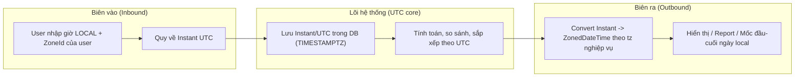

# Server dùng UTC nhưng business dùng local timezone. Thiết kế thế nào?

## ⚡ Tóm tắt ngắn (30s)
* **Bản chất**: Đây là bài toán **tách biệt hai trục thời gian khác nhau**: trục **kỹ thuật/lưu trữ** (luôn UTC, tuyệt đối, không nhập nhằng) và trục **nghiệp vụ/hiển thị** (local timezone của user hoặc của thị trường). Mâu thuẫn chỉ xảy ra khi để hai trục này rò rỉ vào nhau — ví dụ lưu giờ local vào DB, hay đem UTC ra so sánh với "ngày làm việc" của business.
* **Hướng thiết kế**: Áp dụng kiến trúc **"UTC ở lõi, local ở rìa"** (UTC core, local edges). **Lưu** mọi timestamp dưới dạng `Instant`/UTC; **convert sang timezone nghiệp vụ chỉ tại biên** — khi nhận input từ user, khi hiển thị, và khi tính các mốc nghiệp vụ (đầu ngày, cuối tháng, hạn thanh toán) theo IANA zone của thị trường.
* **Quyết định Senior**: Coi **timezone là một tham số nghiệp vụ tường minh** (lưu trong profile user / cấu hình tenant bằng IANA zone ID như `Asia/Ho_Chi_Minh`), không phải hằng số ngầm. Mọi phép tính "theo ngày local" phải nhận `ZoneId` làm input, không bao giờ dựa vào JVM default tz.

---

## 🔍 Chi tiết bản chất thực chiến: Kiến trúc "UTC core, local edges"

### 1. Vì sao lưu UTC nhưng không thể "chỉ dùng UTC"
Lưu UTC giải quyết được vấn đề **lưu trữ và so sánh thứ tự** (instant nào trước/sau là tuyệt đối). Nhưng nghiệp vụ luôn hỏi câu kiểu **local**:
* "Doanh thu **ngày hôm nay**" — "hôm nay" của thị trường VN bắt đầu lúc `00:00 Asia/Ho_Chi_Minh` = `17:00 UTC hôm trước`.
* "Báo cáo **tháng 6**", "khuyến mãi kết thúc **cuối ngày 30/6 giờ địa phương**".
Nếu đem `00:00 UTC` ra làm ranh giới ngày cho business VN, mọi event xảy ra từ `00:00–07:00` giờ VN sẽ bị tính nhầm sang ngày hôm trước.

### 2. Ba điểm biên (edge) phải convert
* **Inbound (nhận input)**: user nhập "đặt lịch 9:00 sáng 1/7" — đó là giờ **local của họ**. Backend phải biết tz của user để quy về instant UTC: `LocalDateTime + ZoneId → ZonedDateTime → Instant`.
* **Outbound (hiển thị)**: convert `Instant → ZonedDateTime` theo tz user trước khi format.
* **Business boundary (mốc nghiệp vụ)**: tính "đầu ngày local", "cuối tháng local" bằng `ZoneId` rồi mới đổi sang UTC để query DB.

### 3. Timezone thuộc về ai? — Mô hình hóa tường minh
Phải trả lời: timezone gắn với **user**, với **tenant/thị trường**, hay với **một địa điểm cụ thể** (ví dụ booking sân bay theo tz sân bay)?
* Lưu `zone_id VARCHAR` (IANA, ví dụ `Asia/Ho_Chi_Minh`) trong bảng tương ứng.
* **Không lưu fixed offset** (`+07:00`) cho dữ liệu nghiệp vụ tương lai: offset có thể đổi (DST, đổi luật quốc gia). IANA zone mới chứa đủ luật để tính đúng offset tại từng thời điểm.

### 4. Ranh giới ngày nghiệp vụ — công thức quy đổi
Để query "tất cả đơn trong ngày `D` theo tz `Z`":
* Đầu ngày local: `startLocal = D.atStartOfDay(Z)` → `startUtc = startLocal.toInstant()`.
* Cuối ngày: `endUtc = D.plusDays(1).atStartOfDay(Z).toInstant()`.
* Query: `WHERE created_at >= startUtc AND created_at < endUtc` (nửa mở `[start, end)` để tránh trùng/sót ranh giới).

---

## 🎨 Sơ đồ trực quan: UTC ở lõi, convert local tại biên

Sơ đồ mô tả luồng dữ liệu giữ UTC ở tầng lưu trữ và convert sang tz nghiệp vụ tại các điểm biên:



---

## 💻 Code thực chiến: BAD vs GOOD

Hai đoạn dưới tương phản việc trộn UTC với local so với tách bạch rõ ràng:

### ❌ BAD: Trộn lẫn UTC và local, dùng default tz
```java
// ❌ "Đầu ngày hôm nay" theo default tz của JVM (không xác định)
LocalDate today = LocalDate.now();                  // ❌ phụ thuộc default tz
LocalDateTime start = today.atStartOfDay();         // ❌ naive, không zone
// đem so sánh trực tiếp với cột UTC -> lệch đúng bằng offset thị trường
List<Order> orders = repo.findByCreatedAtAfter(start); // ❌ sai ranh giới ngày
```

### ✅ GOOD: UTC core + ZoneId nghiệp vụ tường minh tại biên
```java
private final Clock clock;                 // inject để test (xem q10)
private static final ZoneId BIZ_ZONE = ZoneId.of("Asia/Ho_Chi_Minh");

// ✅ Tính ranh giới ngày NGHIỆP VỤ theo IANA zone, rồi đổi sang UTC để query
public List<Order> ordersOfBusinessDay(LocalDate day, ZoneId zone) {
    Instant startUtc = day.atStartOfDay(zone).toInstant();          // ✅ 00:00 local -> UTC
    Instant endUtc   = day.plusDays(1).atStartOfDay(zone).toInstant();
    return repo.findByCreatedAtBetween(startUtc, endUtc);          // ✅ nửa mở [start, end)
}

// ✅ Nhận input giờ LOCAL từ user, quy về Instant để lưu
public Instant toInstant(LocalDateTime userLocalInput, ZoneId userZone) {
    return userLocalInput.atZone(userZone).toInstant();            // ✅ local -> UTC
}

// ✅ "Hôm nay" theo nghiệp vụ, không dựa default tz
public LocalDate businessToday() {
    return LocalDate.now(clock.withZone(BIZ_ZONE));               // ✅ zone tường minh
}
```

---

## 📊 Bảng so sánh: UTC vs Local timezone — dùng ở đâu

Bảng dưới phân vai hai trục thời gian theo từng mục đích:

| Mục đích | Dùng UTC (Instant) | Dùng Local (ZoneId nghiệp vụ) |
| :--- | :--- | :--- |
| **Lưu trữ DB** | ✅ Luôn UTC, bất biến | ❌ Không lưu local |
| **So sánh thứ tự / sort** | ✅ Tuyệt đối, đúng mọi tz | ❌ Mơ hồ khi qua DST |
| **Audit / log / event time** | ✅ Một sự thật chung | ❌ Khó đối chiếu đa vùng |
| **Hiển thị cho user** | ❌ User không đọc UTC | ✅ Convert theo tz user |
| **Mốc ngày/tháng nghiệp vụ** | ❌ Lệch ranh giới ngày | ✅ Theo IANA zone thị trường |
| **Hạn (deadline) nghiệp vụ tương lai** | ❌ Offset có thể đổi | ✅ Lưu local + ZoneId |

---

## ⚠️ Common Gotchas & Questions follow-up

### 1. Cạm bẫy "lưu fixed offset thay vì IANA zone cho sự kiện tương lai"
* Lưu `+07:00` thay vì `Asia/Ho_Chi_Minh` cho một lịch hẹn năm sau là sai nếu quốc gia đó áp dụng/đổi DST hoặc đổi luật giờ. Offset là **kết quả** của (zone + thời điểm), không phải bản chất. Với mốc nghiệp vụ tương lai, lưu **giờ local + IANA zone**, và chỉ tính ra instant/offset tại thời điểm cần.

### 2. Cạm bẫy "convert nhiều lần, double-convert"
* Một lỗi phổ biến: backend đã convert sang local rồi frontend convert thêm lần nữa (hoặc ngược lại) → lệch gấp đôi. Quy ước rõ: **truyền instant UTC (có Z) trên dây**, và **chỉ một nơi convert** sang tz hiển thị — thường là frontend. Backend không nên trả sẵn giờ local trừ khi có lý do nghiệp vụ rõ ràng.

### 3. Câu hỏi đào sâu từ interviewer
* **Interviewer: "Hệ thống có user ở nhiều quốc gia. Báo cáo 'doanh thu theo ngày' nên tính theo timezone nào?"**
* **Trả lời**: Không có một câu trả lời mặc định — đây là **quyết định nghiệp vụ** phải làm rõ với stakeholder. Có ba lựa chọn hợp lý: (1) theo **một tz chuẩn của công ty** (ví dụ tz trụ sở) để mọi báo cáo nhất quán và dễ đối chiếu; (2) theo **tz của từng thị trường/tenant** nếu mỗi quốc gia chốt sổ riêng theo giờ địa phương; (3) theo **tz của từng user** cho dashboard cá nhân. Điểm mấu chốt là dù chọn cách nào, dữ liệu gốc vẫn **lưu UTC**, và việc "gom theo ngày" chỉ là **convert tại tầng query/report** bằng IANA zone tương ứng. Như vậy cùng một tập dữ liệu có thể tạo ra báo cáo theo nhiều tz khác nhau mà không phải sửa cách lưu — đó là lợi ích lớn nhất của kiến trúc "UTC core, local edges".
