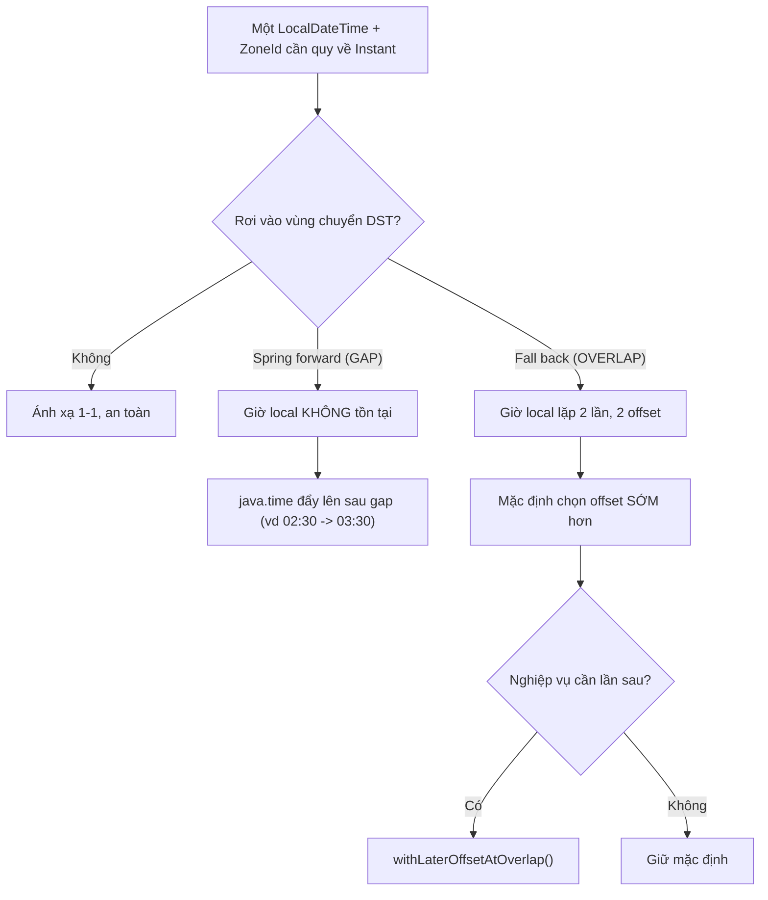

# Daylight Saving Time có thể gây bug gì?

## ⚡ Tóm tắt ngắn (30s)
* **Bản chất**: DST (giờ tiết kiệm ánh sáng ngày) làm cho **offset của một timezone thay đổi 2 lần/năm**, tạo ra hai hiện tượng nguy hiểm trên trục **giờ local**: **gap (spring forward)** — có những giờ local **không tồn tại** (ví dụ 02:00→03:00, nên 02:30 không có thật); và **overlap (fall back)** — có những giờ local **xảy ra hai lần** (01:30 lặp lại với hai offset khác nhau). Mọi code giả định "offset cố định" hoặc "1 ngày = 24 giờ" đều có thể vỡ.
* **Các bug điển hình**: lịch hẹn rơi vào giờ không tồn tại; job cron **chạy 2 lần hoặc bị bỏ qua** trong đêm DST; tính khoảng thời gian (`duration`) sai 1 giờ; cộng "+1 ngày" cho ra sai giờ; token/booking bị lệch 1h; báo cáo theo giờ có một giờ trùng hoặc thiếu.
* **Quyết định Senior**: **Lưu và tính toán trên `Instant`/UTC** (trục UTC không có DST, không có gap/overlap). Chỉ dùng giờ local + **IANA zone** (`Asia/Ho_Chi_Minh`, `America/New_York`) ở biên hiển thị, và để `java.time.ZonedDateTime` tự xử lý gap/overlap theo `ZoneRules` thay vì tự cộng/trừ offset bằng tay. Phân biệt rõ **`Duration` (giờ tuyệt đối)** với **`Period` (ngày theo lịch)**.

> Lưu ý: Việt Nam hiện **không áp dụng DST**, nhưng hệ thống phục vụ user/thị trường ở US, EU, Úc... thì chắc chắn gặp. Đây là lý do phải dùng IANA zone chứ không phải `+07:00`.

---

## 🔍 Chi tiết bản chất thực chiến: Gap, Overlap và các phép tính vỡ

### 1. Spring forward — Gap (giờ local biến mất)
Khi đồng hồ nhảy `02:00 → 03:00`, dải `[02:00, 03:00)` **không tồn tại** ở local. Nếu user đặt lịch lúc 02:30:
* `java.time` không ném lỗi — `ZonedDateTime.of(...)` sẽ **đẩy lên 03:30** (dịch theo độ dài gap). Cần biết hành vi này để không ngạc nhiên.
* Bug thật: nếu bạn tự ghép `LocalDateTime + fixed offset` thì có thể tạo ra một instant **không hợp lệ** hoặc lệch 1h.

### 2. Fall back — Overlap (giờ local lặp lại)
Khi đồng hồ lùi `02:00 → 01:00`, dải `[01:00, 02:00)` **xảy ra hai lần** với hai offset (ví dụ `-04:00` rồi `-05:00`). `01:30` là **mơ hồ**:
* `ZonedDateTime` mặc định chọn **offset sớm hơn** (lần xuất hiện đầu). Nếu nghiệp vụ cần lần sau, phải `withLaterOffsetAtOverlap()`.
* Bug thật: cron `@Scheduled` theo giờ local chạy **2 lần** trong giờ lặp; hoặc một deadline 01:30 trở nên không xác định là lần nào.

### 3. Duration vs Period — "1 ngày" không phải lúc nào cũng 24 giờ
Đây là cạm bẫy tinh vi nhất:
* `instant.plus(Duration.ofHours(24))` → cộng **đúng 24 giờ vật lý** trên trục UTC.
* `zonedDateTime.plus(Period.ofDays(1))` → giữ **nguyên giờ trên đồng hồ tường** (wall-clock) sang hôm sau. Vào ngày DST, "1 ngày" này có thể là **23 hoặc 25 giờ thật**.
* Dùng nhầm hai khái niệm này khiến hẹn giờ, gia hạn subscription, tính phí theo ngày bị lệch đúng 1 giờ vào ngày chuyển DST.

### 4. Vì sao fixed offset là sai gốc rễ
Lưu `+07:00`/`-05:00` cho sự kiện tương lai bỏ qua việc offset **sẽ đổi** khi DST tới. Chỉ IANA zone chứa **lịch sử + luật tương lai** của các lần đổi giờ, nên mới tính đúng offset tại từng thời điểm cụ thể.

---

## 🎨 Sơ đồ trực quan: Gap và Overlap trên trục giờ local

Sơ đồ minh họa hai vùng nguy hiểm khi offset thay đổi và cách xử lý đúng:



---

## 💻 Code thực chiến: BAD vs GOOD

Hai đoạn dưới tương phản giả định "offset cố định / 24h" với cách dùng `java.time` đúng:

### ❌ BAD: Tự cộng offset và giả định 1 ngày = 24h
```java
// ❌ Giả định offset cố định -> sai vào ngày đổi DST
ZoneOffset fixed = ZoneOffset.ofHours(-5);          // ❌ New York đâu phải luôn -5
OffsetDateTime appt = local.atOffset(fixed);

// ❌ Gia hạn "1 ngày" bằng cách cộng 24 giờ cứng
Instant nextRenewal = renewal.plus(Duration.ofHours(24)); // ❌ lệch 1h vào ngày DST
// ❌ Cron theo giờ local có thể chạy 2 lần / bị skip trong đêm DST (xem q4)
```

### ✅ GOOD: Dùng ZonedDateTime + IANA zone, phân biệt Duration/Period
```java
ZoneId ny = ZoneId.of("America/New_York");          // ✅ IANA zone, chứa luật DST

// ✅ Để java.time tự xử lý gap/overlap theo ZoneRules
ZonedDateTime appt = LocalDateTime.of(2026, 3, 8, 2, 30)
        .atZone(ny);                                // gap -> tự đẩy lên 03:30 hợp lệ

// ✅ "Cộng 1 ngày theo lịch" giữ nguyên giờ tường, dù ngày đó 23h hay 25h thật
ZonedDateTime nextDayLocal = appt.plus(Period.ofDays(1));

// ✅ "Đúng 24 giờ vật lý" thì làm trên trục Instant
Instant exact24h = appt.toInstant().plus(Duration.ofHours(24));

// ✅ Phát hiện và xử lý overlap tường minh nếu nghiệp vụ yêu cầu
ZoneRules rules = ny.getRules();
LocalDateTime amb = LocalDateTime.of(2026, 11, 1, 1, 30);
if (!rules.getValidOffsets(amb).isEmpty() && rules.getValidOffsets(amb).size() > 1) {
    ZonedDateTime later = amb.atZone(ny).withLaterOffsetAtOverlap(); // ✅ chọn lần sau
}
```

---

## 📊 Bảng so sánh: hành vi tại Gap vs Overlap và cách lưu trữ

Bảng dưới tổng hợp hai hiện tượng DST và lựa chọn lưu trữ tương ứng:

| Tiêu chí | Spring forward (Gap) | Fall back (Overlap) |
| :--- | :--- | :--- |
| **Hiện tượng giờ local** | Một dải giờ **biến mất** | Một dải giờ **lặp 2 lần** |
| **Số instant ánh xạ** | 0 (không tồn tại) | 2 (mơ hồ) |
| **Mặc định `java.time`** | Đẩy lên sau gap | Chọn offset **sớm hơn** |
| **Rủi ro cron** | Job bị **bỏ qua** | Job chạy **2 lần** |
| **Nên lưu** | `Instant`/UTC | `Instant`/UTC |
| **Future event nghiệp vụ** | Local + IANA zone | Local + IANA zone |

---

## ⚠️ Common Gotchas & Questions follow-up

### 1. Cạm bẫy "test không bao giờ rơi vào ngày DST"
* DST chỉ xảy ra 2 ngày/năm cho mỗi zone, nên unit test ngẫu nhiên gần như **không bao giờ** chạm vào gap/overlap → bug ngủ yên tới đúng đêm chuyển giờ rồi bùng. Phải viết test **chủ đích** với các ngày DST đã biết (ví dụ `2026-03-08` cho US, `2026-10-25` cho EU) và inject `Clock` cố định vào các thời điểm đó.

### 2. Cạm bẫy "dùng `Duration` để cộng ngày lịch"
* `plus(Duration.ofDays(1))` trong `java.time` thực chất là **cộng đúng 24 giờ** (Duration đo theo giây), khác với `Period.ofDays(1)` (cộng theo lịch). Vào ngày DST, hai cái cho kết quả lệch 1h. Quy tắc: cần "đúng N giờ/phút" → `Duration`; cần "cùng giờ tường ngày mai/tháng sau" → `Period`.

### 3. Cạm bẫy "giả định nửa đêm luôn tồn tại"
* Vài zone từng đặt mốc chuyển DST **đúng lúc nửa đêm** (ví dụ một số năm ở Brazil), khiến `00:00` rơi vào **gap** và `LocalDate.atStartOfDay(zone)` trả về **01:00 chứ không phải 00:00**. Code tính "đầu ngày" bằng cách hard-code `LocalTime.MIDNIGHT` rồi tự ghép offset sẽ sai. Luôn để `atStartOfDay(zone)` cho `java.time` trả về **thời điểm hợp lệ đầu tiên** của ngày thay vì giả định nửa đêm luôn tồn tại.

### 4. Câu hỏi đào sâu từ interviewer
* **Interviewer: "Một báo cáo thống kê theo từng giờ phát hiện ngày nọ có một giờ bị trùng dữ liệu (double count), một ngày khác lại thiếu một giờ. Nguyên nhân?"**
* **Trả lời**: Đây gần như chắc chắn là tác động của DST khi report **gom theo giờ local** thay vì giờ UTC. Vào ngày **fall back**, giờ `01:00–02:00 local` xảy ra **hai lần** nên dữ liệu của hai khoảng vật lý khác nhau bị gộp vào cùng một "bucket giờ local" → double count. Vào ngày **spring forward**, giờ `02:00–03:00 local` **không tồn tại** nên bucket đó rỗng → thiếu một giờ. Cách khắc phục đúng là **gom (bucketize) theo trục UTC/Instant** — vốn liên tục và không có gap/overlap — rồi chỉ **gắn nhãn hiển thị** sang giờ local khi render. Nếu bắt buộc báo cáo theo giờ local, phải xử lý đặc biệt hai ngày DST: tách hai lần xuất hiện của giờ lặp bằng offset, và chấp nhận bucket rỗng ở giờ gap. Gốc rễ vẫn là: **tính toán trên Instant, local chỉ là nhãn trình bày**.
