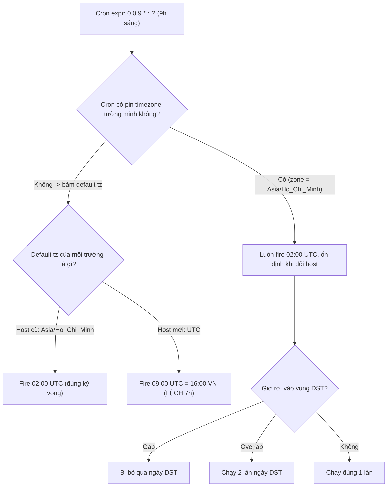

# Cron chạy sai giờ sau khi đổi timezone. Vì sao?

## ⚡ Tóm tắt ngắn (30s)
* **Bản chất**: Một biểu thức cron như `0 0 9 * * ?` **không mang nghĩa tuyệt đối** — nó là "9 giờ **theo một timezone nào đó**". Khi timezone tham chiếu của scheduler thay đổi (đổi base image OS, đổi `TZ` env, đổi JVM default tz, hoặc đổi host từ giờ VN sang UTC), **cùng một biểu thức sẽ kích hoạt ở một thời điểm UTC khác** → job "9h sáng" bỗng chạy lúc 2h sáng (lệch đúng bằng offset cũ).
* **Các nguyên nhân thường gặp**: (1) cron không **pin timezone tường minh** nên bám vào default tz; (2) OS/container đổi `/etc/localtime` hoặc biến `TZ`; (3) DST làm giờ local dịch nên cron theo giờ local bị **chạy 2 lần hoặc bị bỏ qua**; (4) trộn lẫn nhiều scheduler với tz mặc định khác nhau.
* **Quyết định Senior**: **Pin timezone cho mọi cron một cách tường minh**. Với job hạ tầng → chạy theo **UTC** cho bất biến. Với job nghiệp vụ "phải đúng 9h sáng giờ địa phương" → khai báo **IANA zone tường minh** (`@Scheduled(cron, zone="Asia/Ho_Chi_Minh")` hoặc `spec.timeZone` của Kubernetes CronJob), tuyệt đối không dựa vào default tz của máy.

---

## 🔍 Chi tiết bản chất thực chiến: Cron luôn cần một "neo timezone"

### 1. Cron expression không có timezone bên trong nó
`0 0 9 * * ?` chỉ nói "phút 0, giờ 9". Câu hỏi sống còn là **9h theo tz nào**. Mỗi tầng có một câu trả lời mặc định khác nhau:
* **Linux `crond`**: theo timezone của hệ thống (`/etc/localtime`, biến `TZ`).
* **Spring `@Scheduled`**: mặc định theo **JVM default tz** trừ khi khai báo `zone`.
* **Quartz**: theo `TimeZone` của `CronTrigger`, mặc định là default tz của JVM.
* **Kubernetes CronJob**: từ k8s 1.27 có `spec.timeZone`; nếu không set thì theo tz của kube-controller-manager.

Khi **bất kỳ** mặc định nào đổi, thời điểm UTC thực thi đổi theo.

### 2. Tại sao "đổi tz" làm lệch giờ
Giả sử trước đây host chạy `Asia/Ho_Chi_Minh` (UTC+7), cron `9:00` nghĩa là **02:00 UTC**. Sau khi migrate sang container base image dùng **UTC**, cùng biểu thức `9:00` giờ nghĩa là **09:00 UTC = 16:00 giờ VN**. Job "gửi báo cáo sáng" bỗng chạy buổi chiều. Lệch **đúng bằng offset cũ (7h)** là dấu hiệu kinh điển của bug này.

### 3. DST làm cron theo giờ local trở nên bất định
Nếu cron neo vào một zone có DST và đặt giờ rơi vào vùng chuyển:
* **Spring forward (gap)**: job đặt 02:30 → giờ đó **không tồn tại** → job **bị bỏ qua** ngày hôm đó.
* **Fall back (overlap)**: giờ 01:30 **lặp 2 lần** → job có thể **chạy 2 lần**. Nguy hiểm với job không idempotent (gửi tiền, gửi email hàng loạt).

### 4. Vì sao nên tách "cron hạ tầng" và "cron nghiệp vụ"
* **Hạ tầng** (cleanup, backup, healthcheck): không quan tâm giờ địa phương → **chạy theo UTC** để bất biến, không bao giờ dính DST.
* **Nghiệp vụ** ("chốt sổ cuối ngày VN", "gửi nhắc 9h sáng giờ user"): **bắt buộc** neo IANA zone tường minh để đúng theo cảm nhận của con người, chấp nhận xử lý DST.

---

## 🎨 Sơ đồ trực quan: Vì sao cùng cron lại lệch giờ sau khi đổi tz

Sơ đồ truy nguyên thời điểm thực thi thực tế của cron qua từng nguồn timezone:



---

## 💻 Code thực chiến: BAD vs GOOD

Hai đoạn dưới tương phản cron bám default tz với cron pin zone tường minh:

### ❌ BAD: Không khai báo zone, phụ thuộc default tz
```java
@Component
public class ReportJob {
    // ❌ Không có zone -> bám JVM default tz; đổi base image/host là lệch giờ
    @Scheduled(cron = "0 0 9 * * *")
    public void sendMorningReport() { ... }
}
```
```yaml
# ❌ Kubernetes CronJob không set timeZone -> theo tz của controller, dễ lệch
apiVersion: batch/v1
kind: CronJob
metadata: { name: morning-report }
spec:
  schedule: "0 9 * * *"   # ❌ 9h theo tz nào? Không ai biết chắc
```

### ✅ GOOD: Pin timezone tường minh cho cả app và infra
```java
@Component
public class ReportJob {
    // ✅ Cron nghiệp vụ: neo IANA zone -> luôn 9h sáng giờ VN dù host chạy tz nào
    @Scheduled(cron = "0 0 9 * * *", zone = "Asia/Ho_Chi_Minh")
    public void sendMorningReport() { ... }

    // ✅ Cron hạ tầng: chạy theo UTC cho bất biến, miễn nhiễm DST
    @Scheduled(cron = "0 0 18 * * *", zone = "UTC")
    public void nightlyCleanup() { ... }
}
```
```yaml
# ✅ Kubernetes 1.27+: khai báo spec.timeZone tường minh
apiVersion: batch/v1
kind: CronJob
metadata: { name: morning-report }
spec:
  schedule: "0 9 * * *"
  timeZone: "Asia/Ho_Chi_Minh"   # ✅ rõ ràng, không phụ thuộc node
  jobTemplate: { ... }
```

Phòng thủ thêm: **chuẩn hóa JVM/container về UTC** rồi neo zone ở tầng app:
```dockerfile
ENV TZ=UTC                      # ✅ container chạy UTC, app tự quyết zone nghiệp vụ
```

---

## 📊 Bảng so sánh: nơi cron lấy timezone và rủi ro khi đổi môi trường

Bảng dưới đối chiếu các scheduler theo nguồn timezone và độ ổn định:

| Scheduler | Lấy tz mặc định từ đâu | Cách pin tường minh | Rủi ro nếu không pin |
| :--- | :--- | :--- | :--- |
| **Linux crond** | `/etc/localtime`, `TZ` | Set `TZ` trong crontab/unit | Đổi OS image → lệch |
| **Spring `@Scheduled`** | JVM default tz | thuộc tính `zone="..."` | Đổi `user.timezone` → lệch |
| **Quartz** | JVM default tz | `CronTrigger` + `TimeZone` | Đổi node → lệch / DST chạy 2 lần |
| **K8s CronJob** | controller tz | `spec.timeZone` (1.27+) | Đổi cluster → lệch |

---

## ⚠️ Common Gotchas & Questions follow-up

### 1. Cạm bẫy "đổi base image làm lệch toàn bộ cron"
* Nhiều image cũ mặc định chứa tz địa phương; image slim/distroless mới thường là **UTC**. Một lần nâng cấp base image vô tình dịch **tất cả** cron không pin zone đi vài giờ, mà CI vẫn xanh vì test không kiểm tra thời điểm thực thi. Cách phòng: **luôn pin zone tường minh** và viết test kiểm tra `CronExpression.next(...)` ra đúng thời điểm UTC mong đợi.

### 2. Cạm bẫy "job không idempotent gặp overlap DST"
* Cron nghiệp vụ theo giờ local có thể **chạy 2 lần** trong giờ lặp của fall-back. Nếu job gửi tiền/email mà không idempotent → trả 2 lần, gửi trùng. Luôn thiết kế job **idempotent** (khóa theo business date, dedup key) để an toàn cả khi bị kích hoạt 2 lần.

### 3. Câu hỏi đào sâu từ interviewer
* **Interviewer: "Job chốt doanh thu cuối ngày phải chạy đúng nửa đêm giờ Việt Nam. Bạn cấu hình cron theo UTC hay theo Asia/Ho_Chi_Minh? Vì sao?"**
* **Trả lời**: Phụ thuộc bản chất job. Vì đây là **chốt sổ theo ngày nghiệp vụ VN**, mốc "nửa đêm" là khái niệm **local của thị trường**, nên tôi sẽ neo cron vào `Asia/Ho_Chi_Minh` để nó luôn khớp với 00:00 giờ VN bất kể host chạy tz nào — nếu hard-code `17:00 UTC` thì khi quốc gia đổi luật giờ (hoặc khi mở rộng sang thị trường có DST) sẽ phải sửa tay và dễ quên. Tuy nhiên, vì VN hiện không có DST nên `17:00 UTC` và `00:00 Asia/Ho_Chi_Minh` trùng nhau hôm nay; tôi vẫn chọn khai báo theo IANA zone để **diễn đạt đúng ý định nghiệp vụ** và an toàn trước thay đổi tương lai. Quan trọng không kém: bản thân logic chốt sổ phải **tự tính ranh giới ngày theo `ZoneId` trong code** (đầu/cuối ngày local → quy về Instant để query), để dù cron có lệch vì lý do nào thì job vẫn chốt đúng tập dữ liệu của ngày cần chốt, và phải **idempotent** để chạy lại an toàn.
