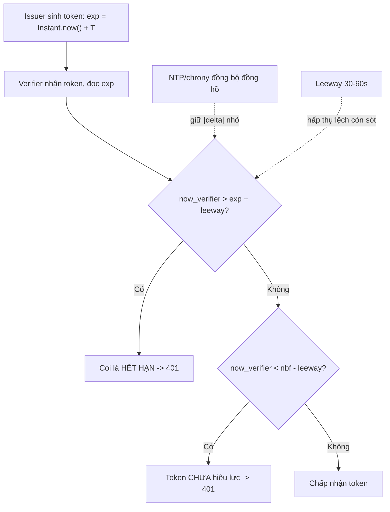

# Token expiration sai do clock lệch. Bạn xử lý ra sao?

## ⚡ Tóm tắt ngắn (30s)
* **Bản chất**: Trường `exp`/`iat`/`nbf` trong JWT là **NumericDate** — số **giây kể từ epoch UTC**, tức là một **thời điểm tuyệt đối, không có timezone**. Vì vậy bug "token hết hạn sai" hầu như **không phải lỗi timezone** mà là **clock skew**: đồng hồ của server **phát hành** và server **xác thực** lệch nhau. Nếu đồng hồ verifier **chạy nhanh** → token bị coi là hết hạn **sớm**; nếu **chạy chậm** → token đã hết hạn vẫn được **chấp nhận** (rủi ro bảo mật).
* **Hướng xử lý**: (1) **Đồng bộ đồng hồ bằng NTP/chrony** trên mọi node và **giám sát độ lệch**; (2) bật **leeway / clock skew tolerance** nhỏ (30–60s) khi verify để hấp thụ lệch tự nhiên; (3) luôn sinh `exp` từ **`Instant`/epoch seconds**, không bao giờ từ `LocalDateTime` (vốn không có zone).
* **Quyết định Senior**: Coi **đồng hồ là một dependency hạ tầng phải được giám sát**. Kết hợp **NTP (gốc rễ)** + **leeway hợp lý (giảm nhiễu)** + **token sống ngắn kèm refresh token** để cửa sổ rủi ro nhỏ. Không "nới hạn token" bừa để né bug — đó là che triệu chứng và mở lỗ hổng bảo mật.

---

## 🔍 Chi tiết bản chất thực chiến: Clock skew, không phải timezone

### 1. Vì sao timezone không liên quan, clock skew mới là thủ phạm
`exp = 1781000000` là một điểm trên trục UTC, giống nhau dù đọc ở Hà Nội hay New York. Verifier kiểm tra đơn giản: `now() >= exp` thì hết hạn. Cả hai vế đều quy về epoch UTC nên **timezone bị loại khỏi phương trình**. Cái có thể sai là **`now()` của verifier khác `now()` của issuer** vì hai đồng hồ vật lý lệch nhau.

### 2. Mô hình hóa độ lệch
Gọi $t_{issuer}$ và $t_{verifier}$ là đồng hồ hai server, độ lệch $\delta = t_{verifier} - t_{issuer}$.
* Token phát hành sống $T$ giây: $exp = t_{issuer} + T$.
* Verifier coi token còn hạn khi $t_{verifier} < exp$, tức $t_{issuer} + \delta < t_{issuer} + T \Rightarrow \delta < T$.
* Nếu $\delta > 0$ (verifier nhanh hơn) → **mất** $\delta$ giây tuổi thọ token. Với token sống ngắn (ví dụ $T = 60s$) mà $\delta = 90s$ thì **token chết ngay khi sinh ra**.
* Nếu $\delta < 0$ (verifier chậm) → token **sống lâu hơn** kỳ vọng, token đã thu hồi/hết hạn vẫn lọt.

### 3. Hai tầng phòng thủ: NTP (gốc) + leeway (đệm)
* **NTP/chrony**: giữ $|\delta|$ ở mức mili-giây tới vài chục mili-giây. Đây là **giải pháp gốc** — đồng hồ phải đúng.
* **Leeway** (còn gọi clock skew tolerance): khi verify, cho phép một biên độ nhỏ $\epsilon$ (30–60s): token coi là hết hạn khi $now > exp + \epsilon$, và `nbf` được nới `now >= nbf - \epsilon`. Leeway **hấp thụ lệch nhỏ còn sót**, nhưng **không thay thế NTP** và không nên đặt quá lớn (mở cửa sổ token chết vẫn dùng được).

### 4. `nbf` (not before) cũng dính skew
Nếu issuer đặt `nbf = now` và verifier **chạy chậm hơn issuer**, token vừa phát hành đã bị coi là "chưa hiệu lực" → lỗi `token not yet valid`. Đây là biến thể ngược của expiry, cũng được leeway xử lý.

### 5. Đừng sinh `exp` từ giờ local
Một lỗi code thật: tính `exp` bằng `LocalDateTime.now().plusMinutes(15)` rồi convert sai zone → ra một `exp` lệch đúng một offset. Luôn dùng `Instant.now(clock).plus(...)` rồi lấy `getEpochSecond()`.

---

## 🎨 Sơ đồ trực quan: Clock skew tác động tới hiệu lực token

Sơ đồ mô tả cách độ lệch đồng hồ và leeway quyết định token còn hạn hay không:



---

## 💻 Code thực chiến: BAD vs GOOD

Hai đoạn dưới tương phản cách sinh/verify token dễ vỡ vì clock với cách an toàn:

### ❌ BAD: Sinh exp từ giờ local, verify không leeway
```java
// ❌ LocalDateTime không có zone -> convert sai là lệch cả token
LocalDateTime exp = LocalDateTime.now().plusMinutes(15);
long expEpoch = exp.toEpochSecond(ZoneOffset.UTC); // ❌ giả định JVM đang ở UTC

String jwt = Jwts.builder()
    .setExpiration(Date.from(exp.atZone(ZoneId.systemDefault()).toInstant())) // ❌ default tz
    .signWith(key).compact();

// ❌ Verify không cho phép skew -> lệch vài giây cũng fail hàng loạt
Jwts.parserBuilder().setSigningKey(key).build().parseClaimsJws(jwt);
```

### ✅ GOOD: Instant + Clock inject + leeway + token ngắn
```java
private final Clock clock;                  // ✅ inject để test & nhất quán (xem q10)

public String issue(String sub) {
    Instant now = Instant.now(clock);       // ✅ thời điểm tuyệt đối, không dính tz
    return Jwts.builder()
        .setSubject(sub)
        .setIssuedAt(Date.from(now))
        .setNotBefore(Date.from(now))
        .setExpiration(Date.from(now.plus(Duration.ofMinutes(15)))) // ✅ token ngắn
        .signWith(key).compact();
}

public Jws<Claims> verify(String jwt) {
    return Jwts.parserBuilder()
        .setSigningKey(key)
        .setAllowedClockSkewSeconds(60)     // ✅ leeway hấp thụ lệch nhỏ
        .setClock(() -> Date.from(Instant.now(clock)))
        .build()
        .parseClaimsJws(jwt);               // ném ExpiredJwtException nếu quá exp + leeway
}
```

Giám sát skew như một SLO hạ tầng (ví dụ Prometheus + node_exporter):
```promql
# Cảnh báo khi lệch NTP vượt 250ms trên bất kỳ node nào
abs(node_timex_offset_seconds) > 0.25
```

---

## 📊 Bảng so sánh: hướng xử lý token sai giờ

Bảng dưới đối chiếu các cách tiếp cận theo gốc rễ và rủi ro:

| Hướng xử lý | Giải quyết gốc rễ? | Rủi ro bảo mật | Khi nào dùng |
| :--- | :--- | :--- | :--- |
| **Đồng bộ NTP/chrony** | ✅ Có (đồng hồ đúng) | Thấp | **Bắt buộc**, nền tảng |
| **Leeway 30–60s** | ⚠️ Đệm, không sửa gốc | Thấp nếu nhỏ | Hấp thụ lệch còn sót |
| **Token ngắn + refresh** | ✅ Giảm cửa sổ rủi ro | Thấp | Mặc định nên có |
| **Nới `exp` thật to** | ❌ Che triệu chứng | **Cao** (token sống dai) | Không nên |
| **Tắt kiểm tra exp** | ❌ Phá bảo mật | **Rất cao** | Không bao giờ |

---

## ⚠️ Common Gotchas & Questions follow-up

### 1. Cạm bẫy "nới hạn token để hết lỗi"
* Khi user phàn nàn "vừa đăng nhập đã bị đá ra", phản xạ sai là tăng `exp` từ 15 phút lên 24 giờ. Điều này **che bug clock skew** và **mở lỗ hổng**: token bị lộ sẽ dùng được rất lâu. Đúng ra phải sửa đồng hồ (NTP) và thêm leeway nhỏ, giữ token ngắn.

### 2. Cạm bẫy "leeway quá lớn"
* Đặt leeway hàng giờ để né một node lệch giờ nặng = vô hiệu hóa ý nghĩa của `exp`. Leeway chỉ nên cỡ vài chục giây để bù dao động NTP; nếu phải đặt lớn hơn, đó là dấu hiệu **đồng hồ đang hỏng** và phải sửa hạ tầng, không phải nới leeway.

### 3. Câu hỏi đào sâu từ interviewer
* **Interviewer: "Một số ít user bị 401 ngẫu nhiên ngay sau khi login, chỉ trên một vài pod. Bạn điều tra thế nào?"**
* **Trả lời**: Triệu chứng "ngẫu nhiên, chỉ vài pod" rất khớp với **clock skew cục bộ**: một số pod chạy trên node có đồng hồ lệch (NTP chết, VM bị pause/migrate làm trôi giờ). Token sống ngắn (vài phút) nên chỉ cần lệch vài chục giây cũng đủ khiến verifier coi token vừa cấp đã hết hạn hoặc `nbf` chưa tới. Tôi sẽ: (1) đo `node_timex_offset_seconds` trên các node nghi vấn để xác nhận lệch; (2) kiểm tra log verify xem là `ExpiredJwtException` hay `PrematureJwtException` (cái sau ám chỉ verifier chậm hơn issuer); (3) khắc phục gốc bằng cách sửa/khởi động lại NTP, đồng thời bật **leeway 30–60s** để hệ thống chịu được dao động nhỏ. Về lâu dài, tôi thêm **alert SLO cho clock offset** để bắt sự cố đồng hồ trước khi nó gây 401, và đảm bảo token được sinh từ `Instant.now(clock)` chứ không phải giờ local — vì bug này phải được chặn ở cả tầng hạ tầng lẫn tầng code.
