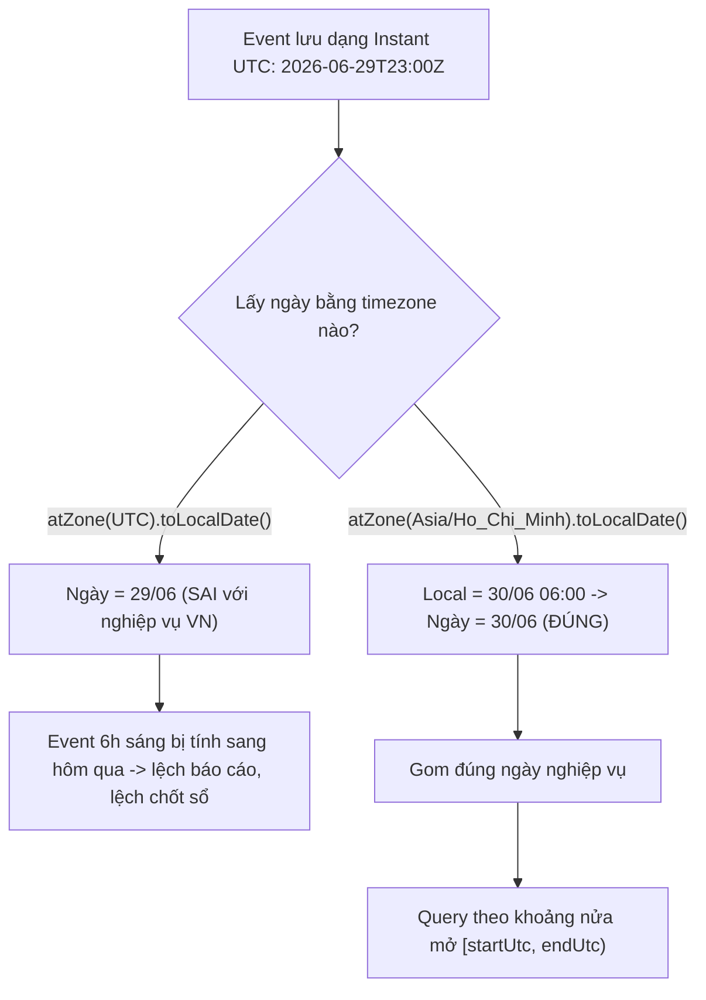

# Event xảy ra lúc cuối ngày bị tính sang ngày khác. Nguyên nhân?

## ⚡ Tóm tắt ngắn (30s)
* **Bản chất**: "Ngày của một sự kiện" là một khái niệm **local** (gắn với timezone nghiệp vụ), nhưng nếu bạn lấy `date` bằng cách **cắt (truncate) một `Instant` theo timezone sai** — thường là UTC thay vì tz nghiệp vụ — thì các sự kiện gần ranh giới ngày sẽ bị **rơi nhầm sang ngày kế bên**. Một event lúc `23:30` hay `00:30` giờ địa phương rất dễ thuộc về một **ngày UTC khác**, và ngược lại.
* **Nguyên nhân cốt lõi**: lấy ngày từ `instant.atZone(ZoneOffset.UTC).toLocalDate()` (hoặc dùng default tz) thay vì `instant.atZone(BIZ_ZONE).toLocalDate()`. Với VN (UTC+7), event lúc **06:00 sáng VN** thực ra là **23:00 UTC hôm trước** → nếu gom theo ngày UTC, nó bị tính sang **hôm qua**.
* **Quyết định Senior**: Lưu `Instant`/UTC, nhưng khi cần "ngày nghiệp vụ" thì **luôn quy chiếu theo IANA zone tường minh** của thị trường. Ranh giới ngày phải tính bằng `LocalDate.atStartOfDay(zone)` và dùng khoảng **nửa mở `[start, end)`**, không bao giờ suy ra ngày bằng cách cắt UTC.

---

## 🔍 Chi tiết bản chất thực chiến: "Ngày" là hàm của (Instant, ZoneId)

### 1. Cùng một Instant, hai timezone cho hai ngày khác nhau
Một instant không có "ngày" cố định — ngày của nó **phụ thuộc tz người nhìn**:
* `Instant = 2026-06-29T23:00:00Z` (UTC).
* Ở `UTC`: đó là **ngày 29/6**.
* Ở `Asia/Ho_Chi_Minh` (UTC+7): đó là `2026-06-30T06:00` → **ngày 30/6**.
Cùng một thời điểm, hai nhãn ngày. Nếu code lưu UTC nhưng nghiệp vụ nghĩ theo giờ VN, mọi event trong khung **00:00–07:00 giờ VN** (tức `17:00–24:00 UTC hôm trước`) sẽ bị **lệch ngày** nếu gom theo UTC.

### 2. Vì sao "cuối ngày / đầu ngày" là vùng nguy hiểm
Lỗi chỉ lộ ở **rìa ngày**: event lúc 14:00 giữa trưa thì UTC và local thường cùng ngày, nên test giữa ngày luôn pass. Nhưng event lúc 23:30 hay 00:30 nằm sát ranh giới → một offset nhỏ cũng đẩy nó qua ngày khác. Đây là lý do bug "ẩn" rất lâu rồi bùng vào đúng các đơn hàng/giao dịch cuối ngày.

### 3. Cách lấy "ngày nghiệp vụ" đúng
Quy ước: **ngày của event = `event.atZone(BIZ_ZONE).toLocalDate()`**. Và khi truy vấn "tất cả event của ngày D":
* `start = D.atStartOfDay(BIZ_ZONE).toInstant()`
* `end = D.plusDays(1).atStartOfDay(BIZ_ZONE).toInstant()`
* `WHERE event_at >= start AND event_at < end` (**nửa mở**).
Khoảng nửa mở `[start, end)` tránh được hai lỗi kinh điển: dùng `BETWEEN ... AND end-of-day 23:59:59` sẽ **sót** các event trong mili-giây cuối, còn dùng `<=` cả hai đầu sẽ **đếm trùng** event đúng nửa đêm.

### 4. DST làm "đầu ngày" không phải lúc nào cũng 00:00
Ở zone có DST, ngày spring-forward bắt đầu lúc 00:00 nhưng "mất" 1 giờ; `atStartOfDay(zone)` xử lý đúng việc này. Nếu tự ghép `LocalDate + LocalTime.MIDNIGHT + fixed offset` thì sẽ sai vào ngày DST. Luôn để `java.time` tính start-of-day theo zone.

---

## 🎨 Sơ đồ trực quan: Vì sao event rìa ngày bị lệch sang ngày khác

Sơ đồ minh họa việc gán nhãn ngày phụ thuộc timezone quy chiếu:



---

## 💻 Code thực chiến: BAD vs GOOD

Hai đoạn dưới tương phản việc cắt ngày theo UTC với việc quy chiếu theo zone nghiệp vụ:

### ❌ BAD: Lấy ngày bằng cách cắt UTC / default tz
```java
// ❌ Cắt Instant theo UTC -> event 6h sáng VN bị gán nhầm sang hôm trước
LocalDate eventDay = event.getOccurredAt()
        .atZone(ZoneOffset.UTC)       // ❌ sai timezone quy chiếu
        .toLocalDate();

// ❌ Ranh giới ngày dùng 23:59:59 -> sót event trong mili-giây cuối ngày
LocalDateTime start = day.atTime(0, 0, 0);
LocalDateTime end   = day.atTime(23, 59, 59);   // ❌ bỏ sót [23:59:59.001, 24:00)
List<Event> rows = repo.findBetween(start, end); // ❌ còn so sánh naive với cột UTC
```

### ✅ GOOD: Quy chiếu IANA zone nghiệp vụ + khoảng nửa mở
```java
private static final ZoneId BIZ_ZONE = ZoneId.of("Asia/Ho_Chi_Minh");

// ✅ "Ngày nghiệp vụ" của một event = quy về tz thị trường rồi lấy LocalDate
public LocalDate businessDate(Instant occurredAt) {
    return occurredAt.atZone(BIZ_ZONE).toLocalDate();
}

// ✅ Truy vấn theo ngày D, ranh giới tính theo zone, khoảng nửa mở [start, end)
public List<Event> eventsOfDay(LocalDate d) {
    Instant start = d.atStartOfDay(BIZ_ZONE).toInstant();          // 00:00 local -> UTC
    Instant end   = d.plusDays(1).atStartOfDay(BIZ_ZONE).toInstant(); // 00:00 hôm sau
    return repo.findByOccurredAtBetween(start, end);               // >= start AND < end
}
```
```sql
-- ✅ SQL tương ứng: nửa mở, so sánh trên cột UTC (TIMESTAMPTZ)
SELECT * FROM events
WHERE occurred_at >= :startUtc
  AND occurred_at <  :endUtc;   -- KHÔNG dùng BETWEEN ... 23:59:59
```

---

## 📊 Bảng so sánh: cách xác định "ngày" của event

Bảng dưới đối chiếu các cách lấy ngày và hệ quả ở rìa ngày:

| Cách lấy ngày | Kết quả ở rìa ngày | Đúng cho nghiệp vụ? |
| :--- | :--- | :--- |
| Cắt theo **UTC** | Lệch event sáng sớm/đêm khuya | ❌ Sai nếu nghiệp vụ là local |
| Cắt theo **JVM default tz** | Phụ thuộc môi trường, bất định | ❌ Không ổn định |
| Cắt theo **fixed offset** (`+07:00`) | Sai vào ngày DST của zone | ⚠️ Chỉ tạm đúng nơi không DST |
| Cắt theo **IANA zone nghiệp vụ** | Đúng ranh giới, xử lý DST | ✅ Chuẩn |
| Khoảng **`BETWEEN ... 23:59:59`** | Sót mili-giây cuối ngày | ❌ Dùng nửa mở thay thế |

---

## ⚠️ Common Gotchas & Questions follow-up

### 1. Cạm bẫy "lưu sẵn cột `event_date` cắt theo UTC"
* Nhiều schema thêm cột `event_date DATE` được tính sẵn bằng `CAST(occurred_at AS DATE)` ở UTC để query nhanh. Cột này **đóng băng cái sai**: mọi event rìa ngày bị gán nhầm và không sửa được trừ khi backfill. Nếu cần cột ngày phục vụ index, hãy tính nó theo **zone nghiệp vụ** (`(occurred_at AT TIME ZONE 'Asia/Ho_Chi_Minh')::date` trong Postgres) và ghi rõ quy ước.

### 2. Cạm bẫy "client gửi lên `date` mà không gửi instant"
* Nếu mobile gửi `"2026-06-30"` (chỉ ngày, không giờ/zone) cho event, server không thể biết đó là ngày theo tz nào. Luôn yêu cầu client gửi **instant đầy đủ có offset** (`2026-06-29T23:00:00Z` hoặc `...+07:00`), rồi server tự suy ra ngày nghiệp vụ. "Ngày trần" là dữ liệu mất thông tin.

### 3. Cạm bẫy "coi 'hôm nay' là khái niệm toàn cục"
* Chênh lệch offset giữa hai zone có thể **vượt 24 giờ** (từ `Pacific/Kiritimati` UTC+14 tới `Etc/GMT+12` UTC−12). Tại **cùng một instant**, user bên này đã sang ngày mai trong khi user bên kia vẫn là hôm qua → "hôm nay" **không tồn tại như một giá trị chung**. Mọi truy vấn "trong ngày hôm nay" buộc phải gắn một `ZoneId` cụ thể; nếu không, hai user sẽ nhận hai tập kết quả khác nhau mà **cả hai đều đúng** theo tz của họ.

### 4. Câu hỏi đào sâu từ interviewer
* **Interviewer: "Khách đặt đơn lúc 6h sáng giờ Việt Nam nhưng report ghi nhận vào 'hôm qua'. Bạn giải thích và sửa thế nào?"**
* **Trả lời**: Nguyên nhân là report đang **suy ra ngày bằng cách cắt timestamp theo UTC** thay vì theo giờ VN. 06:00 sáng giờ VN (UTC+7) tương ứng `23:00 UTC của ngày hôm trước`, nên khi gom theo ngày UTC, đơn này rơi vào "hôm qua" — lệch đúng vùng `00:00–07:00` sáng. Để sửa, tôi giữ nguyên cách **lưu Instant/UTC** (không đụng dữ liệu gốc), nhưng ở tầng report thay đổi cách phân ngày: quy mỗi instant về `Asia/Ho_Chi_Minh` rồi mới lấy `LocalDate`, và truy vấn theo khoảng **nửa mở `[startOfDay(zone), startOfNextDay(zone))`** đã đổi sang UTC. Nếu hệ thống đang dùng cột `event_date` tính sẵn theo UTC, tôi sẽ backfill lại cột đó theo zone nghiệp vụ. Bài học cốt lõi tôi sẽ nêu: **"ngày" không phải thuộc tính của instant mà là kết quả của (instant + timezone)** — nên timezone quy chiếu phải là tham số tường minh của nghiệp vụ, không để mặc định rơi vào UTC hay tz của máy chủ.
