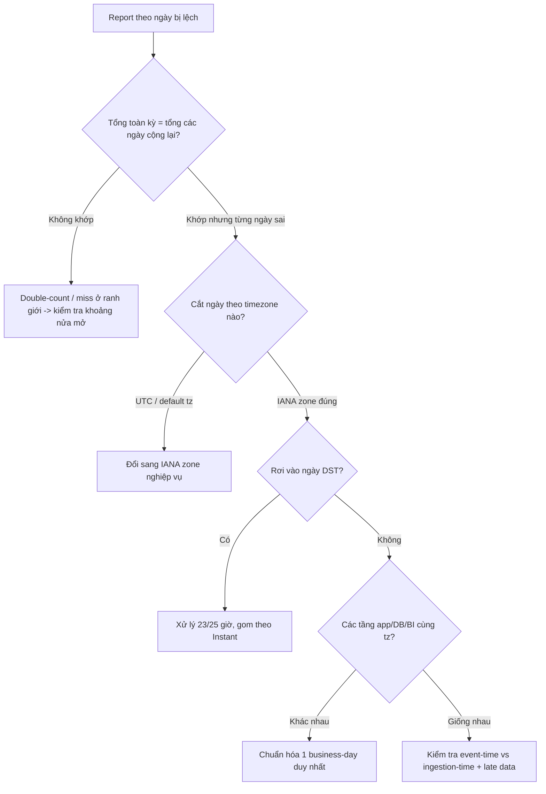

# Report theo ngày bị lệch dữ liệu. Bạn kiểm tra gì?

## ⚡ Tóm tắt ngắn (30s)
* **Bản chất**: Report theo ngày lệch gần như luôn là lỗi ở khâu **gom dữ liệu vào "bucket ngày"** (date bucketing): hoặc dùng **sai timezone quy chiếu** (UTC thay vì tz nghiệp vụ), hoặc **ranh giới ngày sai** (đếm trùng/sót ở nửa đêm), hoặc **DST** làm một ngày có 23/25 giờ, hoặc **các service/DB dùng tz khác nhau** nên cùng một event bị xếp vào hai ngày khác nhau.
* **Cần kiểm tra (checklist)**: (1) timezone dùng để cắt ngày ở **mỗi tầng** (app, DB session, BI tool); (2) ranh giới là **nửa mở `[start, end)`** hay đóng (gây off-by-one/đếm trùng); (3) event rìa ngày (`00:00–07:00` giờ VN) có bị lệch UTC không; (4) ngày **DST**; (5) **event-time vs ingestion-time** (dữ liệu tới muộn); (6) bộ lọc chạy ở **app hay DB** với tz nào.
* **Quyết định Senior**: Định nghĩa **một "business day" chuẩn duy nhất** (theo IANA zone của thị trường) và áp dụng **nhất quán** từ DB → service → BI. Luôn kiểm chứng bằng **invariant đối soát**: `tổng toàn kỳ` phải bằng `tổng các ngày cộng lại` — nếu lệch là có double-count/miss ở ranh giới.

---

## 🔍 Chi tiết bản chất thực chiến: Sáu nghi can của report lệch

### 1. Sai timezone quy chiếu khi cắt ngày
Nghi can số một (xem chi tiết ở q6): report cắt `Instant` theo **UTC** trong khi nghiệp vụ tính theo `Asia/Ho_Chi_Minh`. Hệ quả: mọi giao dịch khung `00:00–07:00` giờ VN bị đẩy sang ngày hôm trước. Cách kiểm tra nhanh: lấy vài bản ghi sát nửa đêm, in cả `occurred_at` (UTC) lẫn `occurred_at AT TIME ZONE 'Asia/Ho_Chi_Minh'` và xem chúng rơi vào ngày nào.

### 2. Ranh giới ngày đóng/mở sai
* `BETWEEN start AND '2026-06-30 23:59:59'` **sót** các bản ghi trong khoảng `23:59:59.001–24:00:00`.
* Dùng `<=` ở cả hai đầu của hai ngày liên tiếp → bản ghi đúng **00:00:00** bị đếm vào **cả hai** ngày.
* Chuẩn: **`>= start AND < startOfNextDay`** (nửa mở). Đây là lỗi off-by-one phổ biến nhất.

### 3. Ngày DST có 23 hoặc 25 giờ
Nếu report theo giờ/ngày trên zone có DST: ngày spring-forward thiếu 1 giờ (bucket rỗng), ngày fall-back thừa 1 giờ (double-count) — y như đã phân tích ở q3. Kiểm tra: report có rơi vào ngày chuyển DST của zone không.

### 4. Các tầng dùng timezone khác nhau
Bug âm thầm nhất: **app lọc theo tz A, DB `date_trunc` theo tz B, BI tool hiển thị theo tz C**. Mỗi nơi tự gom một kiểu → số liệu "đúng" ở từng chỗ nhưng **không khớp nhau**. Phải kiểm tra **DB session timezone** (`SHOW timezone` ở Postgres), tham số tz của `date_trunc`/`AT TIME ZONE`, và cấu hình tz của công cụ BI.

### 5. Event-time vs Ingestion-time
"Doanh thu ngày 29" nên tính theo **lúc giao dịch xảy ra (event-time)** hay **lúc bản ghi được nạp (ingestion-time)**? Dữ liệu tới muộn (late-arriving) khiến report chạy lúc 00:05 thiếu các bản ghi của ngày hôm trước chưa kịp về. Kiểm tra: report đang gom theo cột thời gian nào, và có chờ đủ "watermark" trước khi chốt không.

### 6. Filter ở app hay ở DB
Nếu app tải data rồi lọc bằng `LocalDate` (default tz) trong khi DB lưu UTC, ranh giới sẽ lệch so với khi để DB lọc bằng `AT TIME ZONE`. Thống nhất **một nơi gom ngày**, lý tưởng là ở DB với tz tường minh.

---

## 🎨 Sơ đồ trực quan: Quy trình truy lệch của report theo ngày

Sơ đồ mô tả thứ tự kiểm tra để khoanh vùng nguyên nhân report lệch:



---

## 💻 Code thực chiến: BAD vs GOOD

Hai đoạn dưới tương phản truy vấn report dễ lệch với truy vấn chuẩn hóa theo zone:

### ❌ BAD: Cắt ngày theo UTC, ranh giới đóng, tz ngầm
```sql
-- ❌ date_trunc theo UTC (mặc định session) -> lệch ngày với nghiệp vụ VN
SELECT date_trunc('day', occurred_at) AS d, SUM(amount)
FROM transactions
-- ❌ BETWEEN ... 23:59:59 sót mili-giây cuối ngày
WHERE occurred_at BETWEEN '2026-06-01 00:00:00' AND '2026-06-30 23:59:59'
GROUP BY 1 ORDER BY 1;
```

### ✅ GOOD: Gom theo IANA zone nghiệp vụ, khoảng nửa mở
```sql
-- ✅ Quy về giờ VN trước khi cắt ngày -> bucket đúng nghiệp vụ
SELECT (occurred_at AT TIME ZONE 'Asia/Ho_Chi_Minh')::date AS biz_day,
       SUM(amount) AS revenue
FROM transactions
WHERE occurred_at >= '2026-05-31 17:00:00+00'   -- 2026-06-01 00:00 giờ VN
  AND occurred_at <  '2026-06-30 17:00:00+00'   -- nửa mở, = 2026-06-30 00:00 VN
GROUP BY 1 ORDER BY 1;
```
```java
// ✅ Nếu gom ở tầng Java: zone tường minh + nửa mở, không default tz
private static final ZoneId BIZ = ZoneId.of("Asia/Ho_Chi_Minh");

Map<LocalDate, BigDecimal> revenueByDay(List<Transaction> txs) {
    return txs.stream().collect(Collectors.groupingBy(
        t -> t.getOccurredAt().atZone(BIZ).toLocalDate(),   // ✅ ngày theo zone nghiệp vụ
        Collectors.reducing(BigDecimal.ZERO, Transaction::getAmount, BigDecimal::add)));
}
```
```java
// ✅ Invariant đối soát: tổng toàn kỳ phải bằng tổng các ngày
BigDecimal whole = txs.stream().map(Transaction::getAmount).reduce(BigDecimal.ZERO, BigDecimal::add);
BigDecimal sumOfDays = revenueByDay(txs).values().stream().reduce(BigDecimal.ZERO, BigDecimal::add);
assert whole.compareTo(sumOfDays) == 0 : "Có double-count/miss ở ranh giới ngày";
```

---

## 📊 Bảng so sánh: các nghi can gây report lệch và cách phát hiện

Bảng dưới tổng hợp checklist điều tra theo dấu hiệu:

| Nghi can | Dấu hiệu nhận biết | Cách kiểm tra nhanh |
| :--- | :--- | :--- |
| **Sai tz quy chiếu** | Lệch event sáng sớm/khuya | So `::date` ở UTC vs ở IANA zone |
| **Ranh giới đóng/mở** | Tổng kỳ ≠ tổng các ngày | Đổi sang nửa mở `[start, end)` |
| **DST** | Một ngày thiếu/thừa 1 giờ | Xem có rơi vào ngày chuyển DST |
| **Đa tz giữa các tầng** | Mỗi tool ra số khác | `SHOW timezone`, tham số `date_trunc` |
| **Event vs ingestion** | Thiếu data ngày gần nhất | Đối chiếu cột thời gian dùng để gom |
| **Filter app vs DB** | Khác khi đổi nơi lọc | Thống nhất gom ở DB với tz tường minh |

---

## ⚠️ Common Gotchas & Questions follow-up

### 1. Cạm bẫy "DB session timezone ngầm định"
* Postgres `date_trunc('day', ts)` và `ts::date` phụ thuộc tham số `timezone` của session. Nếu một báo cáo chạy qua connection có `timezone=UTC`, báo cáo khác qua connection `timezone=Asia/Ho_Chi_Minh`, hai bên ra số khác nhau dù cùng SQL. Luôn dùng `AT TIME ZONE 'Asia/Ho_Chi_Minh'` **tường minh** thay vì dựa vào session, để kết quả không đổi theo cấu hình kết nối.

### 2. Cạm bẫy "so sánh report với dashboard real-time"
* Dashboard real-time thường hiển thị theo tz browser của người xem, còn report batch gom theo tz nghiệp vụ → hai con số "hôm nay" lệch nhau là **bình thường** chứ không phải bug, nếu hai bên định nghĩa "ngày" khác nhau. Trước khi điều tra, phải thống nhất **cả hai đang dùng business-day nào**.

### 3. Câu hỏi đào sâu từ interviewer
* **Interviewer: "Tổng doanh thu cả tháng đúng, nhưng cộng doanh thu 30 ngày lại không bằng tổng tháng. Bạn nghi gì đầu tiên?"**
* **Trả lời**: Khi **tổng toàn kỳ đúng nhưng tổng các ngày không khớp**, gần như chắc chắn vấn đề nằm ở **ranh giới ngày** chứ không phải ở tz quy chiếu (vì sai tz thường làm lệch cả tổng nếu kỳ cũng bị cắt sai). Cụ thể: hoặc một số bản ghi đúng nửa đêm bị **đếm vào hai ngày** (ranh giới đóng `<=` ở cả hai đầu), hoặc bị **bỏ sót** (dùng `23:59:59` nên rớt mili-giây cuối). Tôi sẽ kiểm tra các bản ghi có `occurred_at` đúng mốc `00:00:00` của business-day và xác minh truy vấn dùng khoảng **nửa mở `[start, end)`** nhất quán giữa các ngày. Nếu report rơi vào tháng có **ngày DST**, tôi kiểm tra thêm vì giờ lặp/giờ thiếu cũng gây lệch tổng theo ngày. Nguyên tắc tôi luôn áp dụng: thiết kế bucket ngày sao cho **các khoảng phủ kín và không chồng lấn** (`[d, d+1)`), rồi dùng chính invariant "tổng toàn kỳ = tổng các ngày" làm test tự động để bắt lỗi ranh giới ngay từ CI.
