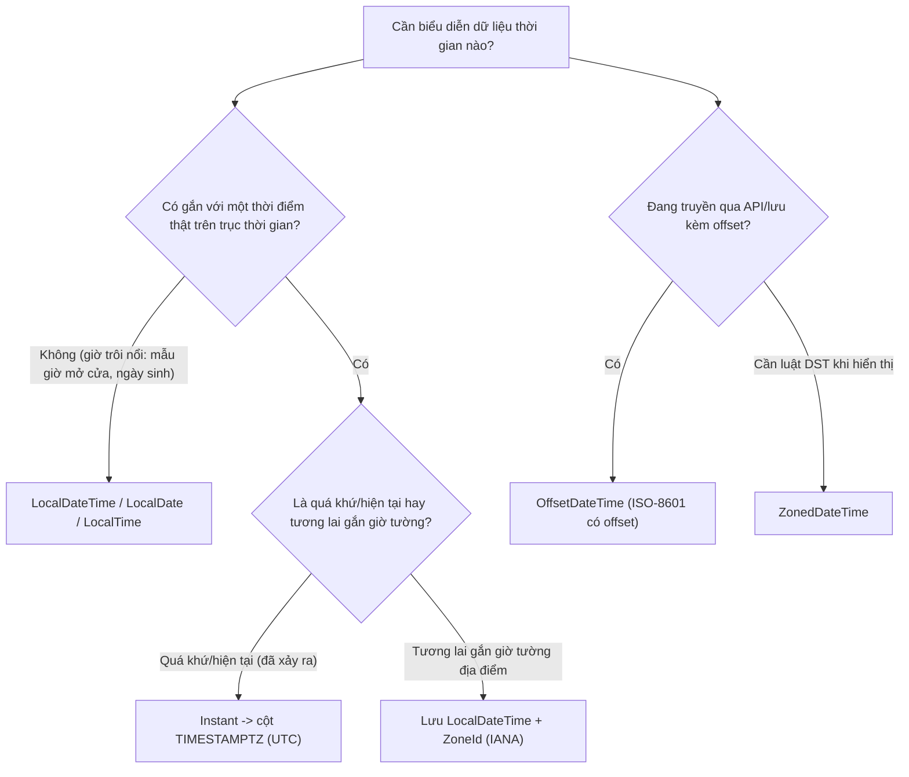

# Nên lưu LocalDateTime, OffsetDateTime, Instant thế nào?

## ⚡ Tóm tắt ngắn (30s)
* **Bản chất**: Bốn kiểu của `java.time` mã hóa **lượng thông tin timezone khác nhau**, và chọn sai kiểu = mất hoặc thừa thông tin. **`Instant`** = một điểm tuyệt đối trên trục UTC (không zone). **`OffsetDateTime`** = giờ local + một **offset cố định** (`+07:00`) nhưng **không biết luật zone**. **`ZonedDateTime`** = giờ local + **IANA zone** (`Asia/Ho_Chi_Minh`) nên **biết cả luật DST**. **`LocalDateTime`** = giờ trên đồng hồ tường **KHÔNG có zone/offset gì cả**.
* **Quy tắc lưu trữ**: (1) Sự kiện đã xảy ra (created_at, log, audit) → lưu **`Instant`/UTC** (cột `TIMESTAMPTZ`); (2) sự kiện **tương lai gắn với giờ tường của một địa điểm** (lịch hẹn 9h sáng năm sau) → lưu **`LocalDateTime` + `ZoneId`** rồi tính instant khi dùng; (3) trên **dây/API** → ISO-8601 có offset (`OffsetDateTime`); (4) chỉ dùng **`LocalDateTime` trần** cho khái niệm thời gian **không gắn địa điểm** (giờ mở cửa mẫu, ngày sinh).
* **Quyết định Senior**: Mặc định dùng **`Instant` để lưu thời điểm**. **Tránh tuyệt đối `java.util.Date`/`Calendar`/`Timestamp`** (mutable, API lỗi thời, ngầm dính default tz). Không bao giờ dùng `LocalDateTime` để biểu diễn một thời điểm cụ thể.

---

## 🔍 Chi tiết bản chất thực chiến: Chọn kiểu theo lượng thông tin cần giữ

### 1. `Instant` — mặc định cho "khi nào việc đó xảy ra"
* Là epoch seconds + nanos trên trục UTC. **Bất biến với mọi timezone** → hoàn hảo để lưu, so sánh thứ tự, đo khoảng cách.
* Map với cột **`TIMESTAMPTZ`** (Postgres) — driver tự quy về UTC khi lưu/đọc.
* Dùng cho: `created_at`, `updated_at`, thời điểm log/audit, timestamp event, `exp`/`iat` của token.

### 2. `OffsetDateTime` — tốt cho định dạng truyền đi
* Là `LocalDateTime` + offset cố định, ví dụ `2026-06-29T17:00:00+07:00`. **Biết offset** tại thời điểm đó nhưng **không biết zone** (không biết Hà Nội hay Bangkok, không biết luật DST).
* Lý tưởng cho **wire format / JSON**: giữ đủ thông tin để client convert, mà không cần client tra luật zone.
* Map được với `TIMESTAMPTZ`. Là kiểu JDBC khuyến nghị cho cột có timezone.

### 3. `ZonedDateTime` — cho tương lai gắn địa điểm & hiển thị
* Là `LocalDateTime` + `ZoneId` (IANA) + offset đã giải. **Biết luật DST**, xử lý gap/overlap đúng.
* Dùng cho: **sự kiện tương lai theo giờ tường** ("họp 9h sáng 1/7 ở VN"), và **convert để hiển thị** cho user.
* Lưu ý lưu trữ: với event tương lai, nên tách **lưu `LocalDateTime` + `zone_id`** riêng, vì nếu chốt cứng thành `Instant` ngay bây giờ mà sau đó zone đổi luật DST thì instant đã lưu sẽ lệch khỏi "9h sáng" thực tế.

### 4. `LocalDateTime` — chỉ cho thời gian KHÔNG gắn địa điểm
* **Không có zone/offset** → không phải một thời điểm trên trục thời gian. `LocalDateTime.now()` ngầm lấy default tz → **cờ đỏ**.
* Chỉ hợp lệ khi khái niệm vốn "trôi nổi": mẫu giờ mở cửa ("09:00–17:00" áp cho mọi chi nhánh), ngày sinh, một template lịch lặp. Khi cần biến nó thành thời điểm, phải **ghép với một `ZoneId` tường minh**.

### 5. Vì sao tránh `java.util.Date`/`Calendar`
* `Date` thực ra là một instant nhưng `toString()` in theo default tz → gây hiểu nhầm; `Calendar` mutable, dễ lỗi off-by-one (tháng đếm từ 0). Cả hai thuộc API cũ trước Java 8. `java.time` bất biến, rõ nghĩa, an toàn luồng — luôn ưu tiên.

---

## 🎨 Sơ đồ trực quan: Cây quyết định chọn kiểu thời gian

Sơ đồ hướng dẫn chọn kiểu `java.time` theo bản chất dữ liệu cần lưu:



---

## 💻 Code thực chiến: BAD vs GOOD

Hai đoạn dưới tương phản việc chọn sai kiểu với việc dùng đúng kiểu theo ngữ cảnh:

### ❌ BAD: LocalDateTime cho thời điểm, và java.util.Date
```java
// ❌ LocalDateTime cho "lúc tạo" -> không zone, ngầm dính default tz
@Column private LocalDateTime createdAt = LocalDateTime.now();

// ❌ java.util.Date: mutable, toString in theo default tz, dễ hiểu nhầm
private Date paidAt = new Date();

// ❌ Lịch hẹn tương lai chốt cứng thành epoch ngay -> sai nếu zone đổi DST
long meetingEpoch = LocalDateTime.of(2027, 3, 8, 9, 0)
        .toEpochSecond(ZoneOffset.ofHours(-5)); // ❌ offset cố định cho tương lai
```

### ✅ GOOD: Đúng kiểu cho đúng ngữ cảnh
```java
// ✅ Sự kiện đã xảy ra: Instant -> TIMESTAMPTZ
@Column(columnDefinition = "timestamptz")
private Instant createdAt = Instant.now(clock);     // clock inject (xem q10)

// ✅ Trên API: OffsetDateTime, ISO-8601 có offset cho client tự convert
public OffsetDateTime getCreatedAt() {
    return createdAt.atOffset(ZoneOffset.UTC);      // "2026-06-29T10:00:00Z"
}

// ✅ Lịch hẹn tương lai: LƯU local + IANA zone, tính instant KHI DÙNG
@Column private LocalDateTime meetingLocal;          // 2027-03-08T09:00
@Column private String meetingZone;                  // "America/New_York"

public Instant resolveMeetingInstant() {
    return meetingLocal.atZone(ZoneId.of(meetingZone)) // ✅ ZoneRules áp luật DST đúng
                       .toInstant();
}

// ✅ Khái niệm trôi nổi không gắn địa điểm: LocalTime trần là hợp lệ
private LocalTime storeOpensAt = LocalTime.of(9, 0);  // áp cho mọi chi nhánh
```

---

## 📊 Bảng so sánh: Instant vs OffsetDateTime vs ZonedDateTime vs LocalDateTime

Bảng dưới đối chiếu bốn kiểu theo thông tin mang theo và mục đích dùng:

| Tiêu chí | `Instant` | `OffsetDateTime` | `ZonedDateTime` | `LocalDateTime` |
| :--- | :--- | :--- | :--- | :--- |
| **Mang offset?** | Ngầm UTC | ✅ Offset cố định | ✅ Offset đã giải | ❌ Không |
| **Biết luật DST (zone)?** | — | ❌ Không | ✅ Có (IANA) | ❌ Không |
| **Là thời điểm tuyệt đối?** | ✅ | ✅ | ✅ | ❌ (trôi nổi) |
| **Cột DB phù hợp** | `TIMESTAMPTZ` | `TIMESTAMPTZ` | (tách local+zone) | `TIMESTAMP` |
| **Dùng tốt nhất cho** | Lưu thời điểm đã xảy ra | Wire/API format | Tương lai + hiển thị | Giờ mẫu không gắn nơi |
| **Cờ đỏ khi** | — | Lưu future event | Quên xử lý overlap | Dùng cho 1 thời điểm thật |

---

## ⚠️ Common Gotchas & Questions follow-up

### 1. Cạm bẫy "lưu future event bằng Instant chốt cứng"
* Một lịch hẹn 9h sáng năm sau nếu lưu thành `Instant` (đã quy offset hôm nay) sẽ **lệch** nếu quốc gia đó thay đổi luật DST/giờ trước thời điểm đó. Với sự kiện tương lai theo giờ tường, lưu **`LocalDateTime` + IANA `ZoneId`** và **tính `Instant` lúc gần dùng**, để luôn áp đúng luật zone hiện hành.

### 2. Cạm bẫy "OffsetDateTime tưởng là ZonedDateTime"
* `OffsetDateTime` chỉ biết `+07:00` chứ không biết đó là zone nào, nên **không tự cộng/trừ DST** khi bạn `plusDays`. Nếu cần phép tính lịch có nhận thức DST, phải dùng `ZonedDateTime`. `OffsetDateTime` hợp cho lưu trữ/truyền tải instant, không hợp cho tính toán lịch tương lai.

### 3. Câu hỏi đào sâu từ interviewer
* **Interviewer: "Một bảng dùng `LocalDateTime` cho cột `created_at`. Tại sao đó là vấn đề và bạn migrate thế nào?"**
* **Trả lời**: `LocalDateTime` **không mang zone**, nên cột `created_at` kiểu này không biết "10:00" là giờ ở đâu — khi các node JVM có default tz khác nhau ghi/đọc, cùng một dòng sẽ được diễn giải thành các instant khác nhau, gây lệch giờ và sai thứ tự sự kiện. Đúng ra `created_at` phải là `Instant` lưu vào `TIMESTAMPTZ` để là một điểm tuyệt đối trên trục UTC. Để migrate an toàn, trước hết tôi xác định **dữ liệu cũ đang được lưu theo tz nào** (thường là default tz của server lúc ghi — phải xác minh, không đoán). Sau đó thêm cột mới `created_at_utc TIMESTAMPTZ`, backfill bằng cách diễn giải giá trị cũ theo đúng tz đã xác định rồi quy về UTC (`old_value AT TIME ZONE 'Asia/Ho_Chi_Minh'`), chuyển code đọc/ghi sang `Instant`, chạy song song đối soát một thời gian, rồi mới bỏ cột cũ. Mấu chốt là **không backfill mù** — nếu giả định sai tz gốc, toàn bộ dữ liệu lịch sử sẽ lệch đúng một offset.
