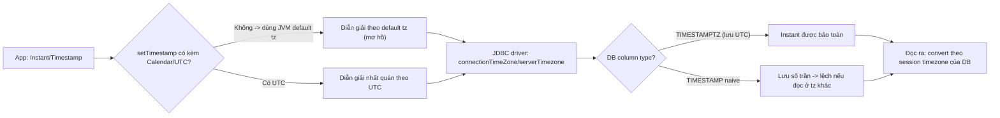

# Database timezone khác application timezone gây lỗi gì?

## ⚡ Tóm tắt ngắn (30s)
* **Bản chất**: Một timestamp đi qua **ba "đồng hồ" có thể khác nhau**: **JVM default tz** của app, **tz của JDBC connection/driver**, và **session timezone của DB**. Khi chúng lệch nhau, driver sẽ **cộng/trừ offset** lúc ghi và đọc — nếu hai chiều không đối xứng, giá trị bị **dịch đúng bằng hiệu số offset**, hoặc tệ hơn là bị **convert hai lần / không convert khi đáng lẽ phải convert**.
* **Lỗi điển hình**: ghi `10:00` đọc ra `03:00` (lệch 7h); cột `TIMESTAMP WITHOUT TIME ZONE` lưu naive nên không ai nhớ đó là UTC hay local; MySQL `serverTimezone`/`connectionTimeZone` cấu hình sai làm dịch toàn bộ; cùng dữ liệu nhưng hai pod (default tz khác nhau) đọc ra hai instant.
* **Quyết định Senior**: **Chuẩn hóa toàn chuỗi về UTC**: JVM chạy `-Duser.timezone=UTC`, **DB session = UTC**, **connection param = UTC**, `hibernate.jdbc.time_zone=UTC`, và dùng cột **`TIMESTAMPTZ`** với kiểu Java **`Instant`/`OffsetDateTime`**. Khi mọi mắt xích cùng nói UTC thì không còn phép dịch ngầm nào để sai.

---

## 🔍 Chi tiết bản chất thực chiến: Ba đồng hồ và các phép convert ngầm

### 1. Ba nơi timezone tham gia vào một lần ghi/đọc
* **JVM default tz**: khi bạn `setTimestamp` không kèm `Calendar`, driver dùng default tz của JVM để diễn giải giá trị.
* **JDBC driver / connection param**: MySQL connector có `connectionTimeZone`/`serverTimezone`; nó **chủ động convert** giữa client tz và server tz.
* **DB session timezone**: Postgres có tham số `timezone` cho mỗi session, quyết định cách hiển thị/parse `TIMESTAMPTZ` và cách `::date`, `date_trunc` hoạt động.
Mỗi mắt xích dịch một ít; nếu chiều ghi và chiều đọc không dùng **cùng** tz, kết quả lệch.

### 2. Postgres: `TIMESTAMPTZ` vs `TIMESTAMP`
* **`TIMESTAMPTZ`**: Postgres **luôn lưu nội bộ là UTC**, convert sang session `timezone` khi hiển thị. Đây là kiểu an toàn — instant được bảo toàn bất kể session tz.
* **`TIMESTAMP` (without time zone)**: lưu **đúng các con số bạn đưa vào**, **không** gắn ý nghĩa zone. Nếu app ghi giờ local rồi đọc ở session tz khác, không có convert nào cứu được vì DB không biết giá trị gốc là tz gì. Đây là nguồn lỗi phổ biến nhất.

### 3. MySQL: `TIMESTAMP` vs `DATETIME` và bẫy `serverTimezone`
* **`TIMESTAMP`** trong MySQL **được lưu là UTC** và convert theo `time_zone` của session khi đọc/ghi; **`DATETIME`** là naive (không convert).
* Bẫy kinh điển: driver MySQL với `serverTimezone`/`connectionTimeZone` đặt sai (ví dụ server thực chạy UTC nhưng khai báo cho driver là `Asia/Ho_Chi_Minh`) → driver **dịch thêm 7h** không cần thiết, toàn bộ giá trị lệch.

### 4. JDBC `setTimestamp` và `Calendar`
`PreparedStatement.setTimestamp(i, ts)` không kèm `Calendar` → dùng **JVM default tz** để hiểu `ts`. Hai pod default tz khác nhau ghi cùng một `Timestamp` sẽ tạo ra hai giá trị DB khác nhau. Bản chất `java.sql.Timestamp` là instant nhưng cách driver diễn giải lại phụ thuộc tz → mơ hồ. Dùng `Instant`/`OffsetDateTime` của `java.time` tránh được lớp mơ hồ này.

### 5. Hibernate `hibernate.jdbc.time_zone`
Đặt `hibernate.jdbc.time_zone=UTC` buộc Hibernate dùng UTC khi đọc/ghi qua JDBC, **độc lập với JVM default tz** → loại bỏ sự phụ thuộc vào `user.timezone` của từng node. Đây là một dòng cấu hình quan trọng thường bị quên.

---

## 🎨 Sơ đồ trực quan: Timestamp bị dịch khi ba đồng hồ lệch nhau

Sơ đồ mô tả nơi phép convert ngầm xảy ra giữa app, driver và DB:



---

## 💻 Code thực chiến: BAD vs GOOD

Hai đoạn dưới tương phản cấu hình để default tz quyết định với cấu hình chuẩn hóa UTC:

### ❌ BAD: Mỗi tầng một tz, cột naive, kiểu cũ
```properties
# ❌ Không khai báo gì -> phụ thuộc JVM default tz của từng node
spring.datasource.url=jdbc:mysql://db:3306/app
# ❌ serverTimezone đặt sai gây dịch thêm offset
spring.datasource.url=jdbc:mysql://db:3306/app?serverTimezone=Asia/Ho_Chi_Minh
```
```java
// ❌ Cột naive + kiểu LocalDateTime -> không ai biết giá trị là tz nào
@Column(columnDefinition = "TIMESTAMP")   // không có time zone
private LocalDateTime createdAt;

ps.setTimestamp(1, Timestamp.valueOf(LocalDateTime.now())); // ❌ default tz
```

### ✅ GOOD: Chuẩn hóa UTC từ JVM tới DB
```properties
# ✅ Ép JVM chạy UTC (hoặc set qua -Duser.timezone=UTC)
# ✅ MySQL: connection nói UTC, khớp với server UTC
spring.datasource.url=jdbc:mysql://db:3306/app?connectionTimeZone=UTC
# ✅ Hibernate luôn dùng UTC khi qua JDBC, độc lập default tz
spring.jpa.properties.hibernate.jdbc.time_zone=UTC
spring.jackson.time-zone=UTC
```
```java
// ✅ Cột có timezone + kiểu Instant -> instant được bảo toàn
@Column(columnDefinition = "timestamptz")
private Instant createdAt = Instant.now(clock);

// ✅ Nếu phải dùng JDBC thô: truyền OffsetDateTime UTC, không Timestamp mơ hồ
ps.setObject(1, Instant.now(clock).atOffset(ZoneOffset.UTC));
```
```sql
-- ✅ Chuẩn hóa session DB về UTC để date_trunc/::date nhất quán
SET TIME ZONE 'UTC';                 -- Postgres
-- SET time_zone = '+00:00';         -- MySQL
```

---

## 📊 Bảng so sánh: cột thời gian giữa Postgres và MySQL

Bảng dưới đối chiếu kiểu cột theo cách lưu trữ và convert:

| Kiểu cột | Lưu nội bộ là | Convert theo session tz? | An toàn instant? |
| :--- | :--- | :--- | :--- |
| **Postgres `TIMESTAMPTZ`** | UTC | ✅ khi hiển thị | ✅ Có |
| **Postgres `TIMESTAMP`** | Số trần (naive) | ❌ Không | ❌ Mơ hồ |
| **MySQL `TIMESTAMP`** | UTC | ✅ theo `time_zone` | ✅ (nếu cấu hình đúng) |
| **MySQL `DATETIME`** | Số trần (naive) | ❌ Không | ❌ Mơ hồ |

> Nguyên tắc: cần lưu một **thời điểm** → chọn kiểu **có time zone** (`TIMESTAMPTZ`/MySQL `TIMESTAMP`) + Java `Instant`/`OffsetDateTime`. Chỉ dùng kiểu naive cho dữ liệu **không gắn địa điểm** (q8).

---

## ⚠️ Common Gotchas & Questions follow-up

### 1. Cạm bẫy "đổi default tz của một pod làm lệch dữ liệu mới"
* Nếu app dựa vào JVM default tz để ghi DB, thì chỉ cần một pod được lên lịch ở node có tz khác (hoặc nâng base image), dữ liệu pod đó ghi sẽ **lệch so với các pod khác** — và lỗi rất khó tái hiện vì phụ thuộc pod nào xử lý request. Cách chặn: `hibernate.jdbc.time_zone=UTC` + `connectionTimeZone=UTC` để kết quả **không phụ thuộc default tz** nữa.

### 2. Cạm bẫy "migrate DB giữa hai server tz khác nhau"
* Khi dump/restore một DB dùng cột `TIMESTAMP` naive sang server có session tz khác, các giá trị có thể bị diễn giải lại và **dịch offset** mà không báo lỗi. Với `TIMESTAMPTZ` thì an toàn vì luôn là UTC. Trước khi migrate, phải biết chắc các cột naive đang ngầm là tz gì để chuyển đổi đúng.

### 3. Câu hỏi đào sâu từ interviewer
* **Interviewer: "Sau khi deploy, các bản ghi mới có giờ lệch đúng 7 tiếng so với bản ghi cũ, dù code xử lý thời gian không đổi. Bạn nghi gì?"**
* **Trả lời**: Lệch **đúng 7 tiếng** (bằng offset VN) và chỉ xảy ra với **bản ghi mới sau deploy** là chỉ dấu rất mạnh rằng một mắt xích timezone trong chuỗi app→driver→DB vừa thay đổi — chứ không phải logic nghiệp vụ. Các nghi can hàng đầu: (1) **base image mới đổi default tz** (ví dụ từ image có giờ VN sang image UTC), khiến `setTimestamp` không kèm `Calendar` diễn giải khác đi; (2) **tham số connection** (`connectionTimeZone`/`serverTimezone`) bị đổi hoặc thêm/bớt; (3) cấu hình `hibernate.jdbc.time_zone` được thêm/gỡ. Tôi sẽ so sánh giá trị **raw trong DB** (qua `psql`/`mysql` trực tiếp, không qua app) của một bản ghi cũ và một bản ghi mới để xác định lệch nằm ở khâu ghi hay khâu đọc, kiểm tra `SHOW timezone`/`@@session.time_zone` và default tz của JVM giữa hai bản deploy. Cách phòng triệt để là **chuẩn hóa tất cả về UTC** và dùng cột `TIMESTAMPTZ` + `Instant`, để không còn phép convert ngầm nào phụ thuộc môi trường — khi đó đổi image hay đổi node cũng không làm dịch dữ liệu.
