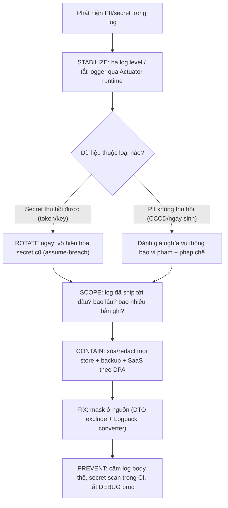

# Log chứa PII hoặc secret. Bạn xử lý thế nào?

## ⚡ Tóm tắt ngắn (30s)
* **Bản chất**: PII (email, CCCD, số điện thoại) hoặc secret (mật khẩu, token, API key) lọt vào log là một **data exposure incident**, không phải một bug log bình thường. Điểm chí mạng: log production gần như luôn được **ship sang hệ thống tập trung** (ELK, Loki, Datadog, CloudWatch) và nhân bản nhiều nơi, nên **xóa file log trên server KHÔNG thu hồi được** thứ đã rời đi. Senior coi mọi secret đã lộ là **đã bị xâm phạm** (assume-breach) dù chưa có bằng chứng bị đọc.
* **Hướng xử lý**: `Stabilize (dừng ghi)` → `Rotate secret đã lộ` → `Scope & Contain (log đã đi tới đâu)` → `Fix tận gốc (mask ở nguồn)` → `Prevent (CI secret-scan, tắt DEBUG prod)`.
* **Quyết định Senior**:
  1. **Cầm máu trước khi vá đẹp**: hạ log level / tắt logger thủ phạm qua config runtime (Actuator `/loggers`) để *ngừng ghi thêm* ngay, không đợi release.
  2. **Rotate ngay mọi secret thu hồi được**: token, key, session — vì xóa log không "thu hồi" thứ có thể đã bị đọc.
  3. **Mask ở nguồn (điểm ghi log), không trông chờ aggregator lọc giúp**; thêm một lớp scrub ở pipeline làm lưới an toàn.

---

## 🔍 Chi tiết bản chất thực chiến: vì sao "xóa log" là chưa đủ

### 1. Phân loại dữ liệu lộ — quyết định cách xử lý
* **Secret thu hồi được** (token, API key, session): **rotate/vô hiệu hóa** là xử lý được tận gốc, vì sau khi rotate thì bản đã lộ thành vô dụng.
* **PII không thu hồi được** (CCCD, ngày sinh, địa chỉ): đã lộ là lộ vĩnh viễn — không "rotate" được, phải đánh giá **nghĩa vụ thông báo vi phạm** (phối hợp pháp chế/DPO, ví dụ Nghị định 13/2023 ở Việt Nam).

### 2. Stabilize — cầm máu mà không cần deploy
* Hầu hết framework cho đổi log level lúc runtime: Spring Boot Actuator `POST /actuator/loggers/{logger}` với `{"configuredLevel":"OFF"}`, hoặc reload `logback.xml`. Hạ logger thủ phạm xuống `OFF`/`WARN` để **dừng dòng máu** trong lúc chuẩn bị bản vá masking đúng.

### 3. Scope & Contain — truy nguồn lan tỏa
* Đây là bước quan trọng nhất và hay bị bỏ qua. Hỏi: **log này được đẩy đi đâu, bao lâu rồi, bao nhiêu bản ghi?** Mỗi store (hot index, cold storage, backup, SaaS bên thứ ba) là một bản sao cần redact riêng.
* Với **SaaS bên thứ ba**, dữ liệu đã rời tầm kiểm soát: mở ticket xóa theo DPA, lấy xác nhận, rà ai có quyền truy cập. Đây là lý do **assume-breach** là mặc định an toàn.

### 4. Fix tận gốc — mask ở nguồn, 3 lớp phòng vệ
1. **Loại trừ ở DTO/entity**: `@ToString.Exclude` cho field nhạy cảm; cấm log object thô (`log.info("{}", user)`).
2. **Masking converter ở Logback**: regex thay số thẻ/token ngay khi ghi (lưới an toàn cho mọi logger).
3. **Lớp pipeline/sidecar**: scrub một lần nữa ở Fluentd/Logstash *trước khi* ship sang aggregator — để log rời server đã sạch (chi tiết kỹ thuật mask xem câu "mask sensitive fields").

---

## 🎨 Sơ đồ trực quan: quy trình ứng phó sự cố log lộ dữ liệu



---

## 💻 Code thực chiến: BAD vs GOOD

### ❌ BAD: log nguyên payload và token
```java
@PostMapping("/login")
public ResponseEntity<?> login(@RequestBody LoginRequest req,
                               @RequestHeader("Authorization") String auth) {
    // ❌ Ghi cả mật khẩu (req.getPassword()) và bearer token vào log production
    log.info("Login request body={}, authHeader={}", req, auth);
    return ResponseEntity.ok(authService.login(req));
}
```

### ✅ GOOD: chỉ log định danh an toàn + scrub ở pipeline
```java
@PostMapping("/login")
public ResponseEntity<?> login(@RequestBody LoginRequest req) {
    // ✅ Chỉ log thông tin định danh không nhạy cảm; KHÔNG log password/token
    log.info("Login attempt username={} ip={}", req.getUsername(), clientIp());
    return ResponseEntity.ok(authService.login(req));
}
```
```java
// ✅ DTO loại trừ field nhạy cảm khỏi mọi toString()
@Getter @Setter @ToString
public class LoginRequest {
    private String username;
    @ToString.Exclude private String password;   // không bao giờ lọt vào log
}
```
```xml
<!-- ✅ Lưới an toàn ở pipeline: scrub trước khi ship sang aggregator (Logback masking converter) -->
<conversionRule conversionWord="mask"
    converterClass="com.example.logging.MaskingConverter"/>
<encoder><pattern>%d{ISO8601} %-5level [%X{traceId}] %logger - %mask</pattern></encoder>
```

---

## 📊 Bảng so sánh: xử lý đúng vs sai khi log lộ dữ liệu

| Tình huống | Cách làm SAI (junior) | Cách làm ĐÚNG (senior) |
| :--- | :--- | :--- |
| **Phát hiện secret trong log** | Xóa file log trên server rồi báo "đã xong" | Coi như đã bị xâm phạm → **rotate** secret ngay |
| **Log đã ship sang Datadog/ELK** | Bỏ qua vì "không thấy ai đọc" | Redact ở mọi store + backup + ticket xóa SaaS theo DPA |
| **Vá lỗi** | Dặn dev "nhớ đừng log nữa" | Mask ở nguồn (DTO exclude + converter) + CI secret-scan |
| **PII người dùng** | Tự kết luận "không sao" | Đánh giá nghĩa vụ thông báo vi phạm với pháp chế |

---

## ⚠️ Common Gotchas & Questions follow-up

### 1. Cạm bẫy "DEBUG/stack trace lộ nhiều hơn bạn nghĩ"
* Bật `DEBUG` của Hibernate (show-sql kèm tham số), Feign full logging, hay Spring Security trên production để debug rồi quên tắt — header `Authorization` và câu query chứa email/SĐT lập tức tràn vào log. Stack trace của lỗi SQL cũng in cả tham số. **Cấm DEBUG/TRACE của package nhạy cảm trên prod** qua config, và tắt ngay sau khi tạm bật.

### 2. Câu hỏi đào sâu từ interviewer
* **Interviewer: "Team bảo cứ xóa hết log cũ là an toàn. Bạn phản biện thế nào?"**
* **Trả lời**: Xóa log chỉ xóa **bản sao mà ta nhìn thấy**, trong khi log production thường đã được forward sang aggregator tập trung và SaaS bên thứ ba, nhân bản vào index nóng, cold storage và backup. Quan trọng hơn, xóa log **không thu hồi** được một token/key đã có thể bị ai đó đọc — về mặt bảo mật phải giả định nó **đã bị xâm phạm**. Vì vậy hành động đúng đầu tiên không phải là xóa mà là **rotate mọi secret đã lộ**, song song với việc redact ở *tất cả* các store theo đúng quy trình (kể cả ticket xóa với SaaS theo DPA). Cuối cùng mới là vá tận gốc: mask ngay tại điểm ghi log để dữ liệu nhạy cảm **không bao giờ được sinh ra trong log** ngay từ đầu — phòng bệnh tốt hơn dọn dẹp.
