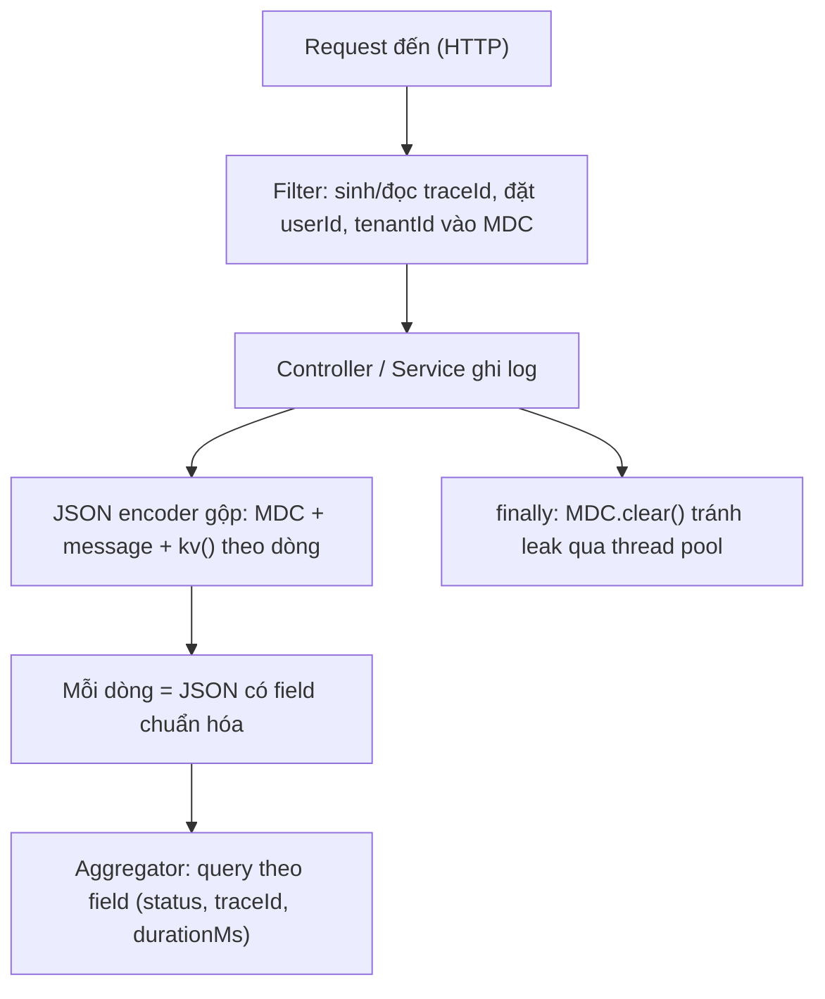

# Structured logging nên gồm những field nào?

## ⚡ Tóm tắt ngắn (30s)
* **Bản chất**: Structured logging là việc ghi log dưới dạng **key-value/JSON có cấu trúc** thay vì một chuỗi văn bản tự do. Khác biệt cốt lõi: log truyền thống là "để con người đọc bằng mắt", còn structured log là "để máy truy vấn, lọc, tổng hợp". Khi log đã có cấu trúc, bạn có thể hỏi aggregator những câu như `status:500 AND service:order-api AND durationMs:>2000` thay vì grep mò trên chuỗi. Đây là điều kiện tiên quyết để observability ở quy mô lớn hoạt động.
* **Bộ field tối thiểu (chia 4 nhóm)**:
  1. **Định danh/correlation**: `timestamp`, `level`, `logger`, `traceId`, `spanId`, `service`, `env`, `version/instance`.
  2. **Ngữ cảnh nghiệp vụ**: `userId`/`tenantId`, `requestId`, `operation`, các id nghiệp vụ (`orderId`...) — **không phải PII thô**.
  3. **Kết quả & hiệu năng**: `httpMethod`, `uri`, `status`, `durationMs`, `errorCode`.
  4. **Chẩn đoán lỗi**: `message`, `exceptionType`, `stackTrace` (khi có lỗi).
* **Quyết định Senior**:
  1. **Chuẩn hóa tên field toàn hệ thống** (một schema chung) để query xuyên service được — `traceId` phải cùng tên ở mọi nơi.
  2. Đưa các field correlation vào **MDC một lần ở filter**, không truyền tay qua từng dòng log.
  3. **Tuyệt đối không nhét PII/secret** vào field; áp masking như mọi log khác.

---

## 🔍 Chi tiết bản chất thực chiến: thiết kế schema log

### 1. Nhóm định danh & correlation — "ai/ở đâu/thuộc request nào"
* `timestamp` (ISO-8601, UTC), `level`, `logger/class`.
* `service` + `env` + `version` (hoặc `instanceId`/pod name): để phân biệt log đến từ service nào, môi trường nào, bản build nào — cực kỳ quan trọng khi nhiều service ship log vào cùng một index.
* `traceId` + `spanId`: **xương sống của distributed tracing**. Cùng một `traceId` xuyên suốt mọi service trong một request → cho phép dựng lại toàn bộ hành trình. Đây là field giá trị nhất khi điều tra sự cố microservice.

### 2. Nhóm ngữ cảnh nghiệp vụ — "đang làm gì cho ai"
* `userId`/`tenantId` (dạng id, **không phải email/tên thật**), `operation`/`useCase`, và các business id (`orderId`, `paymentId`). Nhờ đó có thể filter "tất cả log của tenant X" hoặc "vòng đời của order Y".
* Lưu ý compliance: dùng **id thay cho PII**. Đừng log `email`, `phone` thô — nếu cần thì mask.

### 3. Nhóm kết quả & hiệu năng — "kết thúc thế nào, nhanh hay chậm"
* `httpMethod`, `uri` (đã chuẩn hóa, bỏ path param giá trị thật để giảm cardinality), `status`, `durationMs`, `responseSize`, `errorCode`.
* `durationMs` là field vàng để dựng dashboard latency và truy vấn request chậm mà không cần body.

### 4. Nhóm chẩn đoán lỗi — chỉ khi có lỗi
* `message`, `exceptionType`, `stackTrace`, `errorCategory` (business/system). Stack trace nên là một field riêng để không phá vỡ cấu trúc JSON của dòng.

### 5. Cơ chế triển khai: MDC + JSON encoder
* Đặt các field xuyên suốt (`traceId`, `userId`, `tenantId`) vào **MDC một lần ở filter đầu vào**, rồi xóa ở `finally` (tránh leak qua thread pool). Mọi dòng log sau đó tự động kèm các field này.
* Dùng `logstash-logback-encoder` (Logback) hoặc `JsonTemplateLayout` (Log4j2) để xuất JSON, kèm `StructuredArguments.kv(...)` cho field theo dòng.

---

## 🎨 Sơ đồ trực quan: luồng gắn field vào structured log



---

## 💻 Code thực chiến: BAD vs GOOD

### ❌ BAD: log chuỗi tự do, không truy vấn được
```java
public void placeOrder(Order o) {
    // ❌ Chuỗi tự do: muốn lọc theo status/userId/latency phải grep regex mong manh
    log.info("User " + o.getUserId() + " placed order " + o.getId()
             + " took " + o.getElapsed() + "ms result OK");
}
```

### ✅ GOOD: MDC cho correlation + structured arguments cho field nghiệp vụ
```java
// ✅ Filter: nạp field correlation vào MDC một lần
@Component
public class MdcContextFilter extends OncePerRequestFilter {
    @Override
    protected void doFilterInternal(HttpServletRequest req, HttpServletResponse res,
                                    FilterChain chain) throws IOException, ServletException {
        try {
            MDC.put("traceId", resolveTraceId(req));
            MDC.put("tenantId", resolveTenant(req));
            MDC.put("userId", currentUserId());
            chain.doFilter(req, res);
        } finally {
            MDC.clear(); // ✅ chống leak context qua thread pool
        }
    }
}
```
```java
// ✅ Service: thêm field nghiệp vụ theo dòng bằng kv()
import static net.logstash.logback.argument.StructuredArguments.kv;

public void placeOrder(Order o) {
    long start = System.nanoTime();
    orderRepo.save(o);
    long ms = (System.nanoTime() - start) / 1_000_000;
    // traceId/userId/tenantId tự kèm từ MDC; orderId/status/durationMs là field cấu trúc
    log.info("order placed", kv("orderId", o.getId()),
             kv("status", "OK"), kv("durationMs", ms));
}
```
```xml
<!-- ✅ Xuất JSON có cấu trúc (logback-spring.xml) -->
<appender name="JSON" class="ch.qos.logback.core.ConsoleAppender">
    <encoder class="net.logstash.logback.encoder.LogstashEncoder">
        <includeMdcKeyName>traceId</includeMdcKeyName>
        <includeMdcKeyName>tenantId</includeMdcKeyName>
        <includeMdcKeyName>userId</includeMdcKeyName>
        <customFields>{"service":"order-api","env":"prod"}</customFields>
    </encoder>
</appender>
```

---

## 📊 Bảng so sánh: log dạng chuỗi vs structured logging

| Tiêu chí | Log chuỗi tự do | Structured logging (JSON/kv) |
| :--- | :--- | :--- |
| **Truy vấn** | Grep/regex mong manh, dễ vỡ | Filter theo field chính xác |
| **Tổng hợp/dashboard** | Khó (phải parse) | Dễ — group by status, p99 durationMs |
| **Correlation xuyên service** | Thủ công | traceId chuẩn hóa, tự nối |
| **Cardinality/chi phí** | Khó kiểm soát | Kiểm soát qua chuẩn hóa uri/field |
| **Con người đọc trực tiếp** | Dễ với mắt thường | Cần tool/pretty-print |
| **Tự động alert** | Khó định nghĩa | Dễ — điều kiện trên field |

---

## ⚠️ Common Gotchas & Questions follow-up

### 1. Cạm bẫy "high-cardinality field làm nổ index"
* Nhét giá trị có vô số biến thể vào field — ví dụ `uri` chứa path param thật (`/orders/abc-123-xyz`), full URL có query string, hay timestamp dạng millisecond làm key. Mỗi giá trị duy nhất tạo một entry mới trong index của aggregator, khiến storage phình to và query chậm dần (đặc biệt nếu field này còn được đẩy thành label của metric). Giải pháp: **chuẩn hóa** — log `uri` dạng template `/orders/{id}` thay vì giá trị thật, để id riêng vào field `orderId`. Tách bạch "field để filter chính xác" và "field high-cardinality chỉ để tham khảo".

### 2. Câu hỏi đào sâu từ interviewer
* **Interviewer: "Hệ thống của bạn có 20 microservice do nhiều team viết. Làm sao đảm bảo log của tất cả đều cùng schema để query xuyên service?"**
* **Trả lời**: Vấn đề ở đây là **quản trị schema**, không phải kỹ thuật log đơn lẻ. Tôi giải quyết bằng ba lớp: (1) **Thư viện logging chung** — đóng gói cấu hình encoder, danh sách MDC field bắt buộc (`traceId`, `service`, `env`, `tenantId`), và filter nạp correlation thành một starter/library nội bộ; mọi service `import` nó thay vì tự cấu hình, nên tên field thống nhất "by construction". (2) **Chuẩn propagation chung** — dùng W3C Trace Context (`traceparent`) và một framework tracing thống nhất (OpenTelemetry) để `traceId` được truyền và đặt tên giống hệt nhau xuyên service, bất kể team nào viết. (3) **Kiểm soát ở pipeline** — Logstash/Fluentd có bước normalize ánh xạ các biến thể tên field về schema chuẩn và từ chối/cảnh báo log không đúng định dạng, làm hàng rào cuối. Nhờ vậy việc tuân thủ schema không dựa vào kỷ luật thủ công của từng dev mà được *bảo đảm bằng công cụ và thư viện dùng chung* — đây là cách duy nhất scale được khi số service và số team tăng lên.
