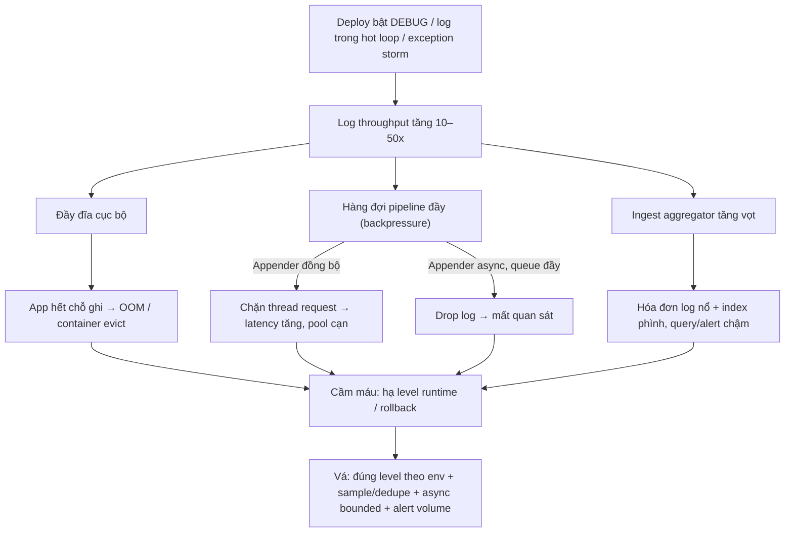

# Log volume tăng đột biến sau deploy. Hậu quả là gì?

## ⚡ Tóm tắt ngắn (30s)
* **Bản chất**: Một deploy vô tình bật `DEBUG`, log trong vòng lặp nóng, log full request/response, hoặc gặp **exception storm** (mỗi request ném và log một lỗi) khiến throughput log tăng gấp hàng chục lần. Vấn đề không chỉ là "log nhiều" — nó kéo theo **chuỗi domino**: đầy đĩa, nghẽn pipeline, nổ chi phí, và **chôn vùi tín hiệu thật** giữa biển nhiễu.
* **Hậu quả thực chiến**:
  1. **Đầy đĩa → service chết**: log local lấp đầy volume, app hết chỗ ghi temp/heap-dump, container bị OOM/evict, thậm chí cả node sập theo.
  2. **Nghẽn pipeline (backpressure)**: agent (Fluentd/Logstash) không kịp đẩy, hàng đợi đầy → hoặc **drop log** (mất quan sát), hoặc nếu **appender đồng bộ** thì *chặn luôn thread xử lý request* → app chậm/timeout.
  3. **Nổ chi phí**: aggregator (Datadog/CloudWatch/ELK SaaS) tính tiền theo GB ingest → hóa đơn tăng vọt chỉ sau một đêm.
* **Quyết định Senior**: kiểm soát log level theo môi trường, **sample/rate-limit** log lặp, dùng **async appender hàng đợi có giới hạn** để bảo vệ app, và **alert trên log-volume/cost** để bắt sớm.

---

## 🔍 Chi tiết bản chất thực chiến

### 1. Ước lượng độ lớn — vì sao một dòng log "rẻ" hóa đắt
Lượng ingest mỗi ngày xấp xỉ:

$$V_{\text{ingest}} = R_{\text{log/s}} \times S_{\text{bytes/log}} \times 86400$$

Ví dụ $R = 5000$ log/s, $S = 1\text{KB}$ → $V \approx 432\text{ GB/ngày}$. Với đơn giá ingest ~ \$0.5/GB thì riêng tiền log đã ~ \$216/ngày. Chỉ cần một logger DEBUG trong hot path là $R$ nhảy 10–50 lần.

### 2. Chuỗi domino của hậu quả
* **Tài nguyên cục bộ**: I/O ghi log cạnh tranh với I/O nghiệp vụ; CPU tốn cho serialize JSON/format; đĩa đầy chặn cả app.
* **Backpressure ở pipeline**: đây là chỗ phân biệt **sync vs async appender**. Sync appender khi đích chậm sẽ **chặn thread request** → tail latency tăng, pool cạn. Async appender giải phóng thread nhưng khi hàng đợi đầy thì **drop** event (mất log).
* **Mất tín hiệu (signal-to-noise)**: log hữu ích bị nhấn chìm, index phình to làm query/alert chậm — đúng lúc cần nhất thì không tìm ra.

### 3. Xử lý: cầm máu rồi vá tận gốc
* **Cầm máu**: hạ log level logger thủ phạm qua Actuator runtime; nếu do deploy lỗi → **rollback**.
* **Vá tận gốc**:
  * **Đúng level theo môi trường**: prod mặc định `INFO`, cấm `DEBUG` package nóng.
  * **Sample/dedupe**: Logback `DuplicateMessageFilter` (gộp log lặp), hoặc sampling 1/N cho event tần suất cao.
  * **Async bounded queue + `neverBlock`**: bảo vệ app khỏi bị chặn (chấp nhận drop log thay vì drop request).
  * **Quota & alert**: đặt ngân sách ingest, alert khi volume vượt ngưỡng để bắt hồi quy ngay sau deploy.

---

## 🎨 Sơ đồ trực quan: chuỗi hậu quả khi log volume tăng đột biến



---

## 💻 Code thực chiến: BAD vs GOOD

### ❌ BAD: log trong vòng lặp nóng + appender đồng bộ
```java
public void process(List<Order> orders) {
    for (Order o : orders) {
        // ❌ Log mỗi phần tử ở INFO trong vòng lặp xử lý hàng triệu order
        log.info("Processing order detail: {}", o);   // bùng nổ volume + lộ dữ liệu
    }
}
```
```xml
<!-- ❌ Appender đồng bộ: khi đích chậm sẽ chặn chính thread request -->
<appender name="FILE" class="ch.qos.logback.core.FileAppender">
  <file>app.log</file>
  <encoder><pattern>%d %-5level %logger - %msg%n</pattern></encoder>
</appender>
```

### ✅ GOOD: log tổng hợp + async bounded queue bảo vệ app
```java
public void process(List<Order> orders) {
    log.info("Bắt đầu xử lý batch size={}", orders.size());
    int failed = 0;
    for (Order o : orders) {
        if (!handle(o)) { failed++; }
        // ✅ Chi tiết từng phần tử để ở DEBUG (tắt trên prod), không log ở INFO
        log.debug("Processed orderId={}", o.getId());
    }
    log.info("Hoàn tất batch size={} failed={}", orders.size(), failed);  // tóm tắt, ít dòng
}
```
```xml
<!-- ✅ Async + hàng đợi giới hạn + neverBlock: thà drop log còn hơn chặn request -->
<appender name="ASYNC" class="ch.qos.logback.classic.AsyncAppender">
  <queueSize>4096</queueSize>
  <discardingThreshold>0</discardingThreshold> <!-- không tự bỏ INFO khi đầy (cân nhắc) -->
  <neverBlock>true</neverBlock>                 <!-- queue đầy → drop, KHÔNG chặn app -->
  <appender-ref ref="FILE"/>
</appender>
<!-- ✅ Gộp log trùng lặp để giảm nhiễu khi có storm -->
<turboFilter class="ch.qos.logback.classic.turbo.DuplicateMessageFilter">
  <allowedRepetitions>5</allowedRepetitions>
</turboFilter>
```

---

## 📊 Bảng so sánh: nguồn gây bùng nổ log và cách kiểm soát

| Nguồn gây spike | Hậu quả chính | Biện pháp kiểm soát |
| :--- | :--- | :--- |
| **DEBUG quên tắt sau deploy** | Volume 10–50x, lộ dữ liệu nhạy cảm | Đúng level theo env; alert volume; rollback |
| **Log trong hot loop** | I/O + CPU bão hòa | Log tóm tắt batch; chi tiết để DEBUG |
| **Exception storm (lỗi/req)** | Mỗi request 1 stack trace | Dedupe/sample; sửa lỗi gốc; log once at boundary |
| **Log full request/response body** | GB ingest + PII | Log metadata, không log body thô |
| **Appender đồng bộ + đích chậm** | Chặn thread request | Async bounded queue + `neverBlock` |

---

## ⚠️ Common Gotchas & Questions follow-up

### 1. Cạm bẫy "tăng async queue để khỏi mất log"
* Khi thấy log bị drop, phản xạ sai là **tăng `queueSize` thật lớn**. Hàng đợi lớn chỉ **trì hoãn** vấn đề: nó ngốn heap (mỗi event là một object), và nếu đặt `neverBlock=false` thì khi đầy vẫn quay lại **chặn request**. Gốc rễ là *giảm lượng log sinh ra* (đúng level + sample), không phải phình bộ đệm. Hàng đợi chỉ để hấp thụ burst ngắn.

### 2. Câu hỏi đào sâu từ interviewer
* **Interviewer: "Sau deploy, p99 latency tăng vọt nhưng CPU app vẫn thấp. Bạn nghi log thế nào?"**
* **Trả lời**: CPU thấp mà latency cao là dấu hiệu thread đang **chờ (blocked)** chứ không phải tính toán. Một nghi phạm kinh điển là **appender đồng bộ**: deploy mới bật thêm log hoặc đích ghi (file/đẩy mạng) chậm lại, khiến mỗi lời gọi `log.info` chặn thread request cho đến khi I/O xong → request xếp hàng, p99 tăng dù CPU rảnh. Tôi sẽ lấy **thread dump** xem thread pool có kẹt ở `FileAppender`/socket write không, kiểm tra log volume có nhảy sau deploy không, rồi xử lý theo hai hướng: chuyển sang **async appender hàng đợi giới hạn với `neverBlock=true`** để I/O log không bao giờ chặn nghiệp vụ, đồng thời **cắt nguồn log thừa** (hạ DEBUG, dedupe). Nguyên tắc: logging phải là tác vụ *fire-and-forget* đối với đường đi của request, không bao giờ nằm trên critical path.
