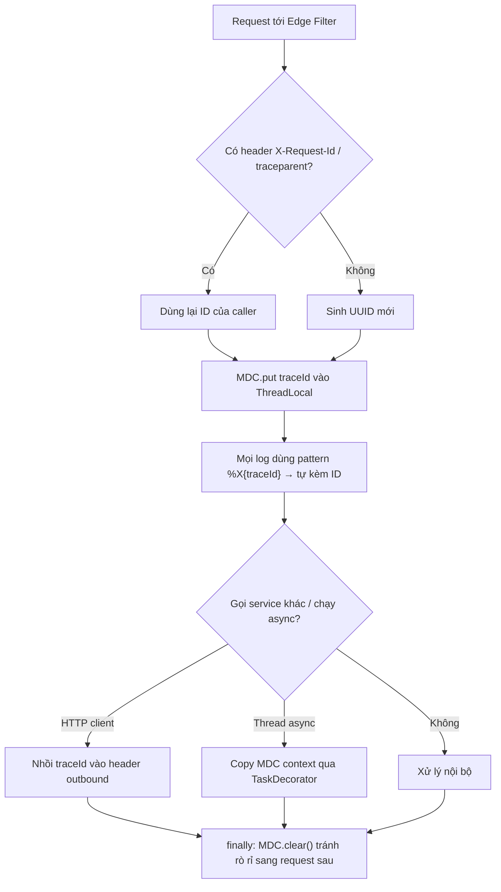

# Log thiếu request ID nên khó trace. Bạn cải thiện ra sao?

## ⚡ Tóm tắt ngắn (30s)
* **Bản chất**: Không có **correlation ID** (request ID / traceId), mỗi dòng log là một mảnh rời rạc. Khi một request đi qua nhiều thread, nhiều service, bạn không thể "khâu" các dòng log của *cùng một request* lại với nhau → debug production biến thành mò kim đáy bể, nhất là khi log của nhiều request xen kẽ nhau.
* **Hướng cải thiện**: Sinh hoặc nhận `traceId` **ở biên** (gateway/filter) → đặt vào **MDC** (Mapped Diagnostic Context) → đưa vào **pattern log** để mọi dòng đều mang ID → **truyền tiếp** qua header sang service khác và qua decorator sang thread async → **dọn MDC** trong `finally`.
* **Quyết định Senior**:
  1. **Generate-or-propagate ở boundary**: nhận `X-Request-Id`/`traceparent` nếu có, không thì sinh mới — để một request xuyên suốt hệ thống dùng *chung một ID*.
  2. **MDC + clear bắt buộc**: thread được tái sử dụng trong pool → quên `MDC.clear()` sẽ khiến ID của request cũ "dính" sang request mới (rò rỉ context).
  3. **Chuẩn hóa theo distributed tracing** (OpenTelemetry traceId/spanId) thay vì tự chế, để log liên kết được với trace/metrics.

---

## 🔍 Chi tiết bản chất thực chiến

### 1. MDC là gì và vì sao dùng nó
* **MDC** là một map `ThreadLocal` của SLF4J/Logback. Bạn `MDC.put("traceId", id)` một lần, sau đó **mọi** `log.info(...)` trên thread đó tự động kèm `traceId` nhờ pattern `%X{traceId}` — không phải truyền ID thủ công vào từng lời gọi log.

### 2. Sinh hoặc nhận ID ở biên (edge)
* Đặt một **Servlet Filter/Interceptor** ở ngoài cùng: đọc header `X-Request-Id` (hoặc W3C `traceparent`). Có thì dùng lại (để liên thông với caller/gateway), không có thì sinh `UUID`. Đưa vào MDC ngay đầu request, trả ID đó về client qua response header để hỗ trợ đối soát.

### 3. Truyền tiếp qua ranh giới — chỗ hay vỡ
* **Sang service khác**: nhồi `traceId` vào header của HTTP client (RestTemplate interceptor, Feign `RequestInterceptor`, WebClient filter) để service phía sau nối tiếp cùng ID.
* **Sang thread async / thread pool**: MDC là `ThreadLocal` nên **KHÔNG tự lan** sang thread của `@Async`/executor. Phải **copy context**: `MDC.getCopyOfContextMap()` rồi set lại trong worker, hoặc dùng Spring `TaskDecorator`. Đây là lỗi phổ biến khiến log trong code bất đồng bộ mất sạch traceId.

### 4. Dọn dẹp để tránh rò rỉ context
* Thread trong pool sống lâu và phục vụ nhiều request. Nếu không `MDC.clear()` ở `finally`, request kế tiếp chạy trên thread đó sẽ **kế thừa traceId cũ** → log gán nhầm ID, sai lệch khi điều tra. Luôn clear trong `finally`.

### 5. Tận dụng hạ tầng có sẵn
* Spring Cloud Sleuth (cũ) / **Micrometer Tracing + OpenTelemetry** (mới) tự bơm `traceId`/`spanId` vào MDC và tự truyền qua thread/HTTP — nên ưu tiên dùng thay vì tự code filter, để log nối được với hệ trace phân tán.

---

## 🎨 Sơ đồ trực quan: vòng đời của traceId qua MDC



---

## 💻 Code thực chiến: BAD vs GOOD

### ❌ BAD: không có correlation ID, async mất ngữ cảnh
```java
@GetMapping("/orders/{id}")
public Order get(@PathVariable Long id) {
    // ❌ Log không có ID nào để nối các dòng của cùng request
    log.info("Fetching order {}", id);
    CompletableFuture.runAsync(() -> log.info("Audit order {}", id)); // ❌ async, vô danh
    return service.find(id);
}
```

### ✅ GOOD: Filter sinh/nhận traceId + MDC + clear + truyền async
```java
@Component
@Order(Ordered.HIGHEST_PRECEDENCE)
public class TraceIdFilter extends OncePerRequestFilter {
    @Override
    protected void doFilterInternal(HttpServletRequest req, HttpServletResponse res,
                                    FilterChain chain) throws ServletException, IOException {
        String traceId = req.getHeader("X-Request-Id");
        if (traceId == null || traceId.isBlank()) {
            traceId = UUID.randomUUID().toString();   // ✅ generate-or-propagate ở biên
        }
        MDC.put("traceId", traceId);
        res.setHeader("X-Request-Id", traceId);       // ✅ trả về client để đối soát
        try {
            chain.doFilter(req, res);
        } finally {
            MDC.clear();                              // ✅ tránh rò rỉ sang request kế tiếp
        }
    }
}
```
```java
// ✅ Truyền MDC sang thread async: copy context map vào worker
@Bean
public TaskDecorator mdcTaskDecorator() {
    return runnable -> {
        Map<String, String> ctx = MDC.getCopyOfContextMap();
        return () -> {
            if (ctx != null) MDC.setContextMap(ctx);
            try { runnable.run(); } finally { MDC.clear(); }
        };
    };
}
```
```xml
<!-- ✅ Đưa traceId vào pattern: mọi dòng log đều mang ID -->
<pattern>%d{ISO8601} %-5level [%X{traceId}] %logger{36} - %msg%n</pattern>
```

---

## 📊 Bảng so sánh: các kiểu correlation ID

| Cách | Phạm vi nối | Ưu điểm | Hạn chế |
| :--- | :--- | :--- | :--- |
| **Không có ID** | Không nối được | — | Debug như mò kim đáy bể |
| **Tự sinh UUID + MDC** | Trong 1 service | Đơn giản, không thêm lib | Phải tự truyền qua HTTP & async |
| **Propagate `X-Request-Id`** | Qua nhiều service | Liên thông end-to-end | Phải nhồi header ở mọi client |
| **OpenTelemetry traceId/spanId** | Toàn hệ + trace/metrics | Chuẩn hóa, tự truyền, nối với tracing | Cần thêm agent/lib, học cấu hình |

---

## ⚠️ Common Gotchas & Questions follow-up

### 1. Cạm bẫy "MDC dính sang request khác vì thread pool"
* MDC sống trên `ThreadLocal`. Thread trong pool phục vụ nhiều request liên tiếp — nếu quên `MDC.clear()` (hoặc clear không nằm trong `finally` nên bị bỏ qua khi có exception), request sau **kế thừa traceId của request trước**, dẫn tới log gán nhầm ID — sai lệch nguy hiểm hơn cả việc không có ID. Luôn clear trong `finally`.

### 2. Câu hỏi đào sâu từ interviewer
* **Interviewer: "Bạn thêm traceId vào MDC rồi, nhưng log bên trong các tác vụ `@Async` và `CompletableFuture` vẫn trống traceId. Vì sao và sửa thế nào?"**
* **Trả lời**: Vì MDC lưu trong **ThreadLocal của thread xử lý request**, còn `@Async`/`CompletableFuture` chạy trên **thread khác** trong pool — ThreadLocal không tự lan sang thread đó, nên worker thấy MDC rỗng. Cách sửa là **chủ động bắc cầu context**: ngay trước khi submit task, chụp lại `MDC.getCopyOfContextMap()` rồi `MDC.setContextMap(...)` ở đầu worker và `clear()` ở cuối — gói gọn trong một `TaskDecorator` cho mọi executor, hoặc bọc `Runnable`/`Callable`. Tốt hơn nữa là dùng **Micrometer Tracing/OpenTelemetry**: nó cung cấp sẵn các wrapper executor truyền context tự động và còn nối traceId của log với span trong hệ tracing phân tán, nên tôi không phải tự bảo trì đoạn copy MDC này ở từng chỗ.
