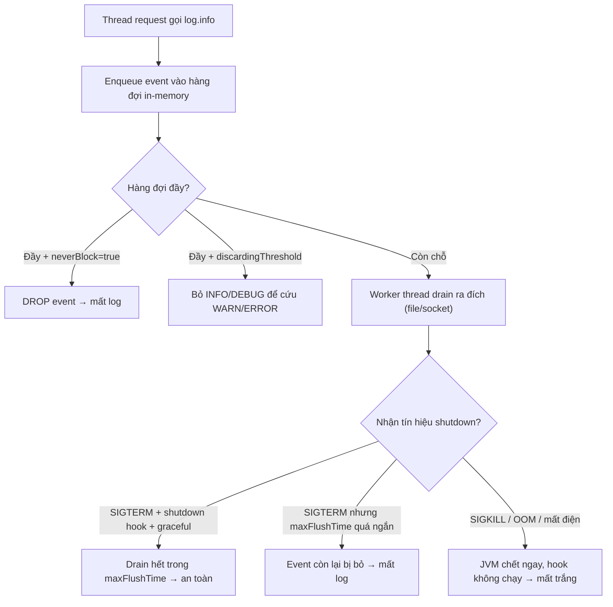

# Log async bị mất khi service shutdown. Vì sao?

## ⚡ Tóm tắt ngắn (30s)
* **Bản chất**: `AsyncAppender` (Logback) / `AsyncLogger` (Log4j2) không ghi log ngay — nó **đẩy event vào một hàng đợi in-memory**, một thread riêng mới drain hàng đợi ra đích thật. Khi service shutdown, **những event còn nằm trong hàng đợi mà chưa kịp drain sẽ mất** nếu không được flush. Đây là cái giá của việc đánh đổi *latency lấy độ bền*.
* **Vì sao mất (các tầng nguyên nhân)**:
  1. **Hàng đợi chưa được drain trước khi JVM thoát** — không đăng ký shutdown hook để `LoggerContext.stop()` gọi flush.
  2. **`discardingThreshold`**: khi hàng đợi đầy ~80%, AsyncAppender **mặc định bỏ luôn** event `TRACE/DEBUG/INFO` để cứu `WARN/ERROR`.
  3. **`maxFlushTime`** (mặc định 1000ms): lúc stop chỉ chờ flush trong ngần đó; event còn lại bị bỏ.
  4. **`neverBlock=true`**: hàng đợi đầy thì **drop** thay vì chặn → mất log dưới tải.
  5. **Bị `SIGKILL` (kill -9)**: JVM chết ngay, shutdown hook không chạy → **không cách nào cứu**.
* **Quyết định Senior**: với log thường, chấp nhận đánh đổi; với **log quan trọng (audit/giao dịch)** thì **không dùng async** hoặc phải đảm bảo **graceful shutdown + shutdown hook + flush** và ghi vào store bền.

---

## 🔍 Chi tiết bản chất thực chiến

### 1. Cơ chế của AsyncAppender — vì sao nhanh nhưng dễ mất
* Producer (thread request) chỉ `offer()` event vào `BlockingQueue` rồi đi tiếp → log gần như miễn phí với đường đi request. Một **worker thread** mới lấy event ra ghi đích (file/socket). Khoảng "trễ" giữa lúc enqueue và lúc ghi thật chính là **cửa sổ mất mát** nếu process chết trong khoảng đó.

### 2. Các tham số quyết định mất hay không (Logback)
* **`queueSize`** (mặc định 256): nhỏ thì dễ đầy → drop; lớn thì hấp thụ burst tốt nhưng tốn heap và **nhiều event treo lơ lửng** lúc shutdown.
* **`discardingThreshold`** (mặc định `queueSize/5` = 20%): khi chỗ trống còn dưới ngưỡng này, **lặng lẽ bỏ** event mức `INFO` trở xuống. Muốn không bỏ → đặt `0` (đánh đổi: dễ chặn/đầy hơn).
* **`neverBlock`** (mặc định `false`): `false` = đầy thì **chặn** producer (không mất nhưng làm chậm app); `true` = đầy thì **drop** (không chặn nhưng mất log).
* **`maxFlushTime`** (mặc định 1000ms): thời gian tối đa chờ drain khi `stop()`. Event chưa kịp ghi trong khoảng này bị bỏ.

### 3. Mắt xích shutdown — nơi log "bốc hơi"
* Để flush được, `LoggerContext` phải được `stop()` một cách có trật tự. Cần **đăng ký shutdown hook** của Logback (hoặc để Spring quản lý vòng đời) để khi nhận `SIGTERM`, app **ngừng nhận request mới → drain hàng đợi log → mới thoát**. Nếu app thoát "cứng" hoặc bị orchestrator (K8s) gửi `SIGKILL` sau khi hết `terminationGracePeriod`, hàng đợi mất trắng.

### 4. Ranh giới không cứu được
* `SIGKILL`/`kill -9`, OOM-killer, mất điện, container bị force-evict → JVM dừng **không chạy hook**. Với các sự kiện *bắt buộc không được mất* (audit tài chính, security event), đừng phụ thuộc async appender: ghi **đồng bộ** hoặc đẩy thẳng vào hàng đợi bền (Kafka) với xác nhận.

---

## 🎨 Sơ đồ trực quan: cửa sổ mất log của async appender khi shutdown



---

## 💻 Code thực chiến: BAD vs GOOD

### ❌ BAD: async không shutdown hook, dễ mất khi đầy và khi thoát
```xml
<configuration> <!-- ❌ Không có <shutdownHook> → hàng đợi không được flush khi stop -->
  <appender name="ASYNC" class="ch.qos.logback.classic.AsyncAppender">
    <!-- ❌ queue nhỏ + neverBlock=true: đầy là drop, không cảnh báo -->
    <queueSize>256</queueSize>
    <neverBlock>true</neverBlock>
    <appender-ref ref="FILE"/>
  </appender>
  <root level="INFO"><appender-ref ref="ASYNC"/></root>
</configuration>
```

### ✅ GOOD: shutdown hook + flush đủ + tách log quan trọng ra đồng bộ
```xml
<configuration>
  <!-- ✅ Đăng ký hook để khi stop sẽ drain hàng đợi trước khi JVM thoát -->
  <shutdownHook class="ch.qos.logback.core.hook.DefaultShutdownHook"/>

  <appender name="ASYNC" class="ch.qos.logback.classic.AsyncAppender">
    <queueSize>4096</queueSize>
    <discardingThreshold>0</discardingThreshold>  <!-- ✅ không tự bỏ INFO -->
    <maxFlushTime>5000</maxFlushTime>             <!-- ✅ cho đủ thời gian drain khi stop -->
    <neverBlock>false</neverBlock>                <!-- chặn nhẹ thay vì mất log thường -->
    <appender-ref ref="FILE"/>
  </appender>

  <!-- ✅ Log audit/giao dịch: ghi ĐỒNG BỘ, không qua async để không bao giờ mất -->
  <logger name="AUDIT" level="INFO" additivity="false">
    <appender-ref ref="AUDIT_FILE"/>
  </logger>

  <root level="INFO"><appender-ref ref="ASYNC"/></root>
</configuration>
```
```yaml
# ✅ Graceful shutdown: ngừng nhận request mới rồi mới thoát, để worker kịp drain log
server:
  shutdown: graceful
spring:
  lifecycle:
    timeout-per-shutdown-phase: 20s
# K8s: đặt terminationGracePeriodSeconds đủ lớn để hook chạy xong
```

---

## 📊 Bảng so sánh: sync vs async appender

| Tiêu chí | Sync appender | Async appender |
| :--- | :--- | :--- |
| **Latency với request** | Cao (ghi I/O trên thread request) | Thấp (chỉ enqueue) |
| **Mất log khi shutdown** | Không (ghi xong mới trả) | **Có thể**, nếu không flush hàng đợi |
| **Mất log khi quá tải** | Không (chặn) | Có (drop/discard tùy cấu hình) |
| **Rủi ro chặn request** | Cao khi đích chậm | Thấp (nếu `neverBlock`) |
| **Phù hợp** | Audit/giao dịch bắt buộc bền | Log vận hành khối lượng lớn |

---

## ⚠️ Common Gotchas & Questions follow-up

### 1. Cạm bẫy "tưởng async là không mất, cứ tăng queue là xong"
* Tăng `queueSize` chỉ làm **cửa sổ mất mát to hơn** lúc shutdown (càng nhiều event treo chưa ghi), đồng thời ngốn heap. Và dù cấu hình hoàn hảo, **`SIGKILL` vẫn xóa sạch hàng đợi** vì hook không chạy. Async về bản chất là *best-effort*; muốn bền tuyệt đối thì không dùng async cho luồng log đó.

### 2. Câu hỏi đào sâu từ interviewer
* **Interviewer: "Mỗi lần rolling-update trên Kubernetes, vài dòng log cuối của pod cũ biến mất. Nguyên nhân và cách khắc phục?"**
* **Trả lời**: Khi K8s rolling-update, nó gửi `SIGTERM` rồi chờ `terminationGracePeriodSeconds`, hết hạn mới `SIGKILL`. Nếu app dùng async appender mà (a) **không có graceful shutdown** nên thoát trước khi worker drain xong hàng đợi, hoặc (b) **grace period quá ngắn** so với `maxFlushTime`, thì các event còn trong hàng đợi của pod cũ bị mất — đúng là "vài dòng cuối". Khắc phục: bật `server.shutdown: graceful` (ngừng nhận request mới, chờ in-flight xong), **đăng ký shutdown hook của Logback** và đặt `maxFlushTime` đủ để drain, đồng thời **nới `terminationGracePeriodSeconds`** lớn hơn tổng thời gian drain. Quan trọng nhất: với log **bắt buộc không được mất** (audit, giao dịch) tôi **không để chúng đi qua async appender** mà ghi đồng bộ hoặc đẩy vào Kafka có ack — vì kể cả cấu hình tốt nhất, một `SIGKILL` do OOM hay timeout vẫn có thể cắt cụt hàng đợi async.
