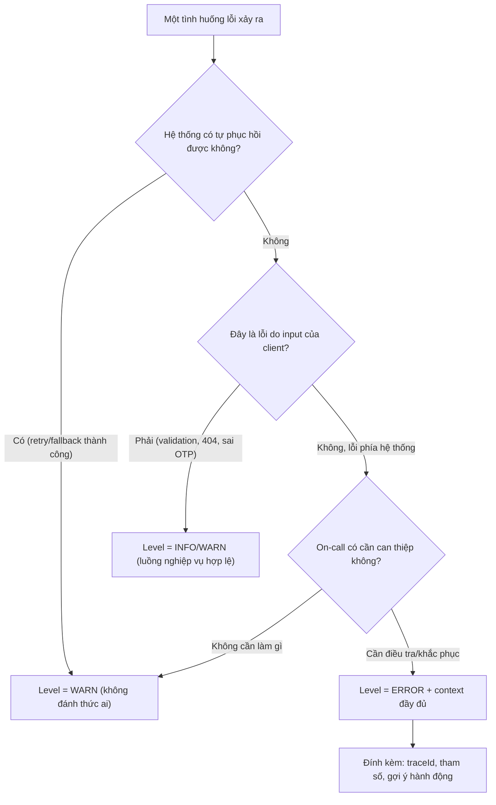

# Log ở level ERROR quá nhiều nhưng không actionable. Bạn làm gì?

## ⚡ Tóm tắt ngắn (30s)
* **Bản chất**: ERROR là level đắt nhất trong hệ thống log — nó là tín hiệu "có người cần thức dậy lúc 3h sáng". Khi log ERROR tràn lan nhưng **không actionable** (không ai cần làm gì, không thể làm gì, hoặc lỗi tự phục hồi), ta gặp hội chứng **alert fatigue**: on-call quen với việc bỏ qua ERROR, và đến khi một ERROR *thật* xuất hiện thì nó chìm nghỉm giữa 10.000 ERROR rác. Đây không phải vấn đề kỹ thuật thuần túy mà là **vấn đề tín hiệu/nhiễu (signal-to-noise)** làm hỏng toàn bộ giá trị của observability.
* **Nguyên nhân gốc thường gặp**:
  1. **Sai ngữ nghĩa level**: dùng ERROR cho lỗi nghiệp vụ bình thường (validation fail, user nhập sai OTP, 404 không tìm thấy resource) — những thứ này là `WARN`/`INFO`, không phải ERROR.
  2. **Lỗi đã được xử lý/retry thành công** vẫn log ERROR — lỗi transient đã tự lành thì không cần đánh thức ai.
  3. **Một sự cố phát sinh hàng loạt ERROR** (mỗi message lỗi log một dòng) thay vì gom nhóm.
* **Quyết định Senior**:
  1. **Định nghĩa lại hợp đồng level**: ERROR = cần con người can thiệp ngay/sớm. Còn lại hạ xuống WARN/INFO.
  2. **Phân loại lỗi nghiệp vụ vs lỗi hệ thống** ngay tại điểm xử lý exception (global handler).
  3. **Đặt mỗi ERROR một "actionable contract"**: mỗi dòng ERROR phải kèm đủ context để người đọc biết *làm gì tiếp theo*; nếu không thì nó không xứng đáng là ERROR.

---

## 🔍 Chi tiết bản chất thực chiến: ERROR là một lời hứa, không phải nơi xả rác

### 1. Hợp đồng ngữ nghĩa của các level (cần thống nhất toàn team)
* **ERROR**: hệ thống không hoàn thành được một việc đáng lẽ phải làm được, và **cần người can thiệp** hoặc cần điều tra. Ví dụ: mất kết nối DB, NPE không lường trước, gọi downstream timeout sau khi đã retry hết.
* **WARN**: có điều bất thường nhưng hệ thống tự xử lý được, hoặc là lỗi phía client. Ví dụ: retry lần 1 thất bại (lần sau thành công), circuit breaker mở, request bị rate-limit, fallback được kích hoạt.
* **INFO**: sự kiện nghiệp vụ bình thường. Validation fail, user nhập sai mật khẩu, đơn hàng bị từ chối vì hết hàng — **đây là luồng nghiệp vụ hợp lệ, không phải lỗi hệ thống**.

### 2. Vì sao "ERROR rác" phá hủy giá trị observability
* Nếu mỗi user nhập sai OTP đều sinh một dòng ERROR, một ngày có thể có hàng chục nghìn ERROR. On-call cấu hình alert "ERROR rate > X" sẽ buộc phải **tắt alert** hoặc nâng ngưỡng cao đến mức vô nghĩa. Kết quả: khi DB thực sự sập, không ai nhận ra vì ERROR rate vốn đã luôn cao.
* **Chi phí thật**: không chỉ là tiền lưu trữ log (mỗi GB ingest vào Datadog/ELK đều tốn tiền), mà là **mất khả năng phát hiện sự cố thật**.

### 3. Quy trình "chữa cháy" khi ERROR đã ngập
1. **Phân loại theo tần suất**: query aggregator nhóm ERROR theo message/exception type, tìm top 10 chiếm 90% volume.
2. **Với mỗi loại, hỏi 1 câu duy nhất**: "Khi thấy dòng này, on-call cần *làm gì*?". Nếu câu trả lời là "không làm gì" → hạ level hoặc xóa.
3. **Sửa tại nguồn**: chuyển lỗi nghiệp vụ sang WARN/INFO, gom lỗi hàng loạt, thêm context cho ERROR còn lại.

---

## 🎨 Sơ đồ trực quan: cây quyết định chọn level cho một tình huống lỗi



---

## 💻 Code thực chiến: BAD vs GOOD

### ❌ BAD: ERROR cho mọi exception, kể cả lỗi nghiệp vụ
```java
@PostMapping("/orders")
public ResponseEntity<?> create(@RequestBody OrderRequest req) {
    try {
        return ResponseEntity.ok(orderService.create(req));
    } catch (Exception e) {
        // ❌ Validation fail, hết hàng, sai input... tất cả đều thành ERROR
        // ❌ Stack trace tràn ngập log, on-call bị đánh thức vì user nhập sai
        log.error("Order failed", e);
        return ResponseEntity.badRequest().build();
    }
}
```

### ✅ GOOD: phân loại tại global handler, mỗi ERROR đều actionable
```java
@RestControllerAdvice
public class GlobalExceptionHandler {

    // ✅ Lỗi nghiệp vụ: luồng hợp lệ → INFO, không stack trace
    @ExceptionHandler(BusinessException.class)
    public ResponseEntity<ApiError> handleBusiness(BusinessException e) {
        log.info("Business rule rejected: code={} msg={}", e.getCode(), e.getMessage());
        return ResponseEntity.status(e.getHttpStatus()).body(ApiError.of(e));
    }

    // ✅ Lỗi hạ tầng đã có fallback → WARN, không đánh thức ai
    @ExceptionHandler(DownstreamUnavailableException.class)
    public ResponseEntity<ApiError> handleDownstream(DownstreamUnavailableException e) {
        log.warn("Downstream {} unavailable, served fallback. cause={}",
                 e.getService(), e.getMessage());
        return ResponseEntity.status(503).body(ApiError.degraded());
    }

    // ✅ ERROR thật sự: cần điều tra → kèm traceId + context để actionable
    @ExceptionHandler(Exception.class)
    public ResponseEntity<ApiError> handleUnexpected(Exception e, HttpServletRequest req) {
        log.error("Unhandled error path={} traceId={} - cần điều tra ngay",
                  req.getRequestURI(), MDC.get("traceId"), e);
        return ResponseEntity.status(500).body(ApiError.internal());
    }
}
```
```yaml
# ✅ Tắt ERROR rác từ thư viện bên thứ ba ồn ào trên production
logging:
  level:
    com.zaxxer.hikari.pool.ProxyConnection: WARN
    org.apache.kafka.clients.NetworkClient: WARN
```

---

## 📊 Bảng so sánh: ERROR "rác" vs ERROR "actionable"

| Tiêu chí | ERROR rác (anti-pattern) | ERROR actionable (chuẩn senior) |
| :--- | :--- | :--- |
| **Ai cần đọc?** | Không ai, bị bỏ qua mặc định | On-call, cần phản ứng |
| **Hành động kèm theo** | Không rõ phải làm gì | Biết ngay bước điều tra/khắc phục |
| **Context** | Chỉ có message chung chung | traceId, tham số, gợi ý nguyên nhân |
| **Lỗi nghiệp vụ (sai OTP, hết hàng)** | Log ERROR + stack trace | Log INFO, không stack trace |
| **Lỗi tự phục hồi (retry OK)** | Log ERROR | Log WARN hoặc bỏ qua |
| **Khả năng đặt alert** | Vô dụng (nhiễu quá cao) | `ERROR rate` là tín hiệu đáng tin |

---

## ⚠️ Common Gotchas & Questions follow-up

### 1. Cạm bẫy "log ERROR rồi ném lại exception" (double logging + sai level)
* Pattern phổ biến: tầng repository `catch` lỗi → `log.error(...)` → `throw` lại; tầng service lại `catch` → `log.error(...)` → `throw`; cuối cùng global handler lại `log.error(...)`. Một lỗi duy nhất sinh **ba dòng ERROR** ở ba layer, làm volume ERROR phình to giả tạo và gây rối khi điều tra. Quy tắc: **chỉ log ở một nơi** (thường là biên ngoài cùng/global handler), các tầng dưới chỉ ném exception kèm context. Đừng vừa log vừa throw.

### 2. Câu hỏi đào sâu từ interviewer
* **Interviewer: "Nếu hạ nhiều ERROR xuống WARN/INFO, làm sao bạn biết mình không vô tình giấu mất một lỗi thật sự nghiêm trọng?"**
* **Trả lời**: Việc đổi level phải dựa trên **tiêu chí actionable rõ ràng**, không phải cảm tính "cho đỡ ồn". Tôi không xóa thông tin, chỉ đổi *mức độ ưu tiên báo động* của nó: lỗi vẫn được ghi đầy đủ ở WARN/INFO và vẫn truy vấn được khi cần điều tra. Để chống rủi ro giấu lỗi thật, tôi làm hai việc: (1) **theo dõi tỷ lệ và xu hướng** của WARN/INFO bằng metric, không chỉ alert trên ERROR — ví dụ "tỷ lệ business-rejection tăng đột biến" vẫn cảnh báo được dù nó là INFO; (2) gắn **SLO/golden signals** (error rate ở tầng HTTP, latency, saturation) làm nguồn cảnh báo chính thay vì đếm dòng ERROR thô. Như vậy ERROR trở lại đúng vai trò "cần can thiệp ngay", còn các bất thường tinh vi vẫn được bắt qua metric và trend — đây là cách tách bạch giữa *điều tra* (cần log đầy đủ) và *báo động* (cần ít nhưng đáng tin).
