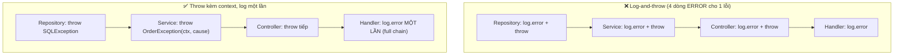

# Một exception được log nhiều lần ở nhiều layer. Có vấn đề gì?

## ⚡ Tóm tắt ngắn (30s)
* **Bản chất**: Đây là anti-pattern **"log-and-throw"** (hoặc "log-and-rethrow"): mỗi tầng `catch` exception, ghi log, rồi ném tiếp lên tầng trên — tầng trên lại làm y hệt. Kết quả là **một lỗi duy nhất sinh ra N dòng log gần giống nhau** (kèm N stack trace dài), thường ở các level khác nhau. Điều này phá hủy ba thứ: (1) **khả năng đếm/đặt alert** — một sự cố trông như nhiều sự cố, ERROR count bị thổi phồng; (2) **khả năng điều tra** — engineer phải ghép thủ công xem các dòng có cùng nguồn gốc không; (3) **chi phí** — stack trace là thứ tốn dung lượng nhất trong log, nhân lên N lần.
* **Tác hại tinh vi hơn**: ngữ cảnh bị phân mảnh — mỗi dòng log thiếu một phần thông tin (tầng dưới biết tham số kỹ thuật, tầng trên biết context nghiệp vụ), không dòng nào đủ để hiểu trọn vẹn.
* **Quyết định Senior**:
  1. **Quy tắc vàng: "log HOẶC throw, không cả hai"**. Tầng nào không xử lý được lỗi thì chỉ *ném tiếp* (có thể bọc thêm context), không log.
  2. **Chỉ log một lần ở biên ngoài cùng** — nơi exception thực sự bị "nuốt" (global handler, message listener, scheduler boundary).
  3. **Bọc context bằng exception chaining** (`new XxxException(msg, cause)`) thay vì log, để stack trace gốc được giữ nguyên và context tích lũy.

---

## 🔍 Chi tiết bản chất thực chiến: vì sao "log mỗi tầng cho chắc" lại phản tác dụng

### 1. Một lỗi → nhiều dòng = sai số liệu vận hành
* Giả sử luồng: `Repository` → `Service` → `Controller` → `@RestControllerAdvice`. Nếu mỗi tầng `log.error`, một request lỗi tạo **4 dòng ERROR**. Dashboard "ERROR per minute" hiển thị gấp 4 lần thực tế. On-call thấy spike khổng lồ, tưởng sự cố lan rộng, trong khi thực ra chỉ có 1 loại lỗi.
* Tệ hơn: nếu các dòng dùng wording khác nhau, công cụ gom nhóm (log clustering) coi chúng là 4 vấn đề riêng biệt.

### 2. Ngữ cảnh phân mảnh — không dòng nào kể trọn câu chuyện
* Tầng repository log: `SQLException: connection timeout`. Tầng service log: `Failed to place order`. Tầng controller log: `Request failed`. Engineer phải tự nối: lỗi DB timeout → khi đặt hàng → cho request nào? **Không có một dòng duy nhất chứa đủ**: traceId + nghiệp vụ + nguyên nhân kỹ thuật.
* Giải pháp đúng: tích lũy context **vào chính exception** khi ném lên, để khi log một lần ở cuối, stack trace + chain of causes chứa toàn bộ câu chuyện.

### 3. Stack trace nhân bản = đốt tiền và đốt I/O
* Một stack trace của Spring/Hibernate dễ dàng dài 50–100 dòng. Log 4 lần = 200–400 dòng cho một lỗi. Với hệ thống nhiều lỗi, đây là phần chiếm dung lượng log lớn nhất, đẩy chi phí ingest (Datadog/Splunk tính theo GB) và làm chậm cả việc đọc log khi điều tra.

### 4. Ngoại lệ hợp lý của quy tắc
* Được phép log ở tầng giữa **nếu tầng đó thực sự xử lý xong lỗi** (nuốt nó, không ném tiếp) — ví dụ retry thành công thì log WARN. Hoặc khi **vượt qua một ranh giới mà context sẽ mất** (async boundary, thread pool) thì log thêm context là chấp nhận được. Nguyên tắc cốt lõi: log tại nơi *quyết định cuối cùng* về số phận của lỗi.

---

## 🎨 Sơ đồ trực quan: log-and-throw vs log một lần ở biên



---

## 💻 Code thực chiến: BAD vs GOOD

### ❌ BAD: mỗi tầng đều log rồi ném tiếp
```java
// Repository
public Order findById(Long id) {
    try {
        return jdbc.queryForObject(SQL, mapper, id);
    } catch (DataAccessException e) {
        log.error("DB query failed for order {}", id, e);  // ❌ log lần 1
        throw e;
    }
}

// Service
public Order place(Long id) {
    try {
        return repo.findById(id);
    } catch (Exception e) {
        log.error("Cannot place order {}", id, e);          // ❌ log lần 2 (cùng lỗi)
        throw new OrderException("place failed", e);
    }
}

// Controller advice
@ExceptionHandler(Exception.class)
public ResponseEntity<?> handle(Exception e) {
    log.error("Request failed", e);                         // ❌ log lần 3
    return ResponseEntity.status(500).build();
}
```

### ✅ GOOD: tầng dưới bọc context và ném; chỉ biên ngoài log một lần
```java
// Repository: không log, để exception nói chuyện
public Order findById(Long id) {
    return jdbc.queryForObject(SQL, mapper, id); // DataAccessException tự nổi lên
}

// Service: KHÔNG log, chỉ bọc thêm context nghiệp vụ vào exception
public Order place(Long id) {
    try {
        return repo.findById(id);
    } catch (DataAccessException e) {
        // ✅ Giữ nguyên cause, tích lũy context — không log
        throw new OrderException("place order failed, orderId=" + id, e);
    }
}

// Biên ngoài cùng: log MỘT lần, đầy đủ chain + traceId
@ExceptionHandler(Exception.class)
public ResponseEntity<ApiError> handle(Exception e, HttpServletRequest req) {
    // ✅ Một dòng duy nhất chứa trọn câu chuyện: nghiệp vụ + nguyên nhân gốc
    log.error("Unhandled error uri={} traceId={}", req.getRequestURI(),
              MDC.get("traceId"), e);
    return ResponseEntity.status(500).body(ApiError.internal());
}
```

---

## 📊 Bảng so sánh: log-and-throw vs log-once-at-boundary

| Tiêu chí | Log-and-throw mọi tầng | Log một lần ở biên (chuẩn senior) |
| :--- | :--- | :--- |
| **Số dòng log / 1 lỗi** | N (theo số tầng) | 1 |
| **ERROR count / alert** | Bị thổi phồng, sai lệch | Phản ánh đúng số sự cố |
| **Ngữ cảnh** | Phân mảnh, mỗi dòng thiếu một phần | Gom đủ vào một dòng + exception chain |
| **Stack trace** | Lặp N lần, tốn dung lượng | Một lần, đầy đủ chuỗi cause |
| **Điều tra** | Phải ghép thủ công nhiều dòng | Một entry point rõ ràng |
| **Cách truyền context** | Qua message log rời rạc | Qua exception chaining (giữ cause) |

---

## ⚠️ Common Gotchas & Questions follow-up

### 1. Cạm bẫy "nuốt cause khi rethrow" làm mất stack trace gốc
* Khi bọc lại exception, dev hay viết `throw new OrderException("place failed")` mà **quên truyền `e` (cause)**. Hậu quả: khi log ở biên, stack trace chỉ trỏ tới chỗ ném `OrderException`, còn nguyên nhân thật (DB timeout ở đâu) **biến mất hoàn toàn** — còn tệ hơn cả log nhiều lần. Luôn dùng constructor có `Throwable cause`: `new OrderException(msg, e)`. Tương tự, tránh `catch (Exception e) { throw new RuntimeException(e.getMessage()); }` vì nó cũng cắt đứt chain.

### 2. Câu hỏi đào sâu từ interviewer
* **Interviewer: "Trong kiến trúc microservice, một request đi qua nhiều service. Quy tắc 'log một lần' áp dụng thế nào khi mỗi service là một process riêng?"**
* **Trả lời**: Quy tắc "log một lần" áp dụng **trong phạm vi một service/một process** — mỗi service nên log lỗi một lần ở biên ngoài của *nó* (controller advice, message listener). Khi vượt ranh giới network sang service khác, exception không còn được "ném" qua mà được chuyển thành **response lỗi** (HTTP 5xx + error body). Lúc này, để vẫn truy được toàn bộ luồng, tôi dựa vào **distributed tracing**: mọi service propagate cùng một `traceId` (qua header W3C `traceparent`), và log của từng service đều đính kèm traceId đó trong MDC. Như vậy mỗi service log đúng một lần cho phần lỗi của mình, nhưng khi điều tra, tôi query toàn bộ log theo traceId trên hệ thống tập trung và dựng lại được bức tranh xuyên service. Điểm mấu chốt: ranh giới "log một lần" là **process boundary**, còn việc nối các mảnh xuyên service là nhiệm vụ của **correlation ID + tracing**, không phải của việc log lặp lại.
