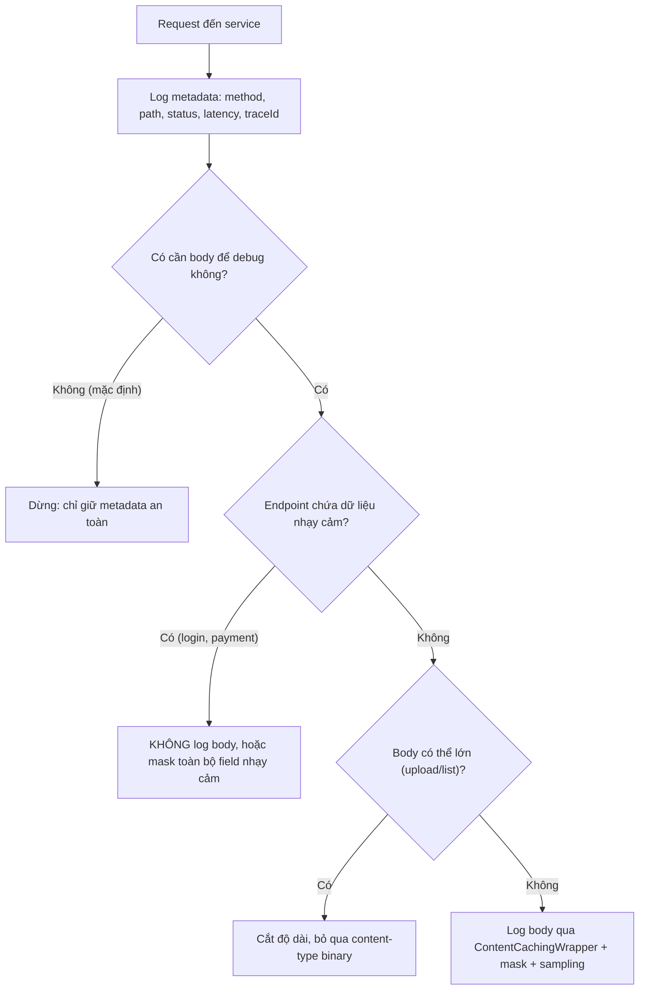

# Logging request/response body có rủi ro gì?

## ⚡ Tóm tắt ngắn (30s)
* **Bản chất**: Log nguyên `request body` và `response body` nghe có vẻ tiện cho debug, nhưng với một service production thật, nó là một quyết định **đầy rủi ro trên bốn mặt trận**: (1) **Bảo mật/tuân thủ** — body thường chứa PII, mật khẩu, token, số thẻ → lọt vào log tập trung và bị nhân bản khắp nơi; (2) **Hiệu năng** — serialize và ghi body lớn (upload, danh sách JSON nặng) ngốn CPU/I/O và làm phình log; (3) **Tính đúng đắn** — đọc body từ `InputStream` để log có thể **làm hỏng việc đọc body của controller** (stream chỉ đọc được một lần); (4) **Chi phí** — log body đẩy volume ingest lên hàng chục lần.
* **Tác hại đặc trưng**: body của endpoint upload file / báo cáo có thể là vài MB; log nó biến mỗi request thành vài MB log, làm sập pipeline log và tốn tiền khủng khiếp.
* **Quyết định Senior**:
  1. **Mặc định KHÔNG log body**; chỉ log metadata (method, path, status, latency, kích thước, traceId).
  2. Nếu thật sự cần body để debug → log **có điều kiện, có giới hạn, có masking**: chỉ bật cho endpoint/level cụ thể, cắt độ dài, mask field nhạy cảm, dùng `ContentCachingWrapper` để không phá stream.
  3. Coi việc log body là **opt-in có kiểm soát**, không phải mặc định bật toàn cục.

---

## 🔍 Chi tiết bản chất thực chiến: bốn rủi ro của việc log body

### 1. Rủi ro bảo mật & tuân thủ (nghiêm trọng nhất)
* Body của `/login`, `/register`, `/payment` chứa mật khẩu, CCCD, số thẻ, token. Log production gần như luôn được ship sang ELK/Datadog và nhân bản vào index nóng, cold storage, backup, SaaS bên thứ ba. Một khi body lọt vào đó, **không thể thu hồi** — đây là data exposure incident, có thể vi phạm Nghị định 13/2023, PCI-DSS, GDPR.

### 2. Rủi ro tính đúng đắn: stream chỉ đọc được một lần
* `HttpServletRequest.getInputStream()` là **one-shot**. Nếu một filter đọc stream để log body, controller phía sau sẽ nhận body rỗng → **app hỏng**. Phải dùng `ContentCachingRequestWrapper`/`ContentCachingResponseWrapper` (Spring) để buffer lại, nhưng điều này lại làm tăng dùng bộ nhớ vì giữ cả body trong RAM.

### 3. Rủi ro hiệu năng & bộ nhớ
* Buffer toàn bộ body để log nghĩa là **giữ cả payload trong heap**. Endpoint upload file 50 MB → mỗi request giữ 50 MB trong RAM chỉ để ghi log → dễ OOM khi tải cao. Serialize object lớn thành JSON để log cũng tốn CPU đáng kể.

### 4. Rủi ro chi phí & nhiễu
* Body làm volume log tăng hàng chục lần. Chi phí ingest (tính theo GB) tăng vọt, và quan trọng hơn là **log bị loãng**: thông tin hữu ích chìm trong biển JSON payload.

### 5. Cách làm đúng: log metadata, body là ngoại lệ có kiểm soát
* Mặc định log "access log" giàu thông tin nhưng an toàn: `method`, `uri`, `status`, `durationMs`, `requestSize`, `responseSize`, `userId`, `traceId`. Đủ để điều tra 90% sự cố mà không chạm vào nội dung nhạy cảm.
* Khi cần body để debug một bug cụ thể: bật **sampling/conditional**, **cắt độ dài** (ví dụ tối đa 2KB), **mask** field nhạy cảm, và chỉ ở môi trường/endpoint được phép.

---

## 🎨 Sơ đồ trực quan: quyết định có nên log body hay không



---

## 💻 Code thực chiến: BAD vs GOOD

### ❌ BAD: đọc stream trực tiếp, log toàn bộ body
```java
@Component
public class BodyLoggingFilter extends OncePerRequestFilter {
    @Override
    protected void doFilterInternal(HttpServletRequest req, HttpServletResponse res,
                                    FilterChain chain) throws IOException, ServletException {
        // ❌ Đọc hết stream → controller nhận body RỖNG, app hỏng
        String body = new String(req.getInputStream().readAllBytes(), StandardCharsets.UTF_8);
        // ❌ Log cả mật khẩu/token, không giới hạn độ dài, không mask
        log.info("Request body: {}", body);
        chain.doFilter(req, res);
    }
}
```

### ✅ GOOD: metadata mặc định, body có điều kiện + caching wrapper + mask + cắt
```java
@Component
public class AccessLogFilter extends OncePerRequestFilter {

    private static final int MAX_BODY = 2048; // chỉ giữ tối đa 2KB
    private static final Set<String> SENSITIVE_PATHS = Set.of("/api/login", "/api/payment");

    @Override
    protected void doFilterInternal(HttpServletRequest req, HttpServletResponse res,
                                    FilterChain chain) throws IOException, ServletException {
        // ✅ Wrapper buffer body để KHÔNG phá stream của controller
        var reqWrap = new ContentCachingRequestWrapper(req);
        var resWrap = new ContentCachingResponseWrapper(res);
        long start = System.currentTimeMillis();
        try {
            chain.doFilter(reqWrap, resWrap);
        } finally {
            long ms = System.currentTimeMillis() - start;
            // ✅ Luôn log metadata an toàn
            log.info("access method={} uri={} status={} ms={} reqSize={} traceId={}",
                     req.getMethod(), req.getRequestURI(), resWrap.getStatus(), ms,
                     reqWrap.getContentLength(), MDC.get("traceId"));
            // ✅ Body chỉ log khi DEBUG, không phải path nhạy cảm, đã mask & cắt
            if (log.isDebugEnabled() && !SENSITIVE_PATHS.contains(req.getRequestURI())) {
                log.debug("reqBody={}", maskAndTruncate(reqWrap.getContentAsByteArray()));
            }
            resWrap.copyBodyToResponse(); // ✅ bắt buộc, nếu không client nhận body rỗng
        }
    }

    private String maskAndTruncate(byte[] raw) {
        String s = new String(raw, StandardCharsets.UTF_8);
        s = s.replaceAll("(?i)(\"password\"\\s*:\\s*\")[^\"]*", "$1***");
        return s.length() > MAX_BODY ? s.substring(0, MAX_BODY) + "...(truncated)" : s;
    }
}
```

---

## 📊 Bảng so sánh: log toàn bộ body vs log metadata có kiểm soát

| Tiêu chí | Log toàn bộ body (anti-pattern) | Metadata + body có kiểm soát (senior) |
| :--- | :--- | :--- |
| **Lộ PII/secret** | Cao — body chứa password/token | Thấp — mặc định không log body, có mask |
| **Phá stream controller** | Có (nếu đọc trực tiếp) | Không — dùng ContentCachingWrapper |
| **Bộ nhớ** | Giữ cả payload lớn trong heap | Giới hạn (cắt 2KB), an toàn |
| **Chi phí ingest** | Tăng hàng chục lần | Thấp, ổn định |
| **Debug được không** | Được nhưng đánh đổi quá lớn | Được, qua DEBUG có điều kiện + sampling |
| **Endpoint upload/binary** | Log cả MB nhị phân vô nghĩa | Bỏ qua theo content-type/size |

---

## ⚠️ Common Gotchas & Questions follow-up

### 1. Cạm bẫy "quên copyBodyToResponse" làm client nhận body rỗng
* Khi dùng `ContentCachingResponseWrapper`, body response được buffer trong wrapper chứ chưa ghi ra client. Nếu quên gọi `resWrap.copyBodyToResponse()` trong `finally`, client sẽ nhận **response rỗng** dù log nhìn vẫn bình thường — một bug rất khó phát hiện vì code log "trông đúng". Đây là lý do nên dùng thư viện access-log đã được kiểm chứng (hoặc Spring `CommonsRequestLoggingFilter`) thay vì tự viết, và luôn có integration test kiểm tra body response không bị mất.

### 2. Câu hỏi đào sâu từ interviewer
* **Interviewer: "Team QA yêu cầu log full request/response để dễ trace bug ở môi trường staging. Bạn đáp ứng thế nào mà không tạo thói quen xấu lan sang production?"**
* **Trả lời**: Tôi tách bạch **chính sách theo môi trường** thay vì bật/tắt thủ công. Ở staging, tôi cho phép log body nhưng vẫn **giữ nguyên lớp masking và giới hạn độ dài** — vì staging thường dùng dữ liệu giống production và vẫn có thể chứa PII. Cụ thể: cấu hình log level và cờ `log-body-enabled` qua `application-staging.yml` (bật) và `application-prod.yml` (tắt), để hành vi khác nhau là do **cấu hình môi trường, không phải sửa code** — nhờ đó không có nguy cơ ai đó "lỡ tay" để chế độ verbose lọt lên prod. Quan trọng hơn, masking và truncate **không bao giờ tắt ở bất kỳ môi trường nào**: chúng là tính chất cố hữu của filter, không phải tùy chọn. Cuối cùng, tôi khuyến khích QA dùng `traceId` để correlate giữa request và log thay vì phụ thuộc vào việc đọc full body — điều này vừa an toàn vừa scale tốt khi lên production, nơi không bao giờ được phép log body thô.
