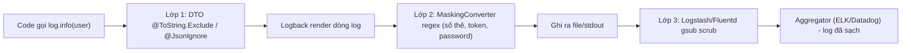

# Làm sao mask sensitive fields trong log?

## ⚡ Tóm tắt ngắn (30s)
* **Bản chất**: Masking là việc **thay thế/che giấu** dữ liệu nhạy cảm (mật khẩu, token, số thẻ, CCCD, email, số điện thoại) ngay tại điểm dữ liệu được ghi thành log, để bản log lưu trữ **không bao giờ chứa giá trị thật**. Điểm mấu chốt của một chiến lược masking đúng: **phòng thủ nhiều lớp** chứ không phụ thuộc một điểm duy nhất, và **mask càng gần nguồn càng tốt** — lý tưởng là dữ liệu nhạy cảm *không bao giờ được sinh ra dưới dạng thô* trong câu log.
* **Ba lớp phòng thủ (từ nguồn ra ngoài)**:
  1. **Tại model/DTO**: loại field nhạy cảm khỏi `toString()` (`@ToString.Exclude`, custom serializer) — chặn `log.info("{}", user)` lộ cả object.
  2. **Tại appender/converter của framework log** (Logback `MessageConverter`/`RewritePolicy`, Log4j2 `RewritePolicy`/pattern): quét regex và thay thế ngay khi render dòng log — lưới an toàn cho mọi logger.
  3. **Tại pipeline/sidecar** (Logstash/Fluentd `gsub`): scrub một lần nữa *trước khi* ship sang aggregator.
* **Quyết định Senior**: ưu tiên **không log dữ liệu nhạy cảm ngay từ đầu** (mask ở nguồn), coi lớp regex là *lưới an toàn* chứ không phải tuyến phòng thủ chính, vì regex luôn có khả năng bỏ sót định dạng mới.

---

## 🔍 Chi tiết bản chất thực chiến: vì sao masking cần nhiều lớp

### 1. Lớp 1 — chặn tại nguồn (hiệu quả & rẻ nhất)
* Nguyên nhân lộ phổ biến nhất là log nguyên object: `log.info("Creating user {}", user)` — Lombok `@ToString` in cả `password`, `ssn`. Sửa tại gốc bằng `@ToString.Exclude` trên field nhạy cảm, hoặc viết `toString()` thủ công chỉ phơi bày field an toàn.
* Với JSON serialization (khi log object dưới dạng JSON), dùng `@JsonIgnore` hoặc custom `@JsonSerialize(using = MaskingSerializer.class)` để field nhạy cảm tự động bị che khi serialize.

### 2. Lớp 2 — masking converter tại framework log (lưới an toàn toàn cục)
* Đây là tuyến bao phủ rộng nhất: một `MessageConverter`/`RewritePolicy` quét **mọi dòng log** bằng regex và thay thế các pattern nhạy cảm (số thẻ 16 chữ số, `"password":"..."`, bearer token). Ưu điểm: bắt được cả những chỗ dev quên mask thủ công. Nhược điểm: **tốn CPU** (regex trên mọi dòng) và **có thể bỏ sót** định dạng không lường trước → vì vậy chỉ là *lưới an toàn*, không thay thế lớp 1.

### 3. Lớp 3 — scrub tại pipeline trước khi rời server
* Logstash filter `mutate { gsub => [...] }` hoặc Fluentd `record_transformer` redact lần cuối trước khi log đi tới ELK/Datadog. Lớp này bảo vệ ngay cả khi app cũ chưa kịp vá, và là điểm kiểm soát tập trung cho compliance.

### 4. Kỹ thuật mask: che một phần để vẫn debug được
* Đừng xóa sạch — thường giữ lại đủ để debug mà không lộ: số thẻ `1234 56** **** 7890` (giữ 6 đầu + 4 cuối theo chuẩn PCI), email `j***@example.com`, số điện thoại `09****1234`. Với secret tuyệt đối (password, token): che **hoàn toàn** thành `***`, không giữ phần nào.

---

## 🎨 Sơ đồ trực quan: ba lớp masking từ nguồn đến aggregator



---

## 💻 Code thực chiến: BAD vs GOOD

### ❌ BAD: log nguyên object, không có lớp che nào
```java
public User register(RegisterRequest req) {
    User user = userMapper.toEntity(req);
    // ❌ @ToString của Lombok in cả password & ssn vào log
    log.info("Registering user: {}", user);
    return userRepo.save(user);
}
```

### ✅ GOOD: kết hợp lớp 1 (DTO) + lớp 2 (Logback converter) + lớp 3 (pipeline)
```java
// ✅ Lớp 1: loại field nhạy cảm khỏi toString & JSON
@Getter @Setter @ToString
public class User {
    private String username;
    private String email;
    @ToString.Exclude @JsonIgnore private String password;
    @ToString.Exclude private String ssn;
}
```
```java
// ✅ Lớp 2: Logback masking converter — lưới an toàn cho mọi dòng log
public class MaskingConverter extends MessageConverter {
    // số thẻ 13-16 số, bearer token, cặp "password":"..."
    private static final Pattern CARD = Pattern.compile("\\b(\\d{6})\\d{3,6}(\\d{4})\\b");
    private static final Pattern PWD  = Pattern.compile("(?i)(\"?password\"?\\s*[:=]\\s*\"?)[^\",\\s]+");
    private static final Pattern TOKEN= Pattern.compile("(?i)(bearer\\s+)[A-Za-z0-9._-]+");

    @Override
    public String convert(ILoggingEvent event) {
        String msg = super.convert(event);
        msg = CARD.matcher(msg).replaceAll("$1******$2");
        msg = PWD.matcher(msg).replaceAll("$1***");
        msg = TOKEN.matcher(msg).replaceAll("$1***");
        return msg;
    }
}
```
```xml
<!-- ✅ Đăng ký converter trong logback-spring.xml -->
<conversionRule conversionWord="mmsg"
    converterClass="com.example.logging.MaskingConverter"/>
<encoder><pattern>%d{ISO8601} %-5level [%X{traceId}] %logger - %mmsg%n</pattern></encoder>
```
```ruby
# ✅ Lớp 3: Logstash scrub lần cuối trước khi vào Elasticsearch
filter {
  mutate {
    gsub => [ "message", "(?i)(\"password\"\s*:\s*\")[^\"]+", "\1***" ]
  }
}
```

---

## 📊 Bảng so sánh: các lớp/kỹ thuật masking

| Tiêu chí | Lớp 1: DTO exclude | Lớp 2: Logback converter | Lớp 3: Pipeline gsub |
| :--- | :--- | :--- | :--- |
| **Vị trí** | Tại nguồn (code) | Khi render dòng log | Trước khi ship aggregator |
| **Phạm vi** | Object cụ thể | Mọi dòng log (toàn cục) | Mọi log đi qua pipeline |
| **Độ tin cậy** | Cao (dữ liệu không bao giờ sinh ra) | Trung bình (regex có thể sót) | Trung bình (tập trung, dễ quên format) |
| **Chi phí CPU** | Gần như 0 | Có (regex mỗi dòng) | Ở tầng pipeline, không tốn app |
| **Vai trò** | Tuyến phòng thủ chính | Lưới an toàn | Chốt chặn compliance cuối |
| **Điểm yếu** | Phải nhớ annotate từng field | Sót định dạng mới | App cũ vẫn ghi thô lên đĩa local |

---

## ⚠️ Common Gotchas & Questions follow-up

### 1. Cạm bẫy "mask rồi nhưng vẫn lộ qua đường khác"
* Mask ở message converter nhưng **quên rằng exception stack trace, MDC, và các marker cũng được ghi ra** — số thẻ nằm trong `IllegalArgumentException: invalid card 1234567890123456` sẽ lọt qua nếu converter chỉ xử lý phần message chính mà không xử lý phần `%ex`/throwable. Tương tự, log SQL của Hibernate ở DEBUG in cả tham số binding (`?` được thay bằng giá trị thật). Phải đảm bảo masking bao phủ **cả stack trace và SQL parameter logging**, và tắt DEBUG của package nhạy cảm trên production.

### 2. Câu hỏi đào sâu từ interviewer
* **Interviewer: "Regex masking tốn CPU và có thể bỏ sót. Có cách nào masking 'có cấu trúc' đáng tin hơn không?"**
* **Trả lời**: Có — chuyển từ masking *văn bản* sang masking *có cấu trúc* bằng **structured logging**. Thay vì log một câu chuỗi rồi quét regex, tôi log dưới dạng key-value/JSON (ví dụ qua `StructuredArgument` của logstash-logback-encoder), nơi mỗi field có tên rõ ràng. Khi đó masking trở thành thao tác **theo tên field** thay vì đoán mò qua pattern: một bộ lọc biết chính xác field `password`, `cardNumber`, `ssn` cần che, không phụ thuộc vào việc giá trị "trông giống" số thẻ hay không — vừa nhanh hơn (không quét toàn chuỗi) vừa không bỏ sót định dạng lạ. Tôi cũng dùng **chính sách "deny by default" cho field nhạy cảm**: định nghĩa một annotation/marker `@Sensitive` trên model, và một custom serializer tự động mask mọi field gắn nhãn đó khi nó được đưa vào log — biến masking thành thuộc tính của *dữ liệu* thay vì trách nhiệm của *người gọi log*. Lớp regex vẫn giữ làm lưới an toàn cuối, nhưng tuyến phòng thủ chính là cấu trúc và metadata, không phải biểu thức chính quy.
