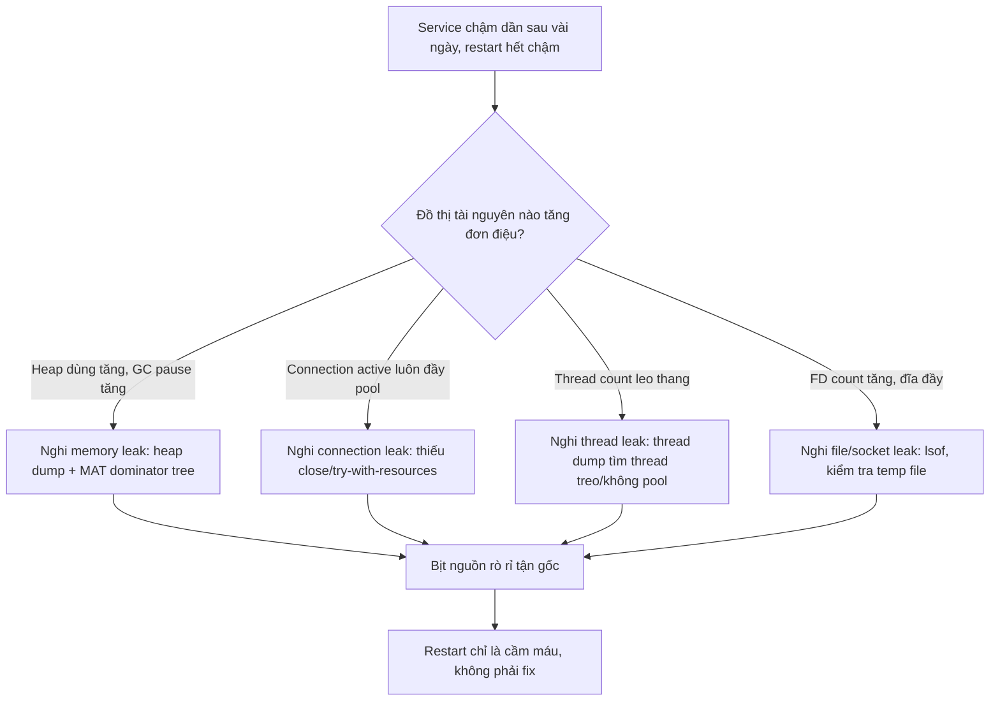

# Service chạy vài ngày thì chậm dần. Bạn nghi ngờ gì?

## ⚡ Tóm tắt ngắn (30s)
* **Bản chất**: Một service **mới deploy thì nhanh, chạy vài ngày thì chậm dần**, và **restart lại nhanh trở lại** — đây là dấu hiệu kinh điển của **rò rỉ tài nguyên tích lũy (resource leak)**, không phải vấn đề thuật toán hay tải đột biến. Đặc trưng "thời gian uptime tỉ lệ thuận với độ chậm, restart reset" loại trừ phần lớn nguyên nhân khác và chỉ về một hướng: có thứ gì đó **tăng đơn điệu theo thời gian** mà không được giải phóng.
* **Các nghi phạm hàng đầu (xếp theo tần suất)**:
  1. **Memory leak** → heap đầy dần → GC chạy ngày càng dày và lâu (GC pause nuốt CPU), cuối cùng OOM.
  2. **Connection/thread leak**: DB connection, HTTP client, thread không được release → pool cạn → request xếp hàng chờ.
  3. **Cache/collection không bao giờ expire** → cấu trúc dữ liệu phình to vô hạn.
  4. **File descriptor / temporary file leak** → cạn FD hoặc đầy đĩa.
* **Quyết định Senior**:
  1. **Xác nhận giả thuyết trước khi sửa**: vẽ đồ thị heap, thread count, connection active, FD theo thời gian — tìm đường **tăng đơn điệu không bao giờ giảm**.
  2. **Khoanh vùng bằng dữ liệu** (heap dump, thread dump), không đoán mò.
  3. **Restart chỉ là cầm máu tạm thời**, không phải cách sửa — phải tìm và bịt nguồn rò rỉ.

---

## 🔍 Chi tiết bản chất thực chiến: đọc "chữ ký" của leak

### 1. Vì sao "chậm dần theo uptime + restart hết chậm" = leak
* Tải, thuật toán, hay query chậm gây chậm **ngay lập tức và ổn định**, không "tích lũy theo ngày". Còn leak khiến một tài nguyên (RAM, connection, thread, FD) **chỉ tăng không giảm**; khi nó chạm trần, hệ thống bắt đầu suy thoái (GC pause, chờ pool, từ chối kết nối). Restart xóa sạch trạng thái tích lũy → nhanh lại → xác nhận giả thuyết.

### 2. Memory leak — nghi phạm số một
* Heap đầy dần khiến GC phải chạy **thường xuyên hơn và lâu hơn**; thời gian "stop-the-world" tăng dần làm latency p99 leo thang dù CPU nghiệp vụ không đổi. Cuối cùng heap không đủ → `OutOfMemoryError`. Nguồn phổ biến: collection static/cache không expire, `ThreadLocal` không `remove()`, listener/callback không gỡ đăng ký, object bị giữ bởi reference ngoài ý muốn.

### 3. Connection & thread leak — nghẽn cổ chai vô hình
* Mỗi DB connection/HTTP connection không `close()` chiếm một slot pool. Pool cạn → request mới **chờ lấy connection** (chứ không lỗi ngay) → latency tăng vọt rồi timeout. Thread leak (tạo thread không dùng pool, hoặc task treo trong pool) làm thread count leo thang → tốn RAM (mỗi thread ~1MB stack) và context-switch.

### 4. Cache/collection phình vô hạn
* Một `Map` static làm cache nhưng key không bao giờ expire (ví dụ cache theo `userId` cho hệ thống có hàng triệu user) → lớn dần đến khi nuốt hết heap. Đây vừa là memory leak vừa là lỗi thiết kế cache.

### 5. Quy trình điều tra chuẩn
1. **Monitoring trước**: nhìn đồ thị `jvm_memory_used`, `threads_live`, `hikari_connections_active`, FD count theo nhiều ngày → tìm đường dốc lên đều.
2. **Khoanh vùng**: heap dump (`jmap`/`jcmd`) khi heap cao → phân tích dominator tree bằng Eclipse MAT; thread dump khi thread cao.
3. **Tái hiện**: dùng load test chạy dài để ép leak lộ nhanh ở môi trường test.

---

## 🎨 Sơ đồ trực quan: chẩn đoán "chậm dần theo thời gian"



---

## 💻 Code thực chiến: BAD vs GOOD

### ❌ BAD: cache static không giới hạn + connection không đóng
```java
@Service
public class PricingService {
    // ❌ Map static làm cache nhưng không bao giờ evict → phình vô hạn theo userId
    private static final Map<Long, Quote> CACHE = new HashMap<>();

    public Quote quote(Long userId) {
        return CACHE.computeIfAbsent(userId, this::computeQuote);
    }

    public int countActive() throws SQLException {
        // ❌ Connection lấy từ pool nhưng không đóng → leak, pool cạn dần
        Connection c = dataSource.getConnection();
        ResultSet rs = c.createStatement().executeQuery("SELECT count(*) FROM active");
        rs.next();
        return rs.getInt(1);
    }
}
```

### ✅ GOOD: cache có bound + TTL, connection đóng bằng try-with-resources
```java
@Service
public class PricingService {
    // ✅ Cache giới hạn kích thước + hết hạn → không phình vô hạn
    private final Cache<Long, Quote> cache = Caffeine.newBuilder()
            .maximumSize(50_000)
            .expireAfterWrite(Duration.ofMinutes(10))
            .build();

    public Quote quote(Long userId) {
        return cache.get(userId, this::computeQuote);
    }

    public int countActive() throws SQLException {
        // ✅ try-with-resources đảm bảo connection trả về pool kể cả khi lỗi
        try (Connection c = dataSource.getConnection();
             Statement st = c.createStatement();
             ResultSet rs = st.executeQuery("SELECT count(*) FROM active")) {
            rs.next();
            return rs.getInt(1);
        }
    }
}
```
```yaml
# ✅ Bật metric để PHÁT HIỆN leak sớm qua dashboard, không đợi sập
management:
  metrics:
    enable:
      jvm: true
      hikaricp: true
  endpoints:
    web:
      exposure:
        include: health,metrics,prometheus,threaddump,heapdump
```

---

## 📊 Bảng so sánh: phân biệt các kiểu "chậm dần"

| Triệu chứng quan sát | Nghi phạm | Cách xác nhận | Hướng sửa |
| :--- | :--- | :--- | :--- |
| Heap tăng đều, GC pause tăng, cuối cùng OOM | Memory leak | Heap dump + Eclipse MAT | Bịt reference giữ object, cache có TTL |
| Connection active luôn = max, request chờ | DB connection leak | Metric Hikari, log "connection timeout" | try-with-resources, đóng đúng chỗ |
| Thread count leo thang, RAM tăng theo | Thread leak | Thread dump, đếm thread theo tên | Dùng pool có bound, không tạo thread thủ công |
| FD count tăng, "Too many open files" | Socket/file leak | `lsof`, FD metric | Đóng stream/socket, dùng client có pool |
| Đĩa đầy dần, IO chậm | Temp file / log không xoay vòng | `du`, kiểm tra thư mục temp | Cleanup temp, cấu hình log rotation |

---

## ⚠️ Common Gotchas & Questions follow-up

### 1. Cạm bẫy "đổ lỗi cho GC trong khi GC chỉ là nạn nhân"
* Thấy GC pause cao và CPU GC tăng, nhiều người vội đi tinh chỉnh GC (đổi collector, tăng heap). Nhưng nếu nguyên nhân gốc là **memory leak**, tăng heap chỉ **kéo dài thời gian giữa các lần OOM** chứ không sửa được — service vẫn chậm dần, chỉ chậm hơn vài ngày. GC làm việc nhiều là *triệu chứng*, không phải *nguyên nhân*. Luôn xác nhận bằng heap dump xem object nào tăng vô hạn trước khi đụng vào tham số GC. Tăng heap để "mua thời gian" chỉ hợp lý như biện pháp tạm thời, song song với việc tìm leak.

### 2. Câu hỏi đào sâu từ interviewer
* **Interviewer: "Service chậm dần nhưng heap, thread, connection đều ổn định — không thứ nào tăng đơn điệu. Bạn nghĩ đến gì tiếp theo?"**
* **Trả lời**: Khi các tài nguyên trong process đều phẳng, tôi mở rộng phạm vi nghi ngờ ra **bên ngoài JVM và các trạng thái tích lũy không nằm ở heap**. Vài hướng: (1) **Phía downstream**: database chậm dần do bảng phình to mà thiếu index/cleanup, hoặc plan cache của DB xấu đi, hoặc table bloat (Postgres) cần VACUUM — service "chậm" thực ra là chờ DB. (2) **Off-heap / native memory**: leak ở direct ByteBuffer, native library, hoặc metaspace (nạp class động không ngừng) — không hiện trong heap thường. (3) **Trạng thái bên ngoài**: cache phía Redis phình to, message queue tồn đọng (consumer lag tăng) khiến độ trễ end-to-end leo thang. (4) **Hệ điều hành**: page cache bị ép, fragmentation đĩa, hoặc "noisy neighbor" trên cùng host. Cách tiếp cận của tôi là **mở rộng cửa sổ quan sát ra ngoài service**: so sánh latency nội bộ (service tự đo) với latency của downstream, để biết thời gian bị mất *ở đâu* — nếu service nhanh nhưng chờ DB lâu dần thì gốc rễ nằm ở tầng dữ liệu, không phải ở process này.
