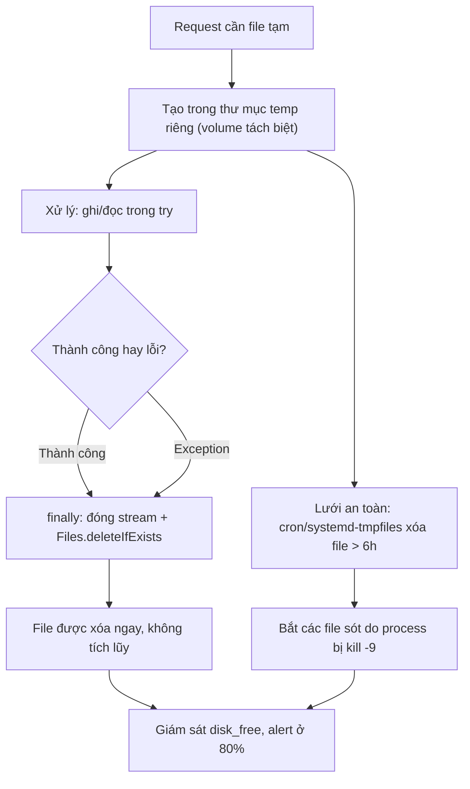

# Temporary file không cleanup gây disk full. Bạn xử lý ra sao?

## ⚡ Tóm tắt ngắn (30s)
* **Bản chất**: Temp file leak là khi ứng dụng **tạo file tạm** (xử lý upload, export báo cáo, giải nén, buffer dữ liệu lớn) nhưng **không xóa sau khi dùng xong** — đặc biệt khi có exception nhảy qua dòng xóa. Mỗi file tạm còn lại tích lũy trong `/tmp` (hoặc thư mục cấu hình); qua thời gian, đĩa đầy 100% → kéo theo toàn bộ hậu quả của "đĩa đầy" (không ghi được log, DB fail nếu chung volume, app crash). Đây là một resource leak kinh điển: chạy vài ngày thì đĩa đầy, **dọn `/tmp` thì hết tạm thời rồi tái diễn**.
* **Đặc trưng nhận biết**: `du -sh /tmp` lớn dần, đầy file dạng `tmpXXXX`, `upload_*`, `*.tmp`; lỗi `No space left on device` dù dữ liệu nghiệp vụ không tăng tương ứng.
* **Quyết định Senior**:
  1. **Đảm bảo xóa tuyệt đối**: try-with-resources / `Files.delete` trong `finally`, hoặc `deleteOnExit` (cẩn trọng), tốt nhất là pattern "tạo → dùng → xóa" có bảo đảm.
  2. **Hàng rào phòng thủ tầng hệ thống**: thư mục temp riêng + job cleanup định kỳ (hoặc systemd-tmpfiles) xóa file cũ hơn N giờ — lưới an toàn cho những file lọt lưới.
  3. **Giám sát dung lượng + alert ở 80%**, và cô lập temp trên volume riêng.

---

## 🔍 Chi tiết bản chất thực chiến

### 1. Vì sao temp file dễ leak hơn ta nghĩ
* `File.createTempFile()` tạo file nhưng **không tự xóa**. Nếu code xóa ở cuối method mà giữa chừng có exception (parse lỗi, downstream timeout), dòng `delete()` bị nhảy qua → file ở lại vĩnh viễn. Vì mỗi file thường nhỏ, leak không gây OOM ngay mà **âm ỉ làm đầy đĩa sau hàng nghìn–triệu request** — chậm và khó liên hệ tới nguyên nhân.

### 2. `deleteOnExit` — con dao hai lưỡi
* `file.deleteOnExit()` chỉ xóa khi **JVM thoát bình thường** — với service chạy liên tục hàng tháng, "exit" gần như không xảy ra → file vẫn tích lũy suốt thời gian chạy. Tệ hơn, mỗi lần gọi `deleteOnExit` còn **thêm một entry vào danh sách static giữ tên file vĩnh viễn trong heap** → bản thân nó là một memory leak nếu gọi hàng triệu lần. Nó **không phải** giải pháp cho service tồn tại lâu.

### 3. Pattern xóa đảm bảo
* Dùng `try { ... } finally { Files.deleteIfExists(path); }` để xóa kể cả khi lỗi. Hoặc với stream-based, đảm bảo đóng stream (try-with-resources) **trước khi** xóa (trên Windows không xóa được file đang mở). API hiện đại: tạo trong một thư mục làm việc của request rồi xóa cả thư mục, giảm rủi ro sót file lẻ.

### 4. Hàng rào tầng hệ thống — vì code luôn có thể sót
* Dù code cẩn thận tới đâu, vẫn có trường hợp process bị `kill -9` giữa chừng để lại file. Vì vậy luôn cần **lưới an toàn độc lập với app**: một cron/scheduled job hoặc `systemd-tmpfiles` quét thư mục temp, xóa file **cũ hơn ngưỡng an toàn** (ví dụ > 6 giờ — đủ lâu để không xóa nhầm file đang xử lý). Đây là defense-in-depth: code lo "đường chính", job lo "đường sót".

### 5. Cô lập & giám sát
* Đặt temp trên **volume/partition riêng** (cấu hình `java.io.tmpdir` hoặc thư mục app riêng) để temp đầy không giết DB/log. Giám sát `disk_free_percent` và alert ở 80%, đồng thời theo dõi số lượng/tổng kích thước file trong thư mục temp như một metric.

---

## 🎨 Sơ đồ trực quan: vòng đời temp file an toàn



---

## 💻 Code thực chiến: BAD vs GOOD

### ❌ BAD: tạo temp file, xóa ở cuối, leak khi có exception
```java
@Service
public class ReportExporter {

    public byte[] export(ReportRequest req) throws IOException {
        File tmp = File.createTempFile("report_", ".xlsx"); // ❌ không tự xóa
        writeWorkbook(tmp, req);          // ❌ nếu ném exception ở đây...
        byte[] data = Files.readAllBytes(tmp.toPath());
        tmp.delete();                     // ❌ ...dòng này bị nhảy qua → file ở lại mãi
        return data;
    }
}
```

### ✅ GOOD: xóa đảm bảo trong finally + thư mục riêng + job cleanup lưới an toàn
```java
@Service
public class ReportExporter {

    // ✅ Thư mục temp riêng, cấu hình được, tách khỏi /tmp hệ thống
    @Value("${app.tmp-dir:/var/app/tmp}")
    private Path tmpDir;

    public byte[] export(ReportRequest req) throws IOException {
        Files.createDirectories(tmpDir);
        Path tmp = Files.createTempFile(tmpDir, "report_", ".xlsx");
        try {
            writeWorkbook(tmp, req);
            return Files.readAllBytes(tmp);
        } finally {
            // ✅ Xóa kể cả khi writeWorkbook ném exception
            Files.deleteIfExists(tmp);
        }
    }
}
```
```java
// ✅ Lưới an toàn độc lập: dọn file sót (do crash/kill -9) cũ hơn 6 giờ
@Component
@RequiredArgsConstructor
public class TempFileJanitor {
    @Value("${app.tmp-dir:/var/app/tmp}")
    private Path tmpDir;

    @Scheduled(fixedDelay = 30, timeUnit = TimeUnit.MINUTES)
    public void cleanup() {
        if (!Files.isDirectory(tmpDir)) return;
        Instant cutoff = Instant.now().minus(Duration.ofHours(6));
        try (Stream<Path> files = Files.list(tmpDir)) {
            files.filter(p -> isOlderThan(p, cutoff))
                 .forEach(this::deleteQuietly); // bọc try-catch để 1 lỗi không giết job
        } catch (IOException e) {
            log.warn("temp cleanup failed dir={}", tmpDir, e);
        }
    }
}
```
```ini
# ✅ Hoặc giao cho hệ điều hành: systemd-tmpfiles xóa file > 6h trong thư mục app
# /etc/tmpfiles.d/app.conf
d /var/app/tmp 0750 app app 6h
```

---

## 📊 Bảng so sánh: cách quản lý temp file

| Cách làm | Đảm bảo xóa? | Hợp service chạy lâu? | Ghi chú |
| :--- | :--- | :--- | :--- |
| `delete()` ở cuối method | ❌ Không (leak khi exception) | — | Anti-pattern |
| `deleteOnExit()` | ❌ Chỉ khi JVM thoát | ❌ Không | Còn leak heap danh sách tên |
| `try/finally + deleteIfExists` | ✅ Có (kể cả khi lỗi) | ✅ Có | Tuyến chính |
| Thư mục/volume temp riêng | — | ✅ Cô lập thiệt hại | Tránh kéo theo DB/log |
| Cron/systemd-tmpfiles dọn file cũ | ✅ Lưới an toàn | ✅ Có | Bắt file sót do kill -9 |
| Giám sát disk + alert 80% | — | ✅ Có | Phát hiện sớm |

---

## ⚠️ Common Gotchas & Questions follow-up

### 1. Cạm bẫy "ngưỡng tuổi của job cleanup quá ngắn xóa nhầm file đang xử lý"
* Khi viết job dọn temp, cám dỗ là đặt ngưỡng thật ngắn (xóa file > 5 phút) để giải phóng đĩa nhanh. Nhưng nếu có một tác vụ hợp lệ đang xử lý file lớn lâu hơn ngưỡng đó (export báo cáo nặng mất 20 phút), job sẽ **xóa mất file đang được dùng** → tác vụ lỗi giữa chừng, có khi rất khó tái hiện. Ngưỡng phải **lớn hơn thời gian xử lý hợp lệ lâu nhất có thể** (cộng biên an toàn) — thường đặt vài giờ. An toàn hơn nữa: đặt file đang xử lý vào một **thư mục con theo request-id** và job chỉ xóa các thư mục mà ứng dụng đã đánh dấu "hoàn tất", hoặc dùng cơ chế lock/marker để job biết file nào đang active. Đừng đánh đổi "giải phóng đĩa nhanh" lấy nguy cơ phá hỏng tác vụ đang chạy.

### 2. Câu hỏi đào sâu từ interviewer
* **Interviewer: "Trong container/Kubernetes, temp file leak có gì khác so với máy chủ truyền thống, và bạn thiết kế để tránh nó thế nào?"**
* **Trả lời**: Trong môi trường container, bài toán vừa dễ hơn vừa có cạm bẫy mới. **Dễ hơn** ở chỗ container thường **ephemeral** — pod restart định kỳ (rollout, scaling) xóa sạch filesystem ghi-được, nên temp leak ít khi tích lũy hàng tháng như server truyền thống; đây là một "cleanup tự nhiên". **Nhưng** có vài điểm phải thiết kế cẩn thận: (1) Filesystem ghi của container thường nằm trên **lớp ghi của overlay (container writable layer)** hoặc `emptyDir` — nếu temp file leak nhanh, nó có thể làm **đầy đĩa của node** và ảnh hưởng *mọi pod trên node đó*, không chỉ pod lỗi (noisy neighbor). (2) Vì vậy tôi luôn gắn temp vào một **`emptyDir` volume riêng có `sizeLimit`** thay vì ghi vào rootfs — Kubernetes sẽ **evict pod khi nó vượt giới hạn**, biến leak thành sự cố khoanh vùng và quan sát được thay vì làm chết node. (3) Tôi đặt `java.io.tmpdir` trỏ vào volume đó, đặt **ephemeral-storage requests/limits** ở pod spec để scheduler và kubelet kiểm soát. (4) Vẫn giữ pattern xóa-trong-finally trong code, vì restart pod là lưới an toàn *thô* (mất cả dữ liệu đang xử lý), không thay thế cho việc dọn dẹp đúng. Tóm lại: container cho ta một mạng lưới an toàn nhờ tính ephemeral, nhưng tôi không **dựa** vào restart để che giấu leak — tôi giới hạn ephemeral-storage để leak không lan ra node, và vẫn xóa file chủ động trong code như trên server thường.
