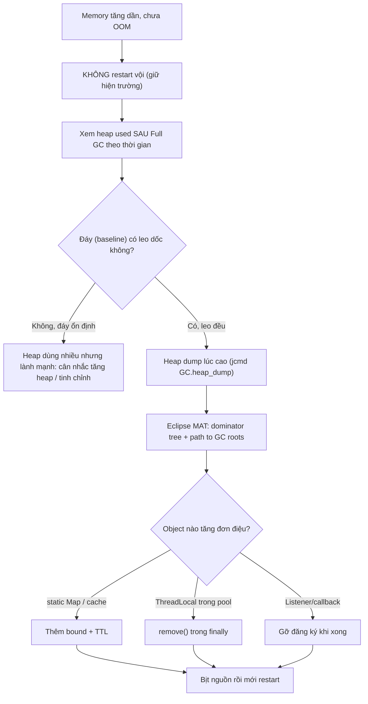

# Memory tăng dần nhưng chưa OOM. Bạn xử lý thế nào?

## ⚡ Tóm tắt ngắn (30s)
* **Bản chất**: "Memory tăng dần nhưng chưa OOM" là **cửa sổ vàng để điều tra** — service vẫn sống nên ta có thể lấy bằng chứng *trong khi vấn đề đang diễn ra*, thay vì khám nghiệm sau khi nó đã chết. Sai lầm lớn nhất là vội restart: restart **xóa sạch hiện trường** và reset đồng hồ, khiến leak quay lại sau vài ngày mà ta vẫn không biết nguyên nhân. Việc đầu tiên không phải là "cứu", mà là **thu thập chứng cứ rồi mới quyết định**.
* **Phân biệt cốt lõi**: không phải mọi đường heap đi lên là leak. Cần tách **"memory leak thật"** (object tăng đơn điệu, không bao giờ được GC thu) với **"heap dùng nhiều nhưng lành mạnh"** (tăng rồi giảm sau Full GC — chỉ là heap chưa cần dọn). Bằng chứng quyết định: heap **sau Full GC** có giảm về mức cũ không?
* **Quy trình Senior**:
  1. **Quan sát**: vẽ đồ thị heap used *sau GC* theo thời gian → xác nhận đường nền (baseline) có leo dốc không.
  2. **Chụp bằng chứng**: lấy **heap dump** lúc memory cao (`jcmd <pid> GC.heap_dump`), phân tích dominator tree bằng Eclipse MAT.
  3. **Tìm thủ phạm**: object nào chiếm phần lớn heap và *vì sao chưa được giải phóng* (chuỗi GC root giữ nó).
  4. **Bịt nguồn**, rồi mới restart.

---

## 🔍 Chi tiết bản chất thực chiến

### 1. Đọc đồ thị heap đúng cách — nhìn đáy, không nhìn đỉnh
* Heap theo thời gian là một đường răng cưa: tăng dần rồi tụt mạnh mỗi lần GC. Điều quan trọng **không phải đỉnh** (đỉnh cao là bình thường — JVM dùng heap rảnh để hoãn GC) mà là **đáy sau Full GC**: nếu đáy này *cũng* leo lên đều theo ngày → có leak thật; nếu đáy ổn định → heap chỉ đang được dùng nhiều, không leak.
* Bật `-Xlog:gc*` (Java 9+) hoặc xem metric `jvm_memory_used{area="heap"}` ngay sau GC để đọc baseline.

### 2. Lấy heap dump đúng thời điểm — bằng chứng quyết định
* Khi memory đã cao **nhưng chưa OOM**, chủ động dump: `jcmd <pid> GC.heap_dump /tmp/heap.hprof` (hoặc `jmap -dump:live,format=b,file=...`). Tùy chọn `live`/`GC.heap_dump` ép một Full GC trước khi dump → dump chỉ chứa object *thực sự còn sống*, loại nhiễu rác chưa kịp dọn.
* Cũng nên cấu hình sẵn `-XX:+HeapDumpOnOutOfMemoryError -XX:HeapDumpPath=...` để nếu lỡ OOM thì vẫn có dump tự động.

### 3. Phân tích bằng Eclipse MAT — đi từ "to nhất" tới "vì sao chưa chết"
* Mở dump bằng MAT, xem **Dominator Tree** (object nào giữ nhiều RAM nhất) và chạy **Leak Suspects Report**. Câu hỏi then chốt với object nghi vấn: **"Path to GC Roots"** — chuỗi reference nào đang giữ nó sống? Thủ phạm điển hình: một `static Map`, một collection trong singleton bean, `ThreadLocal` trong thread pool, listener không gỡ.

### 4. Xác nhận trước khi kết luận
* So sánh **hai heap dump cách nhau vài giờ** (cùng tải): class nào tăng số instance đều đặn chính là kẻ rò rỉ. Đây là cách phân biệt chắc chắn nhất giữa leak và biến động bình thường.

---

## 🎨 Sơ đồ trực quan: quy trình điều tra memory tăng dần



---

## 💻 Code thực chiến: BAD vs GOOD

### ❌ BAD: listener đăng ký nhưng không bao giờ gỡ → leak chậm
```java
@Service
public class QuoteService {
    private final EventBus bus;

    public QuoteSession openSession(Long userId) {
        QuoteSession s = new QuoteSession(userId);
        // ❌ Đăng ký listener mỗi lần mở session nhưng KHÔNG gỡ khi đóng
        // → EventBus giữ strong ref tới session vĩnh viễn, heap baseline leo dốc
        bus.register(s);
        return s;
    }

    public void close(QuoteSession s) {
        s.markClosed(); // ❌ quên bus.unregister(s)
    }
}
```

### ✅ GOOD: gỡ đăng ký dứt khoát + cấu hình thu thập bằng chứng
```java
@Service
public class QuoteService {
    private final EventBus bus;

    public QuoteSession openSession(Long userId) {
        QuoteSession s = new QuoteSession(userId);
        bus.register(s);
        return s;
    }

    public void close(QuoteSession s) {
        try {
            s.markClosed();
        } finally {
            // ✅ Luôn gỡ listener → cắt reference, session được GC thu hồi
            bus.unregister(s);
        }
    }
}
```
```bash
# ✅ Lấy bằng chứng KHI service còn sống (chưa OOM), không restart vội
jcmd <pid> GC.heap_dump /tmp/heap-$(date +%s).hprof   # ép Full GC + dump live object
jcmd <pid> GC.class_histogram | head -30               # top class theo số instance & bytes
# Lấy 2 dump cách vài giờ rồi so sánh trong Eclipse MAT để tìm class tăng đơn điệu
```
```
# ✅ Cấu hình JVM dựng sẵn lưới an toàn
-XX:+HeapDumpOnOutOfMemoryError -XX:HeapDumpPath=/var/dumps -Xlog:gc*:file=/var/log/gc.log
```

---

## 📊 Bảng so sánh: leak thật vs heap dùng nhiều lành mạnh

| Tiêu chí | Memory leak thật | Heap dùng nhiều (lành mạnh) |
| :--- | :--- | :--- |
| **Heap sau Full GC (baseline)** | Leo dốc đều theo ngày | Ổn định quanh một mức |
| **Restart** | Nhanh lại rồi chậm dần tiếp | Không thay đổi pattern |
| **Class histogram theo thời gian** | Một số class tăng đơn điệu | Số instance dao động ổn định |
| **Cách xử lý** | Bịt nguồn giữ reference | Tăng heap / tinh chỉnh GC nếu cần |
| **Path to GC roots** | Trỏ về static/singleton/ThreadLocal | Là object tạm, GC thu được |
| **Kết cục nếu bỏ qua** | Chắc chắn OOM | Không OOM, chỉ dùng nhiều |

---

## ⚠️ Common Gotchas & Questions follow-up

### 1. Cạm bẫy "lấy heap dump làm treo service trên production"
* `jmap -dump` / `GC.heap_dump` **ép một Full GC và tạm dừng (stop-the-world) toàn bộ JVM** trong lúc ghi dump — với heap vài chục GB, pause có thể kéo dài nhiều giây tới hàng chục giây, đủ làm timeout hàng loạt request và trigger health-check fail → instance bị kill. Vì vậy trên production: ưu tiên dump trên **một instance đã rút khỏi load balancer**, hoặc dùng `jcmd GC.class_histogram` (nhẹ hơn nhiều, không ghi cả heap) để khoanh vùng trước, và lên lịch dump vào lúc tải thấp. Đừng vô tư chạy `jmap` trên instance đang phục vụ traffic.

### 2. Câu hỏi đào sâu từ interviewer
* **Interviewer: "Heap dump cho thấy phần lớn RAM là `byte[]` và `char[]` — những thứ quá chung chung. Bạn truy tiếp thế nào?"**
* **Trả lời**: `byte[]`/`char[]`/`String` đứng đầu dominator là chuyện bình thường vì chúng là khối xây dựng của mọi thứ — nhìn *kiểu* của chúng vô ích, phải nhìn **ai đang giữ chúng**. Trong Eclipse MAT tôi không dừng ở danh sách class lớn nhất mà chuyển sang câu hỏi "**ai sở hữu**": dùng tính năng **"Path to GC Roots → exclude weak/soft references"** trên các `byte[]` lớn để lần ngược lên object nghiệp vụ thật sự giữ chúng (ví dụ một `ArrayList` trong một singleton cache, hay một `LinkedHashMap` trong session store). Tôi cũng dùng **"Group by class loader"** và **"Merge Shortest Paths to GC Roots"** để gom các `byte[]` về cùng một chủ sở hữu chung. Thường chỉ vài bước là ra: hàng triệu `char[]` thực ra là `String` nằm trong các entry của một `HashMap` static không expire. Nguyên tắc: trong phân tích leak, *loại object rò rỉ ít quan trọng hơn chuỗi reference giữ nó sống* — luôn đi từ "vật to nhất" tới "GC root đang nắm nó".
