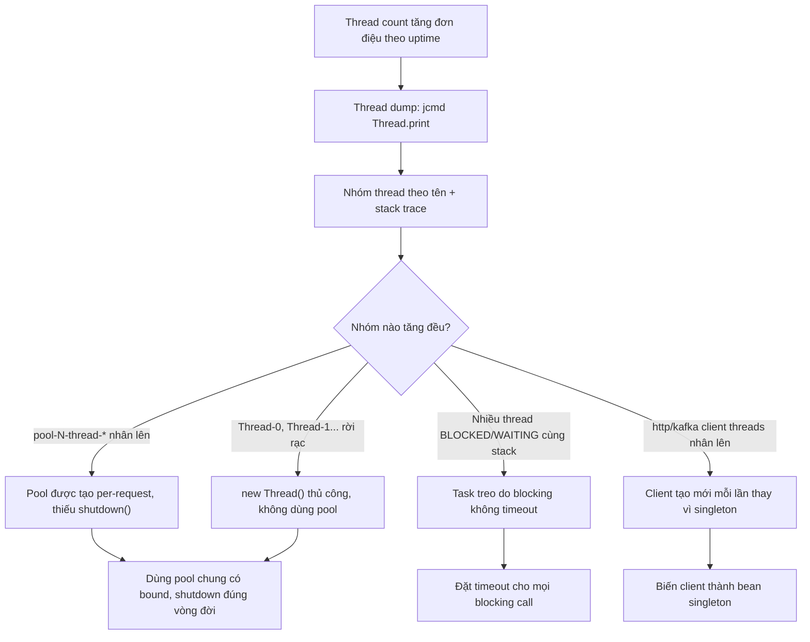

# Thread count tăng dần theo thời gian. Nguyên nhân có thể là gì?

## ⚡ Tóm tắt ngắn (30s)
* **Bản chất**: Số thread của một process **chỉ tăng không giảm** theo uptime là một dạng resource leak đặc biệt nguy hiểm, vì mỗi thread tốn **~512KB–1MB stack (off-heap)** cộng tài nguyên OS — thread count leo thang vừa ngốn native memory (có thể OOM kiểu `unable to create new native thread` dù heap còn trống), vừa tăng chi phí **context-switch** làm CPU bận rộn mà throughput giảm. Đặc trưng: thread count đi lên theo bậc thang và **không bao giờ tụt về baseline** dù tải đã giảm.
* **Các nguyên nhân gốc phổ biến**:
  1. **Tạo executor/pool mới trong vòng lặp hoặc per-request** mà không `shutdown()` — mỗi lần tạo một bộ thread mới sống mãi.
  2. **Thread/task bị treo** trong pool (chờ I/O không có timeout, deadlock) → pool phải sinh thêm thread (với cached pool) hoặc thread kẹt vĩnh viễn.
  3. **Tạo thread thủ công** (`new Thread().start()`) cho mỗi việc, không dùng pool.
  4. **Thư viện/client tự tạo pool riêng** mỗi lần khởi tạo (HTTP client, scheduler) mà không được đóng.
* **Quyết định Senior**:
  1. **Chụp thread dump** (`jstack`/`jcmd Thread.print`), **nhóm theo tên thread và stack trace** để tìm nhóm tăng đơn điệu.
  2. **Tập trung hóa thread pool**: dùng pool có bound, dùng chung, đặt tên rõ ràng — không tạo pool bừa bãi.
  3. **Mọi blocking call phải có timeout** để thread không kẹt vĩnh viễn.

---

## 🔍 Chi tiết bản chất thực chiến

### 1. Vì sao thread leak nguy hiểm theo cách riêng
* Stack của thread nằm ở **native memory, không phải heap** — nên thread leak gây OOM kiểu `OutOfMemoryError: unable to create new native thread` ngay cả khi `-Xmx` còn dư, dễ chẩn đoán nhầm. Ngoài ra, càng nhiều thread runnable thì OS càng tốn thời gian context-switch; CPU "bận 100%" nhưng phần lớn là chuyển ngữ cảnh chứ không phải làm việc hữu ích → throughput tụt.

### 2. Nguyên nhân #1 — tạo pool không đóng
* Anti-pattern kinh điển: `Executors.newFixedThreadPool(n)` được gọi **bên trong một method nghiệp vụ** chạy mỗi request. Mỗi lần tạo n thread mới; vì không gọi `shutdown()`, các thread đó **không bao giờ chết** (non-daemon, hoặc core thread giữ sống). Sau vài nghìn request → hàng nghìn thread. Đặt tên thread sẽ thấy nhóm `pool-1-thread-*`, `pool-2-thread-*`... tăng vô tận.

### 3. Nguyên nhân #2 — task treo vì blocking không timeout
* Với `newCachedThreadPool` (không giới hạn), nếu task block vào I/O không timeout, pool **liên tục sinh thread mới** cho task đến sau vì thread cũ chưa rảnh. Một downstream chậm/treo có thể làm thread count bùng nổ. Với pool cố định thì không bùng nổ nhưng task kẹt làm cạn pool → request xếp hàng.

### 4. Nguyên nhân #3 & #4 — thread thủ công & pool ẩn của thư viện
* `new Thread(task).start()` rải rác trong code, mỗi cái sống độc lập, không ai quản lý vòng đời. Tương tự, tạo mới một `HttpClient`/`RestTemplate`/Kafka producer/scheduler **mỗi lần dùng** — nhiều client tự ôm một thread pool I/O riêng → leak gián tiếp. Các client này phải là **singleton dùng chung**.

### 5. Chẩn đoán: thread dump + nhóm theo tên
* `jstack <pid>` hoặc `jcmd <pid> Thread.print` rồi đếm thread theo prefix tên. Nhóm nào tăng đơn điệu chính là nguồn. Đây là lý do **đặt tên thread có ý nghĩa** (qua `ThreadFactory`) là khoản đầu tư quý giá cho việc debug sau này.

---

## 🎨 Sơ đồ trực quan: truy nguồn thread leak



---

## 💻 Code thực chiến: BAD vs GOOD

### ❌ BAD: tạo executor mỗi request + blocking không timeout
```java
@Service
public class ReportService {

    public Report build(ReportRequest req) {
        // ❌ Tạo pool MỚI mỗi lần gọi, KHÔNG shutdown → thread sống mãi
        ExecutorService pool = Executors.newFixedThreadPool(8);
        List<Future<Section>> futures = req.getSections().stream()
                .map(s -> pool.submit(() -> fetchSection(s)))   // ❌ fetch không có timeout
                .toList();
        return assemble(futures); // ❌ pool không bao giờ được đóng
    }
}
```

### ✅ GOOD: pool dùng chung có bound, đặt tên, blocking có timeout
```java
@Configuration
public class ExecutorConfig {
    // ✅ MỘT pool dùng chung, có bound, thread đặt tên để dễ debug thread dump
    @Bean(destroyMethod = "shutdown")
    public ExecutorService reportExecutor() {
        ThreadFactory tf = new ThreadFactoryBuilder().setNameFormat("report-worker-%d").build();
        return new ThreadPoolExecutor(8, 16, 60, TimeUnit.SECONDS,
                new LinkedBlockingQueue<>(1000), tf,
                new ThreadPoolExecutor.CallerRunsPolicy()); // backpressure thay vì sinh vô hạn
    }
}

@Service
@RequiredArgsConstructor
public class ReportService {
    private final ExecutorService reportExecutor; // ✅ inject pool dùng chung

    public Report build(ReportRequest req) {
        List<Future<Section>> futures = req.getSections().stream()
                .map(s -> reportExecutor.submit(() -> fetchSection(s)))
                .toList();
        List<Section> sections = new ArrayList<>();
        for (Future<Section> f : futures) {
            try {
                // ✅ Timeout: thread không kẹt vĩnh viễn nếu downstream treo
                sections.add(f.get(5, TimeUnit.SECONDS));
            } catch (TimeoutException e) {
                f.cancel(true);
                throw new ReportTimeoutException("section timed out", e);
            } catch (InterruptedException | ExecutionException e) {
                Thread.currentThread().interrupt();
                throw new ReportException("section failed", e);
            }
        }
        return assemble(sections);
    }
}
```

---

## 📊 Bảng so sánh: nguyên nhân thread leak và cách khắc phục

| Dấu hiệu trong thread dump | Nguyên nhân | Hệ quả | Cách sửa |
| :--- | :--- | :--- | :--- |
| `pool-N-thread-*` với N tăng dần | Tạo executor per-request, thiếu shutdown | Hàng nghìn thread sống vĩnh viễn | Pool singleton dùng chung, có bound |
| Nhiều thread WAITING cùng stack I/O | Blocking call không timeout | Pool cạn / cached pool bùng nổ | Đặt timeout cho mọi blocking |
| `Thread-0..N` rời rạc | `new Thread().start()` thủ công | Không kiểm soát vòng đời | Luôn dùng pool đặt tên |
| Thread của HTTP/Kafka client nhân lên | Client tạo mới mỗi lần dùng | Mỗi client ôm pool riêng | Biến client thành singleton |
| Thread giữ nguyên runnable, CPU cao | Quá nhiều thread → context-switch | Throughput giảm dù CPU 100% | Giảm số pool, đặt bound hợp lý |

---

## ⚠️ Common Gotchas & Questions follow-up

### 1. Cạm bẫy "newCachedThreadPool nghe vô hại nhưng không có trần"
* `Executors.newCachedThreadPool()` rất hay bị lạm dụng vì "tiện, tự co giãn". Nhưng nó có `maximumPoolSize = Integer.MAX_VALUE`: khi downstream chậm và task đến nhanh hơn task hoàn thành, nó **tạo thread không giới hạn** cho tới khi cạn native memory và crash. Tương tự, `newFixedThreadPool` dùng `LinkedBlockingQueue` **không bound** — không leak thread nhưng leak *bộ nhớ hàng đợi* (task chất đống). Senior luôn tạo `ThreadPoolExecutor` tường minh với **cả maxPoolSize và queue đều có bound**, kèm một `RejectedExecutionHandler` (ví dụ `CallerRunsPolicy`) để tạo backpressure thay vì phình vô hạn.

### 2. Câu hỏi đào sâu từ interviewer
* **Interviewer: "Với Java 21 và virtual threads, vấn đề thread leak có còn không? Pool còn cần thiết không?"**
* **Trả lời**: Virtual thread thay đổi *bài toán* nhưng không xóa bỏ rủi ro. Virtual thread rất nhẹ (không gắn 1-1 với OS thread, stack nằm trên heap và co giãn), nên việc "có hàng triệu virtual thread block I/O" không còn gây OOM native như platform thread — và mô hình khuyến nghị là **không pool virtual thread** mà tạo mới mỗi tác vụ (`Executors.newVirtualThreadPerTaskExecutor()`). Vậy nên kiểu leak "thread pool tạo per-request không shutdown" gần như biến mất. **Nhưng** rủi ro chuyển hình dạng: (1) mỗi virtual thread vẫn giữ object trong stack/heap, nên "leak" giờ là **leak task không bao giờ kết thúc** — task block vào một blocking call không timeout vẫn treo vĩnh viễn, tích lũy thành leak bộ nhớ heap thay vì leak native thread; (2) hiện tượng **pinning** khi virtual thread block trong `synchronized` hoặc native call sẽ ghim platform carrier thread, làm cạn carrier pool — một dạng nghẽn mới. Vì vậy nguyên tắc cốt lõi vẫn nguyên giá trị: **mọi blocking call phải có timeout, mọi tác vụ phải có điểm kết thúc xác định**. Virtual thread giải phóng ta khỏi việc *đếm và pool thread*, nhưng không giải phóng khỏi kỷ luật quản lý vòng đời tác vụ.
