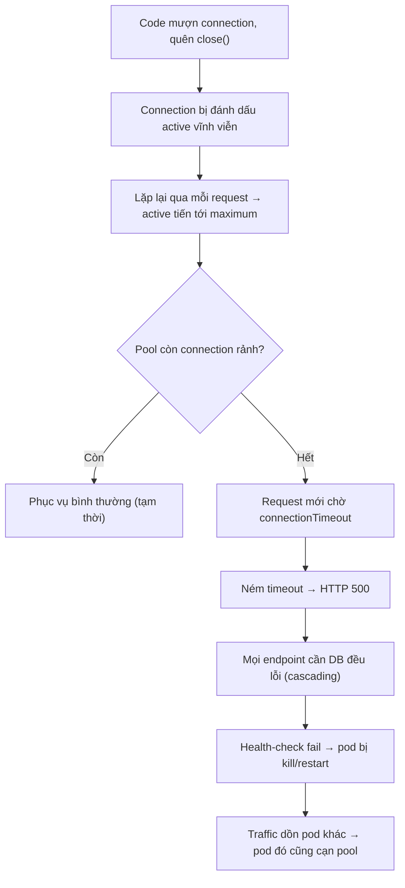

# DB connection không được release gây hậu quả gì?

## ⚡ Tóm tắt ngắn (30s)
* **Bản chất**: DB connection là tài nguyên **cực kỳ đắt và hữu hạn** — mỗi connection chiếm RAM phía DB server, một process/thread backend (Postgres), và pool phía ứng dụng thường chỉ giới hạn 10–50 connection. Khi connection được "mượn" từ pool mà **không trả về** (`close()`), nó bị đánh dấu là đang dùng vĩnh viễn (connection leak). Hậu quả dây chuyền: pool cạn dần → request mới **chờ lấy connection** đến khi timeout → service "treo" dù CPU/RAM còn rảnh → **cascading failure** lan ra toàn hệ thống vì mọi thứ đều cần DB.
* **Đặc trưng nhận biết**: lỗi `Connection is not available, request timed out after Xms` (HikariCP), latency tăng vọt theo thời gian, metric `hikari_connections_active` luôn chạm `maximum`, **restart thì hết** (reset pool) — chữ ký kinh điển của leak tích lũy.
* **Quyết định Senior**:
  1. **Đảm bảo release tuyệt đối**: dùng `try-with-resources` hoặc để framework (Spring `@Transactional`, JPA) quản lý — không tự `getConnection()` rồi quên `close()`.
  2. **Bật phát hiện leak của pool**: HikariCP `leakDetectionThreshold` để log stack trace của nơi giữ connection quá lâu.
  3. **Đặt connection pool nhỏ + có timeout** để leak lộ ra sớm (fail fast) thay vì âm thầm tích lũy.

---

## 🔍 Chi tiết bản chất thực chiến

### 1. Chuỗi hậu quả của connection leak
* **Pool cạn**: pool có 20 connection; mỗi request leak 1 connection → sau 20 request leak, pool hết sạch.
* **Request xếp hàng rồi timeout**: request thứ 21 gọi `getConnection()` → block chờ `connectionTimeout` (mặc định HikariCP 30s) → ném `SQLTransientConnectionException`. Người dùng thấy request "đứng hình" rồi lỗi 500.
* **Cascading failure**: vì gần như mọi endpoint đều cần DB, một khi pool cạn thì **toàn bộ service tê liệt**, không chỉ endpoint có bug. Health-check (nếu có query DB) cũng fail → orchestrator kill/restart pod → traffic dồn sang pod khác → pod đó cũng cạn → sập dây chuyền.

### 2. Vì sao leak xảy ra
* **Tự quản connection thủ công**: `getConnection()` mà không `close()` trong `finally`/try-with-resources, đặc biệt khi có exception nhảy qua dòng `close()`.
* **`ResultSet`/`Statement` không đóng**: giữ connection bận.
* **Transaction quên commit/rollback**: connection bị giữ trong transaction treo.
* **Gọi service ngoài/khối lượng tính toán lâu trong khi đang giữ connection**: không "leak" về mặt code nhưng giữ connection quá lâu → hiệu ứng tương tự cạn pool dưới tải.

### 3. Phát hiện sớm bằng pool metrics + leak detection
* HikariCP phơi bày `hikaricp_connections_active`, `_idle`, `_pending`, `_usage`. **`pending > 0` kéo dài** = đang có request chờ connection = báo động sớm. Bật `leakDetectionThreshold` (ví dụ 60s): nếu một connection bị giữ quá ngưỡng, Hikari **log stack trace của nơi mượn nó** — trỏ thẳng tới dòng code leak.

### 4. Triết lý "pool nhỏ + fail fast"
* Pool quá lớn che giấu leak (mất lâu mới cạn) và còn có thể làm **quá tải DB**. Pool được tinh chỉnh đúng kích thước + `connectionTimeout` ngắn khiến leak **lộ ra nhanh ở môi trường test/staging** thay vì âm ỉ tới production. Đây là tư duy "làm cho lỗi dễ thấy".

---

## 🎨 Sơ đồ trực quan: connection leak dẫn tới cascading failure



---

## 💻 Code thực chiến: BAD vs GOOD

### ❌ BAD: tự quản connection, leak khi có exception
```java
@Repository
public class AuditDao {
    private final DataSource ds;

    public void record(AuditEvent e) {
        try {
            Connection c = ds.getConnection();              // ❌ mượn connection
            PreparedStatement ps = c.prepareStatement(INSERT_SQL);
            ps.setString(1, e.getAction());
            ps.executeUpdate();
            // ❌ Nếu executeUpdate ném exception, connection KHÔNG bao giờ được close()
            ps.close();
            c.close();
        } catch (SQLException ex) {
            throw new RuntimeException(ex); // ❌ connection rò rỉ ở đây
        }
    }
}
```

### ✅ GOOD: try-with-resources + cấu hình leak detection
```java
@Repository
public class AuditDao {
    private final DataSource ds;

    public void record(AuditEvent e) {
        // ✅ try-with-resources: connection & statement LUÔN đóng kể cả khi lỗi
        try (Connection c = ds.getConnection();
             PreparedStatement ps = c.prepareStatement(INSERT_SQL)) {
            ps.setString(1, e.getAction());
            ps.executeUpdate();
        } catch (SQLException ex) {
            throw new AuditException("cannot record audit", ex);
        }
    }
}
```
```java
// ✅ Tốt hơn nữa: để Spring quản lý connection & transaction, không tự getConnection()
@Service
@RequiredArgsConstructor
public class AuditService {
    private final AuditRepository repo; // Spring Data JPA

    @Transactional // Spring đảm bảo connection được trả về pool khi method kết thúc
    public void record(AuditEvent e) {
        repo.save(e);
    }
}
```
```yaml
# ✅ Cấu hình HikariCP để PHÁT HIỆN leak và fail fast
spring:
  datasource:
    hikari:
      maximum-pool-size: 20           # pool vừa đủ, không che giấu leak
      connection-timeout: 5000        # chờ tối đa 5s rồi báo lỗi (fail fast)
      leak-detection-threshold: 60000 # giữ connection > 60s → log stack trace nơi leak
```

---

## 📊 Bảng so sánh: tự quản connection vs để framework quản lý

| Tiêu chí | Tự `getConnection()` thủ công | try-with-resources / Spring `@Transactional` |
| :--- | :--- | :--- |
| **Đảm bảo release** | Dễ quên, leak khi có exception | Tự động đóng / trả pool kể cả khi lỗi |
| **Quản lý transaction** | Thủ công, dễ quên rollback | Framework commit/rollback đúng |
| **Khả năng leak** | Cao | Rất thấp |
| **Phát hiện sớm** | Không có sẵn | Kết hợp leakDetectionThreshold + metric |
| **Hậu quả khi sai** | Cạn pool → cascading failure | Hiếm khi xảy ra |
| **Độ phức tạp code** | Nhiều boilerplate dễ sai | Gọn, tập trung vào nghiệp vụ |

---

## ⚠️ Common Gotchas & Questions follow-up

### 1. Cạm bẫy "giữ connection trong khi gọi service ngoài"
* Một dạng leak tinh vi không phải vì quên `close()` mà vì **giữ connection quá lâu**: trong một method `@Transactional`, code vừa query DB vừa gọi một REST API bên ngoài (hoặc gửi email, xử lý file). Suốt thời gian chờ API ngoài (có thể vài giây), connection vẫn bị transaction giữ chặt. Dưới tải cao, dù không có bug `close()`, pool vẫn cạn vì connection bị "ngâm" trong các transaction dài. Giải pháp: **giữ transaction ngắn nhất có thể** — đẩy lời gọi service ngoài ra *ngoài* ranh giới transaction, chỉ mở transaction quanh đúng các thao tác DB. Đây là lý do "transaction dài" và "gọi external trong transaction" bị xem là anti-pattern.

### 2. Câu hỏi đào sâu từ interviewer
* **Interviewer: "Bạn thấy `hikari_connections_pending` thỉnh thoảng nhảy lên rồi về 0, không phải leak rõ ràng. Điều đó nói lên gì và bạn chỉnh gì?"**
* **Trả lời**: `pending > 0` nghĩa là có thread đang **chờ lấy connection vì pool tạm hết** — nếu nó nhảy lên rồi về 0 (không tăng đơn điệu) thì đây thường **không phải leak**, mà là **pool bị under-provisioned so với mức đồng thời**, hoặc có những query/transaction chậm tạm thời chiếm hết connection trong các đợt burst. Tôi điều tra theo hai nhánh: (1) **Đo thời gian giữ connection** (`hikaricp_connections_usage`) — nếu p99 cao, vấn đề là **query/transaction chậm hoặc transaction giữ quá lâu**, cần tối ưu query, thêm index, hoặc rút ngắn transaction; tăng pool chỉ là vá triệu chứng. (2) Nếu thời gian giữ ngắn nhưng pending vẫn cao lúc burst, thì pool thực sự thiếu so với concurrency — nhưng tôi **không tăng pool vô tội vạ**, vì pool quá lớn sẽ đẩy gánh nặng sang DB (mỗi connection là một backend process). Tôi tính theo công thức kích thước pool dựa trên số core DB và thời gian giữ connection (theo khuyến nghị của HikariCP), thường pool nhỏ + query nhanh cho throughput cao hơn pool to + query chậm. Tóm lại: `pending` nhấp nháy là tín hiệu xem lại **độ dài giữ connection** trước, kích thước pool sau.
