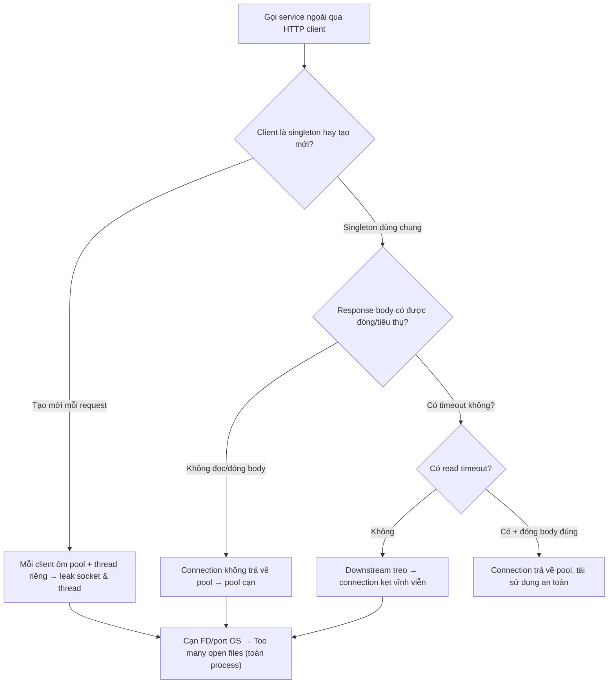

# HTTP client connection leak là gì?

## ⚡ Tóm tắt ngắn (30s)
* **Bản chất**: HTTP client connection leak là khi ứng dụng **mở kết nối HTTP tới service ngoài nhưng không giải phóng đúng cách** — không đọc/đóng response body, không trả connection về connection pool của client, hoặc tạo client mới mỗi lần gọi. Khác với DB connection leak (cạn pool app), HTTP client leak gây ra hai loại cạn kiệt: (1) **cạn connection pool của client** → các lời gọi tiếp theo treo chờ; (2) **cạn file descriptor / ephemeral port của OS** → lỗi `Too many open files` hoặc không mở được socket mới, ảnh hưởng *toàn process* chứ không riêng một downstream.
* **Hai thủ phạm kinh điển**:
  1. **Không tiêu thụ/đóng response body** với Apache HttpClient → connection không được trả về pool (nó chờ body được đọc hết mới reuse được).
  2. **Tạo client mới mỗi request** (`new RestTemplate()`, `HttpClient.newHttpClient()`, `WebClient.create()` trong vòng lặp) → mỗi client ôm một pool + thread I/O riêng, không bao giờ đóng → leak cả socket lẫn thread.
* **Quyết định Senior**:
  1. **Client là singleton dùng chung**, cấu hình connection pool có bound một lần.
  2. **Luôn đóng/tiêu thụ response** (try-with-resources hoặc dùng client tự quản lý như WebClient/RestClient).
  3. **Đặt connect timeout + read timeout** cho mọi lời gọi để connection không kẹt vĩnh viễn.

---

## 🔍 Chi tiết bản chất thực chiến

### 1. Cơ chế reuse connection — vì sao "không đọc body" lại leak
* HTTP client hiện đại dùng **keep-alive + connection pool**: sau một request, connection được giữ lại để tái sử dụng. Nhưng với Apache HttpClient, một connection chỉ được trả về pool khi **response entity đã được tiêu thụ hết** (`EntityUtils.consume`) hoặc `CloseableHttpResponse` được `close()`. Nếu code đọc status rồi bỏ qua body, connection bị kẹt ở trạng thái "đang dùng" → pool cạn dần. Đây là leak phổ biến nhất và khó thấy nhất.

### 2. Tạo client mới mỗi lần — leak kép (socket + thread)
* `new RestTemplate()` trông vô hại, nhưng nếu nó được tạo trong một method gọi mỗi request, mỗi instance ôm một connection manager riêng. Với `WebClient`/Netty hay async client, mỗi instance còn ôm một **event loop thread pool riêng** → vừa leak socket vừa leak thread. Client phải được khởi tạo **một lần** (bean singleton) và tái sử dụng.

### 3. Hậu quả ở tầng OS — không chỉ là pool
* Mỗi connection mở chiếm một **file descriptor** và một **ephemeral port**. Leak đủ nhiều → process chạm giới hạn FD (`ulimit -n`) → ném `Too many open files` cho *mọi* thao tác cần FD (kể cả mở file, accept socket mới) → toàn service tê liệt, không riêng phần gọi HTTP. Connection ở trạng thái `CLOSE_WAIT`/`TIME_WAIT` đọng lại cũng là dấu hiệu (`netstat`/`ss`).

### 4. Timeout — chốt chặn để connection không kẹt
* Nếu downstream treo và lời gọi **không có read timeout**, connection bị giữ vô thời hạn → pool cạn. Phải đặt cả **connect timeout** (thời gian bắt tay TCP) và **read/response timeout** (chờ dữ liệu). Mặc định nhiều client là *vô hạn* — một cái bẫy nguy hiểm.

---

## 🎨 Sơ đồ trực quan: HTTP client leak và điểm cạn kiệt



---

## 💻 Code thực chiến: BAD vs GOOD

### ❌ BAD: tạo client mỗi lần + không đóng response
```java
@Service
public class InventoryClient {

    public int stock(String sku) throws IOException {
        // ❌ Tạo HttpClient mới mỗi lần gọi → leak connection manager + thread
        CloseableHttpClient client = HttpClients.createDefault();
        HttpGet get = new HttpGet("https://inventory/api/stock/" + sku);
        CloseableHttpResponse resp = client.execute(get);
        // ❌ Đọc mỗi status, KHÔNG tiêu thụ/đóng body → connection không trả pool
        if (resp.getCode() == 200) {
            return parse(resp.getEntity());
        }
        return 0; // ❌ resp & client không bao giờ close()
    }
}
```

### ✅ GOOD: client singleton có pool + timeout + đóng response chắc chắn
```java
@Configuration
public class HttpClientConfig {
    // ✅ MỘT client dùng chung với pool có bound và timeout
    @Bean(destroyMethod = "close")
    public CloseableHttpClient httpClient() {
        var cm = new PoolingHttpClientConnectionManager();
        cm.setMaxTotal(100);
        cm.setDefaultMaxPerRoute(20);
        RequestConfig rc = RequestConfig.custom()
                .setConnectTimeout(Timeout.ofSeconds(2))
                .setResponseTimeout(Timeout.ofSeconds(5))   // ✅ tránh kẹt vĩnh viễn
                .build();
        return HttpClients.custom()
                .setConnectionManager(cm)
                .setDefaultRequestConfig(rc)
                .evictIdleConnections(TimeValue.ofSeconds(30))
                .build();
    }
}

@Service
@RequiredArgsConstructor
public class InventoryClient {
    private final CloseableHttpClient httpClient; // ✅ inject singleton

    public int stock(String sku) throws IOException {
        HttpGet get = new HttpGet("https://inventory/api/stock/" + sku);
        // ✅ try-with-resources đóng response → connection trả về pool kể cả khi lỗi
        return httpClient.execute(get, resp -> {
            if (resp.getCode() == 200) {
                return parse(resp.getEntity()); // handler tự tiêu thụ entity
            }
            EntityUtils.consume(resp.getEntity());
            return 0;
        });
    }
}
```
```java
// ✅ Với Spring 6: RestClient/WebClient quản lý vòng đời response tự động
@Bean
RestClient restClient(ClientHttpRequestFactory f) {
    return RestClient.builder().requestFactory(f).build(); // f cấu hình pool + timeout
}
```

---

## 📊 Bảng so sánh: dùng client đúng vs sai

| Tiêu chí | Tạo mới + không đóng body (sai) | Singleton + đóng + timeout (đúng) |
| :--- | :--- | :--- |
| **Connection pool** | Cạn dần, lời gọi treo | Tái sử dụng ổn định |
| **File descriptor / port** | Leak → Too many open files | Giới hạn, ổn định |
| **Thread** | Mỗi client ôm pool thread riêng | Một pool dùng chung |
| **Khi downstream treo** | Kẹt vĩnh viễn (không timeout) | Fail sau read timeout |
| **Phạm vi ảnh hưởng** | Toàn process (cạn FD) | Khoanh vùng, có backpressure |
| **Hiệu năng** | Bắt tay TCP/TLS lại mỗi lần | Keep-alive, tận dụng pool |

---

## ⚠️ Common Gotchas & Questions follow-up

### 1. Cạm bẫy "RestTemplate/WebClient nhiểu nhầm là an toàn"
* Nhiều người nghĩ `RestTemplate` của Spring tự lo connection nên cứ `new RestTemplate()` thoải mái. Thực tế, mặc định nó dùng `SimpleClientHttpRequestFactory` **không có connection pool** (mỗi request mở connection mới) và **không có timeout** — vừa kém hiệu năng vừa dễ kẹt khi downstream treo. Phải cấu hình tường minh một `ClientHttpRequestFactory` dựa trên Apache/OkHttp có pool + timeout, và **tái sử dụng instance** như một bean. Với `WebClient`, lỗi điển hình là `WebClient.create()` trong method nghiệp vụ — mỗi lần tạo một Netty resource mới; phải build một `WebClient` bean dùng chung. Mặc định "trông an toàn" thường là cái bẫy lớn nhất.

### 2. Câu hỏi đào sâu từ interviewer
* **Interviewer: "Bạn thấy hàng loạt connection ở trạng thái `CLOSE_WAIT` tới một downstream cứ tăng dần. Điều đó nghĩa là gì và lỗi thuộc về phía nào?"**
* **Trả lời**: `CLOSE_WAIT` tích tụ là một dấu hiệu rất đặc trưng: nó nghĩa là **đầu kia (downstream) đã gửi FIN để đóng connection, nhưng phía chúng ta (ứng dụng) chưa gọi `close()` để hoàn tất bắt tay đóng**. Nói cách khác, socket đang chờ *ứng dụng của ta* đóng nó — đây gần như luôn là **lỗi phía client của chúng ta**, cụ thể là **không đóng/không tiêu thụ response body** (hoặc giữ một `InputStream` mở). Connection kẹt ở `CLOSE_WAIT` vẫn chiếm một file descriptor, nên nó tăng đơn điệu chính là biểu hiện của HTTP client leak. Cách xử lý: tôi dùng `ss -tan state close-wait` để đếm và xác nhận chúng trỏ về downstream nào, rồi rà code đường gọi đó tìm chỗ response/stream không được đóng — thường là một nhánh lỗi (non-2xx) bỏ qua việc consume entity, hoặc một `InputStream` từ body không nằm trong try-with-resources. Khác biệt cần nhớ: `CLOSE_WAIT` đọng = *ta quên đóng*; còn `TIME_WAIT` nhiều = connection đóng quá thường xuyên (thường do không keep-alive, tạo connection mới liên tục) — hai chẩn đoán khác nhau dẫn tới hai cách sửa khác nhau.
