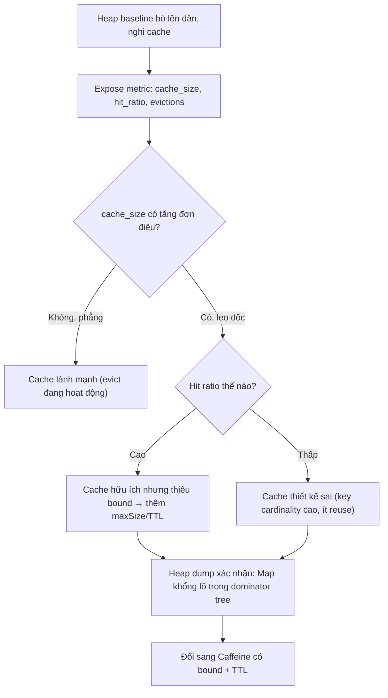

# Cache ngày càng lớn do key không expire. Bạn phát hiện thế nào?

## ⚡ Tóm tắt ngắn (30s)
* **Bản chất**: Đây là một **memory leak ngụy trang thành tính năng**: cache được thêm vào để tăng tốc, nhưng nếu key **không có chính sách hết hạn (TTL) và không có giới hạn kích thước (max size)**, nó trở thành một collection phình to vô hạn. Đặc biệt nguy hiểm khi key có **cardinality cao** (cache theo `userId`, `requestId`, `sessionId` của hệ thống hàng triệu user) — mỗi giá trị mới thêm một entry, không bao giờ bị xóa, đến khi nuốt hết heap và gây OOM. Bản chất nó vẫn là một `Map` chỉ-tăng-không-giảm.
* **Vì sao khó phát hiện**: cache leak chậm và âm thầm — service chạy tốt vài ngày, heap baseline bò lên dần, đến một ngày OOM "bất ngờ". Vì cache *được thiết kế để giữ dữ liệu*, nó không trông giống bug như một connection chưa đóng.
* **Cách phát hiện (theo thứ tự)**:
  1. **Metric**: theo dõi heap baseline (sau Full GC) và **kích thước cache** (số entry) như một metric chính thức → tìm đường tăng đơn điệu.
  2. **Heap dump + MAT**: dominator tree sẽ chỉ thẳng vào một `HashMap`/`ConcurrentHashMap` khổng lồ, "path to GC roots" trỏ về bean cache.
  3. **Class histogram theo thời gian**: số entry/instance của cache tăng đều.
* **Quyết định Senior**: cache **bắt buộc phải có bound** (maxSize) **và/hoặc TTL**; dùng thư viện cache chuyên dụng (Caffeine) thay vì `HashMap` tự chế; **expose metric cache** (size, hit/miss, eviction) ngay từ đầu.

---

## 🔍 Chi tiết bản chất thực chiến

### 1. Vì sao "HashMap làm cache" là quả bom hẹn giờ
* `private static final Map<K,V> cache = new HashMap<>()` không có cơ chế evict: entry chỉ được thêm, không bao giờ tự xóa. Nó là `static` (gắn với class loader, sống suốt vòng đời app) và là **GC root gián tiếp** giữ chặt mọi value → GC không bao giờ thu được. Với key cardinality cao, kích thước tăng tuyến tính theo số key duy nhất từng gặp.

### 2. Phát hiện chủ động bằng metric — tốt hơn là chờ OOM
* Cache chuyên dụng (Caffeine) cho phép `recordStats()` và đăng ký vào Micrometer: `cache_size`, `cache_evictions`, `cache_hit_ratio`. Vẽ `cache_size` lên dashboard: nếu nó **tăng đơn điệu không bao giờ phẳng** → cache không evict đúng. Đây là cách phát hiện *trước khi* sập, thay vì khám nghiệm tử thi.
* Đồng thời nhìn `jvm_memory_used` **sau Full GC**: nếu baseline leo dốc song song với cache_size → xác nhận cache là nguồn leak.

### 3. Heap dump khẳng định thủ phạm
* Khi nghi ngờ, lấy heap dump lúc heap cao, mở Eclipse MAT: **Dominator Tree** thường hiện một `ConcurrentHashMap`/`LinkedHashMap` chiếm phần lớn heap. "Path to GC Roots" trỏ về field cache trong một singleton bean. So sánh hai dump cách vài giờ: số entry tăng → chắc chắn là leak.

### 4. Bẫy cache hit ratio thấp = leak vô ích
* Một dấu hiệu tinh vi: cache phình to **nhưng hit ratio thấp**. Nghĩa là phần lớn entry được thêm vào rồi **không bao giờ được đọc lại** (key quá đặc thù, ví dụ cache theo `requestId` duy nhất). Cache này không những leak mà còn **vô dụng** — nó chỉ tốn RAM mà không tăng tốc gì. Metric hit ratio giúp phát hiện loại cache "thiết kế sai" này.

---

## 🎨 Sơ đồ trực quan: phát hiện cache leak



---

## 💻 Code thực chiến: BAD vs GOOD

### ❌ BAD: HashMap static làm cache, không bound, không TTL, không metric
```java
@Service
public class ProfileService {
    // ❌ Phình vô hạn theo userId, không evict, không quan sát được
    private static final Map<Long, Profile> CACHE = new ConcurrentHashMap<>();

    public Profile get(Long userId) {
        return CACHE.computeIfAbsent(userId, this::loadFromDb);
        // ❌ Mỗi user mới = 1 entry sống vĩnh viễn → OOM sau vài ngày
    }
}
```

### ✅ GOOD: Caffeine có bound + TTL + thống kê + đăng ký metric
```java
@Configuration
public class CacheConfig {
    // ✅ Cache có trần kích thước, hết hạn, ghi stats để quan sát
    @Bean
    public Cache<Long, Profile> profileCache(MeterRegistry registry) {
        Cache<Long, Profile> cache = Caffeine.newBuilder()
                .maximumSize(100_000)                    // ✅ bound: không phình vô hạn
                .expireAfterWrite(Duration.ofMinutes(15))// ✅ TTL: entry cũ tự bay
                .recordStats()                           // ✅ bật thống kê
                .build();
        // ✅ Đăng ký metric để dashboard cảnh báo sớm
        CaffeineCacheMetrics.monitor(registry, cache, "profile");
        return cache;
    }
}

@Service
@RequiredArgsConstructor
public class ProfileService {
    private final Cache<Long, Profile> profileCache;

    public Profile get(Long userId) {
        return profileCache.get(userId, this::loadFromDb);
    }
}
```
```yaml
# ✅ Hoặc dùng Spring Cache + Caffeine khai báo, vẫn có bound + TTL
spring:
  cache:
    type: caffeine
    caffeine:
      spec: maximumSize=100000,expireAfterWrite=15m,recordStats
```

---

## 📊 Bảng so sánh: HashMap tự chế vs cache chuyên dụng

| Tiêu chí | `HashMap`/`ConcurrentHashMap` tự chế | Caffeine (cache chuyên dụng) |
| :--- | :--- | :--- |
| **Giới hạn kích thước** | Không → phình vô hạn | `maximumSize` + thuật toán evict (W-TinyLFU) |
| **Hết hạn (TTL)** | Không có | `expireAfterWrite/Access` |
| **Quan sát (metric)** | Phải tự code | `recordStats` + Micrometer sẵn |
| **Phát hiện leak** | Chỉ biết khi OOM | Thấy `cache_size` tăng trên dashboard |
| **Hit ratio** | Không đo được | Đo được → phát hiện cache vô dụng |
| **Nguy cơ leak** | Cao | Thấp (evict tự động) |

---

## ⚠️ Common Gotchas & Questions follow-up

### 1. Cạm bẫy "soft/weak reference cache nghe an toàn nhưng phản tác dụng"
* Một số người tránh leak bằng cách dùng `WeakHashMap` hoặc cache `SoftReference` với lập luận "GC sẽ tự dọn khi thiếu RAM". Vấn đề: (1) `WeakHashMap` xóa entry khi **key** không còn reference mạnh — với key là `Long`/`String` thường vẫn bị giữ ở đâu đó, nên nó không dọn như kỳ vọng; (2) `SoftReference` chỉ được GC thu khi heap **sắp đầy**, tức là cache giữ RAM tới sát ngưỡng OOM rồi mới nhả hàng loạt → gây **Full GC dồn dập và latency spike** đúng lúc tải cao, hành vi rất khó đoán. Soft/weak cache cũng vô hiệu hóa khả năng evict theo TTL/LRU có kiểm soát. Cách đúng vẫn là **bound rõ ràng (maxSize) + TTL** với thuật toán evict xác định, để hành vi bộ nhớ dự đoán được — chứ không phó mặc cho GC.

### 2. Câu hỏi đào sâu từ interviewer
* **Interviewer: "Đặt `maximumSize` thì hết leak, nhưng làm sao chọn con số đó cho đúng? Và nếu cache phân tán (Redis) thì câu chuyện khác thế nào?"**
* **Trả lời**: Với cache in-process, tôi chọn `maximumSize` dựa trên **ngân sách bộ nhớ chứ không phải con số đẹp**: ước lượng kích thước trung bình một entry (đo bằng heap dump hoặc JOL), nhân với số entry, đảm bảo tổng nằm trong phần heap dành cho cache mà không ép GC. Tôi cũng dựa vào **hit ratio** để hiệu chỉnh: tăng size tới khi hit ratio không cải thiện thêm đáng kể thì dừng — vượt qua đó chỉ tốn RAM. Quan trọng là `maximumSize` biến cache thành **bộ nhớ có trần dự đoán được**, evict theo W-TinyLFU giữ lại entry "nóng". Với **Redis (cache phân tán)**, bài toán đổi chỗ chứ không biến mất: leak không còn ăn heap JVM mà ăn RAM của Redis, và Redis **không tự expire nếu bạn quên đặt TTL** — `SET` không kèm `EX` sẽ sống vĩnh viễn. Hậu quả là Redis chạm `maxmemory` rồi hành xử theo `maxmemory-policy`: nếu là `noeviction` thì lệnh ghi bắt đầu **lỗi** (làm sập tính năng), nếu là `allkeys-lru` thì nó evict cả key quan trọng. Vì vậy nguyên tắc giống hệt: **mọi key cache phải có TTL**, cấu hình `maxmemory` + policy evict phù hợp, và **giám sát `used_memory` + `evicted_keys`** của Redis như giám sát `cache_size` của Caffeine. Dù in-process hay phân tán, luật bất biến là: *không có cache nào được phép tăng vô hạn*.
