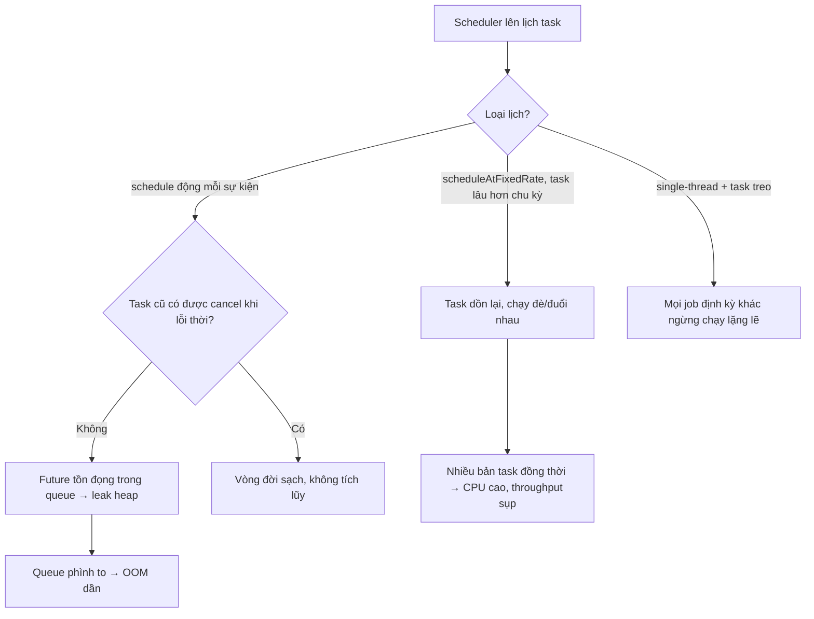

# Scheduler tạo task mới nhưng không cleanup task cũ. Hậu quả?

## ⚡ Tóm tắt ngắn (30s)
* **Bản chất**: Một scheduler (`ScheduledExecutorService`, Spring `@Scheduled`, Quartz, Timer) **liên tục lên lịch task mới mà không hủy/dọn task cũ** sẽ tích lũy task trong hàng đợi của scheduler. Mỗi `ScheduledFuture` chưa hoàn thành/chưa bị hủy giữ reference tới task (và mọi object task đó closure giữ), nên đây vừa là **memory leak** (queue và object phình to) vừa là **task pile-up** (task chồng chất, chạy đè lên nhau khi task cũ chạy lâu hơn chu kỳ). Hậu quả cuối: heap đầy dần, hoặc CPU bị nuốt bởi hàng loạt task trùng lặp chạy đồng thời, throughput sụp.
* **Hai biến thể nguy hiểm**:
  1. **Lên lịch lặp (`scheduleAtFixedRate`) cho task chạy lâu hơn chu kỳ** → task tràn, xếp hàng dồn cục, "đuổi nhau".
  2. **Lên lịch one-shot động trong runtime** (mỗi request/sự kiện tạo một scheduled task) nhưng không hủy task đã lỗi thời → `Future` tồn đọng.
* **Quyết định Senior**:
  1. **Mỗi task lên lịch phải có vòng đời rõ ràng**: hủy (`Future.cancel`) khi không còn cần, hoặc dùng `scheduleWithFixedDelay` để không chồng lấn.
  2. **Task phải có timeout/idempotent + chống chạy trùng** (đặc biệt khi nhiều instance).
  3. **Giám sát kích thước queue của scheduler** và số task active như metric.

---

## 🔍 Chi tiết bản chất thực chiến

### 1. `scheduleAtFixedRate` — cái bẫy "đuổi nhau"
* `scheduleAtFixedRate(task, 0, 1, MINUTES)` cố gắng chạy task **đúng mỗi phút bất kể task trước xong chưa**. Nếu task thỉnh thoảng mất 90 giây, lần chạy kế bị trễ và **dồn lại**; khi task nhanh trở lại, scheduler chạy bù nhiều lần liên tiếp → nhiều bản task chạy đồng thời, tranh tài nguyên, có thể gây hiệu ứng domino (mỗi lần chậm làm lần sau chậm hơn). Ngược lại `scheduleWithFixedDelay` chỉ lên lịch lần sau **sau khi lần trước hoàn tất** + delay → không bao giờ chồng lấn. Với single-thread scheduler, task chạy lâu còn **chặn mọi task khác** trong cùng scheduler.

### 2. Task động không hủy — leak Future
* Mẫu nguy hiểm: mỗi khi một entity được tạo, code `scheduler.schedule(() -> doSomething(entity), delay)` để xử lý sau. Nếu entity bị xóa/hủy trước khi task chạy mà task **không bị cancel**, `Future` vẫn nằm trong queue giữ reference tới `entity` và toàn bộ closure → leak. Sau hàng triệu sự kiện, queue khổng lồ. Tệ hơn, task vẫn chạy trên dữ liệu đã lỗi thời → lỗi nghiệp vụ.

### 3. Single-thread scheduler là điểm nghẽn ẩn
* `Executors.newSingleThreadScheduledExecutor()` chỉ có **một thread**: nếu một task treo (blocking không timeout), **mọi task scheduled khác đứng im vĩnh viễn** — không leak bộ nhớ nhưng "leak" khả năng thực thi, các job định kỳ (cleanup, heartbeat, refresh cache) im lặng ngừng chạy mà không báo lỗi rõ ràng. Đây là sự cố rất khó chẩn đoán.

### 4. Phát hiện
* Giám sát: kích thước queue của scheduled executor, thời gian chạy mỗi task, số lần task overrun (chạy lâu hơn chu kỳ). Heap dump khi nghi leak sẽ hiện `DelayedWorkQueue`/queue của Quartz đầy `ScheduledFutureTask`.

---

## 🎨 Sơ đồ trực quan: scheduler task pile-up



---

## 💻 Code thực chiến: BAD vs GOOD

### ❌ BAD: fixedRate + lên lịch động không hủy
```java
@Service
public class ReminderService {
    // ❌ Single-thread: một task treo làm mọi job khác đứng im
    private final ScheduledExecutorService scheduler =
            Executors.newSingleThreadScheduledExecutor();

    @PostConstruct
    void init() {
        // ❌ fixedRate: nếu syncAll() lâu hơn 1 phút → task dồn cục, chạy đè
        scheduler.scheduleAtFixedRate(this::syncAll, 0, 1, TimeUnit.MINUTES);
    }

    public void scheduleReminder(Order order) {
        // ❌ Mỗi order tạo một task, KHÔNG lưu Future để hủy khi order bị cancel
        scheduler.schedule(() -> sendReminder(order), 1, TimeUnit.HOURS);
    }
    // ❌ order bị hủy nhưng task vẫn nằm trong queue, giữ ref order → leak
}
```

### ✅ GOOD: fixedDelay + pool có bound + lưu Future để hủy + shutdown
```java
@Service
public class ReminderService {
    // ✅ Pool nhiều thread, đặt tên; mỗi task không chặn task khác
    private final ScheduledExecutorService scheduler =
            Executors.newScheduledThreadPool(4,
                new ThreadFactoryBuilder().setNameFormat("reminder-sched-%d").build());

    // ✅ Theo dõi Future của task động để hủy khi không còn cần
    private final Map<Long, ScheduledFuture<?>> pending = new ConcurrentHashMap<>();

    @PostConstruct
    void init() {
        // ✅ fixedDelay: lần sau chỉ chạy SAU khi lần trước xong + delay → không chồng lấn
        scheduler.scheduleWithFixedDelay(this::syncAll, 0, 1, TimeUnit.MINUTES);
    }

    public void scheduleReminder(Order order) {
        ScheduledFuture<?> f = scheduler.schedule(
                () -> { try { sendReminder(order); } finally { pending.remove(order.getId()); } },
                1, TimeUnit.HOURS);
        pending.put(order.getId(), f);
    }

    public void cancelReminder(Long orderId) {
        // ✅ Hủy task lỗi thời → cắt reference, dọn khỏi queue
        ScheduledFuture<?> f = pending.remove(orderId);
        if (f != null) f.cancel(false);
    }

    @PreDestroy
    void shutdown() {
        scheduler.shutdownNow(); // ✅ giải phóng thread khi app dừng
    }
}
```

---

## 📊 Bảng so sánh: lên lịch sai vs đúng

| Tiêu chí | fixedRate + không hủy (sai) | fixedDelay + hủy + bound (đúng) |
| :--- | :--- | :--- |
| **Chồng lấn task** | Có (task đuổi nhau khi chậm) | Không (chờ task trước xong) |
| **Leak Future/heap** | Có (task cũ tồn đọng) | Không (hủy + remove) |
| **Task treo ảnh hưởng** | Chặn mọi job (single-thread) | Khoanh vùng (pool nhiều thread) |
| **Dọn dẹp khi shutdown** | Thiếu → thread sống mãi | `shutdownNow()` trong `@PreDestroy` |
| **Chạy trên dữ liệu lỗi thời** | Có | Không (đã cancel) |
| **Quan sát** | Khó | Đếm `pending`, queue size |

---

## ⚠️ Common Gotchas & Questions follow-up

### 1. Cạm bẫy "exception nuốt task định kỳ vĩnh viễn"
* Một đặc tính ít người biết của `ScheduledExecutorService`: nếu task lặp (`scheduleAtFixedRate`/`WithFixedDelay`) **ném ra một exception không bắt**, scheduler **âm thầm hủy luôn các lần chạy tiếp theo** của task đó — không log, không cảnh báo. Kết quả: job cleanup/refresh của bạn "tự nhiên ngừng chạy" sau một lỗi tạm thời, và cache/temp file bắt đầu tích lũy mà không ai biết, dẫn tới chính các leak ở những câu hỏi khác. Vì vậy mọi task định kỳ phải **tự bọc try-catch toàn bộ thân hàm**, log lỗi và *nuốt* nó để vòng lặp tiếp tục sống. Đừng để một exception thoáng qua giết chết job vĩnh viễn.

### 2. Câu hỏi đào sâu từ interviewer
* **Interviewer: "Khi service chạy nhiều instance, scheduler `@Scheduled` chạy trên *mọi* instance cùng lúc. Điều đó gây ra vấn đề gì và bạn xử lý ra sao?"**
* **Trả lời**: Mặc định `@Scheduled` là **local theo từng JVM**, nên với N instance, một job định kỳ sẽ chạy **N lần đồng thời** — gây ra: (1) **trùng lặp công việc** (gửi N email, xử lý N lần cùng một batch), (2) **tranh chấp/đè dữ liệu** nếu job không idempotent, (3) **leak/quá tải nhân lên N lần** nếu bản thân job có vấn đề. Cách xử lý phụ thuộc yêu cầu: với job *nên chạy đúng một lần toàn cụm*, tôi dùng **distributed lock** — ShedLock là lựa chọn gọn nhất (mỗi lần chạy, instance phải giành được lock trong DB/Redis với một tên job + thời hạn; chỉ một instance chiếm được lock mới thực thi, các instance khác bỏ qua). Với khối lượng lớn cần phân tán, tôi chuyển sang **scheduler có điều phối cụm** như Quartz clustered (lưu trạng thái trong DB, đảm bảo mỗi trigger chỉ một node chạy) hoặc tách hẳn job ra một **message queue** để các instance consume cạnh tranh — vừa tránh trùng vừa scale ngang. Nguyên tắc nền: job định kỳ trong môi trường multi-instance phải **được thiết kế cho việc chạy đúng-một-lần hoặc idempotent ngay từ đầu**, không thể giả định "chỉ có một scheduler".
