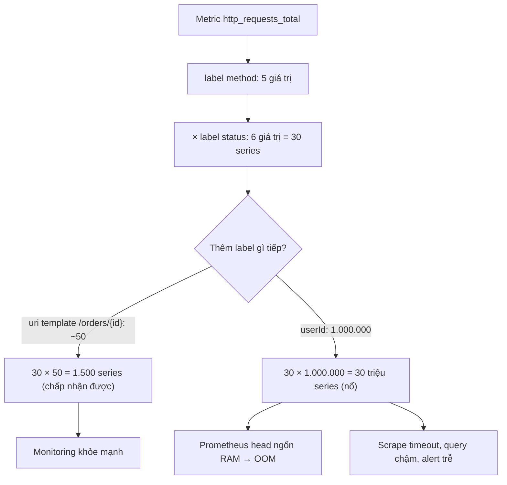

# Metrics cardinality quá cao làm monitoring chậm. Vì sao?

## ⚡ Tóm tắt ngắn (30s)
* **Bản chất**: Trong các hệ thống metric dạng dimensional (Prometheus, Micrometer), một metric được định danh bởi **tên + tập hợp các label (tag)**. Mỗi **tổ hợp giá trị label duy nhất** tạo ra một **time series riêng biệt** được lưu trong bộ nhớ. "Cardinality cao" nghĩa là số tổ hợp này bùng nổ — và vì nó là **tích Descartes** của số giá trị mỗi label, chỉ cần một label có giá trị không giới hạn (`userId`, `requestId`, `url` có path param thật, `email`) là số series nhảy từ vài chục lên hàng triệu. Mỗi series ngốn RAM, làm chậm ingest, query, và có thể đánh sập cả hệ thống monitoring (cardinality explosion).
* **Công thức trực giác**: tổng series $\approx \prod_i |label_i|$. Một metric có `method` (5 giá trị) × `status` (6) là 30 series; thêm `userId` (1 triệu) → **30 triệu series**.
* **Hậu quả**: Prometheus/agent ngốn RAM (mỗi series có overhead cố định + chuỗi sample), **query chậm** (phải quét hàng triệu series), scrape timeout, và đôi khi **OOM cả Prometheus** — tức là chính công cụ để quan sát sự cố lại trở thành nguồn sự cố.
* **Quyết định Senior**:
  1. **Label chỉ dùng cho giá trị có miền hữu hạn, nhỏ** (method, status, endpoint template, region).
  2. **Tuyệt đối không đưa giá trị unbounded** (id, email, full URL) vào label — những thứ đó thuộc về **log/trace**, không phải metric.
  3. **Chuẩn hóa** (`/orders/{id}` thay vì `/orders/123`) và đặt **giới hạn cardinality** ở client lẫn server.

---

## 🔍 Chi tiết bản chất thực chiến

### 1. Vì sao mỗi tổ hợp label = một time series tốn kém
* Trong mô hình dimensional, `http_requests_total{method="GET",status="200",uri="/orders/{id}"}` là **một series**; đổi bất kỳ label nào sang giá trị mới sẽ tạo **series mới hoàn toàn**, có chuỗi sample, index và metadata riêng. Prometheus giữ các series "active" trong bộ nhớ (head block) và đánh index theo label — mỗi series có chi phí RAM cố định (vài KB), nên 1 triệu series = vài GB RAM chỉ cho head. Cardinality là **nhân**, không phải cộng: đó là lý do nó "bùng nổ".

### 2. Nguồn cardinality explosion phổ biến
* **Id trong label**: `userId`, `orderId`, `sessionId`, `traceId` → mỗi giá trị một series.
* **URL chưa chuẩn hóa**: `uri="/orders/12345"` thay vì template `/orders/{id}` → mỗi order một series; bot quét random path còn tệ hơn.
* **Thông tin lỗi tự do**: dùng `error_message` (chuỗi exception đầy đủ) làm label.
* **Giá trị do client/đối thủ kiểm soát**: `User-Agent`, `Referer`, email, IP → kẻ tấn công có thể cố tình bơm giá trị lạ để **tấn công cardinality** làm sập monitoring.

### 3. Hậu quả dây chuyền lên hệ monitoring
* **RAM**: agent (Micrometer registry) và Prometheus phình bộ nhớ → có thể OOM.
* **Ingest/scrape**: payload `/actuator/prometheus` khổng lồ, scrape chậm/timeout → mất dữ liệu giám sát.
* **Query**: PromQL phải quét hàng triệu series → dashboard chậm, alert evaluation trễ.
* **Chi phí**: với SaaS (Datadog, New Relic) tính tiền theo số **custom metric/series**, cardinality cao đốt tiền khủng khiếp.

### 4. Phát hiện & khắc phục
* Tìm metric/label cardinality cao bằng `topk(20, count by (__name__)({__name__=~".+"}))` hoặc `prometheus_tsdb_head_series`. Micrometer có `MeterFilter.maximumAllowableTags` để **chặn cardinality ở nguồn**. Chuẩn hóa URL bằng `uri` template (Spring đã làm sẵn cho `http.server.requests` nếu dùng path pattern).

---

## 🎨 Sơ đồ trực quan: cardinality bùng nổ theo cấp số nhân



---

## 💻 Code thực chiến: BAD vs GOOD

### ❌ BAD: nhét id và URL thô vào tag
```java
@Service
@RequiredArgsConstructor
public class OrderMetrics {
    private final MeterRegistry registry;

    public void recordRequest(HttpServletRequest req, Long userId, int status) {
        // ❌ userId & full URL (có id) làm label → hàng triệu series
        registry.counter("http_requests",
                "userId", String.valueOf(userId),     // ❌ unbounded
                "uri", req.getRequestURI(),            // ❌ /orders/12345 mỗi cái một series
                "status", String.valueOf(status))
                .increment();
    }
}
```

### ✅ GOOD: label hữu hạn + URL chuẩn hóa + giới hạn cardinality ở registry
```java
@Service
@RequiredArgsConstructor
public class OrderMetrics {
    private final MeterRegistry registry;

    public void recordRequest(String routeTemplate, int status) {
        // ✅ Chỉ label miền hữu hạn: route template (/orders/{id}) + status nhóm
        registry.counter("http_requests_total",
                "route", routeTemplate,                       // bounded: số endpoint cố định
                "status", statusClass(status))                // 2xx/4xx/5xx thay vì 200,201,...
                .increment();
        // ✅ id, userId thuộc về LOG/TRACE, không phải metric
    }

    private String statusClass(int s) { return (s / 100) + "xx"; }
}
```
```java
// ✅ Hàng rào toàn cục: chặn cardinality ở nguồn, từ chối tag lạ
@Bean
MeterFilter cardinalityGuard() {
    return MeterFilter.maximumAllowableTags(
            "http_requests_total", "route", 200,   // tối đa 200 giá trị route
            MeterFilter.deny());                   // vượt thì gộp/chặn
}
```
```yaml
# ✅ Spring Boot tự dùng uri template cho http.server.requests; tránh path thật
management:
  metrics:
    tags:
      application: order-api
    web:
      server:
        request:
          autotime:
            enabled: true
```

---

## 📊 Bảng so sánh: label tốt vs label gây nổ cardinality

| Label | Miền giá trị | Cardinality | Dùng làm metric label? |
| :--- | :--- | :--- | :--- |
| `method` (GET/POST...) | ~5 | Thấp | ✅ Có |
| `status` (gộp 2xx/4xx/5xx) | ~3-6 | Thấp | ✅ Có |
| `route` template `/orders/{id}` | ~số endpoint | Thấp/vừa | ✅ Có |
| `region`/`instance` | ít | Thấp | ✅ Có (cẩn thận) |
| `uri` thô `/orders/12345` | vô hạn | Cao | ❌ Không (chuẩn hóa trước) |
| `userId`/`orderId`/`traceId` | hàng triệu | Cực cao | ❌ Không → đưa vào log/trace |
| `error_message` (chuỗi) | vô hạn | Cực cao | ❌ Không → log |

---

## ⚠️ Common Gotchas & Questions follow-up

### 1. Cạm bẫy "cardinality leak qua giá trị do người ngoài kiểm soát"
* Một dạng đặc biệt nguy hiểm: dùng làm label những giá trị mà **client hoặc kẻ tấn công kiểm soát được** — `uri` chưa chuẩn hóa (bot quét hàng nghìn path ngẫu nhiên), `User-Agent`, `Host` header, hay mã lỗi tự do từ input. Đây không chỉ là bug vô tình mà còn là **vector tấn công**: kẻ xấu cố tình gửi request với path/header random để bơm cardinality, làm Prometheus OOM và **làm mù toàn bộ hệ thống giám sát** đúng lúc họ tấn công. Phòng thủ: luôn chuẩn hóa URL về route template *đã đăng ký* (path không khớp route → gộp về nhãn `unknown`/`other`), không bao giờ lấy header/giá trị tùy ý của client làm label, và đặt `maximumAllowableTags` làm trần cứng.

### 2. Câu hỏi đào sâu từ interviewer
* **Interviewer: "Nhưng đôi khi tôi *thật sự* cần phân tích per-user hoặc per-order. Nếu không cho vào metric label thì làm sao?"**
* **Trả lời**: Nhu cầu đó có thật, nhưng nó thuộc về **đúng công cụ cho đúng việc** — và metric dimensional không phải công cụ cho dữ liệu high-cardinality. Tôi tách ba trụ cột observability theo vai trò: (1) **Metrics** trả lời câu hỏi *tổng hợp, low-cardinality*: "tỷ lệ lỗi 5xx của route X là bao nhiêu, p99 latency thế nào" — nhanh, rẻ, để alert. (2) **Logs/Traces** trả lời câu hỏi *cụ thể, high-cardinality*: "request của user 12345 hỏng ở đâu" — tôi để `userId`, `orderId`, `traceId` vào **structured log và distributed trace**, nơi hệ thống được thiết kế để index và truy vấn theo giá trị đặc thù mà không nổ như metric. Khi cần điều tra một user, tôi query log/trace theo `userId`, không nhìn metric. (3) Nếu cần **phân tích theo chiều cao cardinality ở quy mô lớn** (ví dụ doanh thu theo từng merchant), tôi đẩy sự kiện sang một **hệ phân tích chuyên dụng** (ClickHouse, BigQuery, data warehouse) tối ưu cho aggregation high-cardinality, thay vì ép Prometheus làm việc nó không sinh ra để làm. Nguyên tắc: *metric để biết "có vấn đề không và ở đâu chung chung", log/trace/warehouse để biết "chính xác cái nào"* — đặt dữ liệu high-cardinality vào đúng tầng giúp cả hệ thống monitoring lẫn phân tích đều khỏe.
