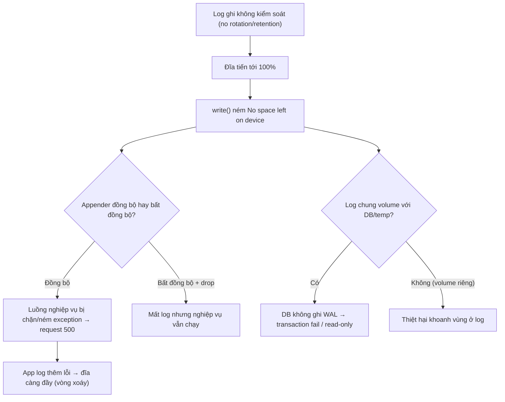

# Log file/disk đầy làm service lỗi như thế nào?

## ⚡ Tóm tắt ngắn (30s)
* **Bản chất**: Khi đĩa chứa log đầy 100%, hệ điều hành **không cho ghi thêm byte nào** — mọi thao tác `write()` ném `IOException: No space left on device`. Điều nguy hiểm là nó không chỉ làm hỏng việc ghi log: **bất kỳ thành phần nào cần ghi đĩa đều sụp** cùng lúc — tạo temp file, ghi file upload, một số DB embedded, thậm chí việc commit của database trên cùng volume. Đáng sợ hơn, nếu logging được cấu hình **đồng bộ (synchronous)**, lỗi ghi log có thể **làm chính luồng nghiệp vụ ném exception hoặc treo**, biến một sự cố vận hành (đĩa đầy) thành một sự cố ứng dụng toàn diện (service down).
* **Vòng xoáy tử thần**: đĩa đầy → ghi log lỗi → app cố log lỗi đó → lại lỗi → có khi sinh thêm log/stack trace → đĩa càng đầy. Nếu log đặt cùng volume với DB/temp, cả những thứ đó cũng chết theo.
* **Quyết định Senior**:
  1. **Phòng**: log rotation + retention bắt buộc (size/time based), giới hạn tổng dung lượng, nén & xóa log cũ.
  2. **Cô lập**: đặt log (và temp) trên **volume riêng**, không chung với DB/ứng dụng, để đĩa log đầy không kéo theo dữ liệu nghiệp vụ.
  3. **Chịu lỗi**: logging không bao giờ được làm sập nghiệp vụ — dùng async appender với chính sách drop, và **alert khi đĩa đạt ~80%** để xử lý trước khi chạm 100%.

---

## 🔍 Chi tiết bản chất thực chiến

### 1. Vì sao đĩa đầy gây lỗi lan rộng
* `No space left on device` là lỗi ở tầng syscall, đánh vào **mọi tiến trình ghi đĩa**, không riêng app log. Hệ quả điển hình: (a) ứng dụng không ghi được log → mất khả năng quan sát đúng lúc cần nhất; (b) không tạo được temp file → các thao tác xử lý file (export báo cáo, upload) lỗi; (c) nếu DB nằm cùng volume → DB không ghi được WAL/redo → **transaction fail hoặc DB chuyển read-only**, sự cố nhân lên cấp số nhân.

### 2. Logging đồng bộ biến đĩa đầy thành app crash
* Với appender **synchronous**, lời gọi `log.info(...)` chặn cho tới khi ghi xong. Nếu ghi thất bại (đĩa đầy) hoặc chậm (đĩa I/O nghẽn), luồng request **bị chặn hoặc nhận exception ngay trong code nghiệp vụ**. Một dòng log tưởng vô hại bỗng làm request lỗi 500. Tệ hơn, nếu code không bắt lỗi logging, một `IOException` từ appender có thể nổi lên phá luồng chính.

### 3. Hiệu ứng "đổ thêm dầu vào lửa"
* Khi đĩa gần đầy và app bắt đầu lỗi, nó thường **log nhiều hơn** (mỗi request lỗi sinh stack trace dài). Lượng log tăng đột biến đúng lúc đĩa sắp cạn → tăng tốc quá trình đầy đĩa → vòng xoáy tự khuếch đại. Đây là lý do alert phải kích hoạt ở **80%**, không phải 99%.

### 4. Nguồn làm đầy đĩa
* **Thiếu/sai log rotation**: log ghi vào một file không bao giờ xoay vòng → file vài chục GB.
* **Retention vô hạn**: rotate nhưng không xóa file cũ → tích lũy.
* **DEBUG bật nhầm trên prod**: lượng log tăng hàng chục lần.
* **Log bùng nổ do lỗi lặp**: một lỗi xảy ra mỗi request sinh stack trace → đầy đĩa trong vài giờ.
* **Temp file / core dump / heap dump không dọn** chiếm chỗ (liên quan câu temp file).

---

## 🎨 Sơ đồ trực quan: vòng xoáy đĩa đầy



---

## 💻 Code thực chiến: cấu hình BAD vs GOOD

### ❌ BAD: ghi một file không rotation, appender đồng bộ
```xml
<!-- ❌ FileAppender đồng bộ, không rotation, không retention -->
<configuration>
  <appender name="FILE" class="ch.qos.logback.core.FileAppender">
    <file>/var/app/logs/app.log</file>     <!-- ❌ cùng volume với DB, lớn vô hạn -->
    <encoder><pattern>%d %-5level %logger - %msg%n</pattern></encoder>
  </appender>
  <root level="DEBUG">                       <!-- ❌ DEBUG trên prod = log khổng lồ -->
    <appender-ref ref="FILE"/>
  </root>
</configuration>
```

### ✅ GOOD: rolling theo size+time, giới hạn tổng dung lượng, async + drop, volume riêng
```xml
<configuration>
  <!-- ✅ Rolling: xoay theo ngày + theo size, NÉN, giữ tối đa 14 ngày & tổng 5GB -->
  <appender name="FILE" class="ch.qos.logback.core.rolling.RollingFileAppender">
    <file>/var/log/app/app.log</file>        <!-- ✅ volume riêng, tách khỏi DB -->
    <rollingPolicy class="ch.qos.logback.core.rolling.SizeAndTimeBasedRollingPolicy">
      <fileNamePattern>/var/log/app/app.%d{yyyy-MM-dd}.%i.log.gz</fileNamePattern>
      <maxFileSize>200MB</maxFileSize>        <!-- ✅ mỗi file tối đa 200MB -->
      <maxHistory>14</maxHistory>             <!-- ✅ giữ 14 ngày -->
      <totalSizeCap>5GB</totalSizeCap>        <!-- ✅ trần tổng: tự xóa cũ khi vượt -->
    </rollingPolicy>
    <encoder><pattern>%d %-5level [%X{traceId}] %logger - %msg%n</pattern></encoder>
  </appender>

  <!-- ✅ Async: nghiệp vụ KHÔNG bị chặn bởi I/O đĩa; queue đầy thì DROP, không treo -->
  <appender name="ASYNC" class="ch.qos.logback.classic.AsyncAppender">
    <appender-ref ref="FILE"/>
    <queueSize>4096</queueSize>
    <discardingThreshold>0</discardingThreshold> <!-- ưu tiên giữ nghiệp vụ sống -->
    <neverBlock>true</neverBlock>                 <!-- ✅ không block luồng app khi queue đầy -->
  </appender>

  <root level="INFO">                            <!-- ✅ INFO trên prod -->
    <appender-ref ref="ASYNC"/>
  </root>
</configuration>
```

---

## 📊 Bảng so sánh: cấu hình log chống đầy đĩa

| Tiêu chí | Cấu hình rủi ro (sai) | Cấu hình chịu lỗi (đúng) |
| :--- | :--- | :--- |
| **Rotation** | Không → một file lớn vô hạn | Size + time based, nén |
| **Retention** | Vô hạn → tích lũy | `maxHistory` + `totalSizeCap` |
| **Appender** | Đồng bộ → chặn nghiệp vụ | Async + `neverBlock` (drop) |
| **Vị trí** | Chung volume với DB | Volume riêng, cô lập |
| **Level prod** | DEBUG (log khổng lồ) | INFO/WARN |
| **Khi đĩa đầy** | App crash, DB fail theo | Mất log, nghiệp vụ sống sót |
| **Cảnh báo** | Không có | Alert ở 80% dung lượng |

---

## ⚠️ Common Gotchas & Questions follow-up

### 1. Cạm bẫy "rotation hoạt động nhưng đĩa vẫn đầy vì file đang mở"
* Một sự cố kinh điển trên Linux: bạn `rm` (hoặc một tool dọn dẹp xóa) các file log cũ để giải phóng đĩa, nhưng **`df` vẫn báo đầy** trong khi `du` lại thấy ít. Lý do: tiến trình ứng dụng **vẫn đang giữ file descriptor mở** tới file đã bị xóa — Linux chỉ thực sự giải phóng dung lượng khi **không còn process nào mở file đó**. File "đã xóa nhưng đang mở" vẫn chiếm chỗ cho tới khi process đóng FD hoặc restart. Đây là lý do nên để **chính logging framework xoay vòng và xóa** (nó đóng/mở file đúng cách) thay vì `rm` thủ công file đang được app ghi. Khi cần khẩn cấp, `truncate -s 0 file.log` (cắt nội dung file đang mở) an toàn hơn `rm`, hoặc dùng `lsof +L1` để tìm file deleted-but-open rồi restart/HUP tiến trình giữ nó.

### 2. Câu hỏi đào sâu từ interviewer
* **Interviewer: "Bạn chọn async appender với `neverBlock=true` để bảo vệ nghiệp vụ, nhưng như vậy sẽ *mất log* khi tải cao — đúng lúc cần log nhất. Bạn cân bằng đánh đổi này thế nào?"**
* **Trả lời**: Đây là một đánh đổi kinh điển giữa **availability của nghiệp vụ** và **completeness của log**, và lựa chọn đúng phụ thuộc *loại log*. Triết lý của tôi: **log không bao giờ được phép làm sập tính năng kinh doanh** — nếu phải chọn, tôi thà mất vài dòng log còn hơn để service down vì nghẽn I/O. Vì vậy với log vận hành thông thường (INFO/DEBUG), `neverBlock=true` + drop là đúng. Nhưng tôi không để mất mát đó diễn ra âm thầm: (1) bản thân việc **drop được đếm thành metric** (số sự kiện bị bỏ), nên tôi biết khi nào và bao nhiêu log bị mất — biến "mất log lặng lẽ" thành tín hiệu quan sát được. (2) Tôi **giảm gốc rễ áp lực** thay vì chỉ chịu trận: tách log nghiệp vụ ra khỏi I/O đĩa bằng cách ship trực tiếp sang hệ tập trung (stdout → agent → Loki/ELK) để không phụ thuộc đĩa local, và rate-limit/sampling log lỗi lặp để một sự cố không sinh ra biển log. (3) Với **audit log/log tài chính bắt buộc đầy đủ** (không được mất), tôi tách thành kênh riêng với chính sách *blocking có giới hạn* hoặc ghi vào nơi bền vững (DB/queue có đảm bảo), chấp nhận đánh đổi ngược lại — vì với loại này, mất một bản ghi là vi phạm tuân thủ. Tóm lại: không có một cấu hình đúng cho mọi log; tôi **phân loại log theo mức độ quan trọng** và áp chính sách drop/block khác nhau cho từng loại, đồng thời luôn *đo lường* phần bị mất để không ra quyết định trong bóng tối.
