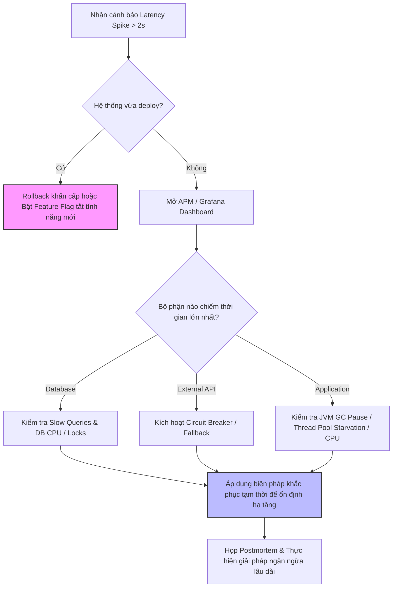

# API bình thường mất 100ms, hôm nay tăng lên 2–5s. Bạn debug thế nào?

## ⚡ Tóm tắt ngắn (30s)
* **Bản chất**: Đây là tình huống ứng phó sự cố khẩn cấp (Incident Response). Quy trình debug chuyên nghiệp cần đi qua 5 bước: **Phát hiện & Xác định phạm vi (Triage)** $\r\rightarrow$ **Cô lập lỗi (Isolate)** $\r\rightarrow$ **Truy dấu vết (Trace)** $\r\rightarrow$ **Phân tích nguyên nhân gốc (RCA)** $\r\rightarrow$ **Khắc phục & Ngăn ngừa (Fix & Prevent)**.
* **Các thảm họa thực chiến được giải quyết**:
    1. **Mù thông tin (Information Blindness)**: Khi hệ thống gặp sự cố, việc không có log tập trung hay APM khiến team mò mẫm vô vọng trong hàng triệu dòng log thô trên từng máy chủ.
    2. **Khắc phục sai mục tiêu (Misdirected Mitigation)**: Thay đổi cấu hình bừa bãi hoặc scale-out vô tội vạ khi bottleneck nằm ở database lock, làm tình trạng tồi tệ hơn.
    3. **Đổ lỗi chéo giữa các team (Finger-pointing)**: Thiếu dữ liệu phân tích thời gian xử lý khiến các nhóm (App, DB, Network, System) đổ lỗi cho nhau.
* **Quyết định Senior**: Sử dụng công cụ APM (như Datadog, Dynatrace, Elastic APM) kết hợp cùng hệ thống **Distributed Tracing (Trace ID)** để khoanh vùng nút thắt cổ chai trong vòng 5 phút đầu tiên. Ưu tiên **ổn định hệ thống trước (Mitigation)** (như scale out, bật circuit breaker, rollback nếu vừa deploy) trước khi ngồi tìm nguyên nhân gốc rễ (RCA).

---

## 🔍 Chi tiết bản chất thực chiến

Khi gặp sự cố gián đoạn hiệu năng đột ngột ở production, sự bình tĩnh và quy trình bài bản là yếu tố phân biệt giữa một kỹ sư Senior và Junior.

### Quy trình 5 bước ứng phó sự cố:

#### Bước 1: Phát hiện & Đánh giá mức độ ảnh hưởng (Triage)
* **Câu hỏi cốt lõi**: Sự cố xảy ra trên diện rộng hay chỉ ảnh hưởng đến một nhóm nhỏ người dùng? Bắt đầu từ khi nào? Có thay đổi nào vừa diễn ra (deploy, đổi config, tăng traffic đột biến) không?
* **Hành động**: Kiểm tra các biểu đồ tổng quan trên Grafana/Datadog: **throughput (RPS)**, **error rate (5xx)**, **CPU/RAM usage**, **database connection pool active count**.

#### Bước 2: Cô lập lỗi (Isolate)
* **Câu hỏi cốt lõi**: Bottleneck nằm ở đâu? Do Code của dịch vụ hiện tại, do Database, do bộ nhớ đệm Cache (Redis), hay do một dịch vụ downstream/third-party bên ngoài?
* **Hành động**: Quan sát biểu đồ phân rã thời gian phản hồi (Response Time Breakdown) trên APM để khoanh vùng chính xác thành phần nào đang chiếm phần lớn trong số 2–5 giây phản hồi.

#### Bước 3: Truy dấu vết chi tiết (Trace)
* **Câu hỏi cốt lõi**: Tại sao request cụ thể đó lại chậm?
* **Hành động**: Sử dụng **Trace ID** lọc ra vài request bị trễ 2–5s. Kiểm tra **Trace Timeline (Waterflow diagram)** để xem chính xác Span nào (ví dụ: `SQL SELECT`, `HTTP POST /external-api`) đang bị kéo dài thời gian bất thường.

#### Bước 4: Phân tích nguyên nhân gốc (RCA - Root Cause Analysis)
* Đi sâu vào nguyên nhân kỹ thuật chi tiết: database bị table lock, rò rỉ connection pool, rò rỉ bộ nhớ gây dừng luồng (GC pause), hoặc hạ tầng mạng chập chờn.

#### Bước 5: Khắc phục & Phòng ngừa (Fix & Prevent)
* Thực hiện các hành động giảm thiểu lập tức: restart pod bị lỗi, tăng kích thước connection pool tạm thời, hoặc kích hoạt cơ chế dự phòng (fallback). Sau sự cố, viết tài liệu Postmortem và thực hiện các cải tiến lâu dài.

---

## 🎨 Sơ đồ trực quan (Quy trình ứng phó khẩn cấp)



---

## 💻 Code thực chiến / Cấu hình thực tế: BAD vs GOOD

### ❌ BAD: Không có Trace ID, Log thô sơ và thiếu cấu hình quan trắc (Observability)
Dưới đây là một cấu hình log và ứng dụng Spring Boot điển hình của các team thiếu kinh nghiệm. Khi hệ thống chậm, các dòng log xuất ra hoàn toàn rời rạc, không thể biết dòng nào thuộc request nào, cũng không đo đếm được thời gian kết nối ngoài.

* **Cấu hình log (logback.xml) tồi**:
```xml
<pattern>%d{yyyy-MM-dd HH:mm:ss} [%thread] %-5level %logger{36} - %msg%n</pattern>
```
* **Mã nguồn Spring Boot thiếu an toàn**:
```java
@RestController
@RequestMapping("/api/orders")
public class OrderControllerBad {
    @Autowired
    private RestTemplate restTemplate;

    @GetMapping("/{id}")
    public OrderResponse getOrder(@PathVariable String id) {
        // ❌ Không có logging Trace ID, không đo đếm thời gian
        logger.info("Fetching order detail for id: " + id);
        
        // ❌ Gọi service ngoài không có timeout cấu hình, có thể treo luồng vô thời hạn
        Object userInfo = restTemplate.getForObject("http://user-service/users/profile", Object.class);
        
        return new OrderResponse(id, userInfo);
    }
}
```

---

### ✅ GOOD: Tích hợp Trace ID trong Log pattern và cấu hình APM Metrics đầy đủ
Cấu hình chuẩn hóa ghi nhận **Trace ID** và **Span ID** tự động vào mọi dòng log qua SLF4J MDC, đồng thời cấu hình RestTemplate có timeout chặt chẽ và ghi nhận số liệu Prometheus.

* **Cấu hình log (logback-spring.xml) chuẩn**:
```xml
<!-- Pattern tích hợp Trace ID và Span ID từ Micrometer/Spring Cloud Sleuth -->
<pattern>%d{yyyy-MM-dd HH:mm:ss.SSS} [%thread] %-5level [%X{traceId:-},%X{spanId:-}] %logger{36} - %msg%n</pattern>
```

* **Mã nguồn Spring Boot tối ưu, an toàn**:
```java
@Configuration
public class RestClientConfig {
    @Bean
    public RestTemplate restTemplate(RestTemplateBuilder builder) {
        return builder
            .setConnectTimeout(Duration.ofMillis(1000)) // ✅ Giới hạn thời gian kết nối mạng 1s
            .setReadTimeout(Duration.ofMillis(2000))    // ✅ Giới hạn thời gian đọc dữ liệu 2s
            .build();
    }
}

@RestController
@RequestMapping("/api/orders")
public class OrderControllerGood {
    private static final Logger logger = LoggerFactory.getLogger(OrderControllerGood.class);
    
    @Autowired
    private RestTemplate restTemplate;
    @Autowired
    private MeterRegistry meterRegistry; // Ghi nhận metrics sang Prometheus

    @GetMapping("/{id}")
    public OrderResponse getOrder(@PathVariable String id) {
        long startTime = System.nanoTime();
        logger.info("Starting processing order request for ID: {}", id); // Log tự động kèm Trace ID

        try {
            // Thực hiện cuộc gọi có bảo vệ timeout
            Object userInfo = restTemplate.getForObject("http://user-service/users/profile", Object.class);
            
            long duration = (System.nanoTime() - startTime) / 1_000_000;
            logger.info("Order request processed successfully in {} ms", duration);
            
            // Ghi nhận metrics thời gian phản hồi sang Grafana
            meterRegistry.timer("api.order.latency").record(duration, TimeUnit.MILLISECONDS);
            
            return new OrderResponse(id, userInfo);
        } catch (Exception e) {
            logger.error("Failed to fetch order detail due to: {}", e.getMessage(), e);
            meterRegistry.counter("api.order.errors").increment();
            throw e;
        }
    }
}
```

---

## 📊 Bảng so sánh phương pháp khoanh vùng sự cố

| Tiêu chí | Quét Log thô (Raw Logs Grepping) | Hệ thống Tracing tập trung (Distributed Tracing) | Hệ thống APM (Application Performance Monitoring) |
| :--- | :--- | :--- | :--- |
| **Tốc độ khoanh vùng** | Rất chậm (mất hàng giờ để ghép nối các máy chủ) | Nhanh (vài phút thông qua Trace ID) | Cực nhanh (phát hiện nút thắt cổ chai trong vòng 30 giây) |
| **Mức độ trực quan** | Kém (chỉ có dòng chữ trắng đen) | Trung bình (sơ đồ thác nước hiển thị span) | Tuyệt vời (dashboard màu sắc, bản đồ kiến trúc động) |
| **Độ bao phủ** | Chỉ trong phạm vi ứng dụng ghi log | Toàn bộ mạng lưới microservices | Toàn diện (JVM, OS, Database, Cloud Infra) |
| **Độ phức tạp cài đặt** | Thấp (mặc định có sẵn) | Trung bình (cần cài đặt thư viện trace client) | Cao (cần cài đặt agent ở tầng JVM/Container) |

---

## ⚠️ Common Gotchas & Questions follow-up

### 1. Cạm bẫy "Mù ảo ảnh do khởi chạy chậm" (JIT Warm-up & Connection Cold Start)
* **Vấn đề**: Sau khi deploy bản mới, trong vòng 5-10 phút đầu tiên, latency toàn bộ hệ thống tăng vọt lên 3s, sau đó tự động giảm dần về mức 100ms mà không cần tác động nào.
* **Hậu quả**: Team hoảng loạn tiến hành rollback khẩn cấp không cần thiết, làm mất thời gian và công sức.
* **Nguyên nhân**: JVM cần thời gian để JIT (Just-In-Time) compiler biên dịch bytecode sang native code (Warm-up). Đồng thời, các connection pool (HikariCP, HTTP client) cũng cần thời gian khởi tạo kết nối vật lý ban đầu (Cold Start).
* **Giải pháp**: Áp dụng cơ chế **Warm-up script** hoặc cấu hình Kubernetes **Readiness Probe** thông minh, cho phép gửi các request giả lập (synthetic traffic) để kích hoạt hệ thống trước khi mở cổng nhận traffic thực tế từ người dùng.

### 2. Câu hỏi đào sâu từ interviewer
* **Q: Nếu toàn bộ hệ thống APM, Grafana, Log Server bị sập đồng thời cùng lúc xảy ra sự cố Latency tăng cao, bạn sẽ làm cách nào để xác định nguyên nhân?**
  * *Trả lời*: Đây là kịch bản mất hoàn toàn tầm nhìn (Blind Flight). Trong tình huống cực đoan này, tôi sẽ truy cập trực tiếp (SSH) vào máy chủ ứng dụng hoặc các pod Kubernetes và sử dụng các công cụ hệ thống cấp thấp (Low-level CLI tools):
    1. Sử dụng lệnh `top -Hp <PID>` hoặc `htop` để kiểm tra xem CPU máy chủ có bị quá tải không và thread nào đang tiêu thụ nhiều CPU nhất.
    2. Sử dụng lệnh `jstack <PID> > thread_dump.txt` để lấy **Thread Dump** của JVM, sau đó phân tích thủ công xem các luồng có đang bị kẹt ở trạng thái `BLOCKED` hay `WAITING` trên các khóa (locks) hoặc các thao tác IO không.
    3. Kiểm tra số lượng kết nối mạng bằng lệnh `netstat -an | grep ESTABLISHED | wc -l` để xác định xem có bị cạn kiệt socket hoặc rò rỉ kết nối mạng không.
    4. Kiểm tra log hệ thống nội bộ ngay trên ổ đĩa cục bộ (Local file system log) hoặc logs của Container bằng lệnh `kubectl logs <POD_NAME> --tail=500` để bắt các lỗi nghiêm trọng.
