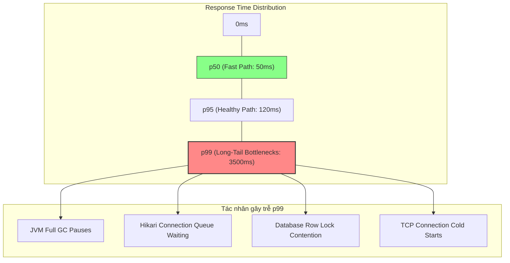

# p50 latency bình thường nhưng p99 tăng rất cao, nguyên nhân có thể là gì?

## ⚡ Tóm tắt ngắn (30s)
* **Bản chất**: Hiện tượng này gọi là **Long-tail Latency (Độ trễ đuôi dài)**. Nó phản ánh tình trạng đa số người dùng (50%) có trải nghiệm rất nhanh (ví dụ: 50ms), nhưng vẫn có 1% lượng request chịu độ trễ cực lớn (ví dụ: > 3000ms), gây sụt giảm nghiêm trọng trải nghiệm của các user VIP hoặc luồng nghiệp vụ phức tạp.
* **Các thảm họa thực chiến được giải quyết**:
    1. **Bỏ sót lỗi hệ thống âm thầm**: Nhìn vào số trung bình (Average) hoặc p50 thấy mọi thứ xanh rì, nhưng thực tế khách hàng thanh toán đang bỏ giỏ hàng vì nút thanh toán quay vòng vô tận (do rơi vào p99).
    2. **JVM sập do Full GC hoặc dừng đột ngột (Stop-the-world)**: Cấu hình heap không tối ưu hoặc dùng GC cũ (ParallelGC) gây ra các đợt ngưng hoạt động kéo dài hàng giây để dọn rác.
    3. **Nghẽn hàng đợi (Queue Head-of-line Blocking)**: Thread pool bị cạn kiệt khiến các request sau phải xếp hàng chờ đợi, làm độ trễ tăng lũy tiến.
* **Quyết định Senior**: Tuyệt đối không dùng chỉ số trung bình (Average Latency) để đánh giá sức khỏe hệ thống. Phải tuning JVM sử dụng các bộ thu gom rác hiện đại có độ trễ cực thấp (như G1GC hoặc ZGC với cờ `-XX:MaxGCPauseMillis`), đồng thời áp dụng thiết kế không chặn (non-blocking) và cô lập tài nguyên bằng Bulkhead pattern để kiểm soát đuôi p99.

---

## 🔍 Chi tiết bản chất thực chiến

Độ trễ phần trăm (Percentiles - p50, p95, p99) là công cụ thống kê duy nhất giúp phản ánh chính xác hiệu năng hệ thống phân tán. 
* **p50 (Median)**: 50% số request có độ trễ bằng hoặc thấp hơn giá trị này.
* **p99**: 99% số request có độ trễ bằng hoặc thấp hơn giá trị này. Chỉ có 1% số request chậm hơn nó.

Khi p50 bình thường nhưng p99 tăng vọt, nguyên nhân **không bao giờ** nằm ở các luồng logic nghiệp vụ thông thường (vì nếu do code chậm chung thì cả p50 cũng sẽ tăng). Nó luôn nằm ở các hiện tượng **đột biến mang tính chu kỳ hoặc tranh chấp tài nguyên cục bộ**:

### 1. Stop-the-world Garbage Collection (JVM GC Pauses)
* JVM định kỳ thực hiện gom rác ở Old Generation. Trong thời gian này, tất cả các luồng xử lý request của ứng dụng bị dừng hoàn toàn. Request nào đen đủi gửi đến đúng thời điểm GC chạy sẽ phải đợi thêm vài trăm mili-giây đến vài giây, trực tiếp đẩy p99 lên cao.

### 2. Tranh chấp khóa Database và Lock Contention đột biến
* Đa số truy vấn đọc (SELECT) chạy cực nhanh trong vài ms (p50 nhanh). Nhưng khi có luồng ghi nặng hoặc batch job cập nhật dữ liệu khóa bảng (Table lock/Row lock), các request gửi đúng lúc đó sẽ bị chặn (`BLOCKED`), tạo ra các đỉnh nhọn độ trễ lớn.

### 3. Starvation (Đói tài nguyên) ở Thread Pool / Connection Pool
* Khi hệ thống chịu tải đột biến (micro-burst traffic), lượng request gửi đến vượt quá kích thước thread pool hoạt động. Request dư thừa phải nằm đợi trong hàng chờ (Queue). Thời gian nằm chờ trong queue chính là tác nhân chính kéo dài p99.

### 4. TCP / TLS Handshake Overhead & Connection Cold Start
* Các request đầu tiên hoặc request mở kết nối vật lý mới đến microservices/DB khác sẽ tốn thời gian thực hiện bắt tay TCP 3 bước và TLS handshake (tốn thêm 100-300ms).

---

## 🎨 Sơ đồ trực quan (Biểu đồ phân phối Latency)



---

## 💻 Code thực chiến / Cấu hình thực tế: BAD vs GOOD

### ❌ BAD: Dùng Garbage Collector mặc định cấu hình cũ và Thread Pool không giới hạn hàng chờ
Cấu hình JVM sử dụng Parallel GC (thích hợp cho xử lý batch chứ không phù hợp cho web có latency thấp) kết hợp với cấu hình Thread Pool sử dụng `LinkedBlockingQueue` vô hạn, khiến các request bị tích tụ trong queue vô thời hạn khi quá tải.

* **Cấu hình JVM chạy tệ**:
```bash
# Sử dụng ParallelGC có thời gian dừng (STW) rất lâu khi dọn dẹp bộ nhớ lớn
java -XX:+UseParallelGC -Xms8g -Xmx8g -jar app.jar
```

* **Cấu hình Thread Pool Java nguy hiểm**:
```java
@Configuration
public class ThreadPoolConfigBad {
    @Bean
    public Executor taskExecutor() {
        ThreadPoolTaskExecutor executor = new ThreadPoolTaskExecutor();
        executor.setCorePoolSize(10);
        executor.setMaxPoolSize(50);
        // ❌ Không giới hạn hàng chờ (Mặc định Integer.MAX_VALUE)
        // Khi quá tải, hàng triệu request sẽ xếp hàng chờ đợi, làm RAM tăng vọt và p99 tăng đến vô cực.
        executor.setQueueCapacity(Integer.MAX_VALUE); 
        executor.setThreadNamePrefix("bad-pool-");
        executor.initialize();
        return executor;
    }
}
```

---

### ✅ GOOD: Cấu hình JVM ZGC độ trễ cực thấp và Thread Pool thông minh có giới hạn hàng chờ kèm Fallback
Sử dụng bộ thu gom rác ZGC (được giới thiệu từ Java 15+, tối ưu hóa độ trễ GC xuống dưới 1ms) và thiết lập kích thước hàng đợi có giới hạn rõ ràng kết hợp với chính sách loại bỏ hoặc xử lý lỗi khi tràn hàng chờ (AbortPolicy / CallerRunsPolicy).

* **Cấu hình JVM tối ưu cho p99 cực thấp**:
```bash
# Sử dụng ZGC hoặc G1GC hiện đại
# Thiết lập cờ -XX:MaxGCPauseMillis định hướng GC ưu tiên giảm thời gian dừng
java -XX:+UseZGC -XX:MaxGCPauseMillis=50 -Xms8g -Xmx8g -jar app.jar
```

* **Cấu hình Thread Pool Java an toàn, hạn chế trễ đuôi**:
```java
@Configuration
public class ThreadPoolConfigGood {
    private static final Logger logger = LoggerFactory.getLogger(ThreadPoolConfigGood.class);

    @Bean
    public Executor taskExecutor() {
        ThreadPoolTaskExecutor executor = new ThreadPoolTaskExecutor();
        executor.setCorePoolSize(20);
        executor.setMaxPoolSize(100);
        
        // ✅ Hàng chờ giới hạn kích thước hợp lý
        executor.setQueueCapacity(200); 
        
        executor.setThreadNamePrefix("resilient-pool-");
        
        // ✅ Chính sách xử lý khi hàng chờ bị đầy: Trả lại luồng gọi (Caller Runs) 
        // hoặc ném ra exception ngay lập tức để hệ thống ngắt mạch (Circuit Breaker) xử lý
        executor.setRejectedExecutionHandler(new ThreadPoolExecutor.CallerRunsPolicy());
        
        executor.initialize();
        return executor;
    }
}
```

---

## 📊 Bảng so sánh các bộ thu gom rác (Garbage Collectors) JVM

| Đặc tính so sánh | Parallel GC | G1 GC (Garbage-First) | ZGC (Z Garbage Collector) |
| :--- | :--- | :--- | :--- |
| **Mục tiêu tối ưu** | Tối đa hóa throughput (Băng thông xử lý) | Cân bằng throughput và latency | Tối thiểu hóa Latency (Độ trễ đuôi) |
| **Thời gian dừng (STW)** | Rất cao (Có thể kéo dài hàng giây) | Thấp (Mục tiêu dưới 100-200ms) | Cực thấp (Luôn dưới 1ms, không phụ thuộc kích thước heap) |
| **Kích thước Heap phù hợp** | Dưới 4GB | 4GB - 64GB | 16GB - 16TB |
| **Chi phí CPU phụ trợ** | Rất thấp | Trung bình | Cao hơn (Do chạy thu gom song song liên tục cùng luồng app) |
| **JVM Version khuyến nghị**| Mặc định Java 8 | Mặc định từ Java 9 trở lên | Sẵn sàng cho Production từ Java 15+ |

---

## ⚠️ Common Gotchas & Questions follow-up

### 1. Cạm bẫy "Đo đếm sai lệch tại Load Balancer" (Coordinated Omission)
* **Vấn đề**: Công cụ đo đếm độ trễ đặt tại client hoặc load balancer báo p99 là 150ms, nhưng khách hàng VIP thực tế phản ánh họ phải chờ hơn 5 giây.
* **Nguyên nhân**: **Coordinated Omission (Bỏ sót phối hợp)**. Khi server bị kẹt cứng (ví dụ do GC sập luồng trong 5 giây), nó không nhận thêm request mới hoặc không xử lý các request đang nằm trong socket buffer. Công cụ đo đếm chỉ ghi nhận thời gian xử lý của các request *đã hoàn thành* thành công. Những request bị kẹt và chưa được phản hồi hoàn toàn bị bỏ sót khỏi thống kê p99, làm sai lệch dữ liệu báo cáo.
* **Giải pháp**: Sử dụng công cụ đo đếm kiểm thử tải nâng cao (như Gatling, wrk2) có khả năng sinh tải đều đặn bất kể tốc độ phản hồi của server, hoặc đo đếm ở cả tầng mạng (Network level) thay vì chỉ ở tầng ứng dụng.

### 2. Câu hỏi đào sâu từ interviewer
* **Q: Làm thế nào để giải quyết bài toán p99 latency bị ảnh hưởng bởi "noisy neighbor" (các ứng dụng khác tranh chấp tài nguyên) khi chạy trên môi trường Cloud (AWS/Azure)?**
  * *Trả lời*: Đây là vấn đề phổ biến trên hạ tầng ảo hóa dùng chung tài nguyên. Để giải quyết, tôi sẽ áp dụng các biện pháp cô lập hạ tầng:
    1. **Resource Limits**: Thiết lập giới hạn chặt chẽ về CPU và Memory (`limits` và `requests`) cho container trên Kubernetes để đảm bảo không bị pod khác chiếm dụng tài nguyên.
    2. **Dedicated Instances / Node Affinity**: Sử dụng các instance chuyên dụng (Dedicated Hosts/Instances) hoặc cấu hình Node Affinity/Taints trên K8s để đưa các service nhạy cảm về độ trễ lên các worker node riêng biệt, không chạy chung với các batch job nặng CPU.
    3. **Provisioned IOPS**: Sử dụng ổ cứng đám mây có cam kết băng thông đọc/ghi (AWS EBS gp3 hoặc io2 với Provisioned IOPS) để tránh hiện tượng nghẽn IO ổ đĩa do dịch vụ khác ghi log quá nhiều.
