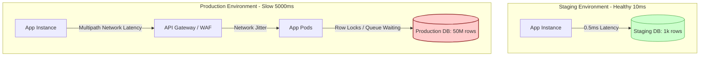

# Một endpoint chỉ chậm ở production, local/staging không reproduce được. Bạn xử lý thế nào?

## ⚡ Tóm tắt ngắn (30s)
* **Bản chất**: Hiện tượng này xuất phát từ sự **bất đối xứng về quy mô (Scale Asymmetry)** giữa môi trường thử nghiệm và thực tế. Các yếu tố cốt lõi bao gồm: Quy mô dữ liệu (Data Volume), Tải đồng thời (Concurrency Traffic), Cấu hình phần cứng, và Độ trễ mạng (Network Topology).
* **Các thảm họa thực chiến được giải quyết**:
    1. **Sập hệ thống khi chịu tải thực tế (Scale Collapse)**: Code chạy mượt ở Staging với 1,000 dòng dữ liệu nhưng lập tức treo hoặc tràn bộ nhớ (Out of Memory) trên Production khi bảng dữ liệu chạm mức 10,000,000 dòng.
    2. **Mất thời gian đoán mò vô vọng**: Team loay hoay thay đổi code liên tục ở local nhưng không giải quyết được vấn đề vì không tìm thấy nút thắt cổ chai thực sự.
    3. **Quét bảng toàn bộ (Full Table Scan) âm thầm**: Thiếu chỉ mục (Index) hoặc chỉ mục bị lỗi thời (Stale Statistics) khiến DB phải quét hàng triệu dòng dữ liệu trên đĩa cứng Production.
* **Quyết định Senior**: Không bao giờ cố đoán mò hoặc cố gắng mô phỏng lại lỗi bằng tay ở local một cách vô căn cứ. Phải sử dụng công cụ phân tích truy vấn thực tế (`EXPLAIN ANALYZE` trên Production replica) để xem cây thực thi của DB, kết hợp cùng **APM Profiler** để so sánh phân bổ thời gian thực hiện giữa Staging và Production nhằm chỉ ra điểm bất đối xứng.

---

## 🔍 Chi tiết bản chất thực chiến

Sự khác biệt giữa môi trường Staging và Production thường nằm ở 4 khía cạnh cốt lõi sau:

### 1. Quy mô dữ liệu (Data Size) & Sự phân rã Index
* Ở local/staging, một câu truy vấn SQL không tối ưu (ví dụ: quét toàn bộ bảng - `Full Table Scan`) chạy chỉ mất 5ms vì bảng chỉ có vài trăm dòng. Trên Production, bảng đó có 50 triệu dòng, câu SQL đó lập tức mất 10 giây để chạy.
* Database Optimizer đưa ra quyết định thực thi (Execution Plan) dựa trên số liệu thống kê (Statistics). Ở staging, do dữ liệu ít, DB có thể chọn quét bảng thay vì dùng index. Nhưng trên Production, Statistics có thể bị lỗi thời (stale), khiến DB đưa ra quyết định sai lầm (chọn nhầm index hoặc bỏ qua index).

### 2. Tải đồng thời (Concurrency) & Tranh chấp Connection
* Local/Staging chỉ có 1-2 người test đồng thời. Production có 5,000 request/giây. Lúc này, tranh chấp khóa (Lock Contention), hàng chờ kết nối (Connection Pool Waiting), và tranh chấp băng thông ổ đĩa (IOPS limit) mới bùng phát.

### 3. Cấu hình mạng & Topology vật lý
* Staging thường chạy ứng dụng và database chung một máy chủ hoặc cùng một vùng mạng (VPC Subnet) có độ trễ cực thấp (0.1ms). Production chạy phân tán trên nhiều vùng (Multi-AZ), đi qua API Gateway, Load Balancer, Firewalls, làm tăng đáng kể độ trễ mạng tích lũy (Network Round-Trip Time).

---

## 🎨 Sơ đồ trực quan (Bất đối xứng Staging vs Production)



---

## 💻 Code thực chiến / Cấu hình thực tế: BAD vs GOOD

### ❌ BAD: Viết truy vấn SQL bỏ qua quy mô dữ liệu thực tế và không phân tích Execution Plan
Lập trình viên viết câu truy vấn sử dụng hàm ở vế trái điều kiện `WHERE` hoặc so sánh không khớp kiểu dữ liệu (Implicit Type Conversion). Điều này khiến cơ sở dữ liệu không thể sử dụng chỉ mục (Index) và buộc phải thực hiện quét toàn bộ bảng (Full Table Scan).

* **Mã nguồn Java JPA/SQL tồi**:
```java
@Repository
public interface OrderRepositoryBad extends JpaRepository<Order, Long> {
    // ❌ Sử dụng hàm LOWER ở vế trái làm vô hiệu hóa index trên cột 'status'
    // ❌ Lấy toàn bộ thực thể Order (SELECT *) bao gồm cả các cột TEXT nặng, gây nghẽn RAM và IOPS
    @Query("SELECT o FROM Order o WHERE LOWER(o.status) = LOWER(:status) AND o.createdAt >= :startDate")
    List<Order> findActiveOrders(String status, LocalDateTime startDate);
}
```

* **Explain Plan tồi trên Production (Mô phỏng kết quả SQL)**:
```sql
EXPLAIN SELECT * FROM orders WHERE LOWER(status) = 'completed';
-- Kết quả hiển thị: 
-- Type: ALL (Full Table Scan) ❌
-- Rows: 45,210,340 (Phải quét toàn bộ 45 triệu dòng trên đĩa)
```

---

### ✅ GOOD: Tối ưu hóa truy vấn sử dụng Composite Index và DTO Projection
Đảm bảo các điều kiện so sánh khớp hoàn toàn với chỉ mục được khai báo. Sử dụng **DTO Projection** để chỉ lấy các trường thông tin cần thiết, giảm thiểu dung lượng truyền tải mạng và tối ưu hóa bộ nhớ đệm.

* **Mã nguồn tối ưu**:
```java
public interface OrderRepositoryGood extends JpaRepository<Order, Long> {
    
    // ✅ Truy vấn khớp chính xác với Composite Index (status, created_at)
    // ✅ Sử dụng DTO Projection để chỉ SELECT các cột cần thiết (Covering Index)
    @Query("SELECT new com.example.dto.OrderSummaryDTO(o.id, o.orderNumber, o.totalAmount) " +
           "FROM Order o WHERE o.status = :status AND o.createdAt >= :startDate")
    List<OrderSummaryDTO> findActiveOrdersSummary(String status, LocalDateTime startDate);
}
```

* **Cấu hình chỉ mục tối ưu trên Database (PostgreSQL/MySQL)**:
```sql
-- Tạo Composite Index bao phủ toàn bộ câu truy vấn để tối đa hóa tốc độ
CREATE INDEX idx_orders_status_created ON orders (status, created_at);

-- Phân tích lại câu lệnh bằng EXPLAIN ANALYZE
EXPLAIN ANALYZE 
SELECT id, order_number, total_amount 
FROM orders 
WHERE status = 'COMPLETED' AND created_at >= '2026-05-01 00:00:00';

-- Kết quả hiển thị:
-- Type: Index Scan using idx_orders_status_created ✅
-- Rows: 1,240 (Chỉ cần quét 1,240 dòng được định vị nhanh chóng)
```

---

## 📊 Bảng so sánh các yếu tố gây lệch hiệu năng Staging vs Production

| Yếu tố khác biệt | Môi trường Staging / Local | Môi trường Production | Giải pháp thu hẹp khoảng cách |
| :--- | :--- | :--- | :--- |
| **Quy mô dữ liệu** | Rất nhỏ (vài ngàn dòng) | Rất lớn (hàng triệu, tỷ dòng) | Thực hiện **Data Masking & Restore** định kỳ từ Prod về Staging với quy mô tối thiểu 10-20% dữ liệu gốc. |
| **Bản đồ luồng mạng** | Đơn giản (Chạy local hoặc cùng mạng LAN) | Phức tạp (Multi-AZ, Multi-Region, Firewalls) | Thiết lập kiểm thử tự động đo đếm Network Round-Trip Time giữa các phân vùng mạng. |
| **Độ chính xác Index** | DB Optimizer luôn chọn quét nhanh | Index dễ bị phân rã, Statistics bị Stale | Định kỳ chạy `ANALYZE` hoặc `OPTIMIZE TABLE` trên Database để cập nhật số liệu thống kê. |
| **Đặc tính lưu lượng** | Lưu lượng đơn luồng, tuyến tính | Lưu lượng đồng thời, micro-bursts | Thực hiện **Load Testing (Kiểm thử tải)** với các công cụ mô phỏng kịch bản tải thực tế trước khi release. |

---

## ⚠️ Common Gotchas & Questions follow-up

### 1. Cạm bẫy "Mất tầm nhìn do Schema thay đổi không đồng bộ"
* **Vấn đề**: Bạn tạo Index mới để tối ưu hóa ở Staging và chạy thấy rất nhanh. Khi deploy lên Production, câu SQL vẫn chậm vô cùng.
* **Nguyên nhân**: Quên không chạy script migration (Flyway/Liquibase) hoặc script chạy bị lỗi ngầm, dẫn đến cấu hình schema thực tế trên Production thiếu mất Index đó. Hoặc do cơ sở dữ liệu trên Production quá tải, hệ thống tự động tạm ngưng tạo index để tránh lock bảng (Online Index Creation bị chặn).
* **Giải pháp**: Luôn kiểm tra tính đồng bộ của Schema thông qua các công cụ tự động hóa CI/CD, chạy câu lệnh kiểm tra danh sách chỉ mục thực tế trên database Production replica trước khi thực hiện phân tích sâu hơn.

### 2. Câu hỏi đào sâu từ interviewer
* **Q: Nếu Database Production có dung lượng quá lớn (ví dụ 10TB) và các quy định bảo mật nghiêm ngặt (PCI-DSS) hoàn toàn cấm việc đưa dữ liệu về Staging, làm thế nào bạn có thể kiểm thử hiệu năng truy vấn một cách an toàn?**
  * *Trả lời*: Đây là một thách thức lớn về bảo mật và quy mô. Để giải quyết, tôi sẽ áp dụng các kỹ thuật sau:
    1. **Synthetic Data Generation**: Viết script sinh dữ liệu giả lập (synthetic data) có phân phối xác suất và dung lượng tương đương 10TB trên một phân vùng cơ sở dữ liệu Staging cô lập hoàn toàn để kiểm thử tải.
    2. **Explain Plan Dry Run**: Chạy lệnh `EXPLAIN` (không kèm `ANALYZE` để tránh thực thi thực tế gây tải) trực tiếp trên cơ sở dữ liệu Production Replica. Việc này hoàn toàn an toàn, không ghi dữ liệu, không tốn tài nguyên nặng nhưng hiển thị chính xác cây quyết định của DB Optimizer dựa trên dữ liệu thật.
    3. **APM Log Profiling**: Sử dụng các công cụ giám sát hiệu năng truy vấn của APM (như Datadog Database Monitoring) để thu thập thông tin về các truy vấn chạy chậm thực tế trên Production mà không cần can thiệp hay sao chép dữ liệu đi nơi khác.
