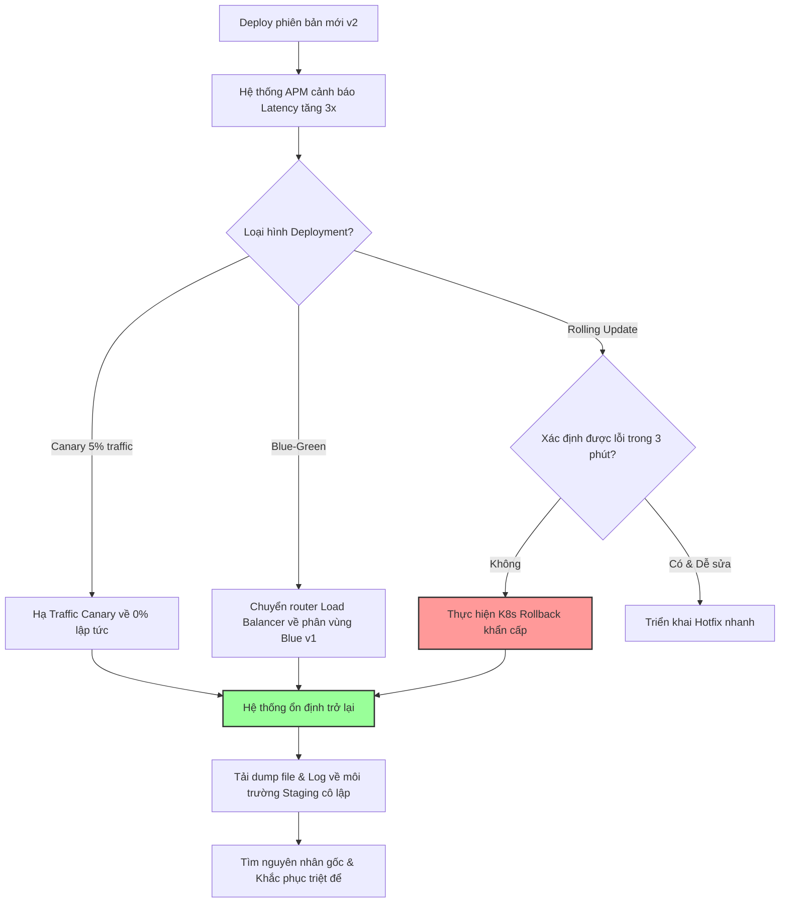

# Sau khi deploy version mới, latency toàn hệ thống tăng 3 lần. Bạn làm gì đầu tiên?

## ⚡ Tóm tắt ngắn (30s)
* **Bản chất**: Đây là tình trạng khẩn cấp cấp độ 1 (P1 Incident). Nguyên tắc tối thượng là: **"Rollback trước, Điều tra sau (Rollback First, Debug Later)"**. Mục tiêu số một là khôi phục trạng thái hoạt động bình thường cho khách hàng, chứ không phải ngồi dò tìm dòng code bị lỗi trên production.
* **Các thảm họa thực chiến được giải quyết**:
    1. **Tổn thất kinh doanh lũy tiến (Financial Bleeding)**: Việc giữ hệ thống lỗi chạy trên Production để cố gắng debug sẽ làm tăng tỷ lệ bỏ giỏ hàng, hỏng giao dịch và tổn hại thương hiệu nghiêm trọng.
    2. **Cạn kiệt tài nguyên diện rộng (Cascading Failure)**: Latency tăng 3 lần làm thời gian chiếm dụng thread tăng gấp 3, nhanh chóng dẫn đến cạn kiệt thread pool và kéo sập tất cả các dịch vụ liên đới.
* **Quyết định Senior**: Nếu hệ thống có hỗ trợ **Canary Deployment** hoặc **Blue-Green Deployment**, lập tức chuyển toàn bộ traffic (100%) về phiên bản cũ (v1) thông qua cấu hình định tuyến của Load Balancer/Service Mesh. Nếu vừa deploy dạng rolling update thông thường, tiến hành kích hoạt lệnh rollback tự động trên Kubernetes. Chỉ thực hiện debug sau khi biểu đồ giám sát ổn định trở lại.

---

## 🔍 Chi tiết bản chất thực chiến

Khi xảy ra sự cố hiệu năng nghiêm trọng ngay sau đợt deploy, kỹ sư Senior sẽ tuân thủ nghiêm ngặt quy trình ứng phó sự cố dưới đây:

### 1. Phân biệt kịch bản Rollback vs Roll-forward
* **Khi nào nên Rollback lập tức?**
  * Latency tăng vọt ảnh hưởng đến các luồng cốt lõi (Core Business Path như Đăng nhập, Thanh toán, Đặt hàng).
  * Lượng lỗi 5xx tăng mạnh.
  * Chưa thể xác định nguyên nhân gốc rễ trong vòng 3-5 phút đầu tiên.
* **Khi nào có thể Roll-forward (Hotfix)?**
  * Lỗi cực kỳ đơn giản (Ví dụ: Sai một ký tự trong file cấu hình, thiếu biến môi trường dễ dàng bổ sung).
  * Việc rollback tốn quá nhiều thời gian hoặc có nguy cơ cao gây mất mát dữ liệu (do database schema đã migrate và không tương thích ngược).

### 2. Triage & Thu thập bằng chứng nhanh (Snapshotting)
* Trước khi nhấn nút Rollback, hãy dành ra **30 giây** để chụp lại trạng thái hệ thống:
  * Chụp ảnh màn hình (screenshot) các dashboard APM bị lỗi.
  * Lưu lại mã hash của bản deploy lỗi (Git Commit SHA).
  * Kích hoạt tự động ghi nhận **Heap Dump** hoặc **Thread Dump** (nếu hạ tầng hỗ trợ tự động) để phục vụ quá trình điều tra sau sự cố.

---

## 🎨 Sơ đồ trực quan (Quy trình ứng phó khẩn cấp sau deploy)



---

## 💻 Code thực chiến / Cấu hình thực tế: BAD vs GOOD

Một lỗi cực kỳ phổ biến gây tăng latency sau deploy là lập trình viên sử dụng thư viện HTTP client hoặc database client mới mà quên không cấu hình các thông số timeout mặc định. Dưới phiên bản cũ, các giá trị này được cấu hình an toàn, nhưng khi deploy bản mới, các cấu hình bị ghi đè hoặc bị xóa bỏ.

### ❌ BAD: Cấu hình Spring Boot `@ConfigurationProperties` thiếu giá trị mặc định cho Timeout
Dưới đây là một cấu hình nạp thông số từ file `application.yml` nhưng không khai báo giá trị mặc định hoặc cơ chế kiểm soát lỗi. Nếu file cấu hình trên Production bị thiếu hoặc sai tên biến, client sẽ rơi vào trạng thái timeout vô hạn (Infinite Timeout), gây treo luồng khi dịch vụ đối tác phản hồi chậm.

```java
@Component
@ConfigurationProperties(prefix = "http.client")
public class HttpClientPropertiesBad {
    // ❌ Nếu file application.yml thiếu các dòng cấu hình này,
    // các giá trị sẽ nhận null hoặc mặc định của thư viện (vô hạn timeout)
    private Duration connectTimeout;
    private Duration readTimeout;

    // Getters and Setters...
}
```

---

### ✅ GOOD: Khai báo giá trị mặc định nghiêm ngặt và công cụ Rollback Kubernetes tự động
Đảm bảo luôn có các giá trị fallback an toàn ngay trong mã nguồn, ngăn chặn tuyệt đối tình trạng timeout vô hạn trong mọi hoàn cảnh cấu hình sai lệch.

* **Mã nguồn Java tối ưu**:
```java
@Component
@ConfigurationProperties(prefix = "http.client")
public class HttpClientPropertiesGood {
    
    // ✅ Khai báo giá trị mặc định cực kỳ an toàn
    private Duration connectTimeout = Duration.ofMillis(1000); 
    private Duration readTimeout = Duration.ofMillis(2000);

    public Duration getConnectTimeout() {
        return connectTimeout;
    }

    public void setConnectTimeout(Duration connectTimeout) {
        // ✅ Ràng buộc giá trị không thể vượt quá ngưỡng tối đa cho phép
        this.connectTimeout = connectTimeout != null ? connectTimeout : Duration.ofMillis(1000);
    }

    public Duration getReadTimeout() {
        return readTimeout;
    }

    public void setReadTimeout(Duration readTimeout) {
        this.readTimeout = readTimeout != null ? readTimeout : Duration.ofMillis(2000);
    }
}
```

* **Lệnh Rollback tự động trên Kubernetes (Kịch bản cứu hộ khẩn cấp)**:
```bash
# 1. Kiểm tra lịch sử các lần deploy của deployment
kubectl rollout history deployment/order-service

# 2. Thực hiện rollback khẩn cấp về phiên bản hoạt động tốt gần nhất
kubectl rollout undo deployment/order-service

# 3. Giám sát trạng thái rollback thời gian thực
kubectl rollout status deployment/order-service
```

---

## 📊 Bảng so sánh các chiến lược xử lý sự cố sau deploy

| Tiêu chí so sánh | Rollback ngay lập tức (Ưu tiên số 1) | Giữ nguyên Prod để debug tại chỗ | Triển khai Hotfix (Roll-forward) |
| :--- | :--- | :--- | :--- |
| **Thời gian khôi phục hệ thống** | Cực nhanh (Vài chục giây đến vài phút) | Không xác định (Phụ thuộc thời gian tìm lỗi) | Trung bình (Tốn thời gian build, test và deploy lại) |
| **Rủi ro ảnh hưởng người dùng** | Rất thấp (Quay về phiên bản đã được kiểm chứng) | Cực cao (Lỗi tiếp tục lan rộng diện rộng) | Cao (Hotfix vội vã có thể mang thêm bug mới) |
| **Yêu cầu hạ tầng** | Cần hỗ trợ tương thích ngược Database Schema | Không yêu cầu | Cần pipeline CI/CD chạy cực nhanh |
| **Phù hợp khi nào?** | Hầu hết mọi trường hợp sự cố P1 | Chỉ khi chạy trên môi trường test nội bộ | Chỉ khi lỗi siêu nhỏ và biết chính xác 100% cách sửa |

---

## ⚠️ Common Gotchas & Questions follow-up

### 1. Cạm bẫy "Rollback nổ tung Database" (Database Incompatibility)
* **Vấn đề**: Sau deploy, latency tăng vọt, bạn ra lệnh rollback code từ v2 về v1. Tuy nhiên, đợt deploy v2 đã thực hiện migrate Database Schema (Ví dụ: Xóa một cột cũ, đổi tên bảng, hoặc tách bảng). Khi code v1 được nạp lại, nó cố gắng truy cập cột đã bị xóa và toàn bộ hệ thống nổ lỗi 500 hàng loạt.
* **Nguyên nhân**: Không tuân thủ quy tắc **Tương thích ngược (Backward Compatibility)** trong thiết kế cơ sở dữ liệu.
* **Giải pháp**: Áp dụng quy trình thay đổi DB gồm 2 bước: **Expand and Contract (Mở rộng và Thu hẹp)**. 
  1. *Bước 1 (Deploy v2)*: Chỉ thêm cột mới, giữ nguyên cột cũ. Code v2 đọc viết cả hai.
  2. *Bước 2 (Chờ hệ thống ổn định)*: Deploy v3 xóa cột cũ. Nếu v2 lỗi, rollback về v1 vẫn chạy bình thường vì cột cũ vẫn tồn tại.

### 2. Câu hỏi đào sâu từ interviewer
* **Q: Làm thế nào bạn thiết kế một pipeline CI/CD tự động phát hiện Latency Spike và thực hiện Rollback tự động (Auto-rollback) mà không cần sự can thiệp của con người?**
  * *Trả lời*: Đây là đỉnh cao của vận hành tự động hóa (GitOps & Progressive Delivery). Tôi sẽ thiết kế hệ thống như sau:
    1. Sử dụng công cụ **Argo Rollouts** kết hợp với **Prometheus** trên Kubernetes để thực hiện chiến dịch Deploy Canary.
    2. Định nghĩa một **AnalysisTemplate** trong Argo Rollouts để tự động quét metrics p99 latency từ Prometheus định kỳ mỗi 1 phút trong quá trình release.
    3. Thiết lập điều kiện: Nếu tỷ lệ lỗi HTTP 5xx vượt quá 1% HOẶC p99 latency vượt quá 500ms liên tục trong 3 phút, Argo Rollouts sẽ tự động đánh giá đợt deploy là `Failed`.
    4. Hệ thống lập tức hủy bỏ đợt cập nhật (Abort Canary) và tự động định tuyến 100% traffic trở lại các Pod v1 cũ an toàn mà không cần kỹ sư phải nhấn nút bằng tay.
