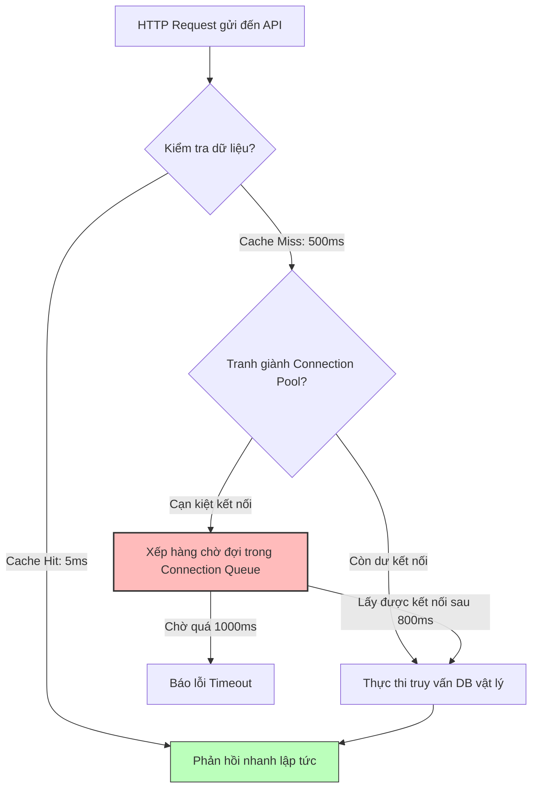

# Một API lúc nhanh lúc chậm không ổn định, bạn nghi ngờ những thành phần nào?

## ⚡ Tóm tắt ngắn (30s)
* **Bản chất**: Hiện tượng này được gọi là **Latency Jitter (Độ trễ chập chờn)**. Nó phản ánh tình trạng tài nguyên hệ thống bị biến động phi tuyến tính theo thời gian hoặc xảy ra tranh chấp không định kỳ.
* **Các thảm họa thực chiến được giải quyết**:
    1. **Nghẽn cổ chai kết nối Database (Database Connection Exhaustion)**: Khi traffic tăng nhẹ, các luồng ứng dụng phải tranh giành số lượng kết nối ít ỏi đến cơ sở dữ liệu, tạo ra hàng chờ cực dài (lúc có kết nối thì nhanh, lúc phải chờ thì chậm).
    2. **Thảm họa sập Cache đồng loạt (Cache Stampede / Cache Avalanche)**: Khi dữ liệu cache hết hạn (TTL expire), hàng ngàn request đồng thời đổ dồn vào database để lấy dữ liệu, làm DB quá tải đột biến trong vài giây rồi tự phục hồi khi cache được nạp lại.
    3. **Ứng dụng bị treo cứng do GC chạy ngầm (GC Jitter)**: Các đợt dọn dẹp bộ nhớ phụ của JVM (Minor/Major GC) hoạt động bất thình lình làm đứng luồng trong 50-200ms.
* **Quyết định Senior**: Sử dụng **HikariCP** cấu hình tối ưu (đồng bộ kích thước `minimumIdle` và `maximumPoolSize`), áp dụng cơ chế khóa phân tán hoặc **Mutex Lock** khi nạp cache để chống Cache Stampede, và kiểm tra phân bổ thời gian của GC để loại bỏ độ trễ ẩn.

---

## 🔍 Chi tiết bản chất thực chiến

Độ trễ không ổn định (Jitter) là một trong những bài toán khó debug nhất vì nó khó tái hiện ổn định ở môi trường thử nghiệm. Những thành phần cốt lõi cần nghi ngờ bao gồm:

### 1. Tầng Cache (Redis / Memcached) - Tỷ lệ Cache Hit/Miss
* **Nhanh**: Khi dữ liệu có sẵn trong cache (Cache Hit), API phản hồi trong 5ms.
* **Chậm**: Khi dữ liệu bị đuổi khỏi cache (Cache Eviction do đầy bộ nhớ) hoặc hết hạn (Cache Miss), ứng dụng buộc phải truy vấn database vật lý, mất 500ms.
* **Cache Stampede (Hiệu ứng bầy đàn)**: Xảy ra khi một key rất hot (ví dụ: thông tin khuyến mãi trang chủ) hết hạn. Hàng ngàn request cùng lúc nhận thấy cache miss và đồng loạt truy vấn DB, làm DB nghẽn cục bộ.

### 2. Tầng Database Connection Pool (HikariCP / pgBouncer)
* Nếu kích thước pool (`maximumPoolSize`) quá nhỏ so với lượng luồng đồng thời, các request sẽ phải xếp hàng chờ kết nối.
* Nếu cấu hình kích thước pool động (ví dụ: `minimumIdle` nhỏ hơn `maximumPoolSize`), cơ sở dữ liệu sẽ liên tục phải tạo mới và hủy kết nối vật lý. Việc tạo kết nối TCP mới tốn hàng trăm ms, tạo ra các đỉnh nhọn trễ chập chờn.

### 3. Tranh chấp tài nguyên ảo hóa (Noisy Neighbors)
* Trên hạ tầng đám mây dùng chung (AWS EC2 Shared Instances), nếu máy chủ vật lý chứa VM của bạn bị các VM khác cùng host chiếm dụng tài nguyên CPU, RAM hoặc IOPS đĩa cứng, ứng dụng của bạn sẽ bị chậm cục bộ theo chu kỳ hoạt động của họ.

---

## 🎨 Sơ đồ trực quan (Mô hình tranh chấp tài nguyên)



---

## 💻 Code thực chiến / Cấu hình thực tế: BAD vs GOOD

Cấu hình connection pool không đúng cách là nguyên nhân số một gây ra hiện tượng API lúc nhanh lúc chậm.

### ❌ BAD: Cấu hình HikariCP động và thiết lập thời gian chờ quá lớn
Cấu hình pool co giãn động liên tục tạo/hủy kết nối vật lý và đặt thời gian chờ lấy kết nối quá dài (`connectionTimeout`), khiến các request bị kẹt chờ đợi rất lâu thay vì fail-fast để giải phóng tài nguyên.

```properties
# application.properties tồi
spring.datasource.hikari.minimum-idle=2
spring.datasource.hikari.maximum-pool-size=50
# ❌ Kích thước co giãn lớn làm phát sinh chi phí bắt tay TCP liên tục khi traffic biến động

spring.datasource.hikari.connection-timeout=30000
# ❌ Đợi kết nối tận 30 giây làm kẹt cứng các luồng HTTP worker khi DB quá tải

spring.datasource.hikari.max-lifetime=600000
# ❌ Không cấu hình leak detection để phát hiện rò rỉ kết nối
```

---

### ✅ GOOD: Cấu hình HikariCP kích thước cố định tối ưu và nạp Cache an toàn chống Stampede
Thiết lập kích thước pool cố định giúp tránh hoàn toàn chi phí tạo kết nối động. Cấu hình thời gian chờ kết nối ngắn (`connectionTimeout`) để fail-fast, đồng thời tích hợp cơ chế khóa (Lock) khi cập nhật Cache.

* **Cấu hình HikariCP tối ưu**:
```properties
# application.properties chuẩn chuyên nghiệp
spring.datasource.hikari.minimum-idle=20
spring.datasource.hikari.maximum-pool-size=20
# ✅ Đồng bộ hóa hai giá trị để cố định số lượng kết nối vật lý luôn mở sẵn

spring.datasource.hikari.connection-timeout=2000
# ✅ Fail-fast: Nếu quá tải, chỉ đợi tối đa 2 giây rồi báo lỗi để giải phóng luồng

spring.datasource.hikari.max-lifetime=1800000
# ✅ Đóng kết nối định kỳ sau 30 phút để giải phóng tài nguyên phía DB

spring.datasource.hikari.idle-timeout=600000
spring.datasource.hikari.leak-detection-threshold=2000
# ✅ Cảnh báo nếu có kết nối nào bị chiếm dụng quá 2 giây mà không trả lại pool (phát hiện leak)
```

* **Mã nguồn cập nhật Cache chống hiệu ứng bầy đàn (Single Flight / Mutex Lock pattern)**:
```java
@Service
public class ProductService {
    private static final Logger logger = LoggerFactory.getLogger(ProductService.class);
    
    @Autowired
    private RedisTemplate<String, Object> redisTemplate;
    @Autowired
    private ProductRepository productRepository;
    
    private final ReentrantLock cacheLock = new ReentrantLock();

    public Product getProductDetail(String productId) {
        String cacheKey = "product:" + productId;
        Product product = (Product) redisTemplate.opsForValue().get(cacheKey);
        
        if (product != null) {
            return product; // ✅ Cache Hit: cực nhanh (5ms)
        }
        
        // ✅ Cache Miss: Sử dụng Lock để đảm bảo tại một thời điểm chỉ có 1 luồng truy vấn DB
        cacheLock.lock();
        try {
            // Kiểm tra lại lần nữa trong trường hợp luồng trước đó đã nạp cache xong (Double-checked locking)
            product = (Product) redisTemplate.opsForValue().get(cacheKey);
            if (product != null) {
                return product;
            }
            
            logger.warn("Cache miss for product: {}. Fetching from DB...", productId);
            product = productRepository.findById(productId).orElseThrow();
            
            // Nạp lại vào cache kèm thời gian sống TTL ngẫu nhiên để tránh hết hạn đồng loạt
            int randomTTL = 3600 + new Random().nextInt(300); // 1 tiếng + ngẫu nhiên 0-5 phút
            redisTemplate.opsForValue().set(cacheKey, product, Duration.ofSeconds(randomTTL));
            
        } finally {
            cacheLock.unlock();
        }
        
        return product;
    }
}
```

---

## 📊 Bảng so sánh các nguyên nhân gây Latency Jitter

| Nguyên nhân | Triệu chứng đặc trưng | Tần suất xuất hiện | Cách kiểm chứng nhanh |
| :--- | :--- | :--- | :--- |
| **Cache Miss / Eviction** | Biểu đồ latency có các vạch đứng cao đột biến trùng với thời điểm key hết hạn. | Thường xuyên | Xem tỷ lệ **Cache Hit/Miss Ratio** trên Grafana. |
| **Connection Starvation** | Latency tăng lũy tiến khi RPS tăng nhẹ, sau đó tự hồi phục khi tải giảm. | Phụ thuộc tải hệ thống | Xem số lượng **Active/Pending Connections** trên Hikari dashboard. |
| **JVM GC Pauses** | Độ trễ tăng đột biến ngẫu nhiên, không phụ thuộc lượng traffic cao hay thấp. | Theo chu kỳ tích lũy rác | Xem biểu đồ **JVM Garbage Collection Time** trên APM. |
| **Noisy Neighbors** | Hệ thống chậm vào những khung giờ cố định (ví dụ ban đêm khi các bên chạy backup). | Ngẫu nhiên theo chu kỳ hạ tầng | So sánh CPU IO-Wait và CPU Steal Time trên hạ tầng máy chủ ảo. |

---

## ⚠️ Common Gotchas & Questions follow-up

### 1. Cạm bẫy "Thiết lập TTL cache đồng loạt" (Cache Expiration Alignment)
* **Vấn đề**: Bạn viết code nạp cache cho toàn bộ sản phẩm và thiết lập TTL cứng là 24 giờ. Cứ đúng 2 giờ sáng mỗi ngày, toàn bộ hệ thống bị treo cứng, database CPU tăng 100%, sau đó 15 phút hệ thống tự hoạt động bình thường trở lại.
* **Nguyên nhân**: Do tất cả các key được nạp cùng một thời điểm vào ngày hôm trước, chúng đồng loạt hết hạn vào cùng một giây ngày hôm sau. Hàng triệu request đổ dồn vào database tạo nên một cơn bão truy vấn khổng lồ.
* **Giải pháp**: Luôn cộng thêm một giá trị **thời gian ngẫu nhiên (random jitter)** vào TTL của từng key khi nạp cache (ví dụ: `TTL = 24h + random(0 đến 30 phút)`), giúp phân tán thời điểm hết hạn của các key trải đều theo thời gian.

### 2. Câu hỏi đào sâu từ interviewer
* **Q: Chỉ số CPU Steal Time trên môi trường Linux ảo hóa (AWS EC2) có ý nghĩa gì trong việc debug sự cố hiệu năng chập chờn?**
  * *Trả lời*: **CPU Steal Time (hiển thị bằng chỉ số %st trong lệnh `top`)** là phần trăm thời gian mà CPU vật lý bị trình quản lý ảo hóa (Hypervisor) chiếm dụng để cấp phát cho các máy ảo khác chạy cùng hệ thống phần cứng. 
    1. Nếu `%st` gần bằng `0%`: Hệ thống của chúng ta được cấp phát tài nguyên CPU vật lý đầy đủ và ổn định.
    2. Nếu `%st` tăng cao (ví dụ > 5-10%): Đây là bằng chứng đanh thép xác định ứng dụng của chúng ta đang bị ảnh hưởng bởi hiện tượng **Noisy Neighbor** (bị máy ảo khác cướp tài nguyên CPU).
    3. Giải pháp duy nhất lúc này là di chuyển máy ảo sang máy chủ vật lý khác (bằng cách stop và start lại instance EC2) hoặc nâng cấp lên dòng instance chuyên dụng (Dedicated Instances).
